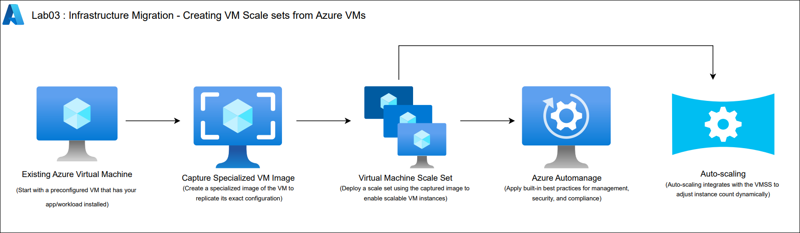
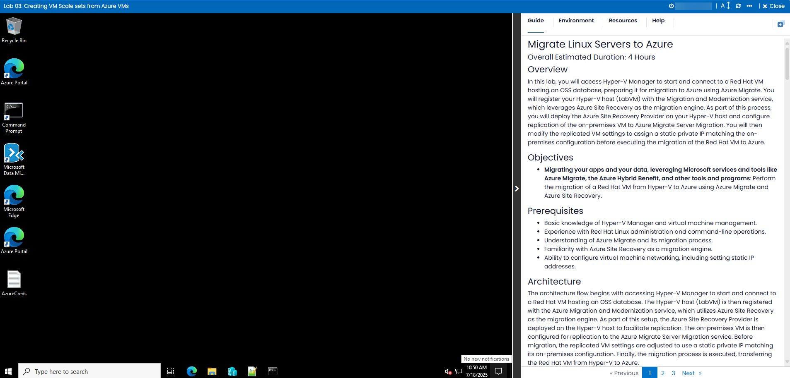

# Lab - 03: Infrastructure Migration - Creating VM Scale sets from Azure VMs
 
### Overall Estimated Duration: 6 Hours

## Overview
In this lab, you will learn how to enhance the scalability, resiliency, and manageability of virtual machines in Microsoft Azure by creating and configuring Virtual Machine Scale Sets (VMSS). This process involves capturing a custom image from an existing VM and using it to deploy a scale set, allowing multiple identical instances to operate as a single resource. VM Scale Sets provide built-in load balancing and autoscaling, improving application availability and performance under variable workloads.

You will also explore Azure Automanage, a service that simplifies VM management by automatically applying best practice configurations for monitoring, backup, security, and more. By enabling Automanage on existing virtual machines, you can ensure consistent operational standards and reduce manual administration.

## Objective
Learn how to create and manage Virtual Machine Scale Sets (VMSS) in Azure by capturing images from existing virtual machines and automating best practices with Azure Automanage. By the end of this lab, you will be able to:

- **Creating VM Scale sets from Azure VMs:** Capture a specialized image from an existing virtual machine and use it to deploy a Virtual Machine Scale Set (VMSS) that enables high availability, automatic scaling, and efficient workload distribution, while also configuring Azure Automanage to apply best practices like backup, monitoring, and security.

## Pre-requisites
To complete this lab effectively, you should have a basic understanding of Microsoft Azure, virtual machine management, and navigating the Azure portal. Familiarity with creating VM images, working with resource groups, and understanding scaling and automation concepts like Azure Automanage will be beneficial.

## Architecture
In this hands-on lab, you will work through the process of creating a scalable and resilient architecture in Azure by capturing a specialized image from an existing virtual machine and using it to deploy a Virtual Machine Scale Set (VMSS). This approach ensures consistent configuration across multiple instances, enabling efficient workload distribution and high availability. Once the VMSS is deployed, you will enhance manageability by enabling Azure Automanage, which applies best practice configurations such as monitoring, backup, and security policies. This architecture supports automated scaling, fault tolerance, and streamlined operations for enterprise-grade applications.

## Architecture Diagram

   

## Explanation of Components

- **Existing Azure Virtual Machine:** Start with a pre-configured VM running your app/workload.
- **Capture Specialized VM Image:** Capture a specialized image of the VM to replicate its configuration.
- **Virtual Machine Scale Set:** Create a VMSS using the captured image for consistency and scale.
- **Azure Automanage:** Apply best practices like backup, monitoring, and security automatically.
- **Auto-scaling:** Scale out/in VMs based on workload demand for cost and performance optimization.

## Getting Started with the Lab
Once the environment is provisioned, a virtual machine (LabVM) and lab guide will be loaded in your browser. Use this virtual machine throughout the workshop to perform the lab. You can see the number on the bottom of the Lab guide to switch to different exercises in the lab guide.

## Accessing Your Lab Environment
 
Once you're ready to dive in, your virtual machine and Guide will be right at your fingertips within your web browser.

   

## Virtual Machine & Lab Guide
 
Your virtual machine is your workhorse throughout the workshop. The lab guide is your roadmap to success.
 
## Exploring Your Lab Resources
 
To get a better understanding of your lab resources and credentials, navigate to the **Environment** tab.

   new.png)
 
## Utilizing the Split Window Feature
 
For convenience, you can open the lab guide in a separate window by selecting the **Split Window** button from the Top right corner.
 
   new.png)
 
## Managing Your Virtual Machine
 
Feel free to **Start**, **Stop**, or **Restart** your virtual machine as needed from the **Resources** tab. Your experience is in your hands!
 
  new.png)

## Lab Guide Zoom In/Zoom Out

To adjust the zoom level for the environment page, click the **A↕ : 100%** icon located next to the timer in the lab environment.

   new.png)
 
## Let's Get Started with Azure Portal
 
1. On your virtual machine, click on the **Azure Portal** icon as shown below:
 
    
 
2. You'll see the **Sign into Microsoft Azure** tab. Here, enter your credentials:
 
   - **Email/Username:** <inject key="AzureAdUserEmail"></inject>
 
      
 
3. Next, provide your password:
 
   - **Password:** <inject key="AzureAdUserPassword"></inject>
 
      

4. If **Action required** pop-up window appears, click on **Ask later**.

      
 
4. If you see the pop-up **Stay Signed in?**, click **No**.

      

6. If a **Welcome to Microsoft Azure** pop-up window appears, click **Cancel** to skip the tour.

7. Now you will see the Azure Portal Dashboard, click on **Resource groups** from the Navigate panel to see the resource groups.

   
   
8. Confirm you have all resource groups present as shown below.

   
 
## Support Contact
The CloudLabs support team is available 24/7, 365 days a year, via email and live chat to ensure seamless assistance at any time. We offer dedicated support channels tailored specifically for both learners and instructors, ensuring that all your needs are promptly and efficiently addressed.

Learner Support Contacts:

- Email Support: labs-support@spektrasystems.com
- Live Chat Support: https://cloudlabs.ai/labs-support

Now, click on the **Next** button in the lower right corner to move to the next page.

   

### Happy Learning!!
