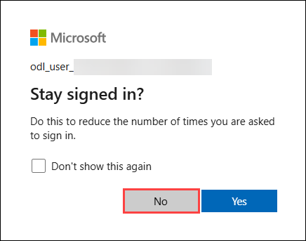
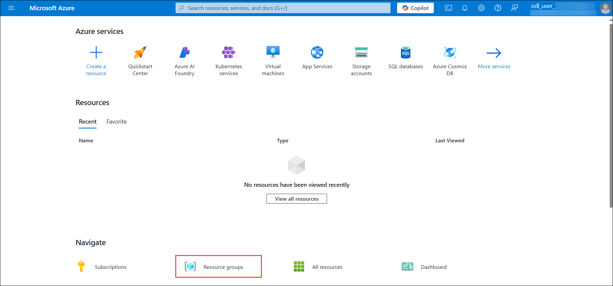

# Lab - 04: Infrastructure Migration - Migrate Linux Workloads from Hyper-V to Azure
 
### Overall Estimated Duration: 6 Hours

## Overview
In this lab, you will learn how to migrate Linux-based virtual machines from an on-premises Hyper-V environment to Microsoft Azure using Azure Migrate and Azure Site Recovery (ASR). The process involves preparing a Red Hat Linux VM, registering the Hyper-V host with Azure Migrate, and enabling replication to Azure. You will also configure networking for the VM and perform the migration, ensuring it aligns with best practices for scalability and security in Azure. By completing this lab, you will gain hands-on experience with migrating Linux servers to Azure, leveraging Microsoft services and tools for a seamless transition to the cloud.

## Objective
Learn how to create and manage Virtual Machine Scale Sets (VMSS) in Azure by capturing images from existing virtual machines and automating best practices with Azure Automanage. By the end of this lab, you will be able to:

- **Migrate Linux Workloads from Hyper-V to Azure:** Successfully migrate Linux Server from Hyper-V to Azure by preparing the environment, configuring replication, executing the migration, and applying core networking and security best practices.

## Pre-requisites
To effectively complete this lab, you need basic knowledge of Microsoft Azure, Hyper-V virtualization, and virtual machine management. You should also be familiar with using the Azure portal, configuring storage accounts, and understanding fundamental networking and security concepts.

## Architecture
In this hands-on lab, you will follow the architecture flow illustrated in the diagram, focusing on migrating Linux-based virtual machines (VMs) from an on-premises Hyper-V environment to Azure. The process begins by registering your on-premises Hyper-V host with Azure Migrate and deploying the Azure Site Recovery (ASR) provider on the Hyper-V host. You will then enable replication to synchronize the Linux VMs’ data to an Azure Storage account. After replication, you will configure networking settings to ensure consistency with on-premises configurations, including setting static IP addresses. Finally, the migration process will move the VMs into Azure as Infrastructure as a Service (IaaS) instances. Throughout the lab, you will apply best practices for networking, security, and scalability to ensure a smooth and efficient migration to the cloud.

## Architecture Diagram

   

## Explanation of Components

- **On-Premises Hyper-V Host:** Source environment for Linux VMs.
- **Azure Migrate Project:** Central hub to initiate and manage discovery and migration.
- **Replicate VMs:** Using Azure Site Recovery unde the hood.
- **Azure Virtual Machines:** Target IaaS VMs created in Azure.
- **Networking & Security:** Configure NSGs, VNets and IPs as needed post migration.

## Getting Started with the Lab
Once the environment is provisioned, a virtual machine (LabVM) and lab guide will be loaded in your browser. Use this virtual machine throughout the workshop to perform the lab. You can see the number on the bottom of the Lab guide to switch to different exercises in the lab guide.

## Accessing Your Lab Environment
 
Once you're ready to dive in, your virtual machine and Guide will be right at your fingertips within your web browser.

   

## Virtual Machine & Lab Guide
 
Your virtual machine is your workhorse throughout the workshop. The lab guide is your roadmap to success.
 
## Exploring Your Lab Resources
 
To get a better understanding of your lab resources and credentials, navigate to the **Environment** tab.

   new.png)
 
## Utilizing the Split Window Feature
 
For convenience, you can open the lab guide in a separate window by selecting the **Split Window** button from the Top right corner.
 
   new.png)
 
## Managing Your Virtual Machine
 
Feel free to **Start**, **Stop**, or **Restart** your virtual machine as needed from the **Resources** tab. Your experience is in your hands!
 
  new.png)

## Lab Guide Zoom In/Zoom Out

To adjust the zoom level for the environment page, click the **A↕ : 100%** icon located next to the timer in the lab environment.

   new.png)
 
## Let's Get Started with Azure Portal
 
1. On your virtual machine, click on the **Azure Portal** icon as shown below:
 
    
 
2. You'll see the **Sign into Microsoft Azure** tab. Here, enter your credentials:
 
   - **Email/Username:** <inject key="AzureAdUserEmail"></inject>
 
      
 
3. Next, provide **Temporary Access Password (1)** and click on **Sign in (2)**.
 
   - **Password:** <inject key="AzureAdUserPassword"></inject>
 
      
 
4. If you see the pop-up **Stay Signed in?**, click **No**.

      

6. If a **Welcome to Microsoft Azure** pop-up window appears, click **Cancel** to skip the tour.

7. Now you will see the Azure Portal Dashboard, click on **Resource groups** from the Navigate panel to see the resource groups.

   
   
8. Confirm you have all resource groups present as shown below.

   
 
## Support Contact
The CloudLabs support team is available 24/7, 365 days a year, via email and live chat to ensure seamless assistance at any time. We offer dedicated support channels tailored specifically for both learners and instructors, ensuring that all your needs are promptly and efficiently addressed.

Learner Support Contacts:

- Email Support: labs-support@spektrasystems.com
- Live Chat Support: https://cloudlabs.ai/labs-support

Now, click on the **Next** button in the lower right corner to move to the next page.

   

### Happy Learning!!
