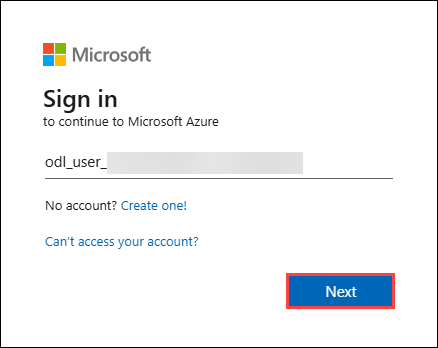
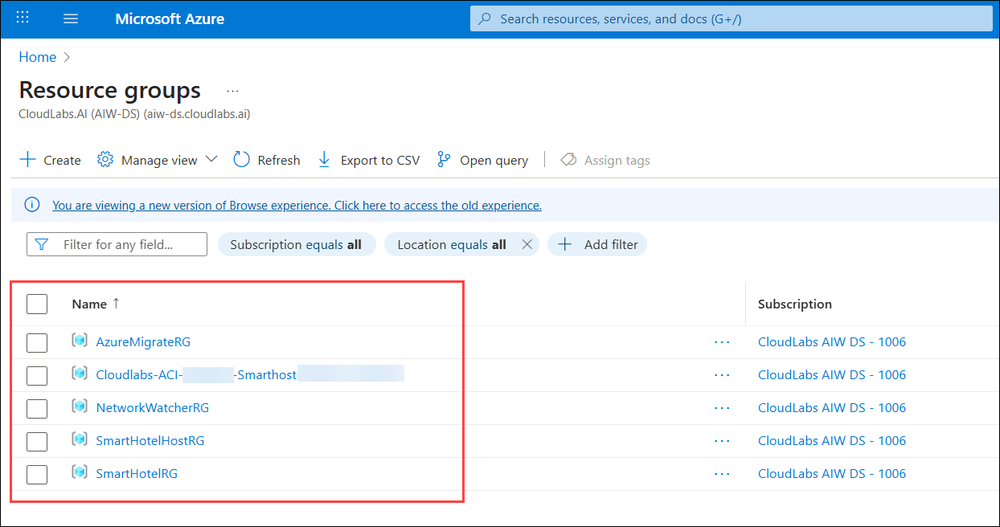

# Guided Lab : Infrastructure Migration
 
### Overall Estimated Duration: 8 Hours

## Overview
In this lab, you will gain hands-on experience deploying and configuring Azure Site Recovery (ASR) to protect your on-premises workloads and ensure business continuity in the event of a disaster. Throughout the lab, you'll work with on-premises Hyper-V VMs and extend their availability to Azure by setting up replication, failover, and failback processes. By the end of the lab, you’ll have a solid understanding of how to orchestrate disaster recovery (DR) to Azure and test failover scenarios to ensure that your applications can continue running seamlessly in the cloud.

## Objective
In this lab, you will learn how to deploy and configure Azure Site Recovery (ASR) for disaster recovery and failover, ensuring business continuity by replicating and recovering on-premises virtual machines to Azure. By the end of this lab, you will be able to:

- **Deploy Azure Site Recover and Failover to DR:** Set up ASR to replicate on-premises Hyper-V VMs to Azure, configure and test failover and failback processes, and simulate a disaster recovery scenario to ensure seamless continuity between on-premises and Azure environments.

## Pre-requisites
To successfully complete this lab, you should have basic knowledge of Microsoft Azure, Hyper-V virtualization, and virtual machine management. Familiarity with using the Azure portal, configuring storage accounts, and understanding fundamental networking and security concepts is also recommended.

## Architecture
In this lab, you'll deploy Azure Site Recovery (ASR) to replicate on-premises Hyper-V VMs to Azure for disaster recovery and failover. The process begins by installing the ASR Provider on your Hyper-V host and configuring replication to Azure. You'll then test failover scenarios to ensure seamless recovery in case of a disaster. This architecture extends Azure’s disaster recovery capabilities to your on-premises infrastructure, ensuring business continuity and centralized management of both cloud and hybrid environments.

## Architecture Diagram

## Getting Started with the Lab
Once the environment is provisioned, a virtual machine (LabVM) and lab guide will be loaded in your browser. Use this virtual machine throughout the workshop to perform the lab. You can see the number on the bottom of the Lab guide to switch to different exercises in the lab guide.

## Accessing Your Lab Environment
 
Once you're ready to dive in, your virtual machine and Guide will be right at your fingertips within your web browser.

   

## Virtual Machine & Lab Guide
 
Your virtual machine is your workhorse throughout the workshop. The lab guide is your roadmap to success.
 
## Exploring Your Lab Resources
 
To get a better understanding of your lab resources and credentials, navigate to the **Environment** tab.

   new.png)
 
## Utilizing the Split Window Feature
 
For convenience, you can open the lab guide in a separate window by selecting the **Split Window** button from the Top right corner.
 
   new.png)
 
## Managing Your Virtual Machine
 
Feel free to **Start**, **Stop**, or **Restart** your virtual machine as needed from the **Resources** tab. Your experience is in your hands!
 
  new.png)

## Lab Guide Zoom In/Zoom Out

To adjust the zoom level for the environment page, click the **A↕ : 100%** icon located next to the timer in the lab environment.

   new.png)
 
## Let's Get Started with Azure Portal
 
1. On your virtual machine, click on the **Azure Portal** icon as shown below:
 
    
 
2. You'll see the **Sign into Microsoft Azure** tab. Here, enter your credentials:
 
   - **Email/Username:** <inject key="AzureAdUserEmail"></inject>
 
      
 
3. Next, provide your password:
 
   - **Password:** <inject key="AzureAdUserPassword"></inject>
 
      

4. If **Action required** pop-up window appears, click on **Ask later**.

      
 
4. If you see the pop-up **Stay Signed in?**, click **No**.

      

6. If a **Welcome to Microsoft Azure** pop-up window appears, click **Cancel** to skip the tour.

7. Now you will see the Azure Portal Dashboard, click on **Resource groups** from the Navigate panel to see the resource groups.

   
   
8. Confirm you have all resource groups present as shown below.

   
 
## Support Contact
The CloudLabs support team is available 24/7, 365 days a year, via email and live chat to ensure seamless assistance at any time. We offer dedicated support channels tailored specifically for both learners and instructors, ensuring that all your needs are promptly and efficiently addressed.

Learner Support Contacts:

- Email Support: labs-support@spektrasystems.com
- Live Chat Support: https://cloudlabs.ai/labs-support

Now, click on the **Next** button in the lower right corner to move to the next page.

   

### Happy Learning!!
