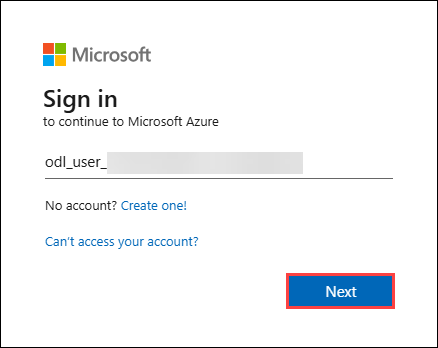
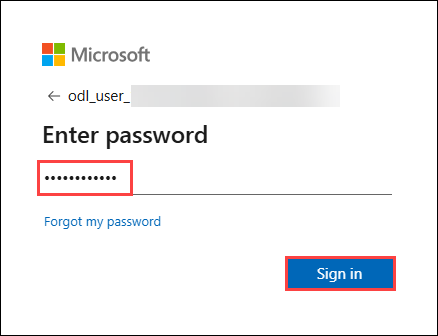
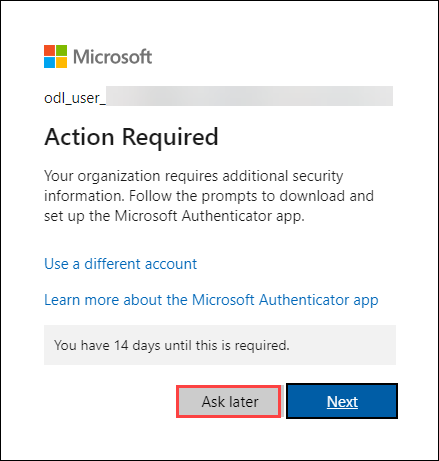
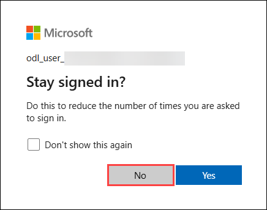
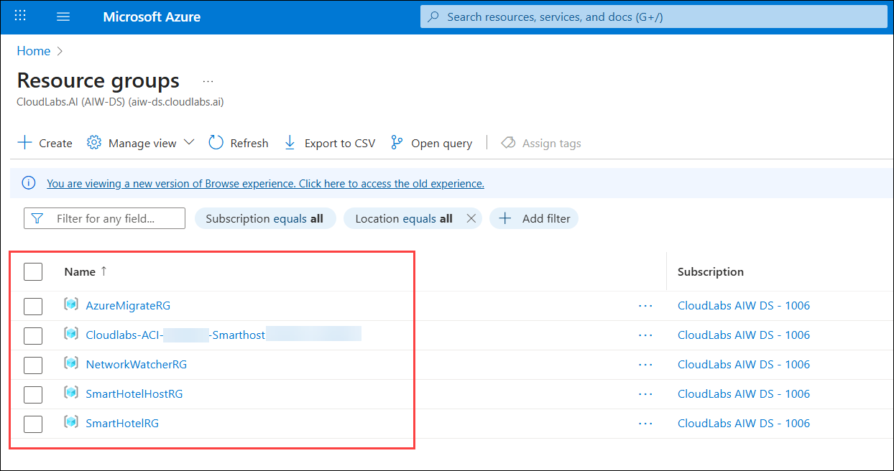

# Guided Lab : Infrastructure Migration
 
### Overall Estimated Duration: 4 Hours

## Overview
In this guided lab, you will enable key security features for your Azure infrastructure using Microsoft Defender for Cloud, Microsoft Sentinel, and Azure Monitor. You'll begin by configuring Microsoft Defender for Cloud to protect your resources, followed by setting up Microsoft Sentinel for enhanced security monitoring and Azure Monitor for tracking performance and health metrics. Additionally, you’ll configure Log Analytics workspaces to collect and analyze logs from your Azure resources, ensuring comprehensive monitoring and security insights.

## Objective
Learn how to secure your Azure infrastructure workloads using Microsoft Defender for Cloud, Microsoft Sentinel, and Azure Monitor. By the end of this lab, you will be able to:

- **Secure Infra workloads with Defender for Cloud:** Configure security and monitoring by setting up Defender for Cloud, Sentinel, and Azure Monitor. Enable Defender for Cloud for protection, integrate Sentinel for threat detection, and use Azure Monitor with Log Analytics to track infrastructure health and performance.

## Pre-requisites
To complete this lab, you should have a basic understanding of Microsoft Azure, virtual machines, and on-premises Hyper-V environments. Familiarity with the Azure portal, Hyper-V Manager, and VM management (including credentials and configuration) will help you effectively navigate the setup and discovery processes.

## Architecture
In this hands-on lab, you will configure security and monitoring for your Azure infrastructure using Microsoft Defender for Cloud, Microsoft Sentinel, and Azure Monitor. The architecture starts with Microsoft Defender for Cloud, which is enabled to provide protection for your resources. Microsoft Sentinel is then integrated for real-time threat detection and security analytics. Additionally, Azure Monitor and Log Analytics workspaces are set up to track the performance, health, and security of your infrastructure. This architecture ensures that your workloads are continuously monitored, threats are detected promptly, and your infrastructure remains secure.

## Architecture Diagram

## Getting Started with the Lab
Once the environment is provisioned, a virtual machine (LabVM) and lab guide will be loaded in your browser. Use this virtual machine throughout the workshop to perform the lab. You can see the number on the bottom of the Lab guide to switch to different exercises in the lab guide.

## Accessing Your Lab Environment
 
Once you're ready to dive in, your virtual machine and Guide will be right at your fingertips within your web browser.

   new.png)

## Virtual Machine & Lab Guide
 
Your virtual machine is your workhorse throughout the workshop. The lab guide is your roadmap to success.
 
## Exploring Your Lab Resources
 
To get a better understanding of your lab resources and credentials, navigate to the **Environment** tab.

   new.png)
 
## Utilizing the Split Window Feature
 
For convenience, you can open the lab guide in a separate window by selecting the **Split Window** button from the Top right corner.
 
   new.png)
 
## Managing Your Virtual Machine
 
Feel free to **Start**, **Stop**, or **Restart** your virtual machine as needed from the **Resources** tab. Your experience is in your hands!
 
  new.png)

## Lab Guide Zoom In/Zoom Out

To adjust the zoom level for the environment page, click the **A↕ : 100%** icon located next to the timer in the lab environment.

   new.png)
 
## Let's Get Started with Azure Portal
 
1. On your virtual machine, click on the **Azure Portal** icon as shown below:
 
    
 
2. You'll see the **Sign into Microsoft Azure** tab. Here, enter your credentials:
 
   - **Email/Username:** <inject key="AzureAdUserEmail"></inject>
 
      
 
3. Next, provide your password:
 
   - **Password:** <inject key="AzureAdUserPassword"></inject>
 
      

4. If **Action required** pop-up window appears, click on **Ask later**.

      
 
4. If you see the pop-up **Stay Signed in?**, click **No**.

      

6. If a **Welcome to Microsoft Azure** pop-up window appears, click **Cancel** to skip the tour.

7. Now you will see the Azure Portal Dashboard, click on **Resource groups** from the Navigate panel to see the resource groups.

   
   
8. Confirm you have all resource groups present as shown below.

   
 
## Support Contact
The CloudLabs support team is available 24/7, 365 days a year, via email and live chat to ensure seamless assistance at any time. We offer dedicated support channels tailored specifically for both learners and instructors, ensuring that all your needs are promptly and efficiently addressed.

Learner Support Contacts:

- Email Support: labs-support@spektrasystems.com
- Live Chat Support: https://cloudlabs.ai/labs-support

Now, click on the **Next** button in the lower right corner to move to the next page.

   

### Happy Learning!!
