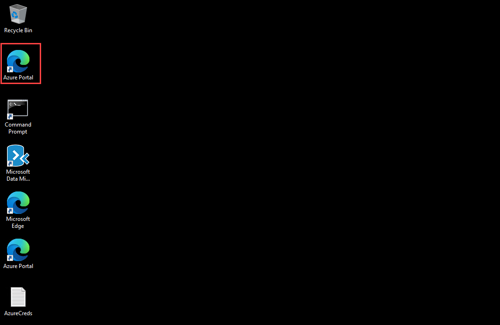

# Guided Lab : Infrastructure Migration
 
### Overall Estimated Duration: 4 Hours

## Overview
In this hands-on lab, you will walk through the end-to-end process of discovering and assessing on-premises workloads for cloud migration using Azure Migrate. You will begin by exploring the Azure Migrate service and understanding the role of the Azure Migrate appliance, which is deployed in your Hyper-V environment. The appliance is responsible for collecting VM metadata and securely sending it to Azure.

You will then configure the appliance, connect it to your Azure Migrate project, add discovery credentials and sources, and initiate the discovery of virtual machines. Once discovery is complete, you will validate that the VMs have been successfully identified in the Azure portal. This setup helps you assess migration readiness and plan future cloud migration steps confidently.

## Objectives
Learn how to assess and prepare your on-premises environment for migration using Azure Migrate. By the end of this lab, you will be able to:

- **Discovery, Assess, and Plan – Evaluate your current environment:** Explore Azure Migrate, deploy and configure the appliance in a Hyper-V environment, and discover on-premises virtual machines to validate migration readiness. 

## Pre-requisites
To complete this lab, you should have a basic understanding of Microsoft Azure, virtual machines, and on-premises Hyper-V environments. Familiarity with the Azure portal, Hyper-V Manager, and VM credential management will help you navigate the setup and discovery process effectively.

## Architecture
In this hands-on lab, you will work through the architecture flow illustrated in the diagram below, focusing on server discovery and assessment using Azure Migrate. The process begins in your on-premises environment, where a pre-configured Azure Migrate appliance is deployed on a Hyper-V host. This appliance securely connects to the Azure Migrate service in the cloud using a project key. Once registered, the appliance collects metadata and performance data from on-premises virtual machines. The information is then sent to the Azure Migrate project, where it's used for discovery, assessment, and migration planning. This setup enables seamless inventory and evaluation of your on-premises infrastructure in preparation for cloud migration.

## Architecture Diagram

## Getting Started with the Lab
Once the environment is provisioned, a virtual machine (LabVM) and lab guide will be loaded in your browser. Use this virtual machine throughout the workshop to perform the lab. You can see the number on the bottom of the Lab guide to switch to different exercises in the lab guide.

## Accessing Your Lab Environment
 
Once you're ready to dive in, your virtual machine and Guide will be right at your fingertips within your web browser.

   new.png)

## Virtual Machine & Lab Guide
 
Your virtual machine is your workhorse throughout the workshop. The lab guide is your roadmap to success.
 
## Exploring Your Lab Resources
 
To get a better understanding of your lab resources and credentials, navigate to the **Environment** tab.

   new.png)
 
## Utilizing the Split Window Feature
 
For convenience, you can open the lab guide in a separate window by selecting the **Split Window** button from the Top right corner.
 
   new.png)
 
## Managing Your Virtual Machine
 
Feel free to **Start**, **Stop**, or **Restart** your virtual machine as needed from the **Resources** tab. Your experience is in your hands!
 
  new.png)

## Lab Guide Zoom In/Zoom Out

To adjust the zoom level for the environment page, click the **A↕ : 100%** icon located next to the timer in the lab environment.

   new.png)
 
## Let's Get Started with Azure Portal
 
1. On your virtual machine, click on the **Azure Portal** icon as shown below:
 
    
 
2. You'll see the **Sign into Microsoft Azure** tab. Here, enter your credentials:
 
   - **Email/Username:** <inject key="AzureAdUserEmail"></inject>
 
      
 
3. Next, provide your password:
 
   - **Password:** <inject key="AzureAdUserPassword"></inject>
 
      

4. If **Action required** pop-up window appears, click on **Ask later**.

      
 
4. If you see the pop-up **Stay Signed in?**, click **No**.

      

6. If a **Welcome to Microsoft Azure** pop-up window appears, click **Cancel** to skip the tour.

7. Now you will see the Azure Portal Dashboard, click on **Resource groups** from the Navigate panel to see the resource groups.

   
   
8. Confirm you have all resource groups present as shown below.

   
 
## Support Contact
The CloudLabs support team is available 24/7, 365 days a year, via email and live chat to ensure seamless assistance at any time. We offer dedicated support channels tailored specifically for both learners and instructors, ensuring that all your needs are promptly and efficiently addressed.

Learner Support Contacts:

- Email Support: labs-support@spektrasystems.com
- Live Chat Support: https://cloudlabs.ai/labs-support

Now, click on the **Next** button in the lower right corner to move to the next page.

   

### Happy Learning!!
