# Exercise 01: Run workloads anywhere with Azure cloud services

### Estimated Duration: 3 hours

## Overview

In this exercise, you will use the Azure Migrate: Discovery and Assessment tool to learn how to onboard on-premises Hyper-V VMs to Azure Arc for Azure management.
Azure Arc allows you to manage your hybrid IT estate with a single pane of glass by extending the Azure management experience to your on-premises servers that are not ideal candidates for migration. 

## Lab objective

After completing this exercise, you will:
- Task 1: Onboard on-premises servers to Azure Arc-enabled servers.

## Task 1: Onboard on-premises servers to Azure Arc-enabled servers

In this exercise, you will deploy and configure the Azure Connected Machine agent on a Windows machine hosted outside of Azure, to ensure that it can be managed through Azure Arc-enabled servers.

1. In the search bar of the Azure portal, type **Azure arc (1)** and select **Azure Arc (2)** from suggestions under Services, as shown below:
   
    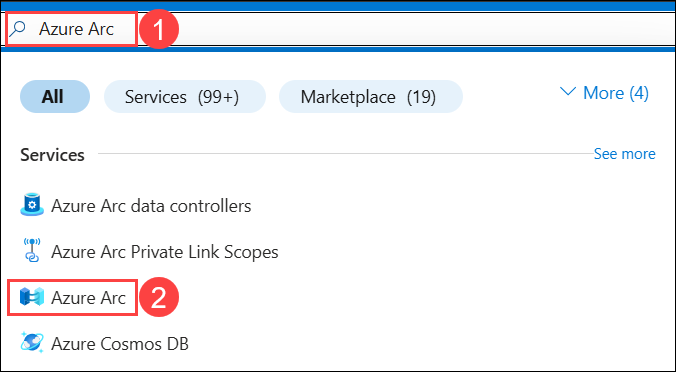
   
1. On the **Azure Arc** page, select **Machines (1)** under **Azure Arc Resources** from left pane, click on **+ Onboard/Create (2)**, then **Onboard existing machines (3)**.
    
    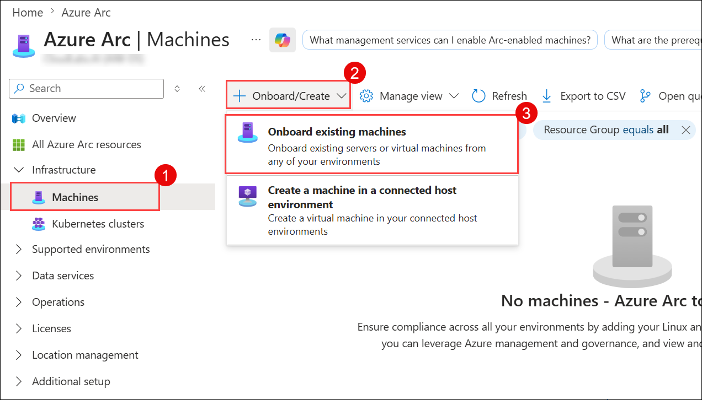
    
1. Under the **Basics** tab, enter the following details:
     
   - Subscription: **Select your subscription**
    
   - Resource group: **SmartHotelRG (1)**
  
   - Region: Select **<inject key="Region" enableCopy="false" />**
   
   - Operating system: **Windows (3)**
   
    - Leave all other values at their default settings and click **Next (4)**.

    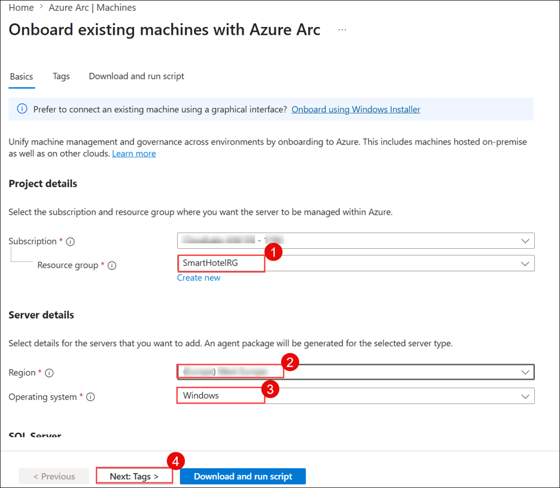

1. Under the **Tags** tab, leave the values at their default settings and click **Next**.

    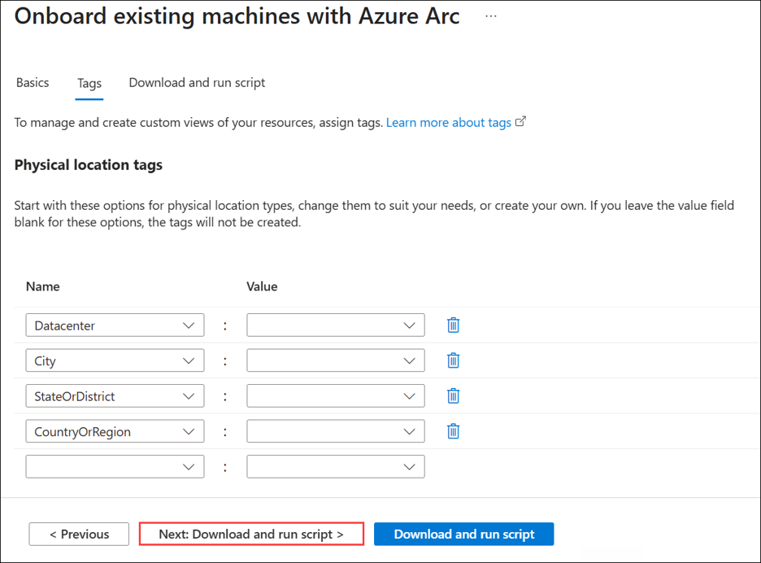

1. In the **Download and run script** section, click **copy (1)** icon to copy the entire script. Paste it into Notepad or your preferred text editor, as you will need it in the upcoming steps, then click on **Close (2)**.

    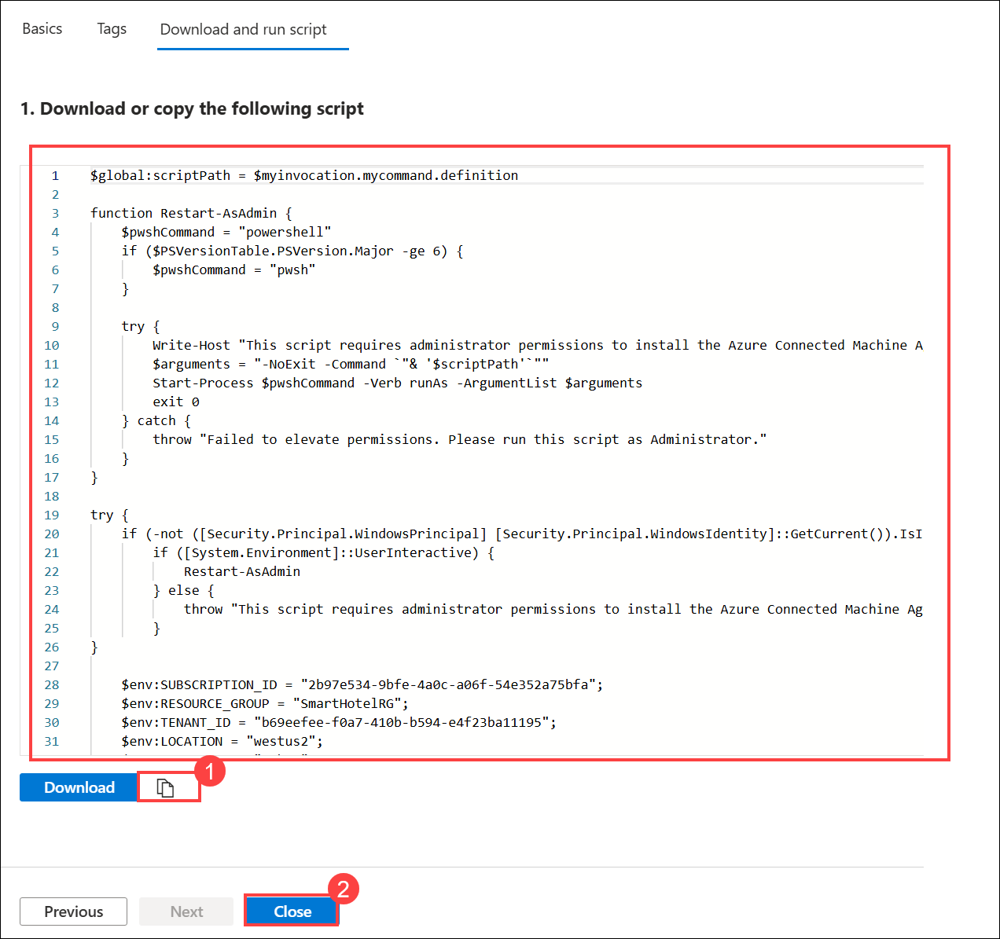
    
1. Go to the **Start (1)** button, type **Hyper-V Manager (2)** in the search bar, and select **Hyper-V Manager (3)** from the results.

    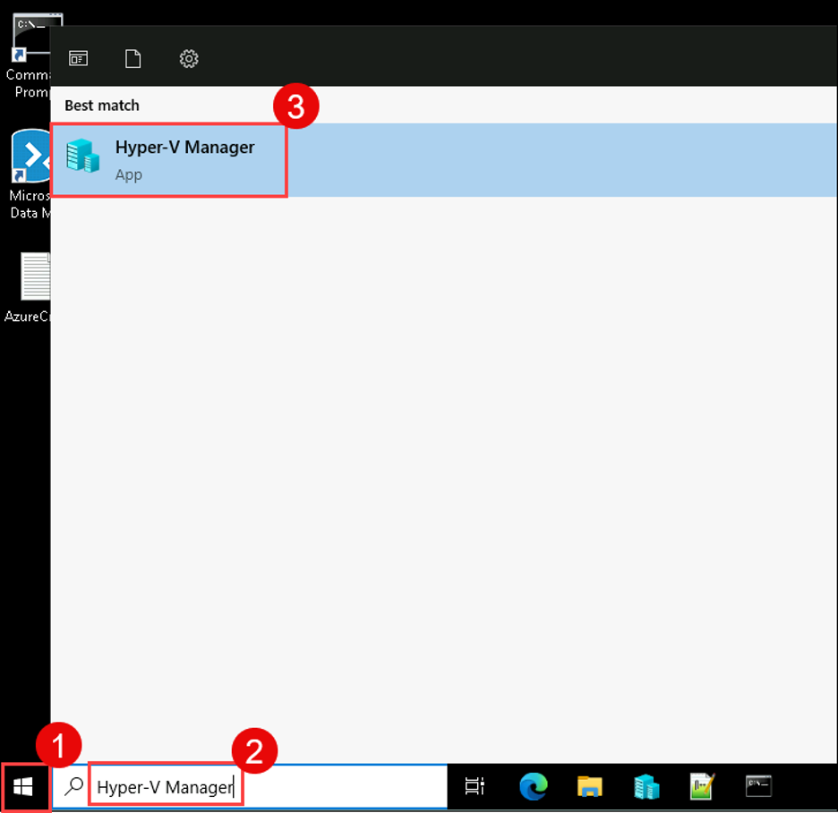

    > **Note:** You can also open **Hyper-V Manager** by clicking the icon on the taskbar.
    
1. In Hyper-V Manager, select **HOSTVMS<inject key="DeploymentID" enableCopy="false" />**.
  
    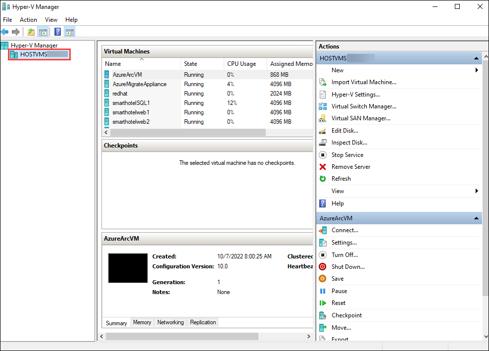
    
1. In Hyper-V Manager, select the **AzureArcVM (1)** VM, then select **Start (2)** on the right if not already running.

    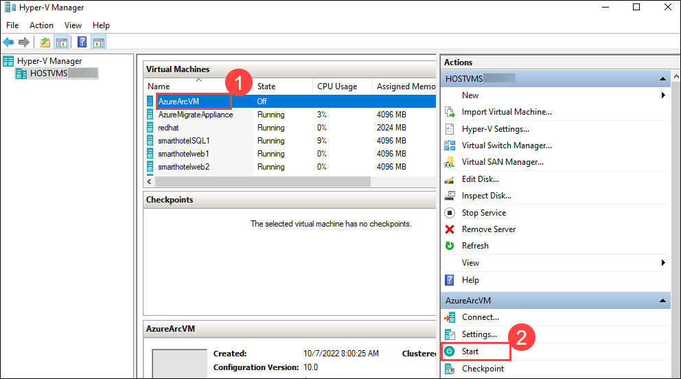    
    
1. In Hyper-V Manager, select the **AzureArcVM (1)** VM, then select **Connect (2)** on the right.

    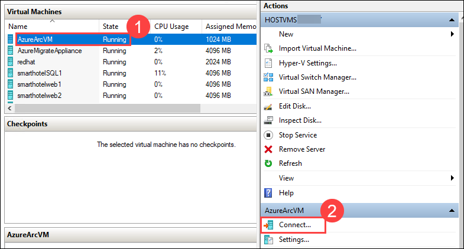  


1. In the **Connect to AzureArcVM** window, click **Connect**, then sign in to the VM using the **Administrator password**: **<inject key="SmartHotel Admin Password" />** (1) and proceed to **log in** (2). If copy and paste does not work in the Hyper-V virtual machine, enter the password manually.
 
    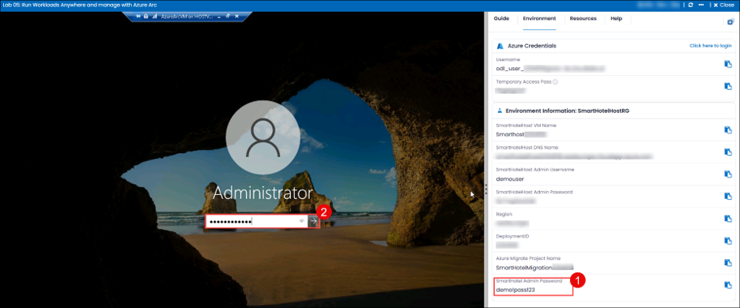
    
1. From the **Start (1)** menu of the AzureArcVM, search for **Windows PowerShell (2)** and open **Windows PowerShell (3)**.

    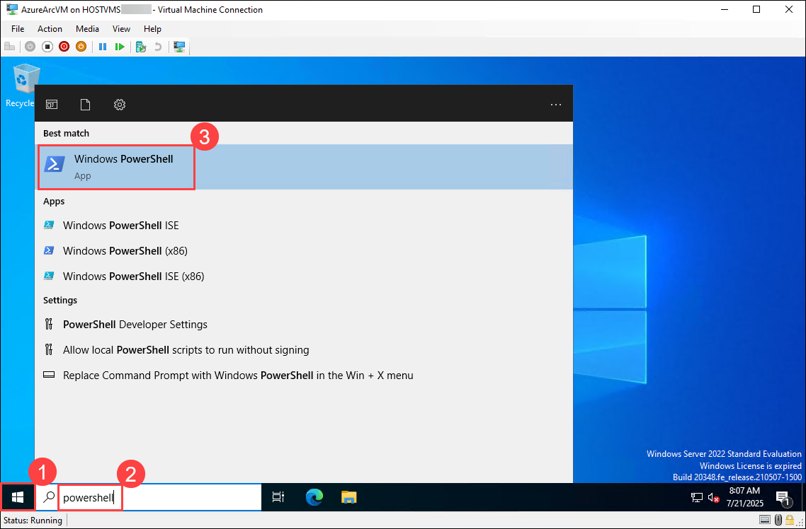
      
1. In PowerShell, run the following command to set the execution policy to unrestricted.

   * ```
     Set-ExecutionPolicy -ExecutionPolicy unrestricted
     ```
     
        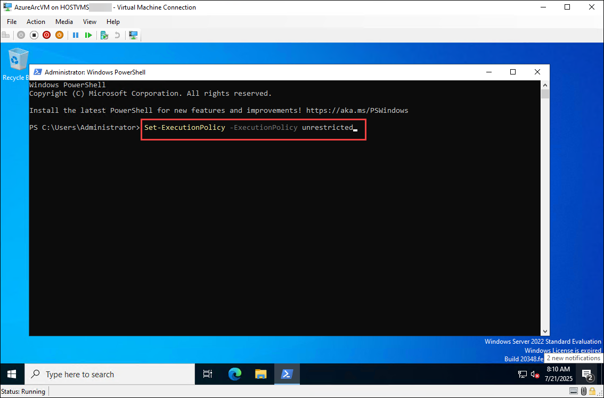

        > **Note:** "If you're prompted with **'Do you want to change the execution Policy?'**, just type **Y** to confirm."
   

1. Now, run the entire script that you copied into Notepad earlier in **Step 5**.

    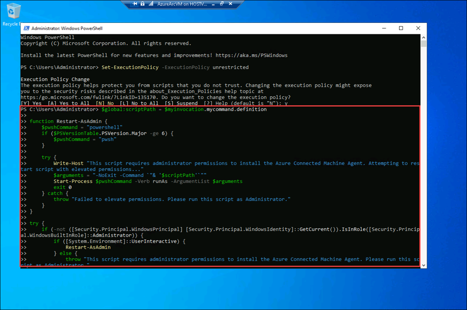

1. After running the script, packages will be installed and you will be redirected to a browser window to log in to your Azure account for authentication. Use the following Azure credentials:

    * Azure Username/Email: <inject key="AzureAdUserEmail"></inject> 
    * Azure Password: <inject key="AzureAdUserPassword"></inject> 

    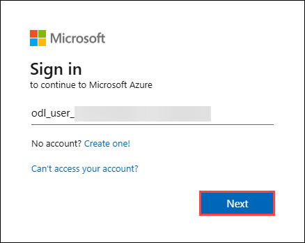

    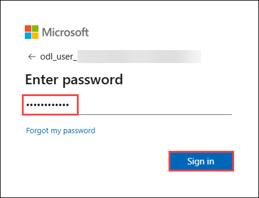

    > **Note:** Return to the PowerShell window and verify that your AzureArcVM has been successfully connected to Azure.
   
    > **Note:** On the Welcome to Microsoft Edge page, select **Start without your data**. On **Stay current with your browsing data**, select **Confirm and continue**. On the page about importing Google browsing data, select **Continue without this data**. Then select **Confirm and start browsing** on the next page.
   
    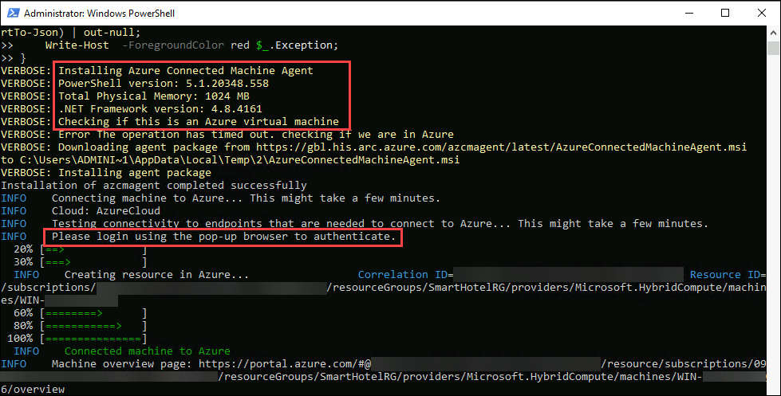
     
 1. Close the **AzureArcVM**, navigate to the **Azure Arc** page in the Azure portal, select **Machines (1)** under **Azure Arc resources**, and verify that a server is connected successfully **(2)**.

    **Note:** The name of the newly added server may be different. You might need to refresh the page to see the new server.
    
    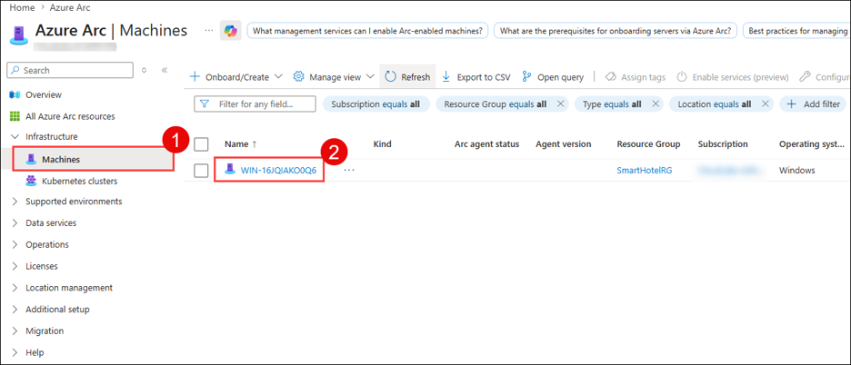

    > **Congratulations** on completing the task! Now, it's time to validate it. Here are the steps:
    > - Hit the Validate button for the corresponding task. If you receive a success message, you can proceed to the next task. 
    > - If not, carefully read the error message and retry the step, following the instructions in the lab guide.
    > - If you need any assistance, please contact us at labs-support@spektrasystems.com. We are available 24/7 to help.

    <validation step="05a7a390-6121-4c68-ae18-dea094999056" />
    
## Summary 

In this exercise, you explored how to deploy and configure the Azure Connected Machine agent on a Windows machine hosted outside of Azure. You learned about creating Azure Arc-enabled servers so they can manage the Windows machine.

### You have successfully completed the Hands-on Lab.
