# HOL3: Onboard On-premises servers to Azure Arc-Enabled Server

## Exercise 1: Run workloads anywhere with Azure Cloud Services

In this Exercise, you will deploy and configure the Azure Connected Machine agent on a Windows machine hosted outside of Azure.

### Estimated Duration: 30 Minutes

## Overview
In this HOL, you will use the Azure Migrate: Discovery and assessment tool that describes how to onboard on-premises Hyper-V VMs to Azure Arc for Azure Management.

Azure Arc allows you to manage your hybrid IT estate with a single pane of glass by extending the Azure management experience to your on-premises servers, which are not ideal candidates for migration.

## Objectives

In this Exercise, you will complete the following task:

- Task 1: Run workloads anywhere with Azure Cloud Services

### Task 1: Run workloads anywhere with Azure Cloud Services

In this task, you will deploy and configure the Azure Connected Machine agent on a Windows machine hosted outside of Azure, to ensure that it can be managed through Azure Arc-enabled servers.

1. In the search bar of the Azure portal, type **Azure arc (1)** and select **Azure Arc (2)** from suggestions under Services, as shown below:
   
    
  
1. In the **Azure Arc | Machines** page, under **Infrastructure**, select **Machines (1)**. Select **+ Onboard/Create (2)**, and then choose **Onboard existing machines (3)** to begin onboarding an existing server to Azure Arc.
    
    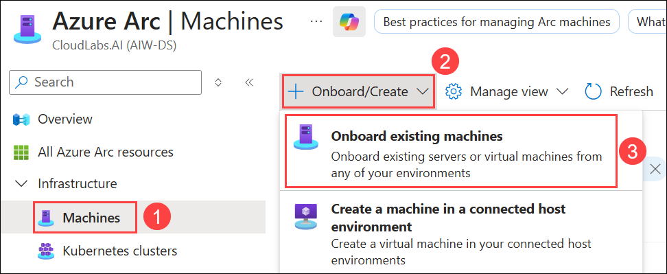
    
1. On the **Onboard existing machines with Azure Arc** page, under the **Basics** tab, configure the following settings:

   - **Subscription**: Select your subscription.
   - **Resource group**: Select **SmartHotelRG (1)**.
   - **Region**: Select **<inject key="Region" enableCopy="false" /> (2)**.
   - **Operating system**: Select **Windows (3)**.

   Leave the remaining settings at their default values, and then select **Next: Tags (4)**.

    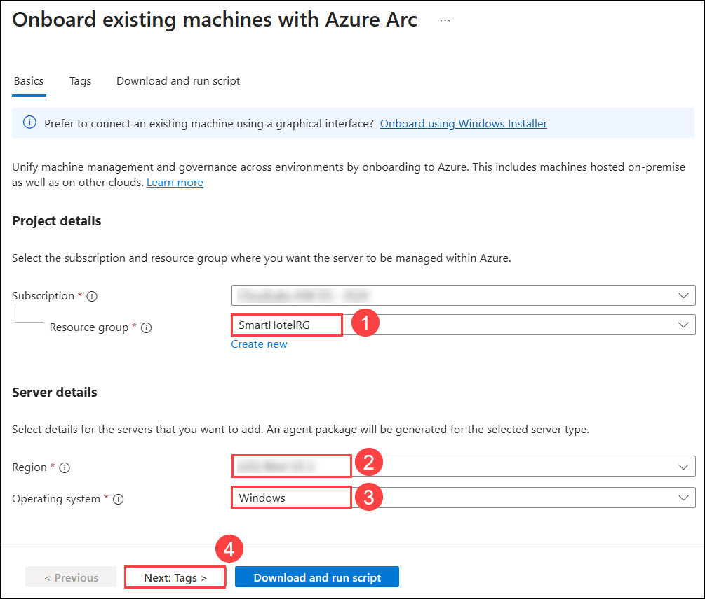

1. On the **Tags** tab, do not configure any tags. Leave all settings at their default values, and then select **Next: Download and run script**.

     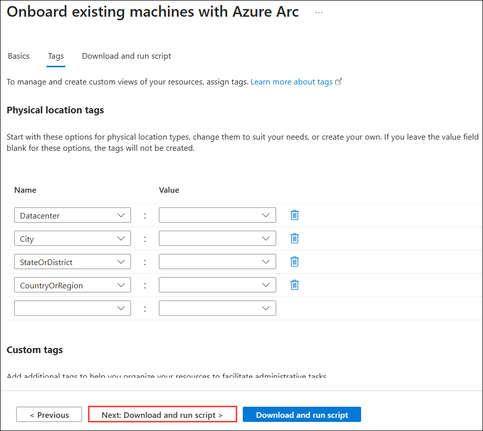

1. On the **Download and run script** tab, copy the generated onboarding script by selecting the **Copy (1)** icon. You can also download the script if needed. After copying the script, select **Close (2)**.

    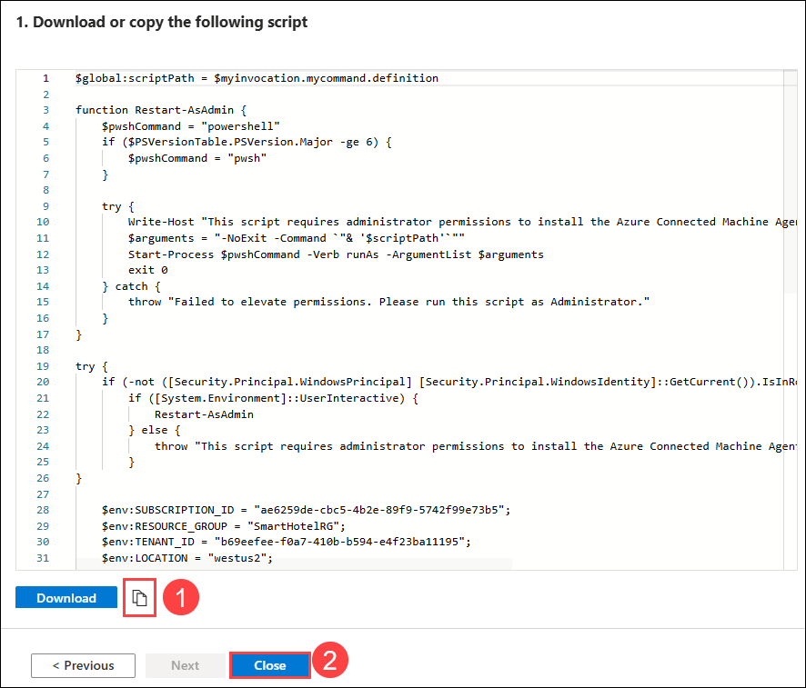
    
1. On the lab VM desktop, type **Hyper-V Manager (1)** in the Windows search box and select **Hyper-V Manager (2)** from the search results to open the **Hyper-V Manager** console.

    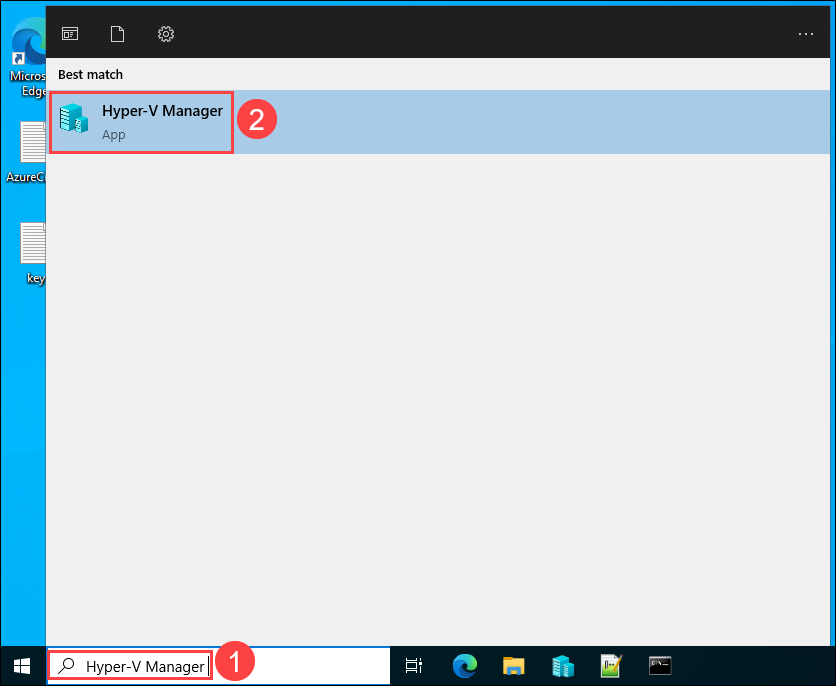

   > **Note:** You can also open the **Hyper-V manager** by clicking on the icon that is present in the taskbar. 
    
1. In **Hyper-V Manager**, select the **HOSTVMS<inject key="DeploymentID" /> (1)** host. Then select the **AzureArcVM** virtual machine **(2)** and choose **Connect... (3)** from the **Actions** pane. 
  
    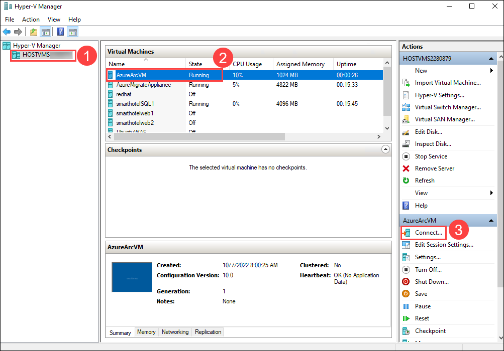

    >**Note:** If the virtual machine is in the **Off (1)** state, select **Start (2)** from the **Actions** pane to power on the virtual machine.

    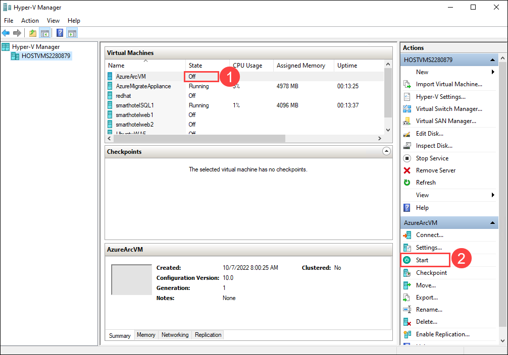    
    
1. Wait for the **AzureArcVM** sign-in screen to appear. Enter the password **<inject key="SmartHotel Admin Password" />** for the **Administrator** account, and then sign in.
 
    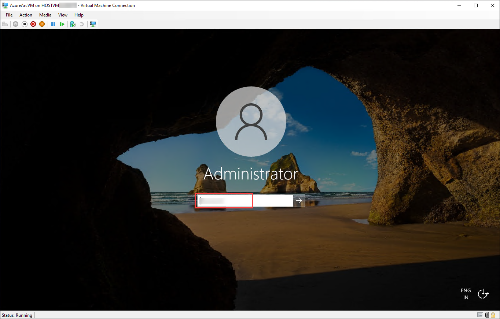
    
1. On the **AzureArcVM** desktop, type **Windows PowerShell ISE (1)** in the Windows search box, and then select **Windows PowerShell ISE (2)** from the search results to open the PowerShell ISE console.

    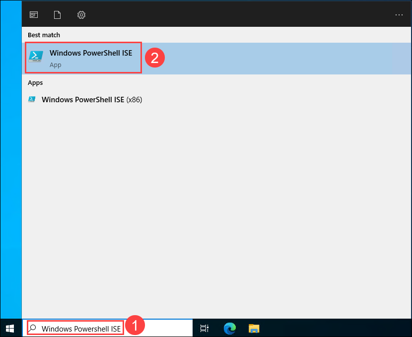
      
1. In Windows PowerShell ISE, run the following command to set the execution policy to Unrestricted. When the **Execution Policy Change** prompt appears, select **Yes to All (1)** to confirm the execution policy change and continue.

    ```
    Set-ExecutionPolicy -ExecutionPolicy unrestricted
    ```
1. In **Windows PowerShell ISE**, paste the Azure Arc onboarding script that you copied earlier in **Step 5**, and then run the entire script.

1. After running the script, the required Azure Arc agent packages will be installed. Once the installation is complete, a browser window will open, prompting you to sign in to your Azure account to complete the authentication. Sign in using the following Azure credentials:

    - Enter your Username/Email: **<inject key="AzureAdUserEmail"></inject>**  in the Sign in field. Click Next to continue.

       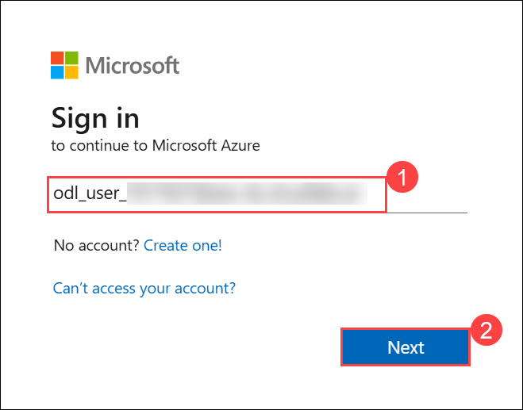
    
    - Enter Temporary Access Pass: **<inject key="AzureAdUserPassword"></inject>** and click Sign in

       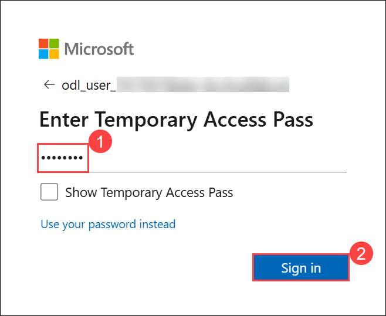

1. After completing the sign-in process, return to the **Windows PowerShell ISE** window. Verify that the script has completed successfully and that the **AzureArcVM** is now connected to Azure.
    
    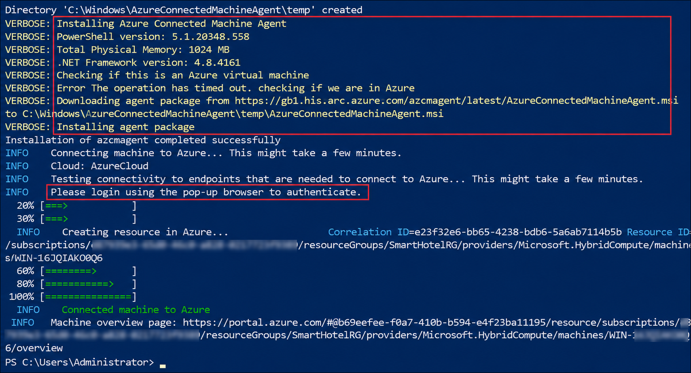
     
1. Close the **AzureArcVM**. In the **Azure portal**, navigate to **Azure Arc**, and then select **Machines (1)** under **Azure Arc resources**. Verify that the newly onboarded server is listed with the **Status** as **Connected (2)**.

    > **Note:** The name of the newly onboarded server may differ from the one shown in the screenshot. If the server is not displayed, select **Refresh** and wait a few moments for it to appear.
    
    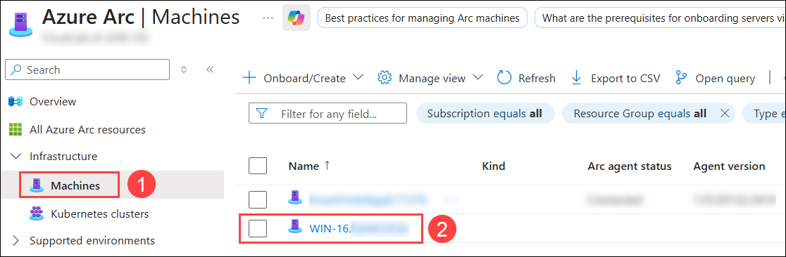
    
## Summary

In this exercise, you explored how to deploy and configure the Azure Connected Machine agent on a Windows machine hosted outside of Azure. You learnt about creating Azure Arc-enabled servers so that they can manage the Windows machine.

Click on **Next >>** from the lower right corner to move on to the next page.
 
  
