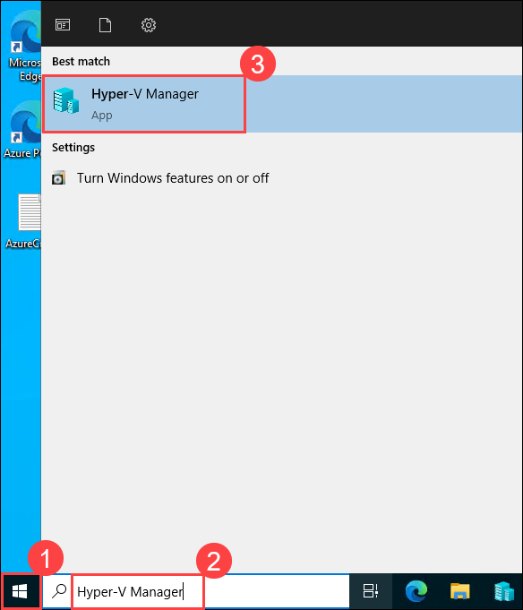
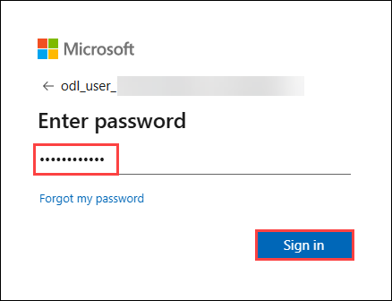
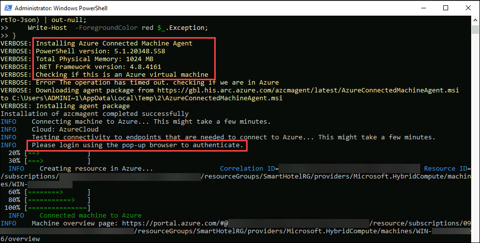
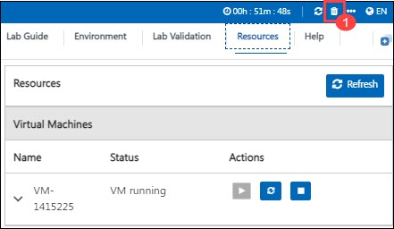
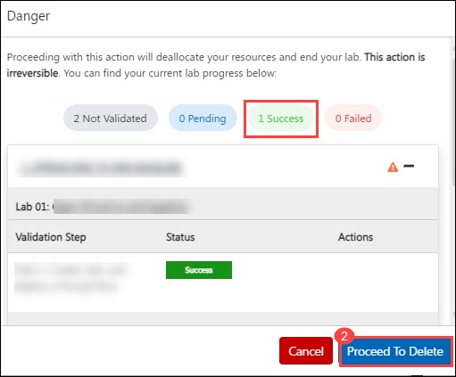

# Lab 01: Run workloads anywhere with Azure Arc

### Estimated Duration: 6 hours

## Overview

In this Lab, you will use Azure Migrate: Discovery and assessment tool that describes how to onboard on-premises Hyper-V VMs to Azure Arc for Azure Management.
Azure Arc allows you to manage your hybrid IT estate with a single pane of glass by extending the Azure management experience to your on-premises servers that are not ideal candidates for migration. 

## Lab objective

After completing this exercise, you will:
- Task 1: Onboard On-prem servers to Azure Arc-enabled server.

## Task 1: Onboard On-prem servers to Azure Arc-enabled server

In this exercise, you will deploy and configure the Azure Connected Machine agent on a Windows machine hosted outside of Azure, to ensure that it can be managed through Azure Arc-enabled servers.

1. In the search bar of the Azure portal, type **Azure arc (1)** and select **Azure Arc (2)** from suggestions under Services, as shown below:
   
    
   
2. On the **Azure Arc** page, select **Machines (1)** under **Azure Arc Resources** from left pane, click on **+ Add/Create (2)**, then **Add a Machine (3)**.
    
    
    
3. On the **Add servers with Azure Arc** page, then click **Generate script** under **Add a single server**.

    
    
4. Under the **Basics** tab, fill in the following details:
     
   - Subscription: **Select your subscription**
    
   - Resource group: **SmartHotelRG (1)**
  
   - Region: Select **<inject key="Region" enableCopy="false" />**
   
   - Operating system: **Windows (3)**
   
   - Leave other values as default and click on **Next (4).**

    

5. Under the **Tags** tab, leave the values as default and click on **Next**.

    

6. In the **Download and run script** section, click **copy (1)** icon to copy the entire script. Paste it into Notepad or your preferred text editor, as you will need it in the upcoming steps, then click on **Close (2)**.

    
    
7. Go to the **Start (1)** button, type **Hyper-V Manager (2)** in the search bar, and select **Hyper-V Manager (3)** from the results.

    

   > **Note:** You can also open the **Hyper-V manager** by clicking on the icon that is present in the taskbar. 
    
8. In Hyper-V Manager, select **HOSTVMS<inject key="DeploymentID" enableCopy="false" />**. 
  
    
    
9. In Hyper-V Manager, select the **AzureArcVM (1)** VM, then select **Start (2)** on the right if not already running.

        
    
10. In Hyper-V Manager, select the **AzureArcVM (1)** VM, then select **Connect (2)** on the right.

      


11. Under Connect to AzureArcVM, click on **Connect** and then log into the VM with the **Administrator password**: **<inject key="SmartHotel Admin Password" />** (If the copy/paste is not working in the hyper-V machine, please try typing the password).
 
    
    
12. From the **Start (1)** menu of the AzureArcVM, search for **Windows Powershell (2)** and open it **Windows Powershell (3)**.

    
      
13. In PowerShell, run the below command to set the execution policy as unrestricted.

   * ```
     Set-ExecutionPolicy -ExecutionPolicy unrestricted
     ```
     
        

        > **Note:** "If you're prompted with **'Do you want to change the execution Policy?'**, just type **Y** to confirm."
   

14. Now, run the whole script that you copied in the notepad earlier in **Step 7**.

1. After running the script, packages will be installed and then you will be directed to a pop-up browser page to login into your Azure account for authentication purposes. Use the below Azure credentials:

    * Azure Username/Email: <inject key="AzureAdUserEmail"></inject> 
    * Azure Password: <inject key="AzureAdUserPassword"></inject> 

    

    

   > **Note:** Move back to the PowerShell pane and now you have connected your AzureArcVM to Azure successfully.
   
   > **Note:** Note: On the Welcome to Microsoft Edge page, **select Start without your data**, on **Stay current with your browsing data** select **Confirm and continue**, and on the help for importing Google browsing data page, select the  **Continue without this data** button. Then, proceed to select **Confirm and start browsing** on the next page has a context menu.."
   
    
     
 1. Close the **AzureArcVM**, navigate to **Azure Arc** page in the Azure portal, select **Machines (1)** under **Azure Arc resources** and now verify that a server is connected **successfully (2)**.

    **Note:** The name of the new server added could be different. You might have to refresh to see the new server.
    
    

    > **Congratulations** on completing the task! Now, it's time to validate it. Here are the steps:
    > - Hit the Validate button for the corresponding task. If you receive a success message, you can proceed to the next task. 
    > - If not, carefully read the error message and retry the step, following the instructions in the lab guide.
    > - If you need any assistance, please contact us at labs-support@spektrasystems.com. We are available 24/7 to help.

    <validation step="05a7a390-6121-4c68-ae18-dea094999056" />
    
## Summary 

In this exercise, you explored how to deploy and configure the Azure Connected Machine agent on a Windows machine hosted outside of Azure. You learnt  about creating Azure Arc-enabled servers so that they can manage the Windows machine.

### You have successfully completed the Hands-on Lab.

>**Note**: If you complete the lab ahead of the allotted time, please review and validate . Once validation is successful, you may proceed to delete the lab.

- Here are the steps to delete the lab:

1. On the environment page, click the **delete icon (1)** in the top right corner.
   
2. Ensure all validations are successful.
   
3. Click **Proceed to Delete (2)**.




