# Exercise 02: Configure ASR for on-premises infrastructure

### Estimated time: 30 Minutes

## Overview

In this exercise, you will deploy disaster recovery of an on-premises Hyper-V VM to Azure. The Azure Site Recovery service contributes to your disaster-recovery strategy by managing and orchestrating replication, failover, and failback of on-premises machines. As part of the registration process, you will deploy the Azure Site Recovery Provider on your Hyper-V host.

## Lab objectives

In this exercise, you will complete the following task:

- Task 1: Configure ASR for on-premises infrastructure

## Task 1: Configure ASR for on-premises infrastructure

In this task, you will configure Azure Site Recovery (ASR) to replicate on-premises Hyper-V VMs to Azure. You will set up the source and target environments, select the virtual machine for replication, configure replication settings, and apply the replication policy, resulting in the successful protection of the replicated VM.

1. In the **search resources, services and docs bar**, type **Recovery services vaults (1)**. From the dropdown results under **Services**, click on **Recovery Services vaults (2)**.
   
    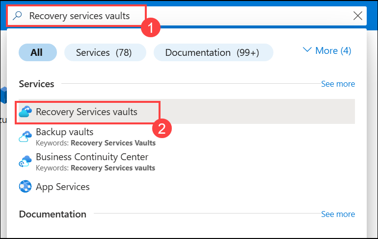
    
1. On the **Recovery Services vaults** page, click **SmartHotelMigration<inject key="DeploymentID" enableCopy="false" />-MigrateVault-_xxxx_**, which was configured in the previous HOL1 task.

    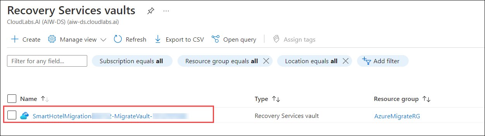

1. In the **Recovery Services vault** page, on the left panel, scroll down and click **Manage (1)** to expand the options. Under **Manage**, select **Site Recovery infrastructure (2)**.

    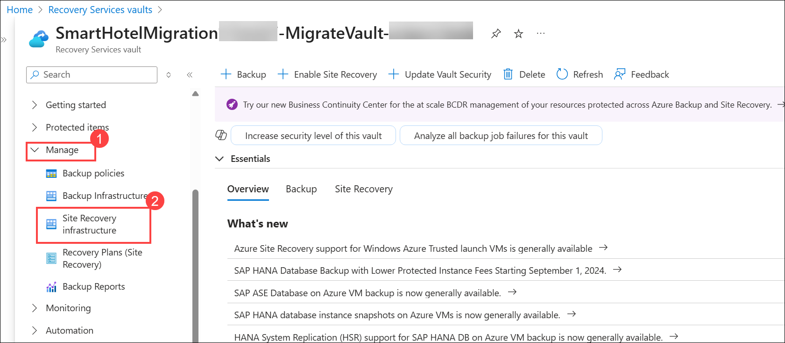

1. In the **Site Recovery infrastructure** blade, expand **For Hyper-V Sites (1)** on the left menu. Click on **Hyper-V Hosts (2)**. In the list of hosts, locate your server and ensure its **Connection status** is **Connected (3)**.

    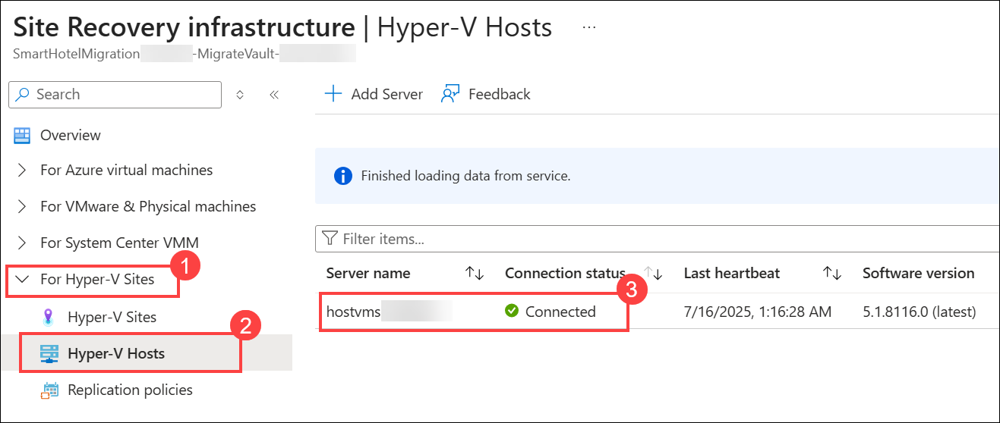  

1. Go back to the **Recovery Services vault** page, expand the **Protected items (1)** section on the left panel, and click **Replicated Items (2)**. Click the **+ Replicate (3)** button at the top. From the dropdown menu, select **Hyper-V machines to Azure (4)**.

    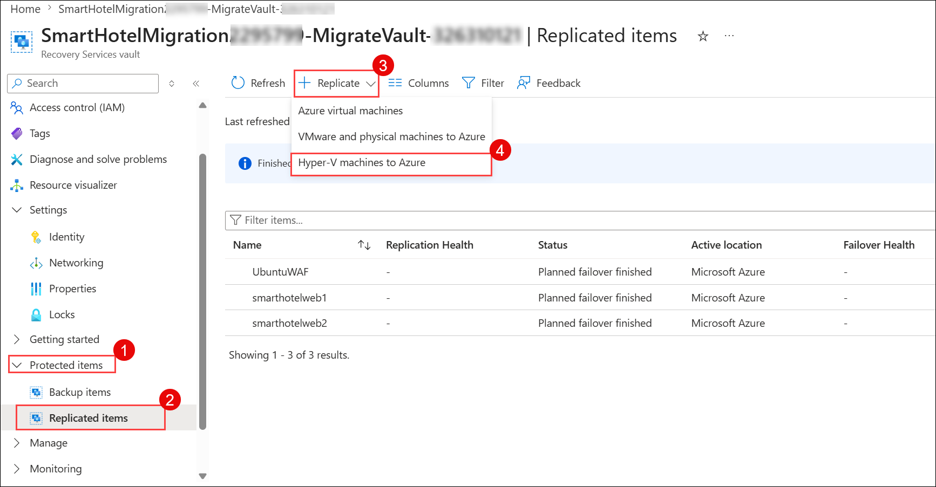 
   
1. In the **Source environment** tab of the replication wizard, select the **SmartHotelMigration<inject key="DeploymentID" enableCopy="false" />-HyperVSite (1)** from the **Source location** dropdown and then click on **Next (2)**.
 
    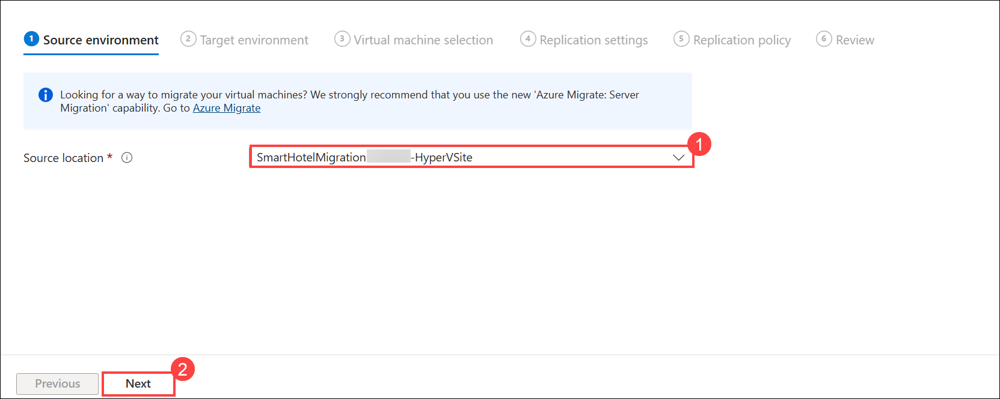 

1. Under the **Target environment** tab, fill in the following details:

   - Post-failover resource group: **SmartHotelRG (1)**
   
   - Storage type: **Storage account (2)**

   - Storage account: select the storage account created in the previous HOL **migrationstorage<inject key="DeploymentID" enableCopy="false" /> (3)** available in the drop-down list.   
   
   - Virtual network: **SmartHotelVNet (4)**

   - Subnet: **SmartHotel (5)**
   
    - Leave all other values at their default settings and click **Next (6)**.
   
    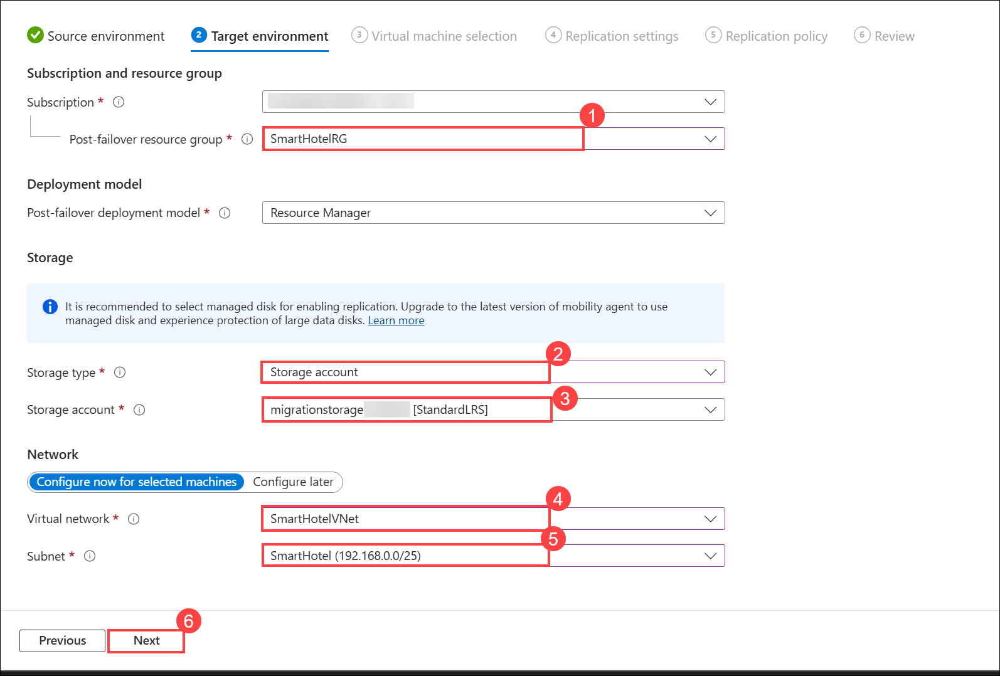    
    
1. Under the **Virtual machine selection** tab, select **AzureArcVM (1)** and click **Next (2)**.

    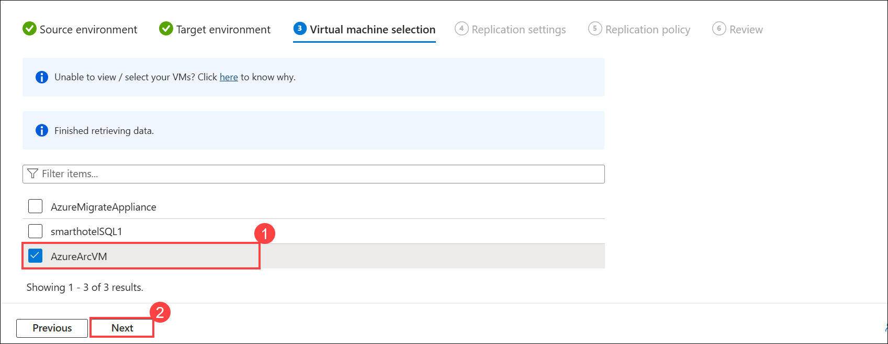

1. In the **Replication settings** tab, set the **OS type** to **Windows (1)** for the virtual machine **AzureArcVM**, and then click **Next (2)**.

    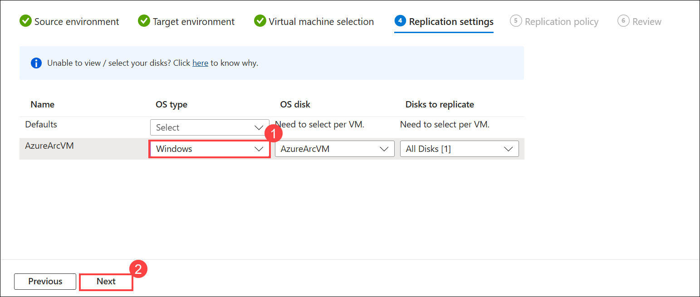
     
1. Under the **Replication policy** tab, select **defaultSmartHotelMigration<inject key="DeploymentID" enableCopy="false" />-HyperVSite-policy (1)** from the dropdown and click **Next (2)**.

    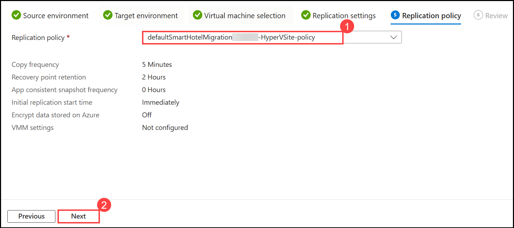
   
1. Under **Review** tab, click on **Enable Replication**.

    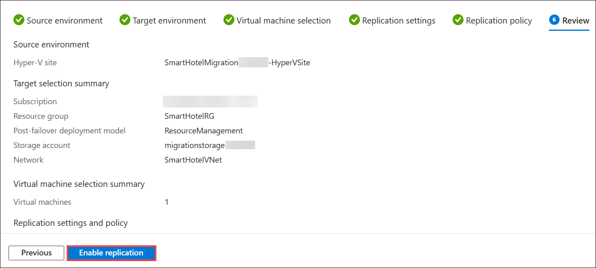

1. The replication process can take **15–20 minutes** to complete. Once replication is complete, the status of the replicated AzureArcVM will become **Protected (2)**.

   > **Note:** You might have to **Refresh (1)** a couple of times.

    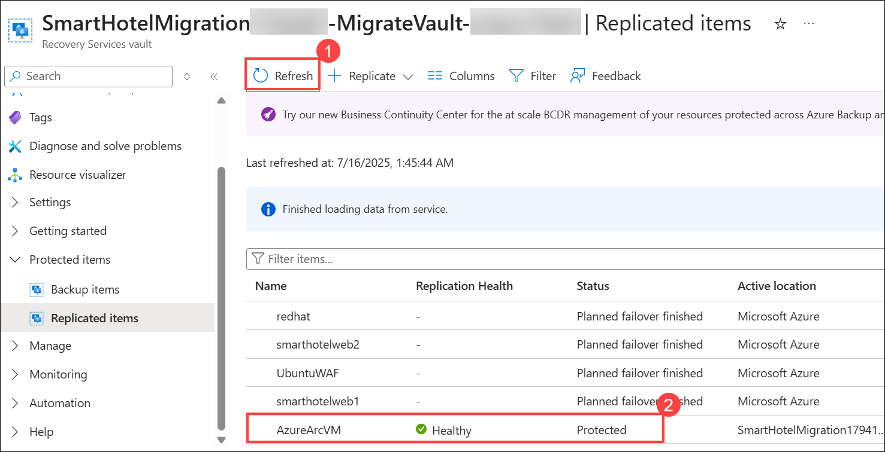

    > **Congratulations** on completing the task! Now, it's time to validate it. Here are the steps:
    > - Hit the Inline Validate button for the corresponding task. If you receive a success message, you can proceed to the next task. 
    > - If not, carefully read the error message and retry the step, following the instructions in the lab guide.
    > - If you need any assistance, please contact us at cloudlabs-support@spektrasystems.com. We are available 24/7 to help.

   <validation step="6f4ede7d-d07d-4209-b748-c272002a4085" />
   
## Summary

In this exercise, you explored how to set up Azure and on-premises prerequisites and create a Recovery Services vault for Site Recovery. You then learned how to configure the source and target replication environments and create a replication policy to enable replication for a server.

Now, click on the **Next** button in the lower right corner to move to the next page.

   