# HOL3: Exercise 2: Configure ASR for On-premises Infrastructure

### Estimated duration: 30 Minutes

## Overview

In this exercise, you will deploy disaster recovery of an on-premises Hyper-V VM to Azure. The Azure Site Recovery service contributes to your disaster-recovery strategy by managing and orchestrating replication, failover, and failback of on-premises machines. As part of the registration process, you will deploy the Azure Site Recovery Provider on your Hyper-V host.

## Objectives

In this exercise, you will complete the following task:

- Task 1: Configure ASR to on-premises infrastructure

### Task 1: Configure ASR to on-premises infrastructure

In this task, you will configure Azure Site Recovery (ASR) to replicate an on-premises Hyper-V VM to Azure.

1. In the Azure portal, search for **Recovery Services vaults (1)** using the search bar. From the search results, select **Recovery Services vaults (2)** to open the service.
   
    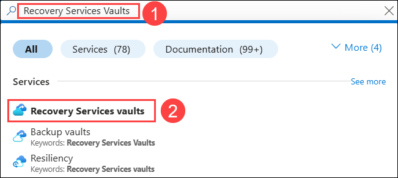
    
1. On the **Recovery Services vaults** page, select the **SmartHotelMigration<inject key="DeploymentID" />-MigrateVault (1)** Recovery Services vault.
   
    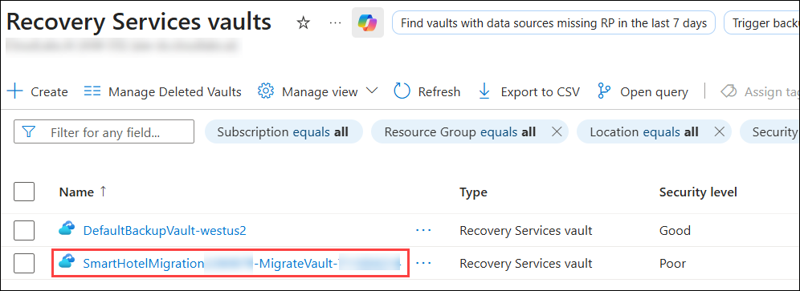

1. On the **Recovery Services vault** page, in the left navigation pane, expand **Manage (1)**, and then select **Site Recovery infrastructure (2)**.

    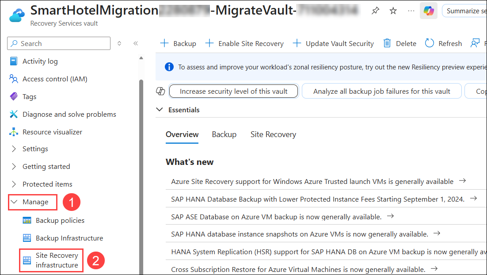

1. In the **Site Recovery infrastructure** pane, expand **For Hyper-V Sites (1)** in the left navigation pane, and then select **Hyper-V Hosts (2)**. Verify that your Hyper-V host displays a **Connection status** of **Connected (3)**.

    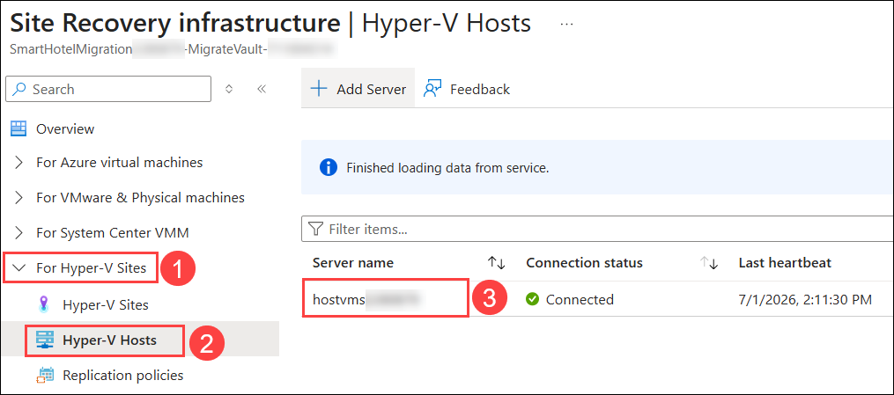

1. Return to the **Recovery Services vault** page. In the left navigation pane, expand **Protected items (1)**, and then select **Replicated items (2)**. On the **Replicated items** page, select **+ Replicate (3)**, and then choose **Hyper-V machines to Azure (4)** from the drop-down menu.

    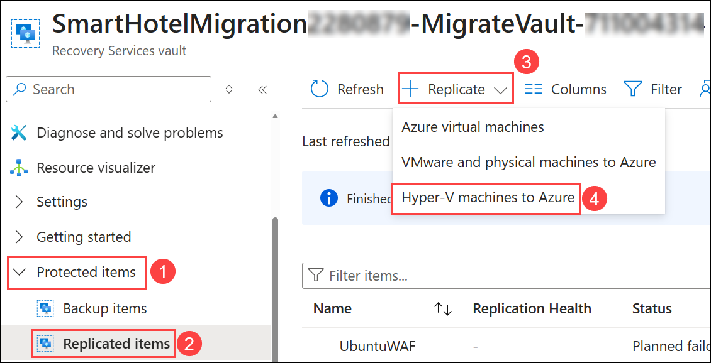
   
1. On the **Source environment** tab of the replication wizard, select **SmartHotelMigration<inject key="DeploymentID" enableCopy="false" />-HyperVSite (1)** from the **Source location** drop-down list, and then select **Next (2)**.
 
    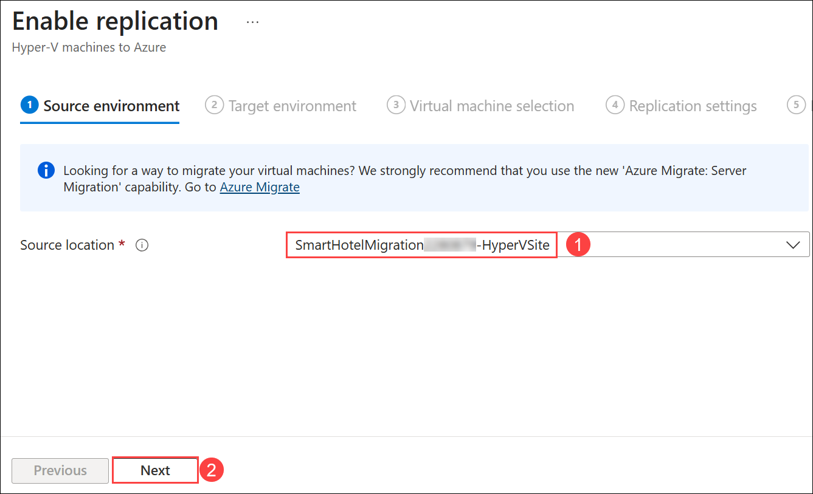
   
1. On the **Target environment** tab of the **Enable replication** wizard, configure the following settings:

   - **Post-failover resource group**: Select **SmartHotelRG (1)**.
   - **Replica storage type**: Select **Storage account (2)**.
   - **Storage account**: Select the storage account created in the previous exercise, **migrationstorage<inject key="DeploymentID" enableCopy="false" /> (3)**, from the drop-down list.
   - **Virtual network**: Select **SmartHotelVNet (4)**.
   - **Subnet**: Select **SmartHotel (5)**.

   Leave the remaining settings at their default values, and then select **Next (6)**.
   
    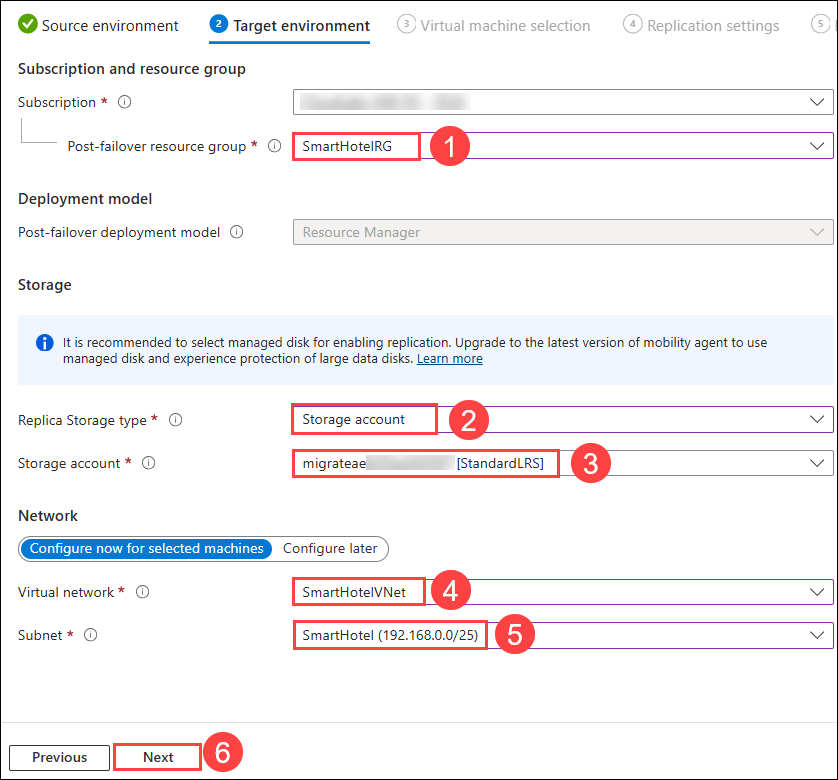
    
1. On the **Virtual machine selection** tab, select the checkbox next to **AzureArcVM (1)**, and then select **Next (2)** to continue.

    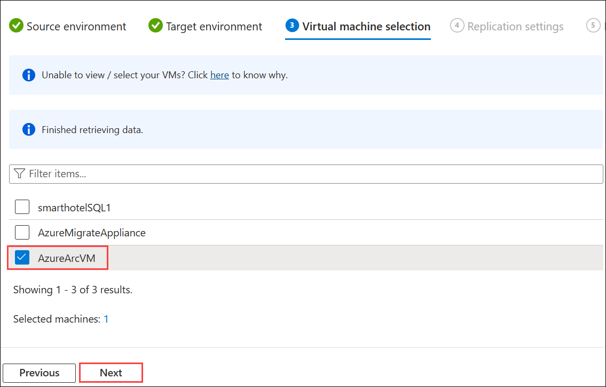

1. On the **Replication settings** tab, set the **OS type** for the **AzureArcVM** virtual machine to **Windows (1)**, and then select **Next (2)**.

    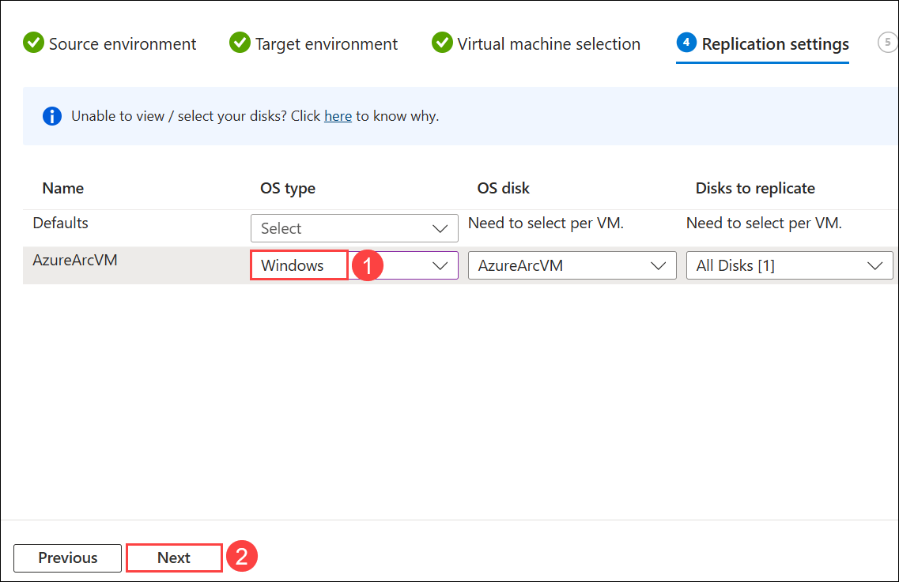
     
1. On the **Replication policy** tab, verify that **defaultSmartHotelMigration<inject key="DeploymentID" enableCopy="false" />-HyperVSite-policy (1)** is selected, and then select **Next (2)**.

    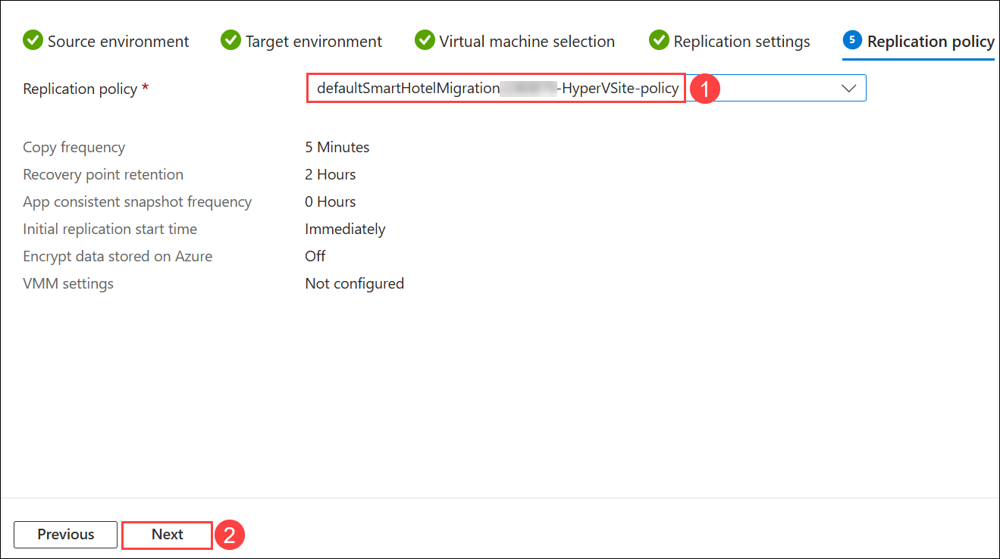
   
1. On the **Review** tab, review the replication settings, and then select **Enable replication** to start the replication process.

   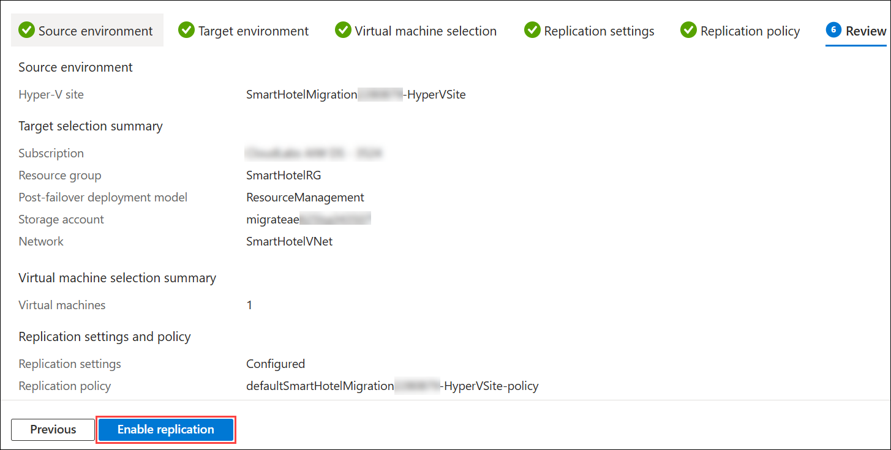

1. The replication process may take **15-20 minutes** to complete.

   > **Note:** Refresh the page periodically by selecting **Refresh (1)** until the **AzureArcVM** replication **Status** changes to **Protected (2)**.

      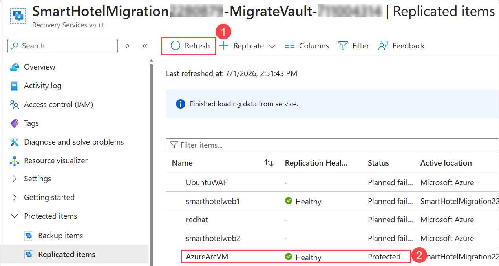

    > **Congratulations** on completing the task! Now, it's time to validate it. Here are the steps:
    > - Hit the Inline Validate button for the corresponding task. If you receive a success message, you can proceed to the next task. 
    > - If not, carefully read the error message and retry the step, following the instructions in the lab guide.
    > - If you need any assistance, please contact us at cloudlabs-support@spektrasystems.com. We are available 24/7 to help.
  
    <validation step="f3c58f07-0538-48dd-b132-fa421af7a7f7" />
   
## Summary 

In this exercise, you explored how to set up Azure and on-premises prerequisites and create a Recovery Services vault for Site Recovery. Then you learn how to set up the source and target replication environments and create a replication policy to enable replication for a server.

Click on **Next** from the lower right corner to move on to the next page.

