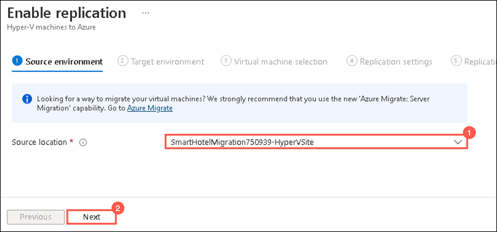

### HOL3: Exercise 2: Configure ASR for on-premises infrastructure

In this exercise, you will deploy disaster recovery of on-premises Hyper-V VM to Azure. The Azure Site Recovery service contributes to your disaster-recovery strategy by managing and orchestrating replication, failover and failback of on-premises machines. 

1. If you are not logged in already, click on Azure portal shortcut that is available on the desktop and log in with below Azure credentials.
    * Azure Username/Email: <inject key="AzureAdUserEmail"></inject> 
    * Azure Password: <inject key="AzureAdUserPassword"></inject>

1. In the **search resources, services and docs bar**, type **Recovery service vaults** and select it from suggestions, as shown below:
   
    
    
1.  Under the **Recovery Services Vaults** page, select the **SmartHotelMigration<inject key="DeploymentID" enableCopy="false" />-MigrateVault-_xxx_** which was created in the previous exercise of HOL1.

    

1. On the **Recovery services vault** page, select **Site Recovery Infrastructure** under **Manage** on the left side of the panel.

    

1. Under **Site Recovery Infrastructure** page, select **Hyper-V hosts (1)** and then make sure that the status of the server **SmartHost<inject key="DeploymentID" enableCopy="false" />** is **Connected (2)**.

      

1. Go to your **Recovery services vault** page, click on **Replicated Items (1)** under **Protected Items** and then click on **+Replicate (2)** and select **Hyper-V machines to Azure (3)**.

     
   
1. Under **Source environment** tab, select the Source location as **SmartHotelMigration<inject key="DeploymentID" enableCopy="false" />-HyperVSite (1)** and then click on **Next (2)**.
 
     
   
1. Under **Target environment** tab, fill the following details:

   - Post-failover resource group: **SmartHotelRG (1)**
   
   - Storage account: **migrate _xxxx_ (2)** (default storage account that was auto-created in previous HOL1)
   
   - Virtual network: **SmartHotelVNet (3)**

   - Subnet: **SmartHotel (4)**
   
   - Leave other values as default and click on **Next (5)**
   
       
    
1. Under **Virtual machine selection** tab, **check for AzureArcVM (1)** and click on **Next (2)**.

   

1. Under **Replication settings** tab, select **Windows** as OS-disk type for AzureArcVM from the drop-down list.

   
    
1. Under **Replication policy** tab, select **defaultSmartHotelMigration<inject key="DeploymentID" enableCopy="false" />-HyperVSite-poicy (1)** from the drop-down menu and then click on **Next (2)**.  
 
   
       
1. Under **Review** tab, click **Enable Replication**.

1. Select **Refresh (1)** occasionally and wait until the replicated AzureArcVM have a **Protected (2)** status, which shows the initial replication is complete. This will take 15-20 minutes.

   
   
