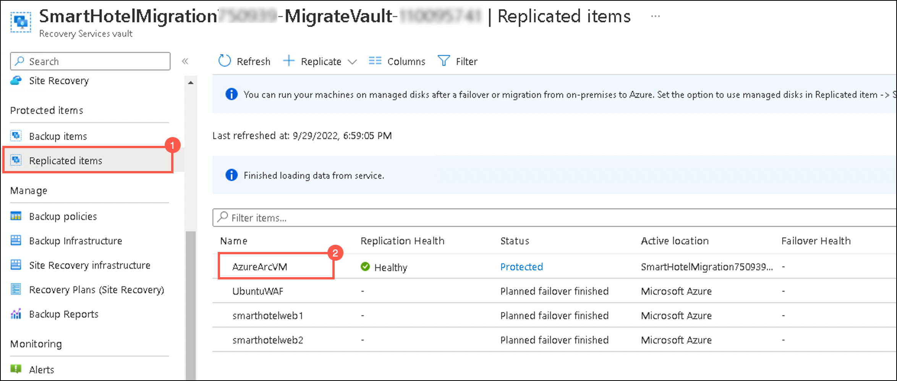
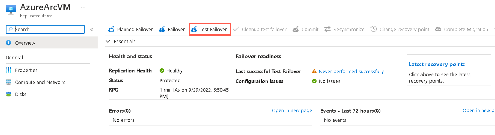
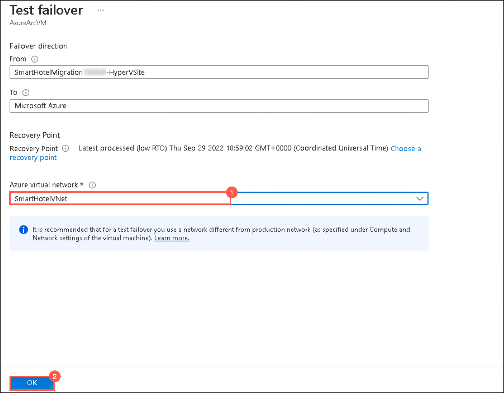
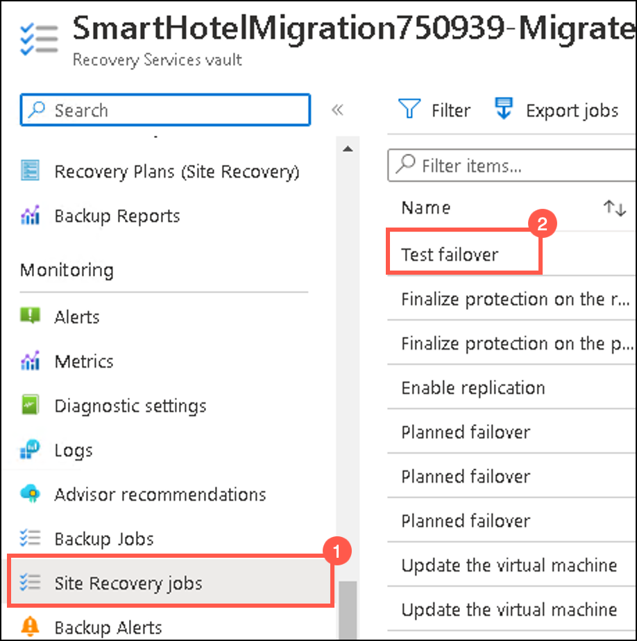
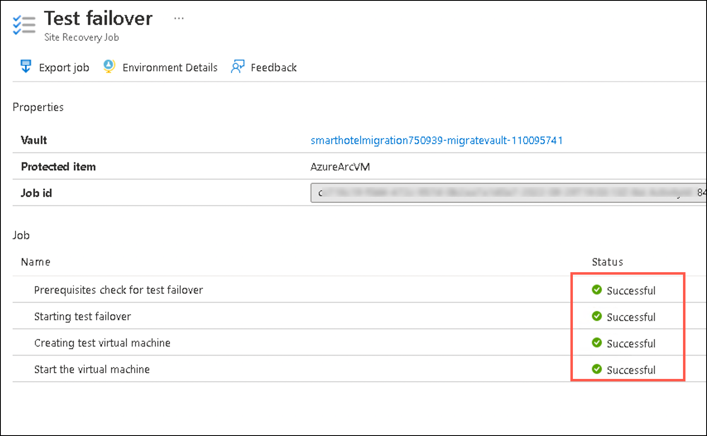
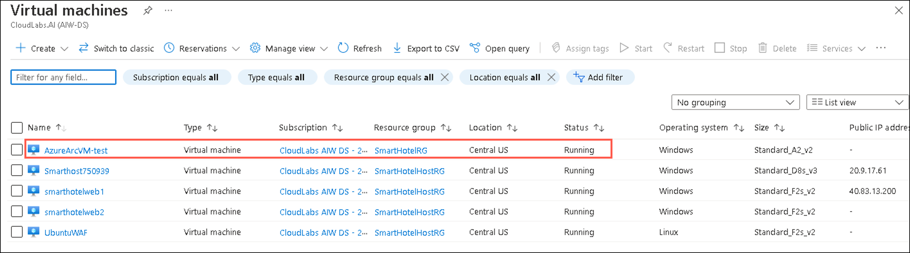
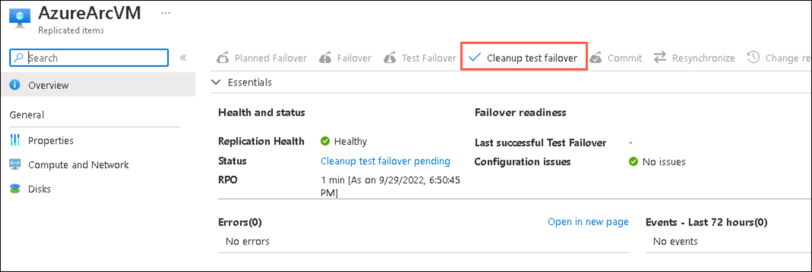
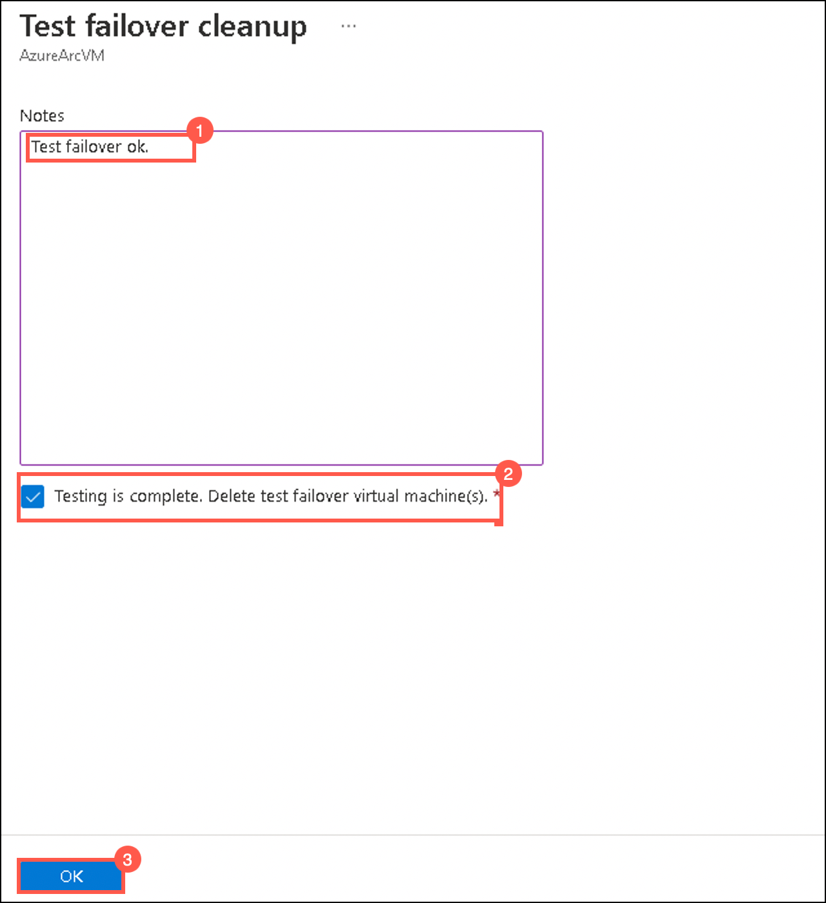

### HOL3: Exercise 3: Setup test failover

In this exercise, you will deploy a Test Failover to the replicated Virtual Machine which allows you to test the sanity of the virtualized workload without interrupting your production workload or ongoing replication.

1. If you are not logged in already, click on Azure portal shortcut that is available on the desktop and log in with below Azure credentials.
    * Azure Username/Email: <inject key="AzureAdUserEmail"></inject> 
    * Azure Password: <inject key="AzureAdUserPassword"></inject>

1. In the **search resources, services and docs bar**, type **Recovery service vaults** and select it from suggestions, as shown below:
   
    
    
1. Select the **SmartHotelMigration<inject key="DeploymentID" enableCopy="false" />-MigrateVault-_xxx_** that you used in the previous exercise.    
    
1. On the **Recovery Service Vault** page, click on **Replicated Items (1)** under **Protected Items** and select **AzureArcVM (2)** that you replicated in the previous exercise.     

     
   
1. On the **AzureArcVM** page, click on **Test Failover**.  

     
   
1. On the **Test failover page**, select the Azure virtual network: **SmartHotelVNet (1)** and click on **Ok (2)**.

     
    
1. To monitor progress, select **Site Recovery Jobs (1)** under **Monitoring** on the left and select **Test failover (2)** to review the status of the job.    

     
    
1. Wait for 10-15 minutes, for the job status of the test failover to get completed successfully. You should not need to refresh your browser. 

     
  
1. In the **search resources, services and docs bar**, type **Virtual Machines** and select it from suggestions.

1. Under **Virtual Machines** page, you will now be able to see **AzureArcVM-test** which is automatically created as a result of test failover and also verify that the status of the VM is in **Running state**.

     
    
 >**Note:** We have successfully configured the test failover over the replicated Virtual Machine.
  
11. Go back to **Recovery Service Vault** page, click on **Replicated Items (1)** under **Protected Items** and select **AzureArcVM (2)**.

     
    
12. On the **AzureArcVM** page, click on **Cleanup test failover**.  

     
    
13. On the **Test failover cleanup** page, enter `Test failover ok.` under **Notes (1)** and **check for the Testing is complete. Delete test failover virtual machines (2)** and then click on **Ok (3)**

     
        
