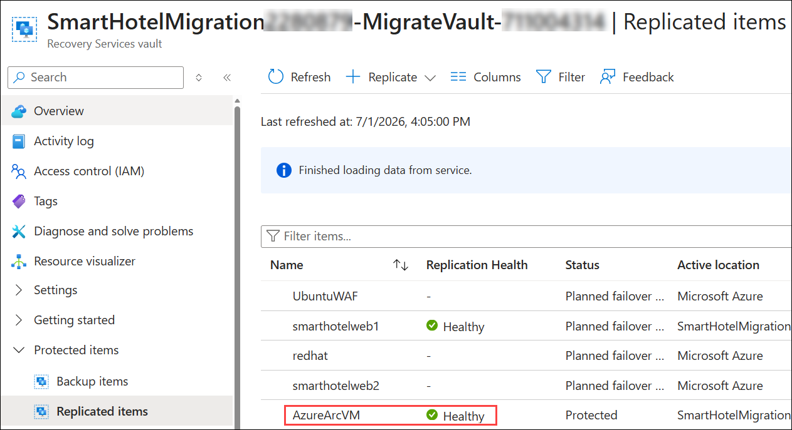
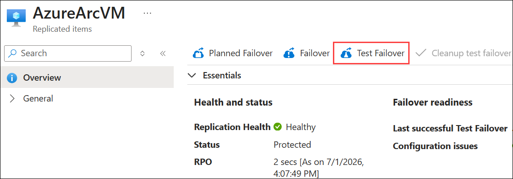
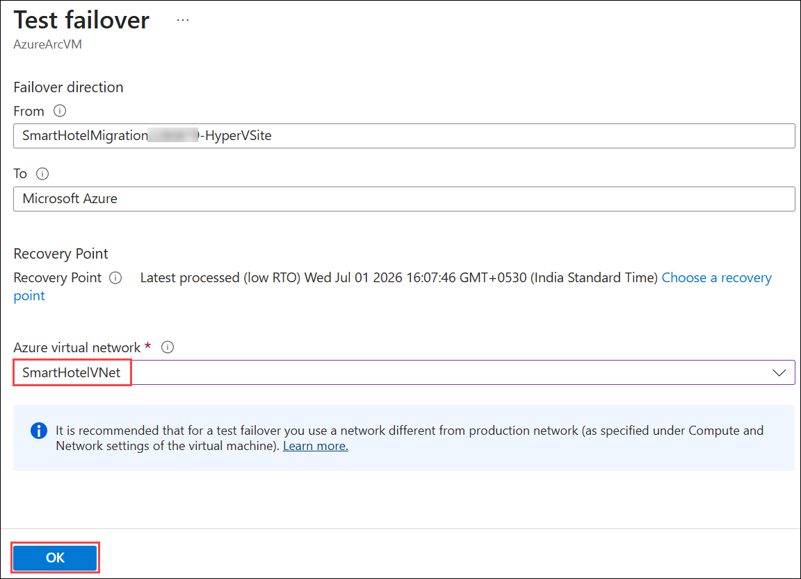
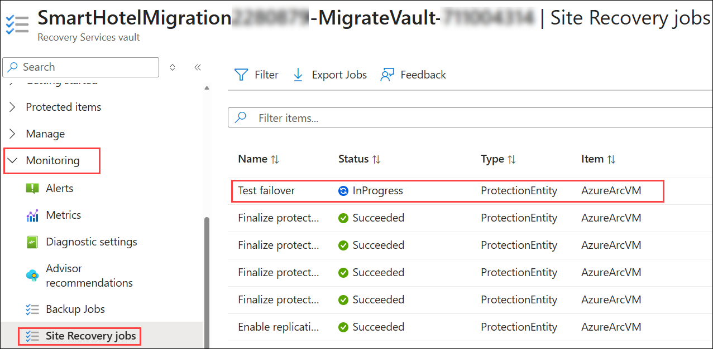
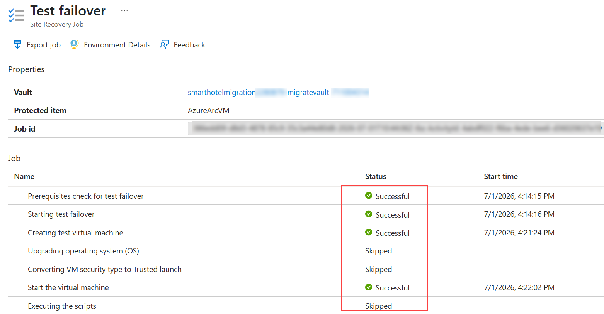
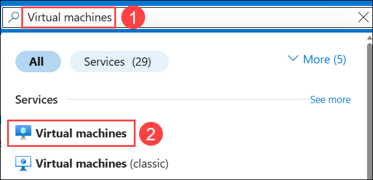
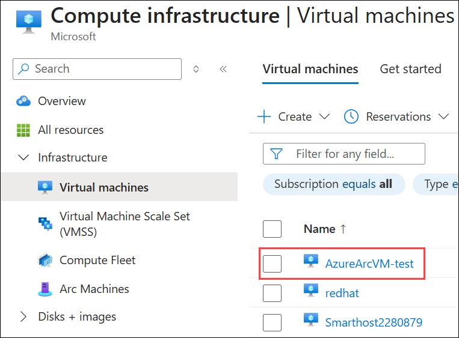
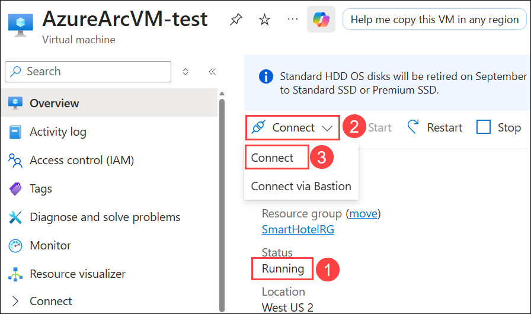
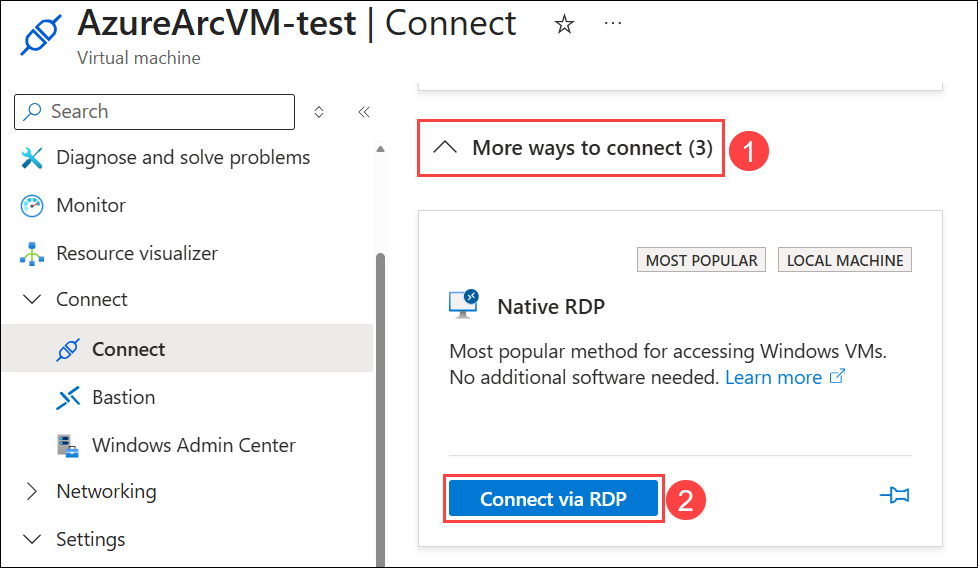
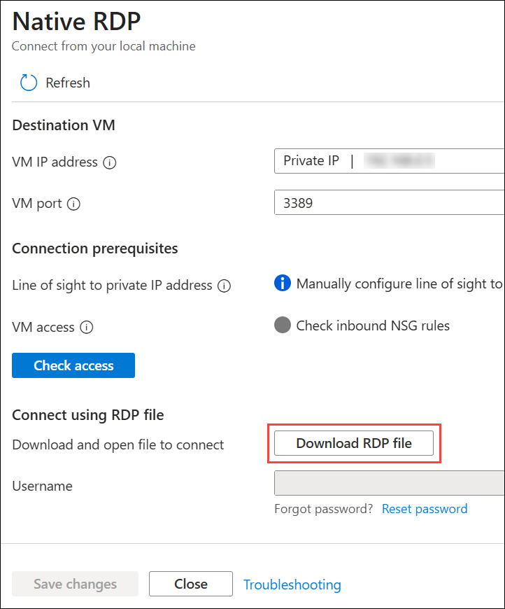

# HOL3: Exercise 3: Setup Test Failover

### Estimated duration: 20 Minutes

## Overview
In this exercise, you will deploy a Test Failover to the replicated Virtual Machine, which allows you to test the sanity of the virtualized workload without interrupting your production workload or ongoing replication.

## Objectives

In this exercise, you will complete the following task:

- Task 1: Setup Test Failover

### Task 1: Setup Test Failover

In this task, you will initiate a test failover for the replicated VM in Azure. This ensures the VM can be recovered successfully without impacting production workloads.

1. On the **Recovery Services vault** page, under **Protected items**, select **Replicated items**, and then select the **AzureArcVM (3)** virtual machine that you replicated in the previous exercise.
   
     
   
1. On the **AzureArcVM** page, click on **Test Failover**.  

     
   
1. On the **Test failover** page, select **SmartHotelVNet** under Azure virtual network and click **OK** to initiate the test failover.

     
    
1. Go back to the **Replicated items** page. Under **Monitoring (1)** in the left-hand panel, select **Site Recovery jobs (2)** and then click on **Test failover (3)** to view the job status.

     

1.  On the **Test failover** job details page, wait for **10-15 minutes** for the **Test failover** job to complete successfully and reflect the **Successful** status across key steps in the job list.
   
     
  
1. In the **Search resources, services, and docs** bar, type **Virtual Machines** **(1)** and select **Virtual machines** from the Services **(2)**.

    

1. On the **Virtual machines** page, select **AzureArcVM-test** which is automatically created after the test failover.

    
  
1. On the **AzureArcVM-test** page, confirm the VM is in **Running** state **(1)**, then click **Connect** **(2)** and select **Connect** from the dropdown **(3)**.
    
     

1. On the **AzureArcVM-test | Connect** page, expand **More ways to connect (1)**, under **Native RDP** click **Connect via RDP (2)**, and on the **Connect using RDP file** page click **Download RDP file** to download and open the file for connection.

     

     

## Summary 

In this exercise, you learnt how to validate the replication and disaster recovery strategy by testing a failover, that too without any data loss or downtime.

Click on **Next** from the lower right corner to move on to the next page.

