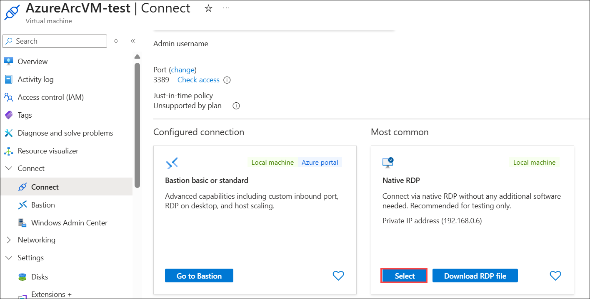

# Exercise 03: Setup test failover

### Estimated time: 25 Minutes

In this exercise, you will deploy a Test Failover to the replicated Virtual Machine which allows you to test the sanity of the virtualized workload without interrupting your production workload or ongoing replication.

## Lab objectives

In this exercise, you will complete the following task:

- Task 1: Setup Test Failover

## Task 1: Setup Test Failover

1. On the **Recovery Service Vault page**, expand the **Protected Items (1)** and click on **Replicated Items (2)** and select **AzureArcVM (3)** that you replicated in the previous exercise.    

     
   
1. On the **AzureArcVM** page, click on **Test Failover**.  

     
   
1. On the **Test failover** page, select **SmartHotelVNet (1)** under Azure virtual network and click **OK (2)** to initiate the test failover.

     
    
1. Go back to the **Replicated items** page. Under **Monitoring (1)** in the left-hand panel, select **Site Recovery jobs (2)** and then click on **Test failover (3)** to view the job status. 

     

1. On the **Test failover** job details page, wait for **10–15 minutes** for the **Test failover** job to complete successfully and reflect the **Successful** status across key steps in the job list.

     
  
1. In the **Search resources, services, and docs** bar, type **Virtual Machines** **(1)** and select **Virtual machines** from the Services **(2)**.

    

1. On the **Virtual machines** page, select **AzureArcVM-test** which is automatically created after the test failover..

     
  
1. On the **AzureArcVM-test** page, confirm the VM is in **Running** state **(1)**, then click **Connect** **(2)** and select **Connect** from the dropdown **(3)**. On the **Connect** pane, under **Most common**, select **Download RDP file** to connect via **Native RDP**.   

     

     
    

## Summary

In this exercise, you learnt how to validate the replication and disaster recovery strategy by testing a failover, that too without any data loss or downtime.

Now, click on the **Next** button in the lower right corner to move to the next page.

   
