# Exercise 04: Failover the infrastructure to Azure Cloud

### Estimated time: 35 minutes

## Overview

In this exercise, you will deploy the Failover from on-premises to Azure. After setting up replication to Azure for on-premises machines, when your on-premises site goes down, you fail those machines over to Azure. After failover, Azure VMs are created from replicated data.

## Lab objectives

In this exercise, you will complete the following task:

- Task 1: Failover the Infrastructure to Azure Cloud

## Task 1: Failover the Infrastructure to Azure Cloud

1. In the **search resources, services and docs bar**, type **Recovery services vaults (1)**. From the dropdown results under **Services**, click on **Recovery Services vaults (2)**.
   
   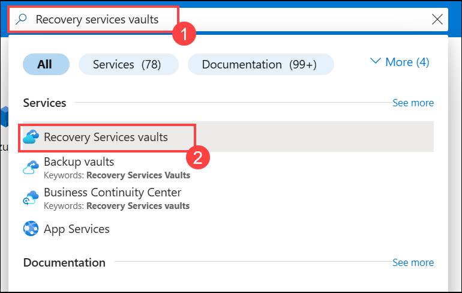
    
1. On the **Recovery service vaults**, click on **SmartHotelMigration<inject key="DeploymentID" enableCopy="false" />-MigrateVault-_xxxx_**.  

    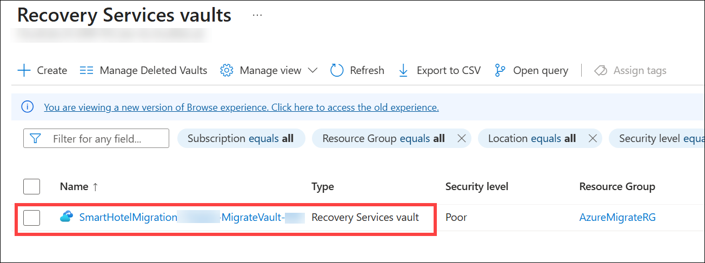
    
1. On the **Recovery Service Vault page**, click on **Replicated Items (2)** under **Protected Items (1)** section and select **AzureArcVM (3)**.     

     
    
1. On the **AzureArcVM** page, click on **Cleanup test Failover**.   

   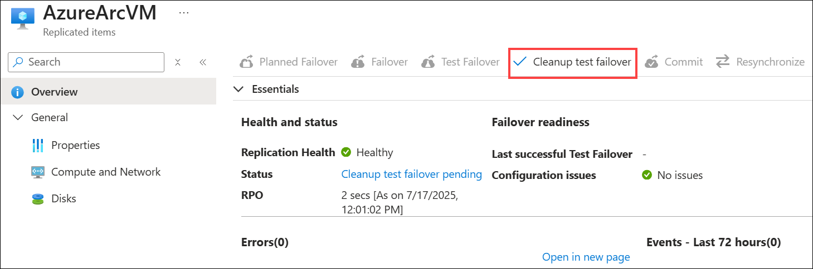 
   
1. On the **Test failover cleanup** page, enter `Test failover ok.` under **Notes (1)** and make sure to **(2) check the box: Testing is complete. Delete test failover virtual machine(s)** and then click on **OK (3)**.

   > **Note:** Wait for the cleanup test failover to get completed successfully.
   
   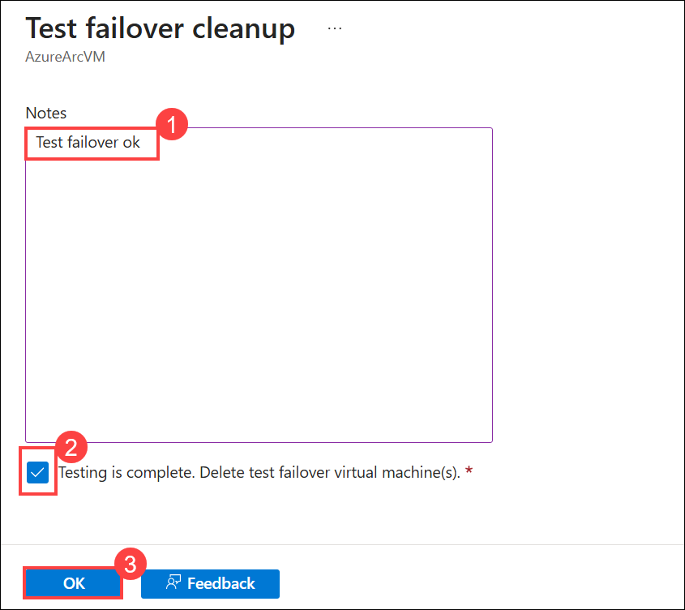 
   
1. On the **AzureArcVM** page, click on **Failover**.

   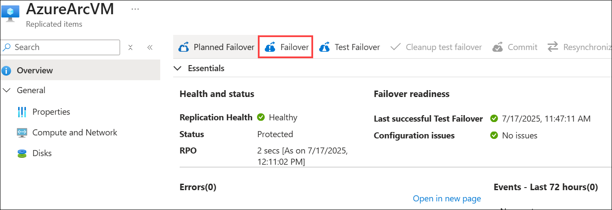 
   
1. On the **Failover** page, review the settings and click on **Ok**.  

   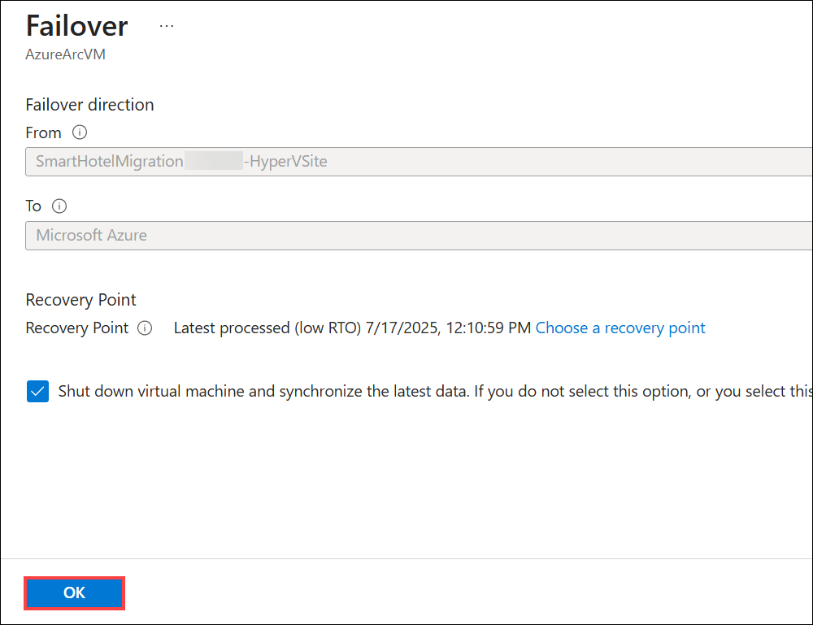 
   
1. Go back to the Replicated items page and select **Site Recovery Jobs (2)** under **Monitoring (1)** from the left-hand side panel and click on **Failover (3)** to view the job status.      

   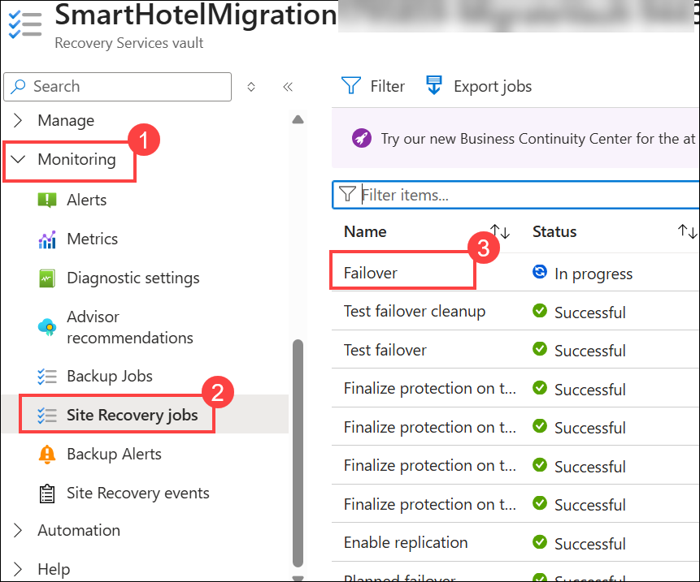 
   
1. On the **Failover** page, wait for **10-15 minutes** for the failover job to complete. The **Status** column should show **Successful** for all key steps.

    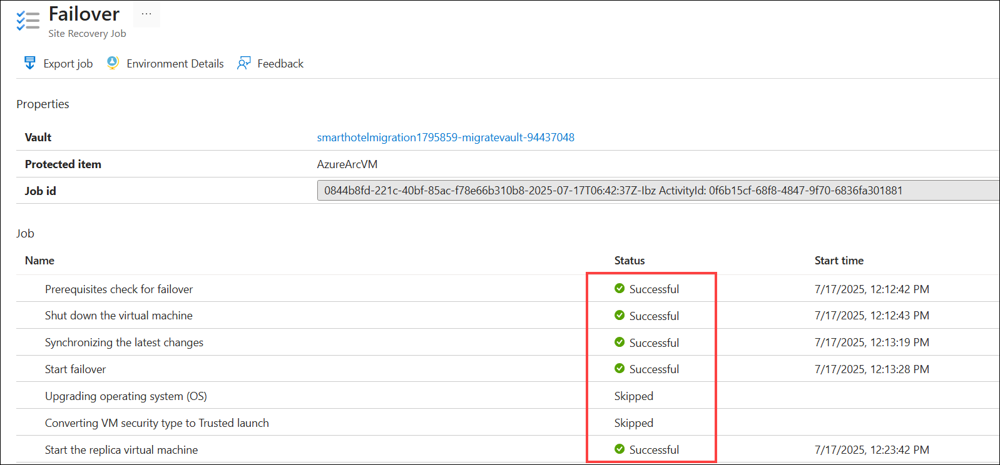    
   
1. After the Failover is completed successfully, go to **Protected items (1)** → **Replicated items (2)** and verify that the status of the replicated **AzureArcVM (3)** shows **Failover completed** with **Active location** as **Microsoft Azure**.

   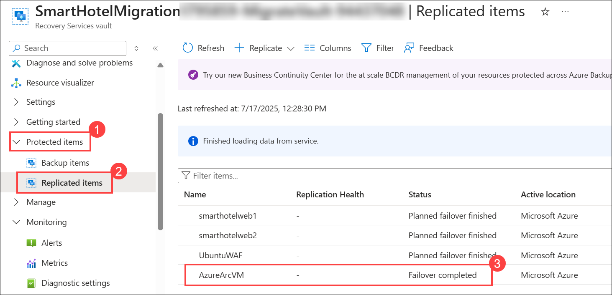  
   
   > **Note:** If you want to switch to a different recovery point to use for the failover, use **Change recovery point**.  
  
   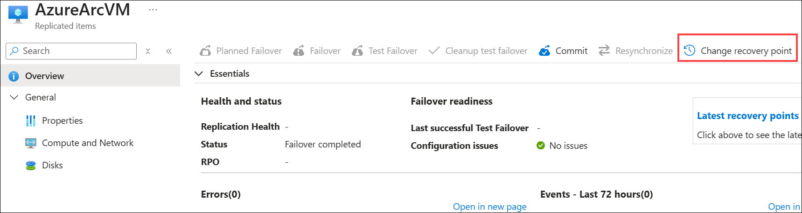 
   
1. On the **replicated AzureArcVM** page, click on **Commit** to commit the failover (The Commit action deletes all the recovery points available with the service).

   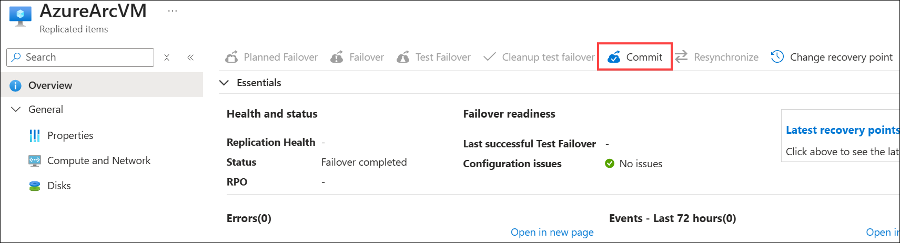
   
1. On the **Commit** page, click on **Ok**.   

   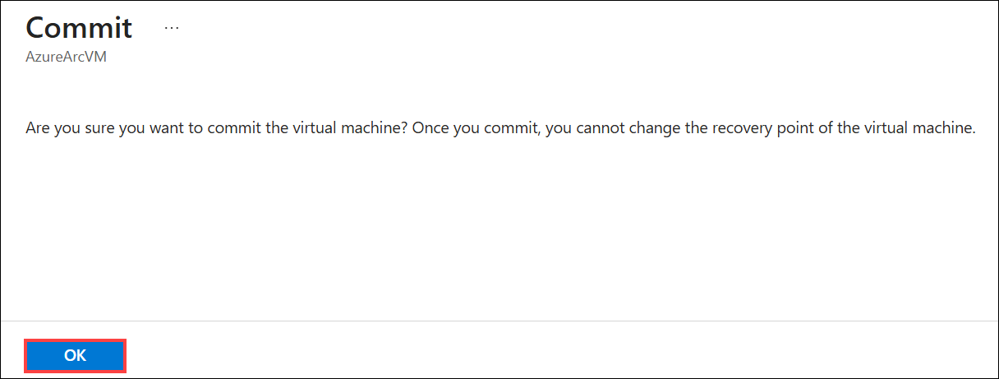 
   
1. After the Failover is **committed successfully**,  In the **Search resources, services, and docs** bar, type **Virtual Machines** **(1)** and select **Virtual machines (2)** from the Services.   

    

1. Under the **Virtual Machines** page, select the **AzureArcVM**, which is automatically created from replicated data after a Failover.

    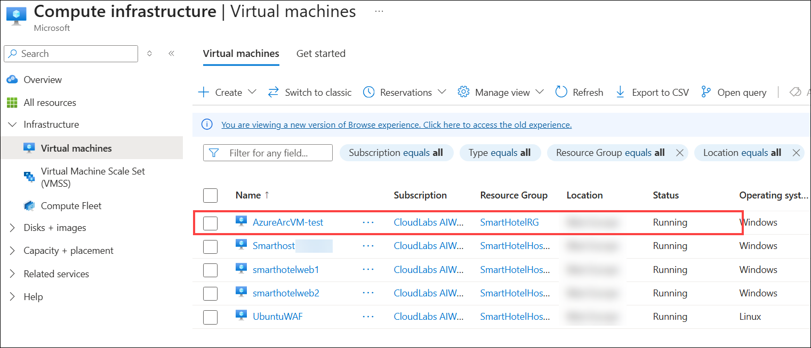 
   
1. On the **AzureArcVM** page, verify that the status of the VM is in the **Running state**.  

    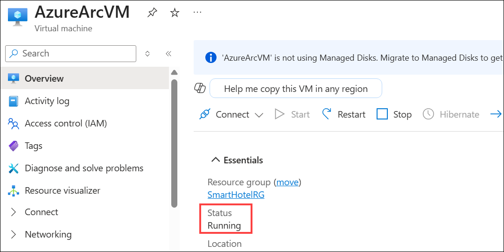

    > **Congratulations** on completing the task! Now, it's time to validate it. Here are the steps:
    > - Hit the Inline Validate button for the corresponding task. If you receive a success message, you can proceed to the next task. 
    > - If not, carefully read the error message and retry the step, following the instructions in the lab guide.
    > - If you need any assistance, please contact us at cloudlabs-support@spektrasystems.com. We are available 24/7 to help.

   <validation step="f44dc9dc-f959-4f70-9cbd-09949f72c0fb" />

## Summary

In this exercise, you explored how to fail over on-premises physical servers that are replicating to Azure with Azure Site Recovery. After you've failed over, you fail back from Azure to your on-premises site when it's available.

### You have successfully completed the Hands-on Lab.

