### HOL3: Exercise 4: Failover the infrastructure to Azure Cloud.

In this exercise, you will deploy the Failover from on-premises to Azure. After setting up replication to Azure for on-premises machine, when your on-premises site goes down, you fail the machine over to Azure. After failover, Azure VM is created from replicated data.

1. If you are not logged in already, click on Azure portal shortcut that is available on the desktop and log in with below Azure credentials.
    * Azure Username/Email: <inject key="AzureAdUserEmail"></inject> 
    * Azure Password: <inject key="AzureAdUserPassword"></inject>

1. In the **search resources, services and docs bar**, type **Recovery service vaults** and select it from suggestions, as shown below:
   
   
    
1. Select the **SmartHotelMigration<inject key="DeploymentID" enableCopy="false" />-MigrateVault-_xxx_** that you used in the previous exercise.    
    
1. On the **Recovery Service Vault page**, click **Replicated Items (1)** under **Protected Items** and select **AzureArcVM (2)** that you replicated in the previous exercise.     

   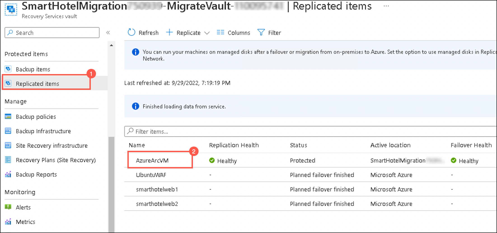 
   
1. On the **AzureArcVM** page, click on **Failover**.

   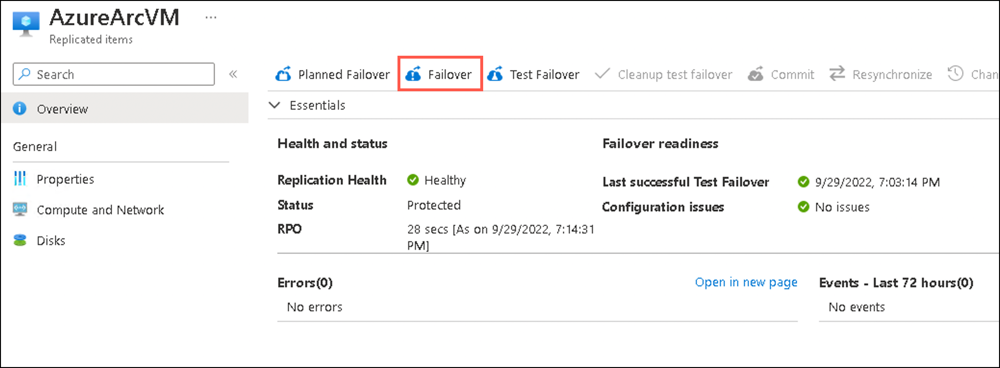 
   
1. On the **Failover** page, review the settings and click **Ok**.  

   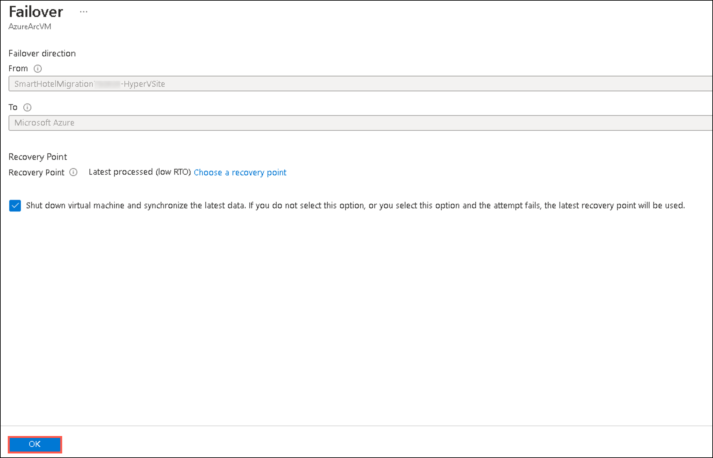 
   
1. To monitor progress, select **Site Recovery Jobs (1)** under **Monitoring** on the left and select **Failover (2)** to review the status of the job.    

   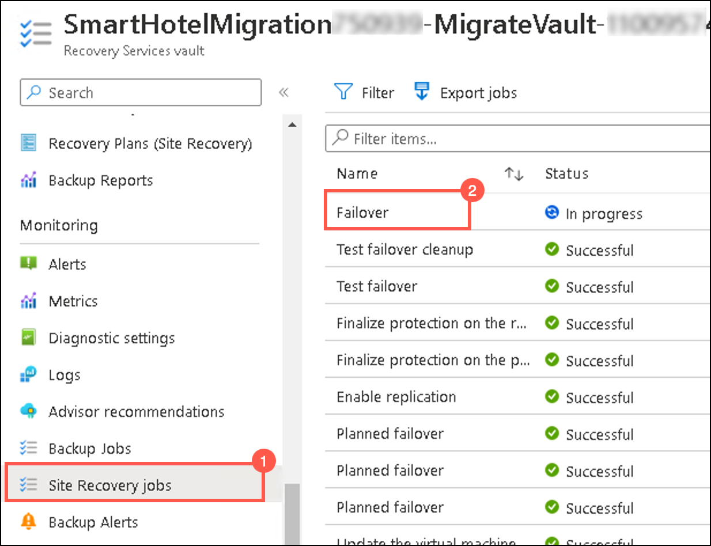 
   
1. Wait for 10-15 minutes, for the job status of the failover to get completed successfully. You should not need to refresh your browser.   

   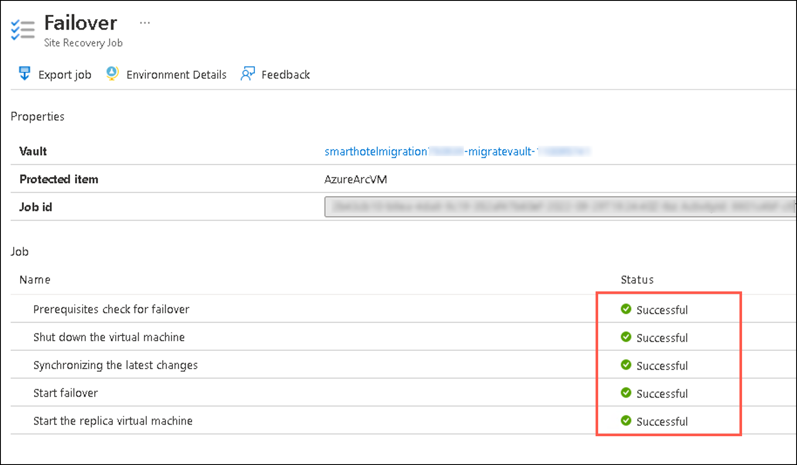 
   
1. After the Failover is completed successfully, go back to **Replicated items** under Protected Items and then verify that the **Active location** of the the **replicated AzureArcVM** will be changed to **Microsoft Azure**.

   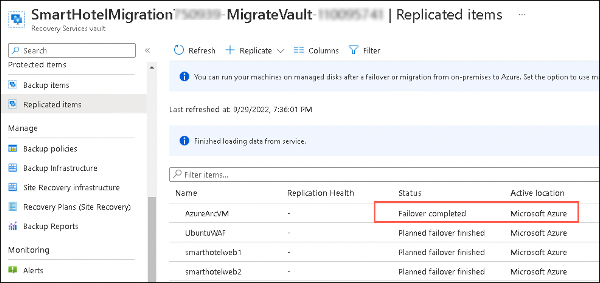  
   
   > **Note:** If you want to switch to different recovery point to use for the failover, use **Change recovery point**.   
  
   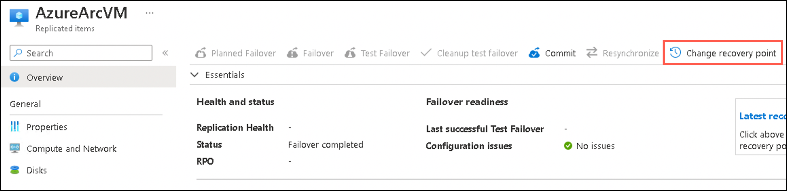 
   
1. On the **replicated AzureArcVM** page, click on **Commit** to commit the failover. (The Commit action deletes all the recovery points available with the service). 

   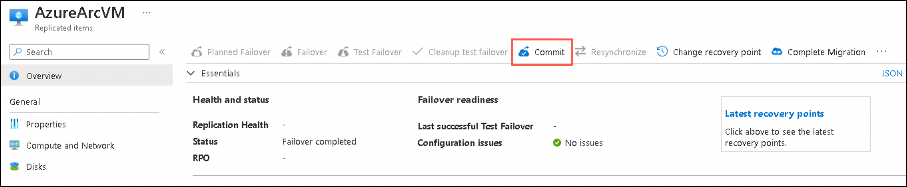
   
1. On the **Commit** page, click **Ok**.   

   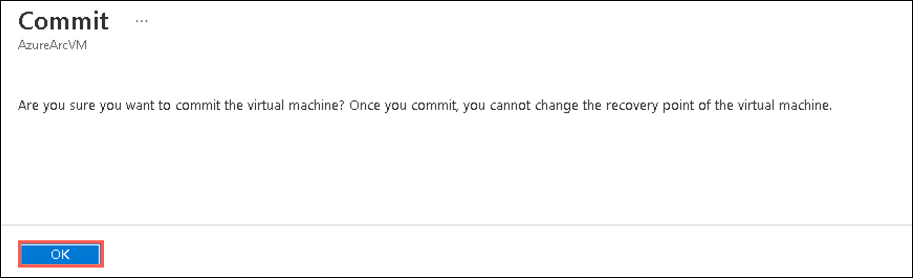 
   
1. After the Failover is **Committed successfully**, go to the **search resources, services and docs bar**, type **Virtual Machines** and select it from suggestions.   

1. Under **Virtual Machines** page, select the **AzureArcVM** which is automatically created from replicated data after a Failover.

    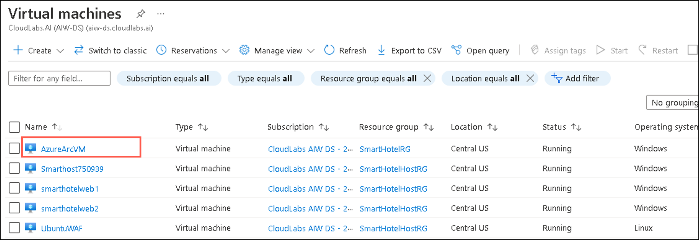 
   
1. On the **AzureArcVM** page, verify that the status of the VM is in **Running state**. 

    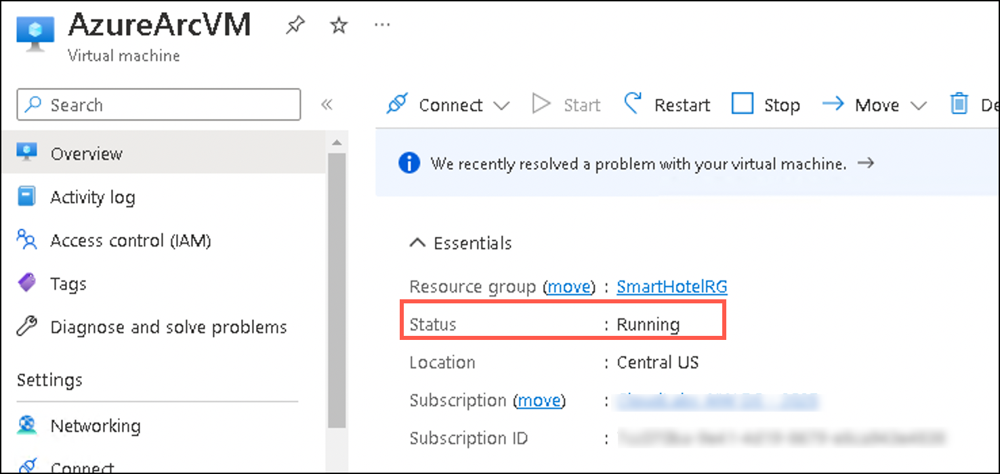  
