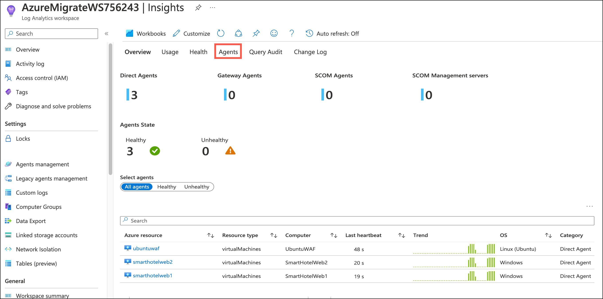

# Lab 01: Secure Infra workloads with Defender for Cloud 

### Estimated Duration: 4 hours

## Exercise 01: Enable Microsoft Defender for Cloud, Microsoft Sentinel, and Azure Monitor, and setup Log analytics for each source

In this exercise, you will learn how to enable enhanced security features by enabling the Defender for Cloud plans through the Azure portal. The Defender plans show you the monitoring coverage for each Defender plan. You will be enabling the same for Microsoft Sentinel and Azure Monitor. Also, you will set up a Log Analytics workspace to collect logs and data of these resources, and their information will be stored in a workspace.

> **Note:** 
> - Microsoft Defender for Cloud, Azure Sentinel and Monitor Insights can take several hours to surface after the completion of a scan.
> - At this point of the workshop, only a limited number of data visualizations may be populated. (So the result in the screenshots below may vary)
> - The screenshots and information below, have been provided so that you can conceptualise the type of graphs and output that can be gleaned from a fully populated environment.

## Lab objectives

In this exercise, you will complete the following tasks:

- Task 1: Enable Microsoft Defender for Cloud
- Task 2: Enable Microsoft Sentinel
- Task 3:  Enable Azure Monitor

## Task 1: Enable Microsoft Defender for Cloud

In this task, you will enable Microsoft Defender for Cloud to enhance the security of your Azure environment.

1. In the **Azure portal**,  search for **Log Analytics Workspaces (1)** and select **Log Analytics Workspaces (2)**, from the results.

    
   
4. Select **+ Create** on the Log Analytics workspaces page.

    
   
5. Within the Create Log Analytics workspace pane, enter the following details:
   
   * Subscription: Select the default **subscription (1)**.
     
   * Resource Group: **AzureMigrateRG (2)**.
     
   * Name : Enter **AzureMigrateWS<inject key="Deployment ID" enableCopy="false"/>** **(3)**.
     
   * Region: Select the default **location (4)**.

   - Click on **Review + Create (5)**

      
     
6.  then click on **Create** and wait for the deployment to complete.

    
   
7. Once the deployment is completed, search for **Microsoft Defender for Cloud (1)** in **Azure Portal** and select **Microsoft Defender for Cloud (2)** from suggestions.

    
    
    > **Note:** If you are prompted with a new upgrade pop-up, click on Skip.
    
9. On the **Microsoft Defender for Cloud** page, click on **Environment settings (2)** under **Management (1)** and click on the **down arrow (3)** of your subscription name and click on **AzureMigrateWS<inject key="DeploymentID" enableCopy="false" /> (4)**.

     
     
10. On the **Defender plans (1)** page, switch the plan blade **On (2)** for **Servers** and then click on **Save (3)**.    

    
    
11. In the Microsoft Defender for Cloud dashboard, go to **General (1)** > **Overview (2)**, **scroll down (3)**, and click **Click here to upgrade (4)** under the Upgrade to new Defender CSPM plan section.

    

12. Under the **Upgrade tab** select **AzureMigrateWS<inject key="DeploymentID" enableCopy="false" /> (1)** workspace and click on **Upgrade (2)**.

     

1. The **Microsoft Defender for Cloud Overview page** offers a consolidated perspective for security experts. This section combines various independent cloud security components, such as **Secure Score, Regulatory Compliance, and Workloads Protection**, and provides detailed insights on the security posture on a distinct dashboard

    

1. In the Microsoft Defender for Cloud portal, click **General (1)**, then select **Recommendations (2)** to view risk-based recommendations and resource health insights..
    
    
   
1. On the **Security alerts page** under General, you can see the alerts that describe details of the affected resources, suggested remediation steps, and in some cases, an option to trigger a logic app in response. (The Remediation steps contain the remediation logic where you can remediate the selected resource/s. To simplify remediation, improve your environment's security, and increase your secure score, many recommendations include a Fix option. Fix helps you quickly remediate a recommendation on multiple resources.)

## Task 2: Enable Microsoft Sentinel
In this task, you will create and enable Microsoft Sentinel and review the Content Hub for enhanced security monitoring and threat detection in your Azure environment.

1. In the Azure portal search bar, type **Microsoft Sentinel (1)** and select **Microsoft Sentinel (2)** from the results.

    
    
1. On the **Microsoft Sentinel** page, click on **+ Create** to start onboarding a workspace.    

    
        
1. On the **Add Microsoft Sentinel to a Workspace** page, select the **AzureMigrateWS<inject key="DeploymentID" enableCopy="false" /> (1)** workspace and click on **Add (2)**. 

    
    
    > **Note:** If you are prompted with the Microsoft Sentinel free trial activated pop-up, click on ok.
    
1. In the **Microsoft Sentinel** window, navigate to the left-hand pane and, under **Configuration (1)**, select **Data connectors (2)**. This will take you to the **Data Connectors** page. 
Microsoft Sentinel includes a wide range of built-in connectors for Microsoft solutions, enabling real-time integration out of the box. For non-Microsoft products, it also offers prebuilt interfaces to integrate with major security and application ecosystems.

   

1. From the left pane, select **Analytics** present under **Configuration**. You can create custom analytics rules to help discover threats and anomalous behaviours in your environment. (Analytics rules search for specific events or sets of events across your environment, alert you when certain event thresholds or conditions are reached, generate incidents for your SOC to triage and investigate, and respond to threats with automated tracking and remediation processes.)

    

> **Congratulations** on completing the task! Now, it's time to validate it. Here are the steps:
> - If you receive a success message, you can proceed to the next task.
> - If not, carefully read the error message and retry the step, following the instructions in the lab guide. 
> - If you need any assistance, please contact us at labs-support@spektrasystems.com. We are available 24/7 to help you out.

<validation step="2bc40646-bf54-4cb9-bfad-e02d398693c8" />

## Task 3:  Enable Azure Monitor
In this task, you will enable Azure Monitor to track and manage the performance and health of your Azure resources, and you can check the insights for detailed analytics.

1. In the **Azure portal**, search for **Monitor (1)** and select **Monitor (2)** from the suggestions.

    
    

1. In the Azure portal, go to **Monitor** , select **Log Analytics Workspaces (2)** present under **Insights (1)** (You will see your subscription and all the workspaces in it, listed here) and click on **AzureMigrateWS<inject key="DeploymentID" enableCopy="false" /> (2)** workspace under azure migrate rg.

    

1. On the **Log Analytics Workspaces** page, under the **Monitoring (1)** section, click on **Insights (2)**, and in the **Overview (3)** tab, you will find the following:

   - The monthly ingestion volume of the workspace
   - How many machines sent heartbeats, meaning - machines that are connected to this workspace (in the selected time range)
   - Machines that haven't sent heartbeats in the last hour (in the selected time range)
   - The data retention period set
   - The daily cap set, and how much data was already ingested on the recent day
   - Ingestion anomalies - a list of identified spikes and dips in ingestion to these tables
    
    
    
1. On the **Usage tab**, you can see ingestion data by tables and defaults to the 5 most ingested tables in the selected time range.
   
   - How much data was ingested into it (during the selected time range)
   - The percentage this table takes from the entire ingestion volume (during the selected time range). That helps identify the tables that affect your ingestion the most.
   - When was the last update of usage statistics regarding each table? We normally expect usage stats to refresh hourly.
   
      
    
1. On the **Health tab**, you can see the workspace's health state and when it was last reported, as well as operational errors and warnings.
        
     
    
1. On the **Agents tab**, you can see :

   - Operation errors and warnings - these are errors and warnings related specifically to agents. 
   - Workspace agents - these are the agents that send logs to the workspace during the selected time range. You can see the agent's type and health state. 
   - Agents activity - this grid shows information on either all agents, healthy agents, or unhealthy agents.
    
    

> **Congratulations** on completing the task! Now, it's time to validate it. Here are the steps:
> - If you receive a success message, you can proceed to the next task.
> - If not, carefully read the error message and retry the step, following the instructions in the lab guide. 
> - If you need any assistance, please contact us at labs-support@spektrasystems.com. We are available 24/7 to help you out.

 <validation step="429df833-4ba9-4dcb-88e5-f48a509ac964" />

## Summary 

In this exercise, you explored what Microsoft Defender is and how to enable it for Cloud and Microsoft Sentinel. You also learnt about Monitoring, which helps you maximize the availability and performance of your applications and services. Then you explored how Azure Monitor Logs stores the data that it collects in the Log Analytics workspaces.

### You have successfully completed the Hands-on Lab.

>**Note**: If you complete the lab ahead of the allotted time, please review and validate . Once validation is successful, you may proceed to delete the lab.

- Here are the steps to delete the lab:

1. On the environment page, click the **delete icon (1)** in the top right corner.
   
2. Ensure all validations are successful.
   
3. Click **Proceed to Delete (2)**.

