## Lab 01: Migrate Linux Servers from Hyper-V to Azure

## Exercise 1: Migrating your apps and your data, leveraging Microsoft services and tools like Azure Migrate, the Azure Hybrid Benefit, and other tools and programs

## Objectives
In this exercise, you will complete the following tasks:

- Task 1: Review your on-prem Hyper-V Linux Server and OSS DB
- Task 2: Register the Hyper-V Host with Migration and modernization
- Task 3: Enable Replication from Hyper-V to Azure Migrate
- Task 4: Configure Networking
- Task 5: Server migration

### Task 1: Review your on-prem Hyper-V Linux Server and OSS DB

In this task, you will access the Hyper-V Manager to start and connect to the redhat VM, which contains an OSS Database. You'll log into this Red Hat server, preparing it for migration to Azure using Azure Migrate.
 
1. Go to **Start** button in the VM, search for **Hyper-V Manager** there and select it. 

    > You can also open the **Hyper-v manager** by clicking on the icon that is present in the taskbar. 

    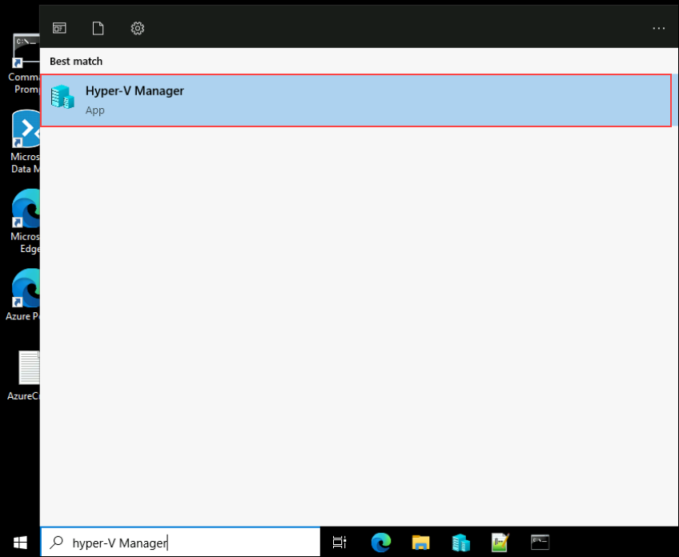
     
1. In Hyper-V Manager, select **HOSTVMS<inject key="DeploymentID" enableCopy="false" />**. You should now see the **redhat** VM and 6 other VMs that we are going to use in other HOLs.

    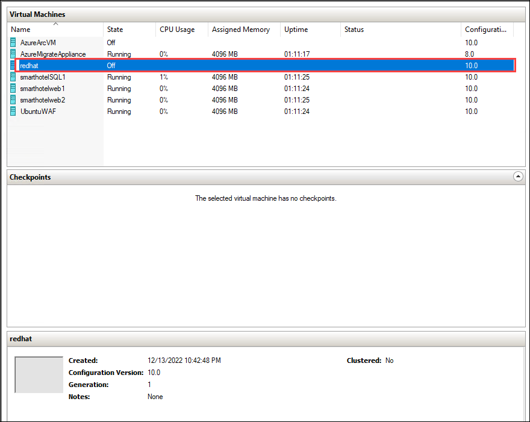
     
1. In Hyper-V Manager, select the **redhat (1)**, then select **Start (2)** on the right if not already running.

    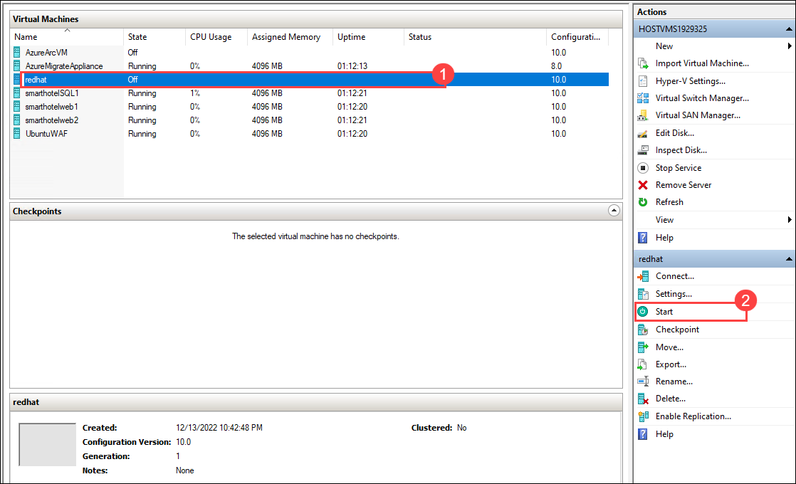

1. In Hyper-V Manager, select the **redhat (1)**, then select **Connect (2)** on the right.

    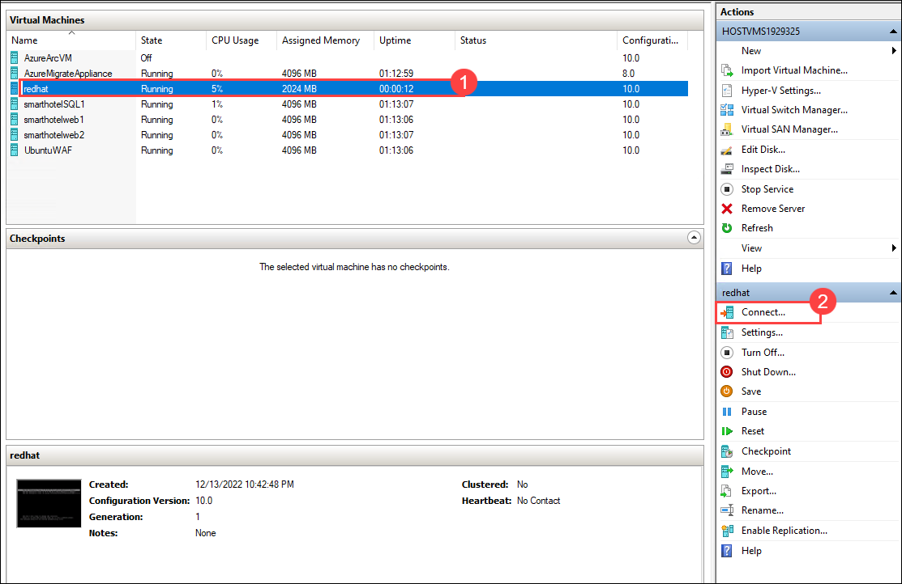

1. Log into the VM with the **Administrator password**: **<inject key="SmartHotel Admin Password" />** (the login screen may pick up your local keyboard mapping, use the 'eyeball' icon to check).

    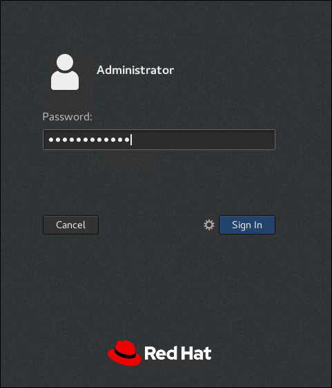

1. You should be able to log in to your on-prem Redhat server hosted on Hyper-V. 

    

1. In the next task you will be migrating the Redhat server, and the OSS Database hosted in the Red Hat VM to the Azure with the help of Azure Migrate.

### Task 2: Register the Hyper-V Host with Migration and modernization

In this task, you will register your Hyper-V host(LabVM) with the Migration and Modernization service. This service uses Azure Site Recovery as the underlying migration engine. As part of the registration process, you will deploy the Azure Site Recovery Provider on your Hyper-V host.

1. If you are not logged in already, click on the Azure portal shortcut that is available on the desktop and log in with below Azure credentials.
    
    - **Azure Username/Email:** <inject key="AzureAdUserEmail"></inject> 
    
    - **Azure Password:** <inject key="AzureAdUserPassword"></inject>

1. In the search bar, search for **Azure Migrate** and select it from the suggestions to open the Azure Migrate Overview blade, as shown below. 
 
    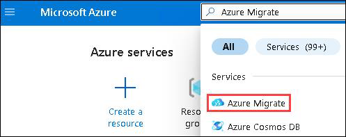

1. Select **All Projects (1)** from the left panel and select the project listed which is **SmartHotelMigration<inject key="DeploymentID" enableCopy="false" />** **(2)**.
   
     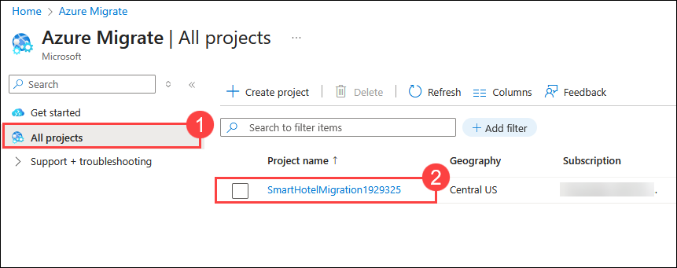

1. In the project, select **Migrations (1)** under Execute from the left panel and then select **Replication summary (2)** under Track migrations.

    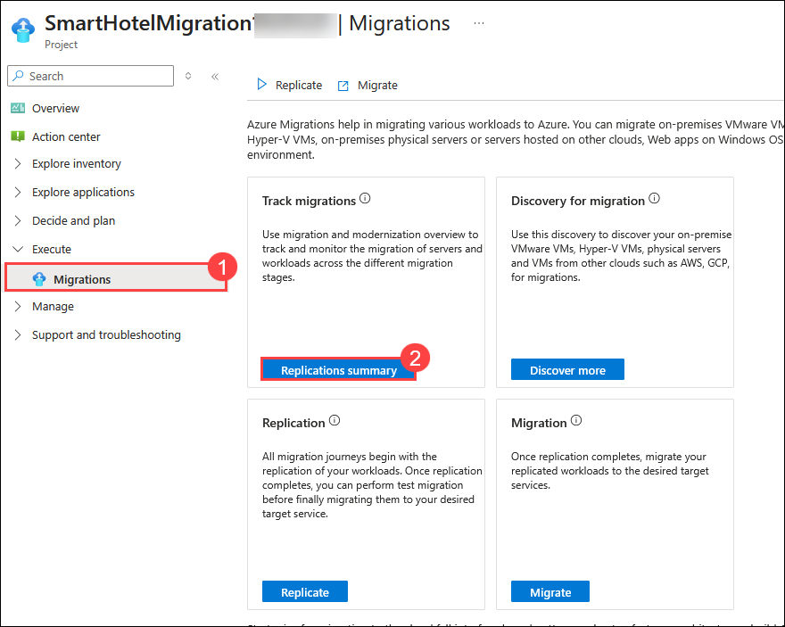

1. Go to **Overview (1)** and select **Discover (2)** under Discovered servers.

    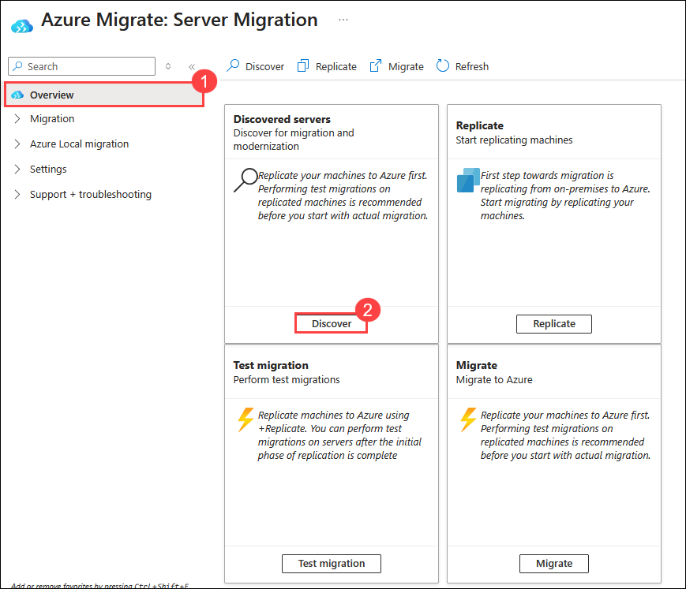

1. In the **Discover** panel, provide the following details:

   - Under **Where do you want to migrate to?**, select **Azure VM (1)**

   - Under **Are your machines virtualized**, select **Yes, with Hyper-V (2)**.

   - Under **Target region (3)** make sure to select the **<inject key="Region"></inject>** region as same the Resource Group's region.

   - Check the **confirmation (4)** checkbox and select **Create resources (5)** to begin the deployment of the Azure Site Recovery resource used by Migration and modernization for Hyper-V migrations.

     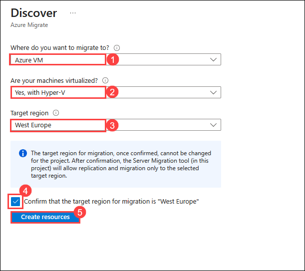

   - Once deployment is complete, the **Discover machines** panel should be updated with additional instructions.
  
1. Click on the **Download** link for the Hyper-V replication provider software installer to download the Azure Site Recovery provider installer.

     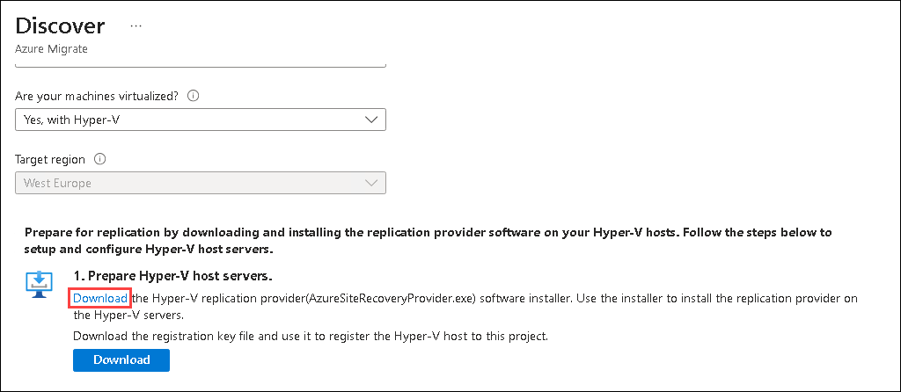

1. Return to the **Discover** page in your browser select the blue **Download** button and download the registration key file.

     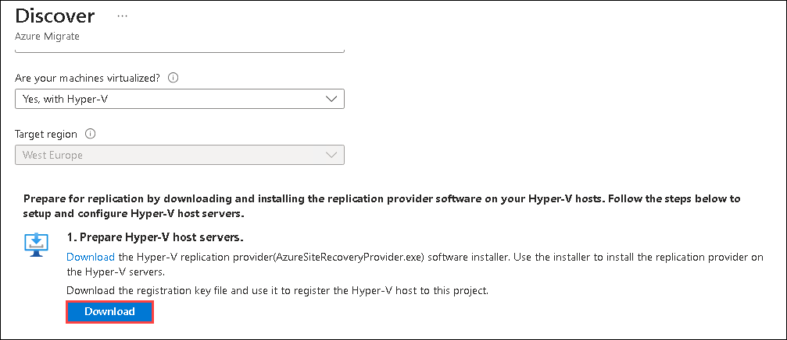

1. Open the **AzureSiteRecoveryProvider.exe** installer you downloaded a moment ago. On the **Microsoft Update** tab, select **Off (1)** and select **Next (2)**. 

    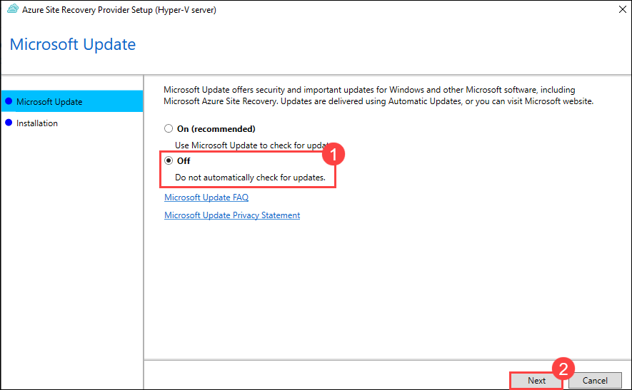

1. Accept the default installation location and select **Install**.

    > **Note:** If you are prompted with a pop-up like the latest version of the Provider is installed on this server. Would you like to proceed to registration? select **Yes**. (You can directly jump to the next step in that case.)
  
     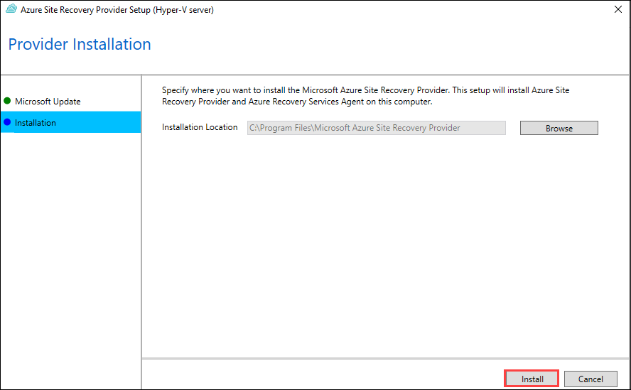

1. When the installation has completed select **Register**. 

    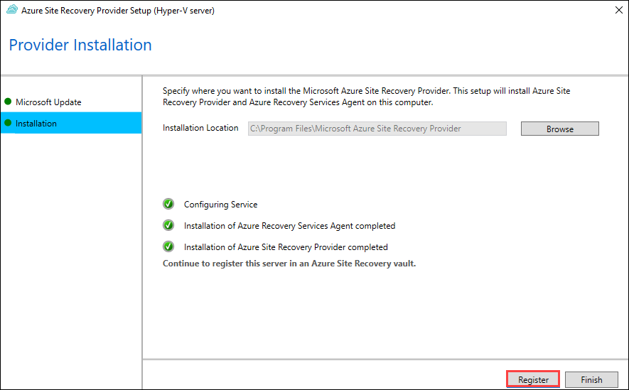

1. Click on **Browse** and navigate to the location of the key file you downloaded. When the key is loaded, select **Next (2)**.

     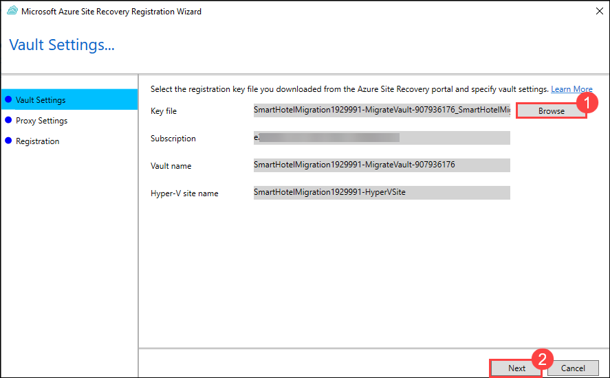

8. Select **Connect directly to Azure Site Recovery without a proxy server (1)** and select **Next (2)**. The registration of the Hyper-V host with Azure Site Recovery will begin.

     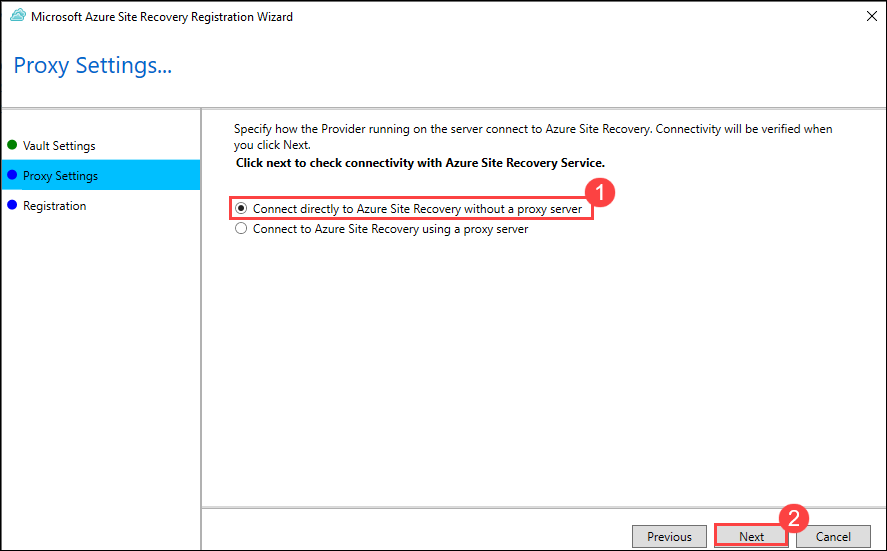

9. Wait for registration to complete (this may take several minutes). Then select **Finish**.

     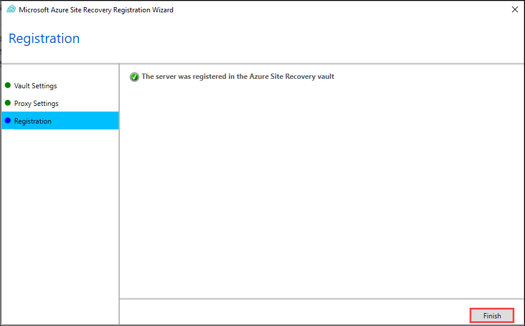

10. Return to the Azure Migrate browser window. **Refresh** your browser, then re-open the **Discover machines** panel by selecting **Discover**. Select **Azure VM (1)** for **Where do you want to migrate to?** and then select **Yes, with Hyper-V (2)** for **Are your machines virtualized?**

11. Select **Finalize registration** **(3)**, which should now be enabled.

     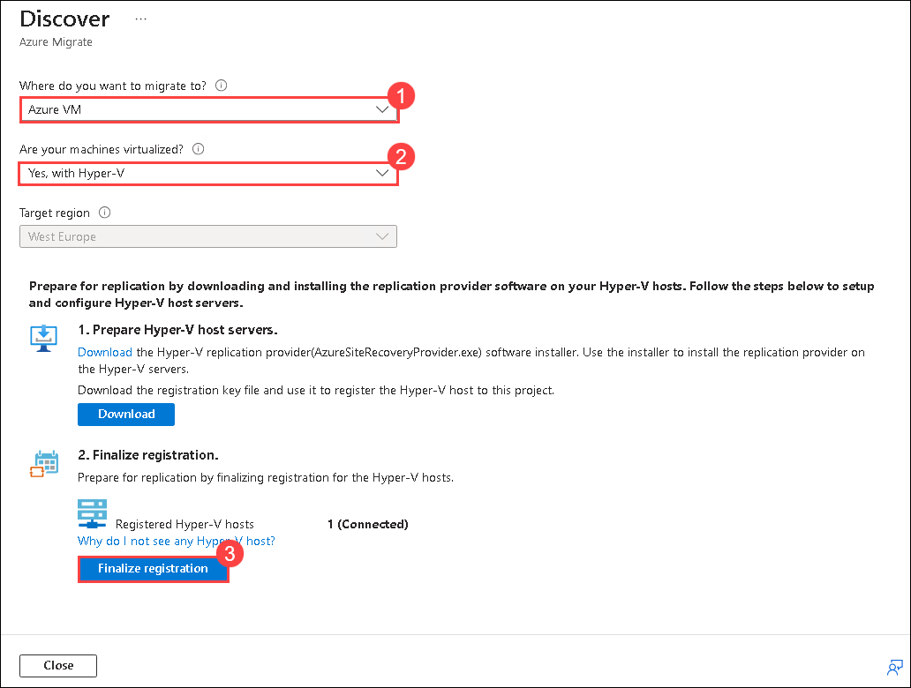

12. Azure Migrate will now complete the registration with the Hyper-V host. **Wait** for the registration to complete. This may take several minutes.

     

13. Once the **Registration finalized (1)** is complete, close the **Discover** panel using **X (2)** button.

     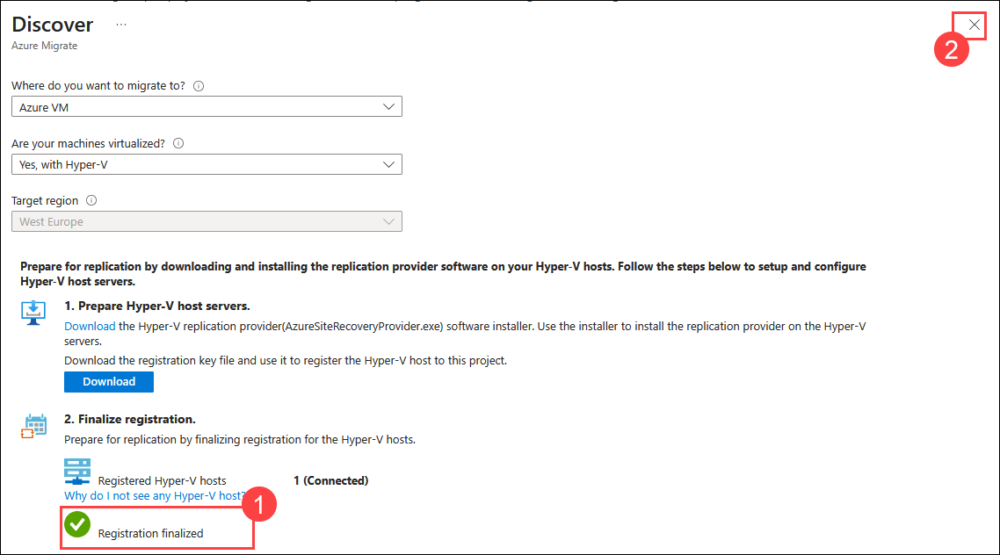

14. Navigate to **Azure Migrate: Server Migration** blade, under the **Discovered servers** panel should now show 7 discovered servers.

    > **Note:** It may take some time for the number of discovered servers to appear. You can proceed with the next task if the number is not yet visible.

     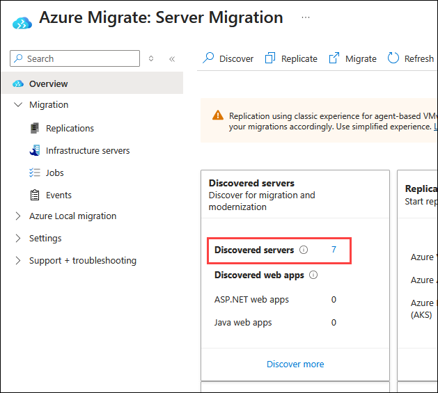

### Task 3: Enable Replication from Hyper-V to Azure Migrate

In this task, you will configure and enable the replication of your on-premises virtual machine from Hyper-V to the Azure Migrate Server Migration service.

1. Return to **SmartHotelMigration<inject key="DeploymentID" enableCopy="false" />** | Migrations, select **Migrations (1)** under Execute on the left. Select **Replicate summary (2)** blue button.

    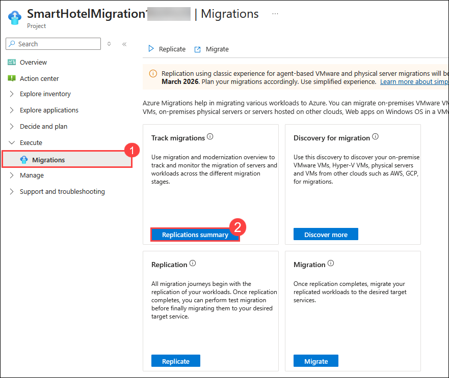

1. In the Azure Migrate: Server Migration blade, select **Replicate**. This opens the **Replicate** wizard.

    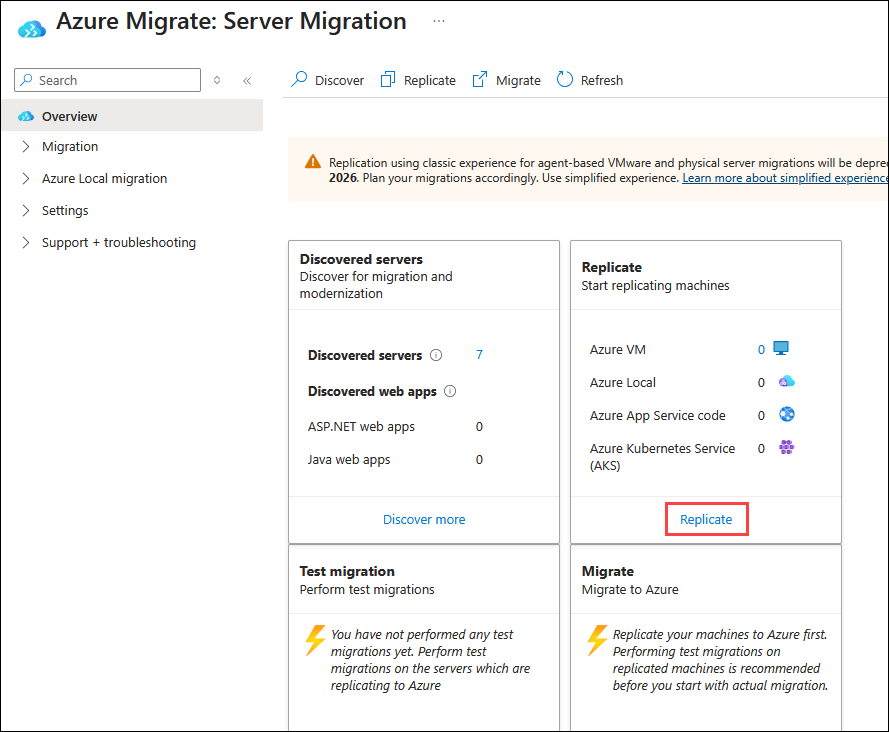
   
2. Under the **Specific Intent** page, provide the below details:

    -  What do you want to migrate? : Select **Servers or Virtual machines (VM)** **(1)**
    
    -  Where do you want to migrate to? : Select **Azure VM** **(2)**
    
    -  Are your machines virtualized? : Select **Yes, with Hyper-V (3)** from the drop-down. Click on **Continue (4)**

       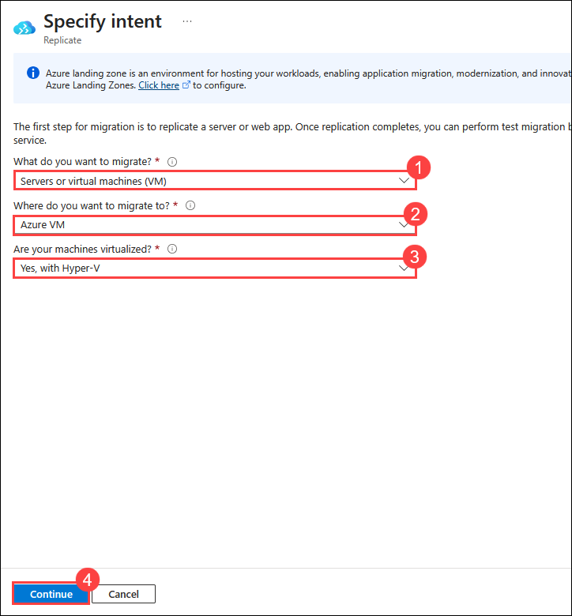

3. In the **Virtual machines** tab, under **Import migration settings from an assessment?**, select **No, I'll specify the migration settings manually (1)** and under the **Virtual machines** tab should show the virtual machines included in the assessment. Select the **redhat (2)** virtual machine from the list, then click on **Next (3)**.

    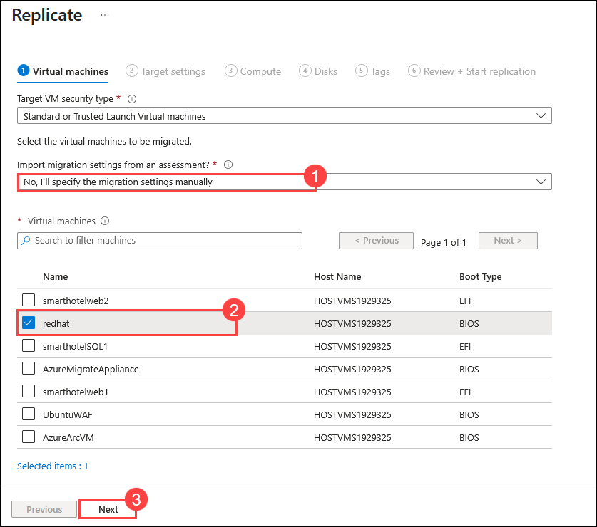

    >**Note:** If you see *Mars agent version compatibility unknown* warning, igonore and proceed further.

5. On the **Target settings** tab, select the below information,

   - Select your subscription and the existing **SmartHotelRG (1)** resource group. 

   - **Cache storage account**: Select **Auto-create** **(2)**.

   - **Virtual Network**: Select **SmartHotelVNet (3)**. 

   - **Subnet**: Select **SmartHotel (4)**. 

   - Select **Next (5)**.
 
     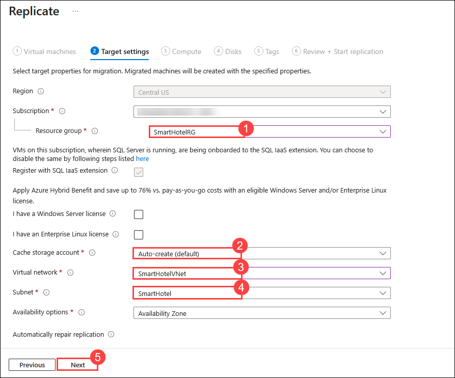

     >**Note:** For simplicity, in this lab you will not configure the migrated VM for high availability, since each application tier is implemented using a single VM.

     >**Note:** Please wait for 10-15 minutes if you donot see the cache storage account option and reperform from Step 2.

7. On the **Compute** tab, select the below configuration,

   - **Azure VM Size:** Select the **Standard_F2s_v2 (1)** VM size 

   - **OS Type:** Select the **Linux (2)** operating system for the **redhat** virtual machine. 

   - **OS Disk:** Select **redhat (1) (3)** for OS disk.

   - **Availability Zone:** Select as **None (4)**

   - Select **Next (5)**. 

     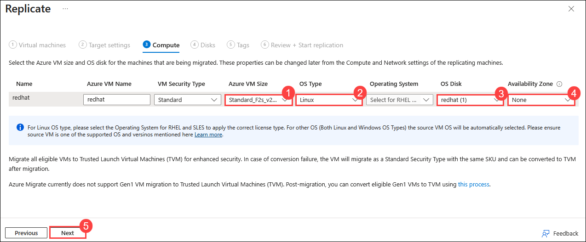
    
9. In the **Disks** tab, review the settings but do not make any changes. Select **Next: Tags**, then select **Next: Review + Start replication**, select **Replicate** to start the server replication.

    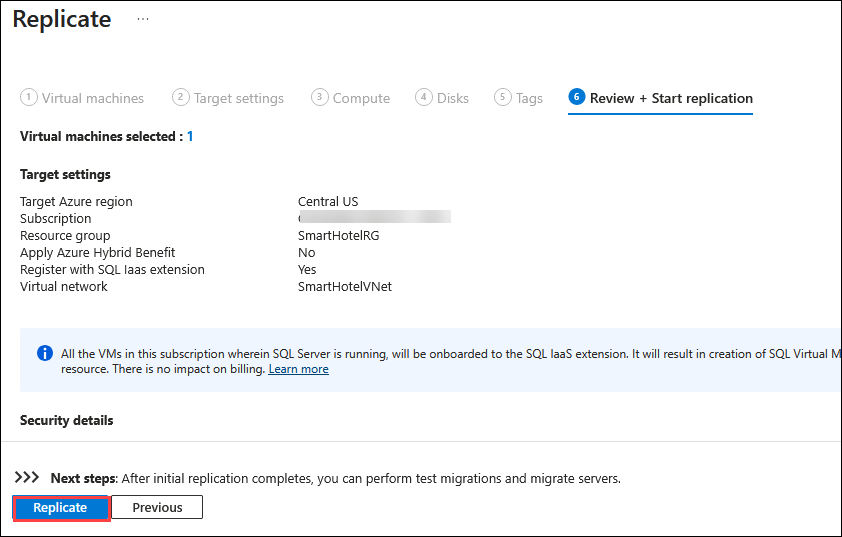

10. In the **Azure Migrate: Server Migration** blade, under **Replicate**, confirm that the 1 machine is replicating.

    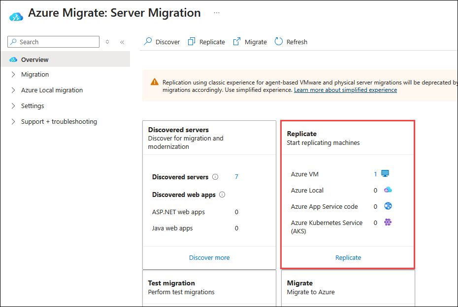

12. Select **Replication (1)** under **Migration** on the left. Select **Refresh (2)** occasionally and wait until the RedHat machine has a **Protected (3)** status, which shows the initial replication is complete. This will take around 10-15 minutes.

    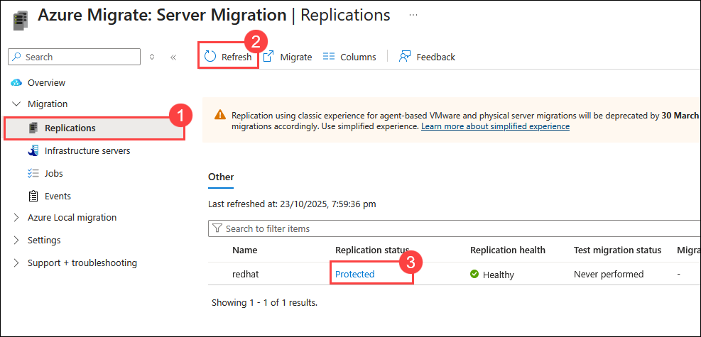

### Task 4: Configure Networking

In this task, you will modify the settings for each replicated VM to use a static private IP address that matches the on-premises IP addresses for that machine.

1. Under the **Azure Migrate: Server Migration | Replications** blade, select the **redhat** virtual machine. This opens a detailed migration and replication blade for this machine. Take a moment to study this information.

    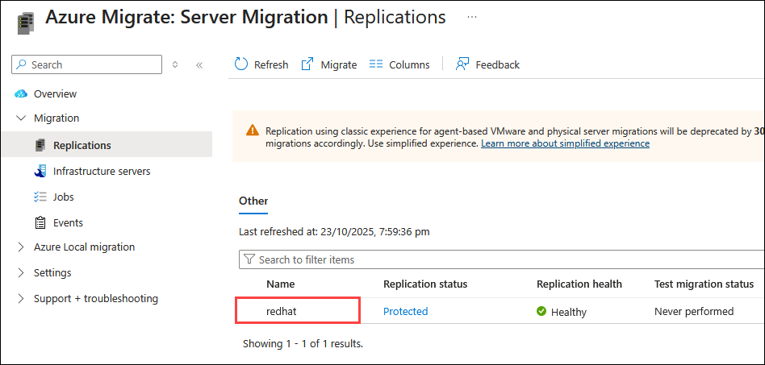

2. Select **Compute and Network** under **General** on the left.

    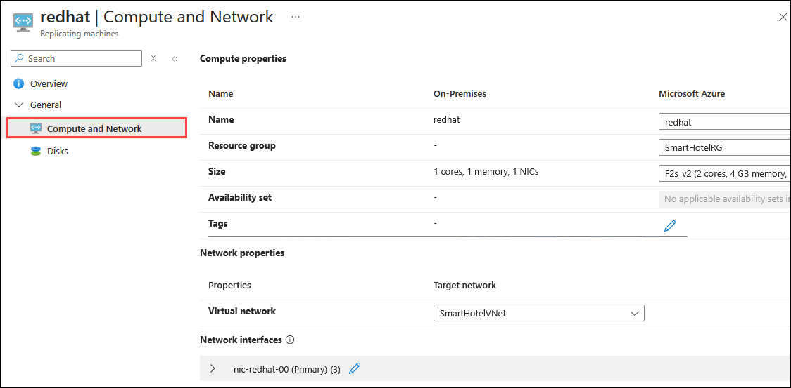

3. Confirm that the VM is configured to use the **F2s_v2** VM size.

    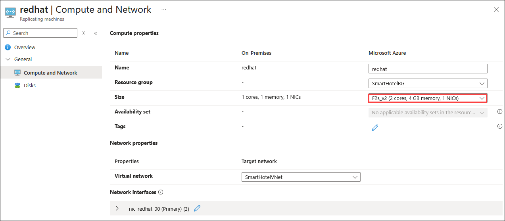

> **Note**: Azure Migrate makes a "best guess" at the VM settings, but you have full control over the settings of migrated items. In this case, setting a static private IP address ensures the virtual machine in Azure retains the same IPs they had on-premises, which avoids having to reconfigure the VM during migration (for example, by editing web.config files).

### Task 5: Server migration

In this task, you will perform a migration of the Redhat virtual machine to Azure.

> **Note**: In a real-world scenario, you would perform a test migration before the final migration. To save time, you will skip the test migration in this lab. The test migration process is very similar to the final migration.

1. Return to the **Azure Migrate: Server Migration** overview blade. Select **Overview (1)** from the left and select **Migrate (2)**.

    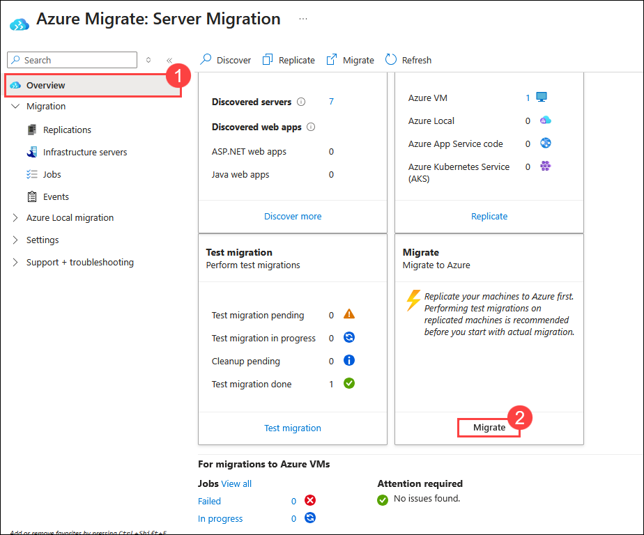

1. Select **Azure VM (1)** under **Where do you want to migrate to?** and select **Continue (2)**.

    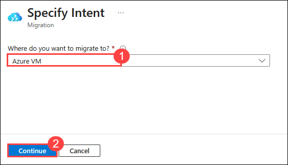

2. On the **Migrate** blade, select **redhat (1)** virtual machine and select **yes, shutdown virtual machines(Ensures no data loss)** **(2)** and then select **Migrate (3)** to start the migration process.

    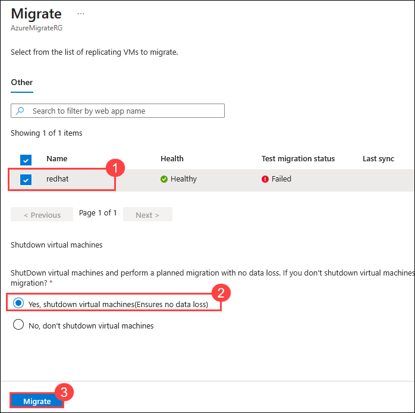

   > **Note**: You can optionally choose whether the on-premises virtual machine should be automatically shut down before migration to minimize data loss. Either setting will work for this lab.

3. The migration process will start and can be checked from notifications.

    

4. To monitor progress, select **Jobs (1)** under **Migration** on the left and review the status of the redhat **Planned failover (2)** job.

    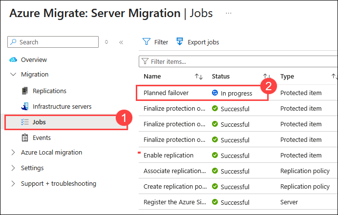

5. **Wait** until the **Planned failover** jobs show a **Status** of **Successful**. You should not need to refresh your browser. This could take up to 15 minutes.

    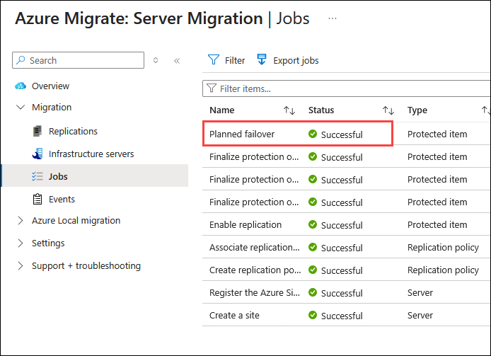

6. Navigate to the **SmartHotelRG** resource group and check that the VM, network interface, and disk resource have been created for the virtual machine being migrated.

    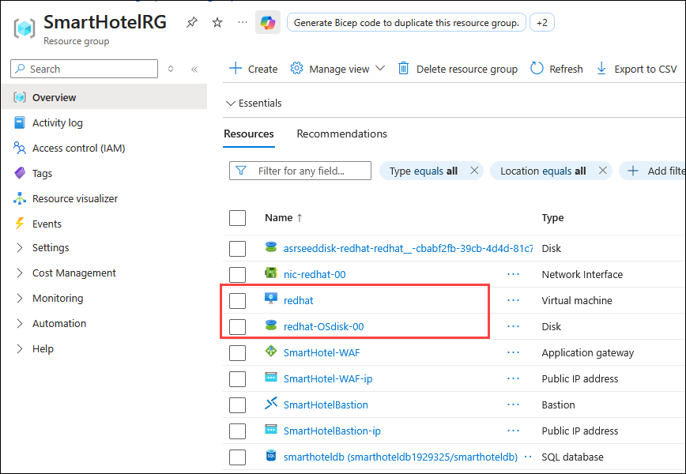

> **Congratulations** on completing the task! Now, it's time to validate it. Here are the steps:
> - Click on validate button.
> - If you receive a success message, you have successfully completed the lab.
> - If not, carefully read the error message and retry the step, following the instructions in the lab guide. 
> - If you need any assistance, please contact us at cloudlabs-support@spektrasystems.com. We are available 24/7 to help you out.

<validation step="fca01519-165a-49c3-897e-6f25ea3468a6" />

## Review

In this lab, you have accomplished the following:

- Logged into the Red Hat VM in Hyper-V Manager, preparing for migration.
- Reviewed the registered Hyper-V host in Azure Migrate Server Migration.
- Enabled replication from Hyper-V to Azure and configured VM size.
- Set static private IP for the replicated VM to match on-prem settings.
- Used Azure Migrate to create an Azure VM with replicated data.
