# Lab 03: Perform database assessments

### Estimated Duration: 60 Minutes

In this lab, you will use **Visual Studio Code** to connect to the SQL Server instance and prepare the **WideWorldImporters** database for assessment. You will then use **Azure Migrate** to create a SQL migration assessment for the discovered SQL Server workload. Finally, you will review the migration recommendations for Azure SQL Managed Instance, Azure SQL Database, and SQL Server on Azure Virtual Machines to determine the most suitable migration strategy.

## Lab Objectives

In this lab, you will perform the following tasks:

- Task 1: Connect to the WideWorldImporters database on the SQL 2019 VM
- Task 2: Create and review a SQL migration assessment

## Task 1: Connect to the WideWorldImporters database on the SQL 2019 VM

In this task, you will create the **WideWorldImporters** database on the SQL Server 2019 virtual machine and connect to the SQL Server instance using **Visual Studio Code** with the **SQL Server (MSSQL)** extension. You will then prepare the database for migration assessment by enabling the required database settings.

1. Navigate to the [Azure portal](https://portal.azure.com) and select **Resource groups** from the Azure services list.

   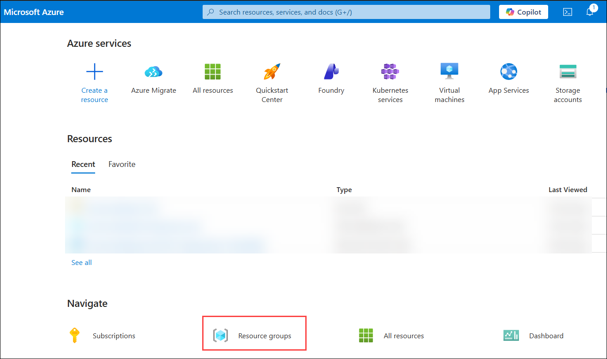

1. Select the **SQLMigrationRG** resource group from the list.

   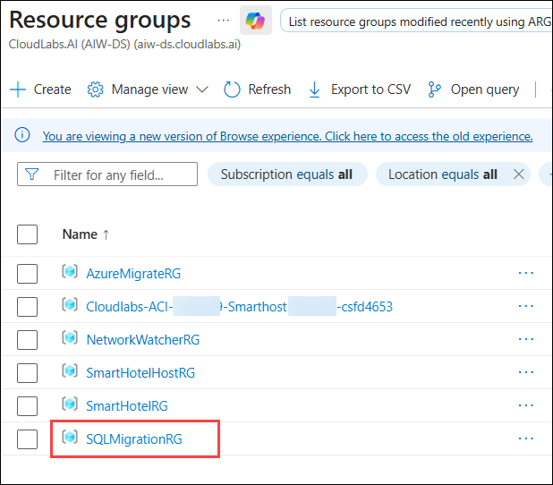

1. In the list of resources for your resource group, select the **sql2019-<inject key="DeploymentID" enableCopy="false"/>** VM.

   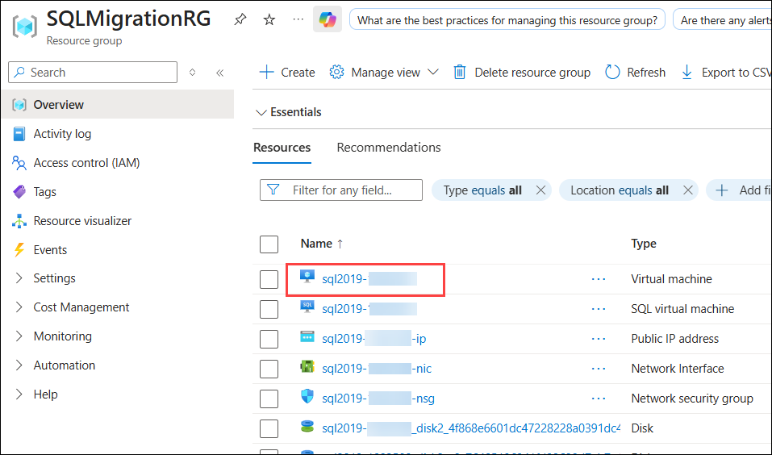

1. On the **sql2019-<inject key="DeploymentID" enableCopy="false"/>** VM blade in the Azure portal, in the **Overview** page, click on **Connect (1)** dropdown and select **Connect (2)**.

   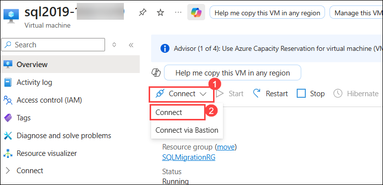 

1. On the Connect blade, select **Download RDP File** under **Native RDP**, then open the downloaded RDP file.

   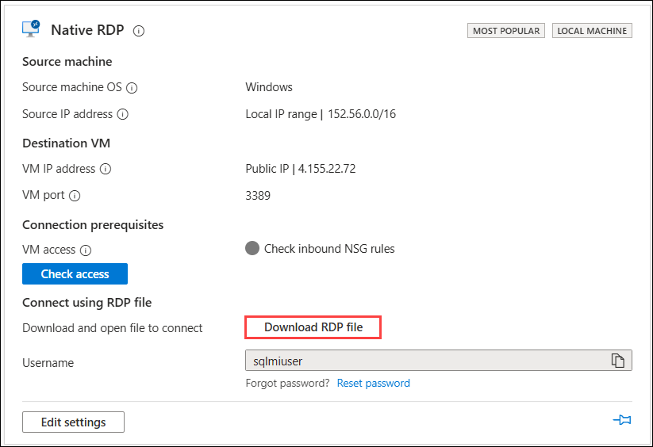

1. Open the downloaded RDP file, click on **Connect**. Then, select **More choices (1) > Use a different account (2)**, and enter the following credentials when prompted, and then select **OK:**

   - **Username:** `.\sqlmiuser` **(3)**
   - **Password:** `Password.1234567890` **(4)**

      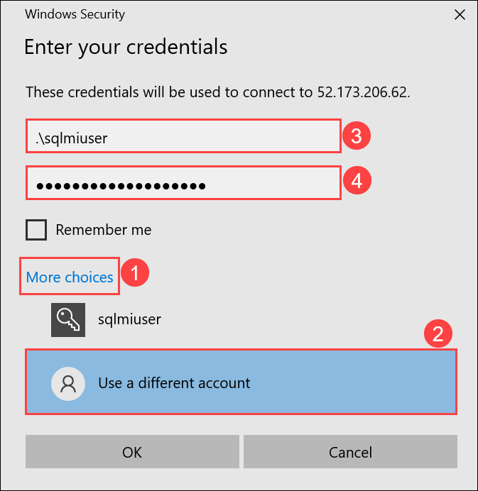 

1. Select **Yes** to connect if prompted that the remote computer's identity cannot be verified.

   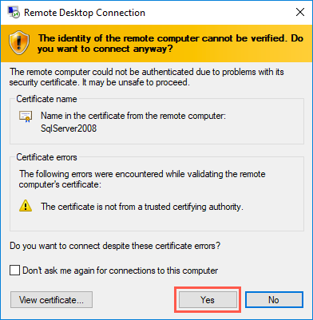

1. Open file explorer on your **sql2019-<inject key="DeploymentID" enableCopy="false"/>** virtual machine, naviagate to **C:\ (1)** drive and double click on **IntegrationRuntime (2)** installer.

   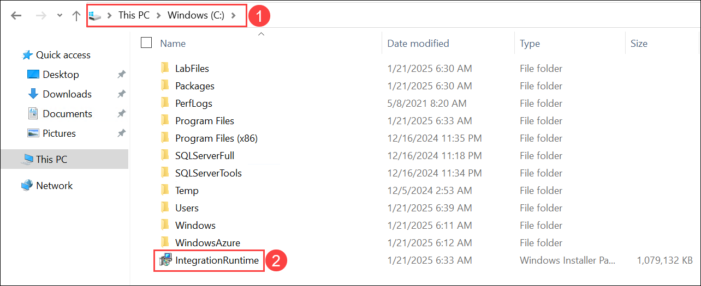

1. In **Welcome to the Microsoft Integration Runtime Setup Wizard**, click on **Next**.

   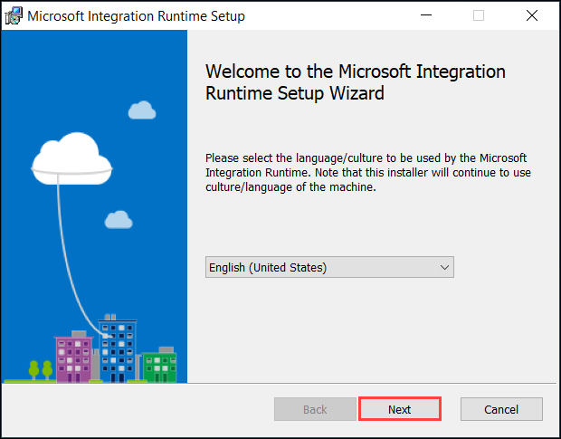

1. In **End-User License Agreement**, select the checkbox **I accept the terms in the License Agreement**, and click on **Next**.

   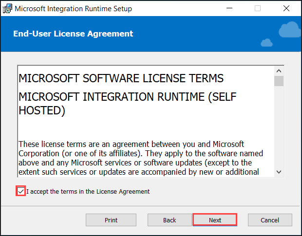

1. In **Destination Folder**, click on **Next**.

   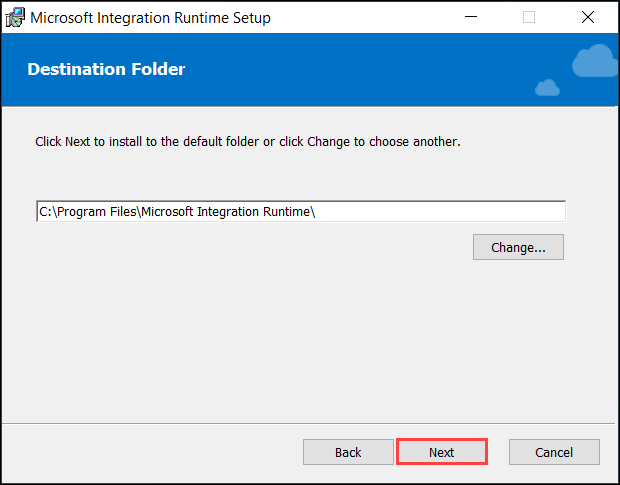

1. In **Ready to install Microsoft Integration Runtime**, click on **Install**.

   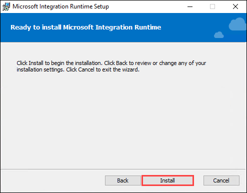

1. Once the deployment is completed, click on **Finish** and minimize the application.

   

1. In the **Register Integration Runtime (Self-hosted)** pop up, click on **Cancel**.

   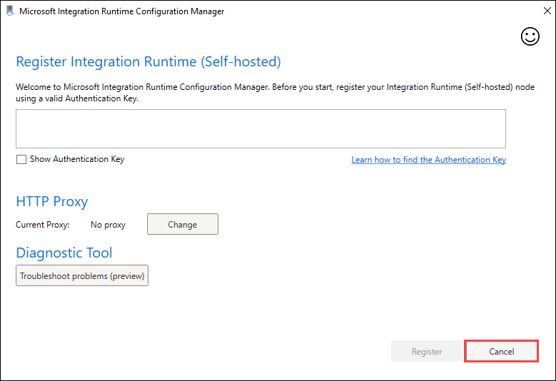

1. In the **sql2019-<inject key="DeploymentID" enableCopy="false"/>** virtual machine, search for **PowerShell (1)** in the search bar, then select **Windows PowerShell (2)** from the search results to open a new PowerShell window.

   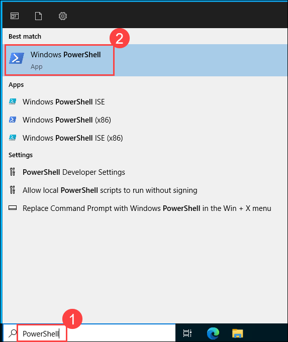

1. Run the command below to create a database named **WideWorldImporters**. Replace "YOUR SQL VM NAME" with your actual SQL 2019 VM name **sql2019-<inject key="DeploymentID" enableCopy="false"/>**.

   ```
   Invoke-Sqlcmd -Query "CREATE DATABASE WideWorldImporters;" -ServerInstance <YOUR SQL VM NAME>
   ```

   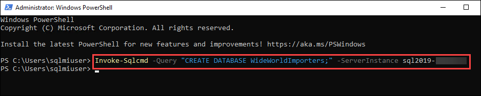

1. Open **Visual Studio Code** from the desktop.

   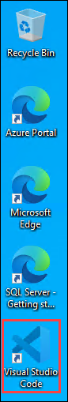

1. In Visual Studio Code, select **Extensions (1)** from the Activity Bar. Search for **SQL Server (MSSQL) (2)**, published by **Microsoft**, select it **(4)** and then click **Install (3)**.

   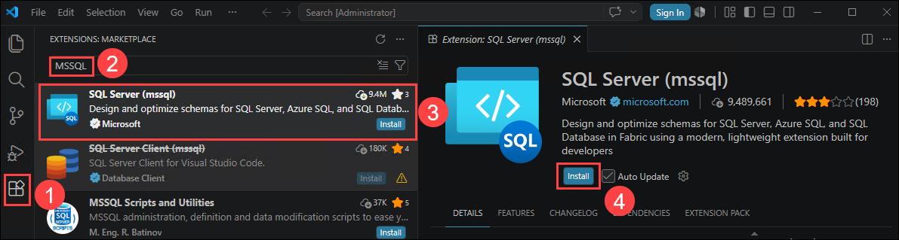

1. After the extension is installed, select the **SQL Server (1)** icon from the Activity Bar, and then select **+ Add Connection (2)**.

   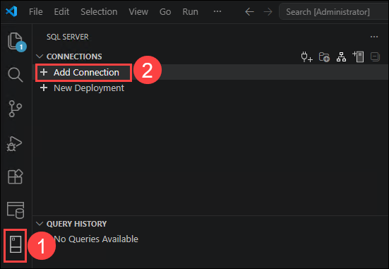

1. In the **Connection** dialog, provide the following information:

   - **Profile Name:** sql2019-<inject key="DeploymentID" enableCopy="false"/> **(1)**
   - **Server:** sql2019-<inject key="DeploymentID" enableCopy="false"/> **(2)**
   - **Authentication Type:** **Windows Authentication** **(3)**
   - Select **Connect (4)**. 

   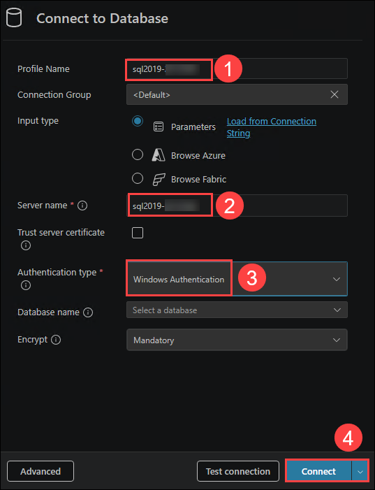

   > **Note:** If you see **Connection error** pop-up click on **Enable Trust server certificate**.

      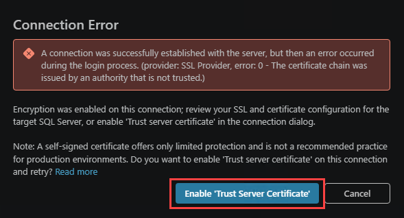

1. In **Visual Studio Code**, expand the connected SQL Server instance **(1)**. Under **Databases**, right-click **WideWorldImporters (2)** and select **New Query (3)**.

   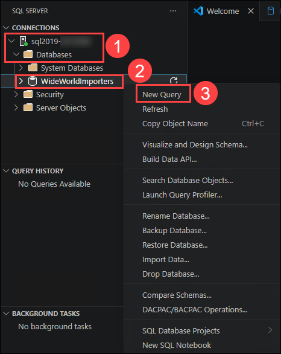

1. Next, copy and paste the SQL script below into the new query window. This script enables the Service Broker and changes the database recovery model to FULL.

   ```sql
   USE master;
   GO

   -- Update the recovery model of the database to FULL and enable Service Broker
   ALTER DATABASE WideWorldImporters SET
   RECOVERY FULL,
   ENABLE_BROKER WITH ROLLBACK IMMEDIATE;
   GO
   ```
1. Select **Run (1)** from the editor toolbar and verify the results from the **Messages (2)** tab.

   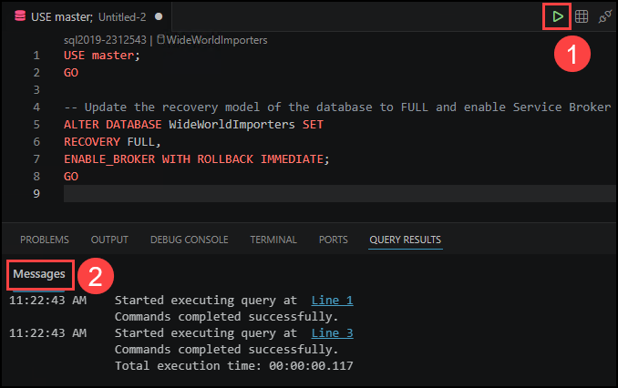

## Task 2: Create and review a SQL migration assessment

In this task, you will create a SQL migration assessment for the discovered SQL Server workload using Azure Migrate. After the assessment is created, you will review the migration recommendations for Azure SQL Managed Instance, Azure SQL Database, and SQL Server on Azure Virtual Machines to evaluate migration readiness and identify the most suitable migration target.

1.  On the **Azure Migrate** project **Overview (1)** page, under the **Assessments** section, click **Create assessment (2)**.

    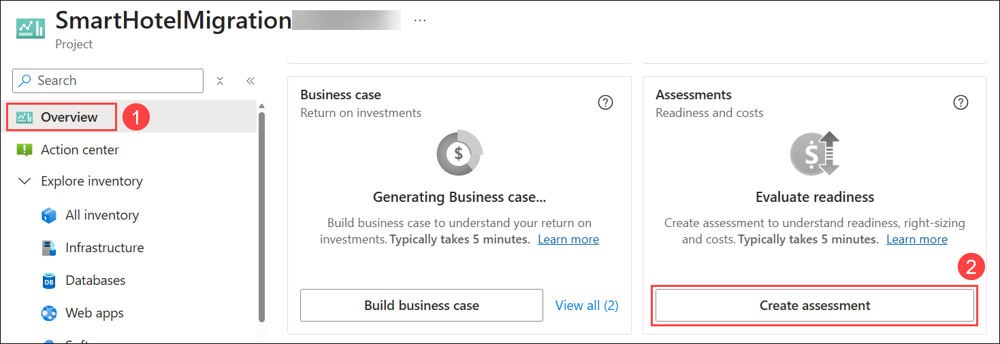

1. On the **Basics** tab, enter **Assessment name** as `SQLAssessment` **(1)**. Then select **Add workloads (2)**.

    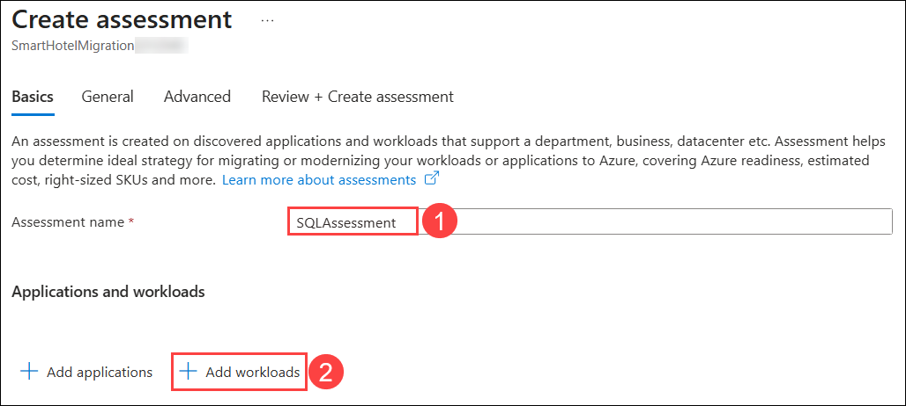

1. On the **Select workloads** page, select **smarthotelSQL1 (1)**. This automatically selects the associated **MSSQLSERVER** SQL instance. Click **Review selected workloads (2)**.

    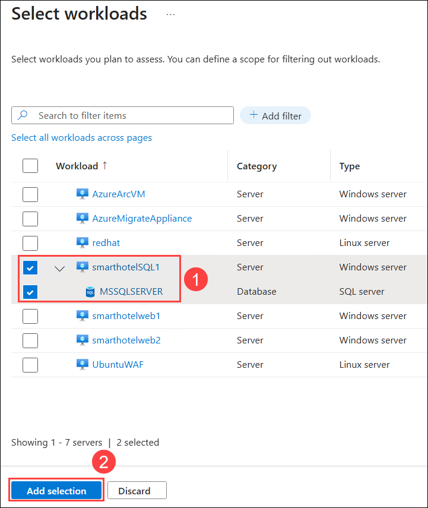

1. Back on the **Create assessment** page, verify that the selected workload is listed under **Applications and workloads**, and then select **Review + Create assessment (1)**.

    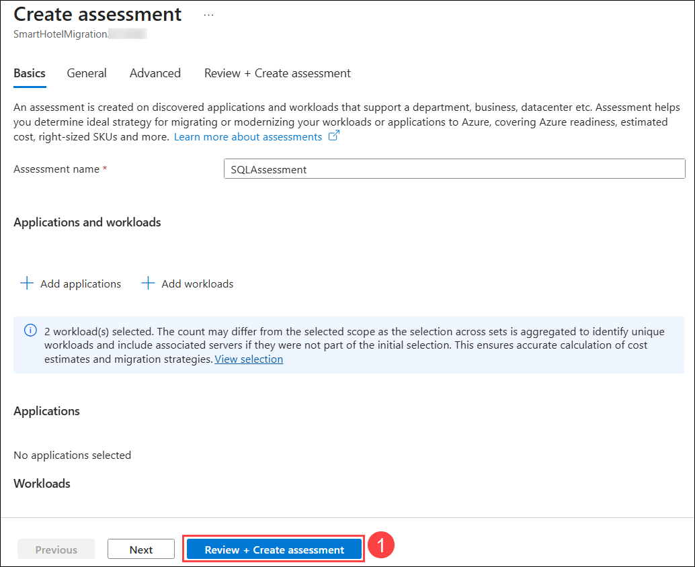

1. On the **Review + Create assessment** tab, review the assessment configuration and select **Create**.

    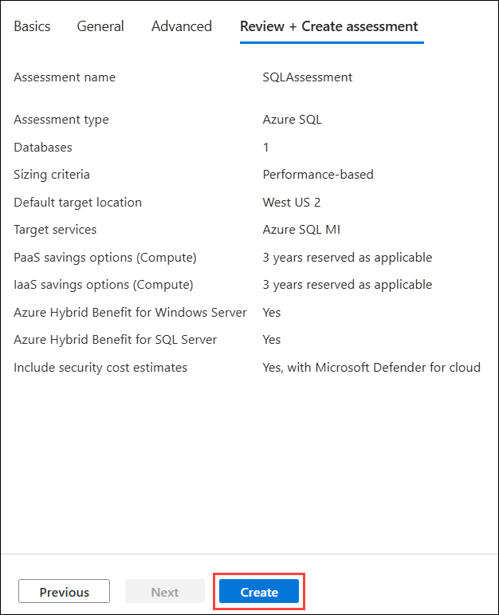

    > **Note:** It may take a few minutes for the assessment to be generated. If the assessment is not displayed, select **Refresh** until the **SQLAssessment** assessment appears.

1. Once the assessment is created, from the left navigation pane, expand **Decide and plan (1)**, select **Assessments (2)**, and then open the **SQLAssessment (3)** assessment.

    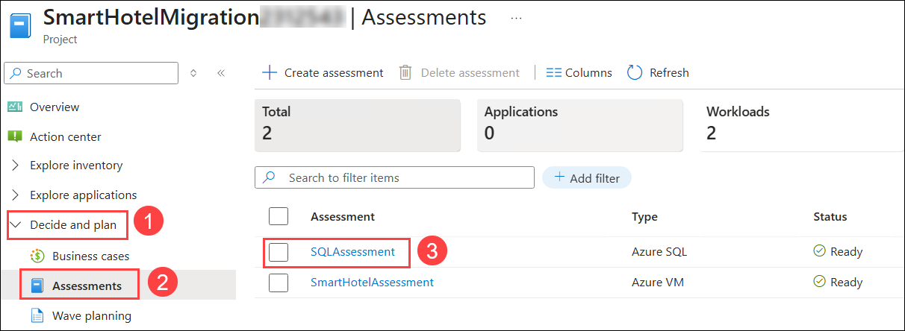

1. On the **Overview** tab, review the assessment summary, including the migration readiness, migration preference, monthly cost estimate, and monthly emissions estimate.
    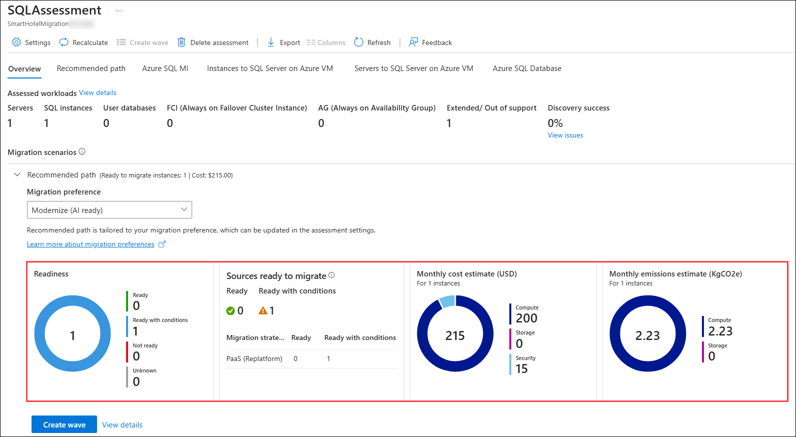

1. Select the **Recommended path (1)** tab. Under **Workload to Azure Service mapping**, select **SQL instances to Azure SQL MI (2)**.

    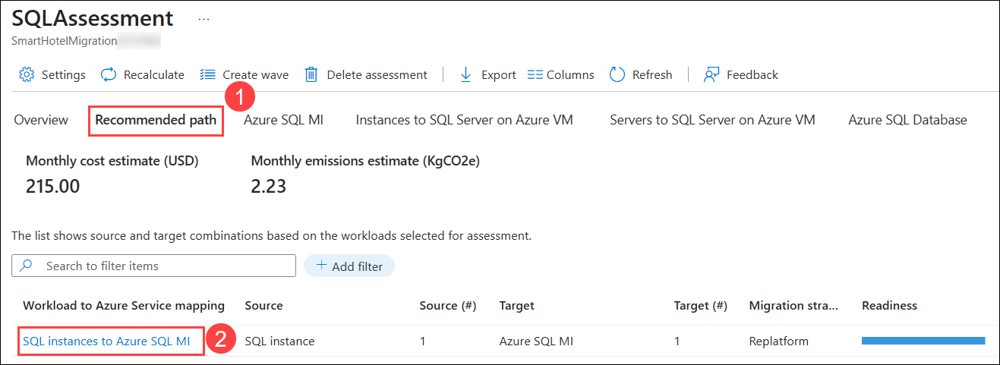

1. Review the recommended migration strategy, migration readiness, and estimated monthly cost for the discovered SQL instance.

    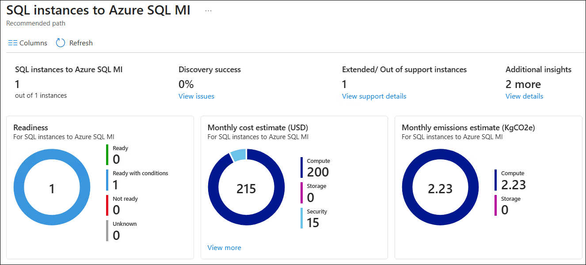

1. Return to the assessment and select the **Azure SQL MI (1)** tab. Under **Workload to Azure Service mapping**, select **SQL instances to Azure SQL MI (2)**.

    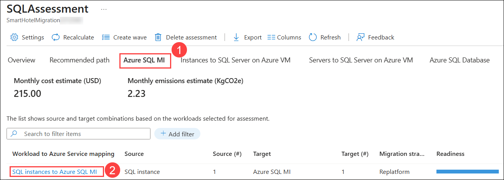

1. Review the migration readiness, migration strategy, and estimated monthly cost for migrating the SQL instance to **Azure SQL Managed Instance**.

    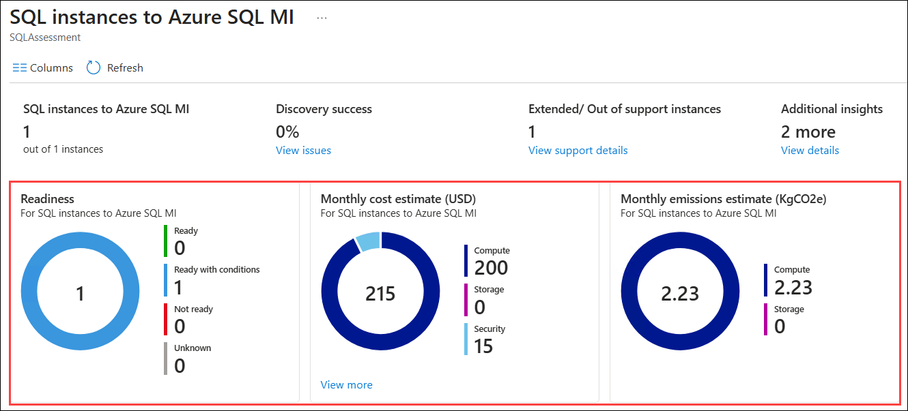

1. Select the **Instances to SQL Server on Azure VM (1)** tab. Under **Workload to Azure Service mapping**, select **SQL instances to instances on Azure VM (2)**.

    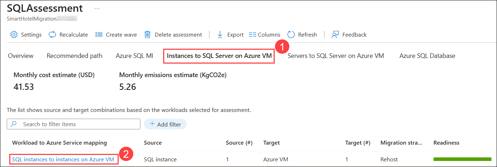

1. Review the migration readiness, migration strategy, and estimated monthly cost for migrating the SQL instance to **SQL Server on Azure Virtual Machines**.

    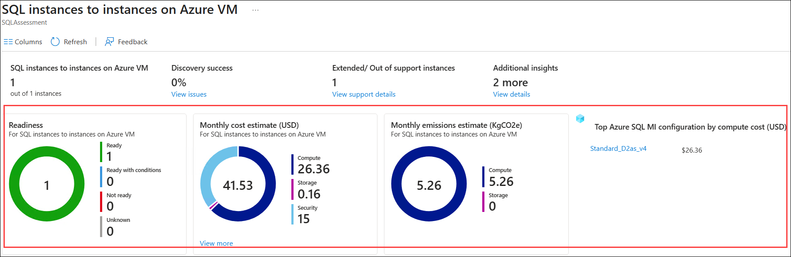

1. Compare the assessment results for each migration target and determine the most appropriate migration strategy based on the readiness, migration strategy, and estimated monthly cost.

<!--
> **Congratulations** on completing the task! Now, it's time to validate it. Here are the steps:
> - Hit the Inline Validate button for the corresponding task. If you receive a success message, you can proceed to the next task. 
> - If not, carefully read the error message and retry the step, following the instructions in the lab guide.
> - If you need any assistance, please contact us at cloudlabs-support@spektrasystems.com. We are available 24/7 to help.

<validation step="2713661b-4366-4b85-9320-74cd3ad4e33d" /> -->

## Summary

In this lab, you have completed the following:

- Connected to the **WideWorldImporters** database on the SQL Server 2019 virtual machine using Visual Studio Code.

- Created a SQL migration assessment using Azure Migrate.

- Reviewed migration recommendations for Azure SQL Managed Instance, Azure SQL Database, and SQL Server on Azure Virtual Machines.

- Compared the available migration targets to determine the most appropriate migration strategy for the discovered SQL workload.

## You have successfully completed the Hands-on lab.

By completing the **Discover and Assess On-prem Windows & SQL Servers** hands-on lab, you learned how to discover SQL Server workloads, prepare databases for migration assessment, and evaluate migration readiness using Azure Migrate. You also compared multiple Azure migration targets based on readiness, migration strategy, and cost estimates, helping you plan an effective SQL Server migration to Azure.
