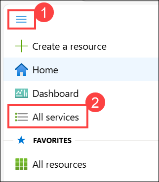
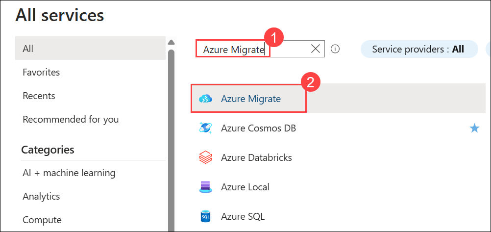
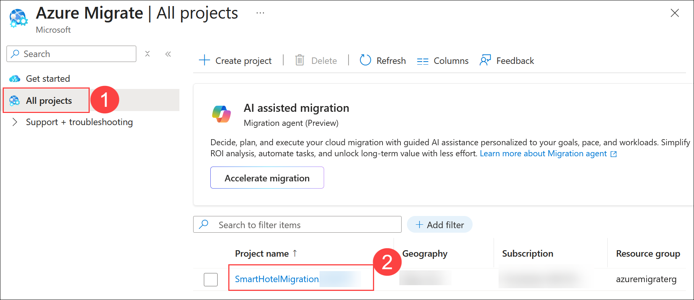
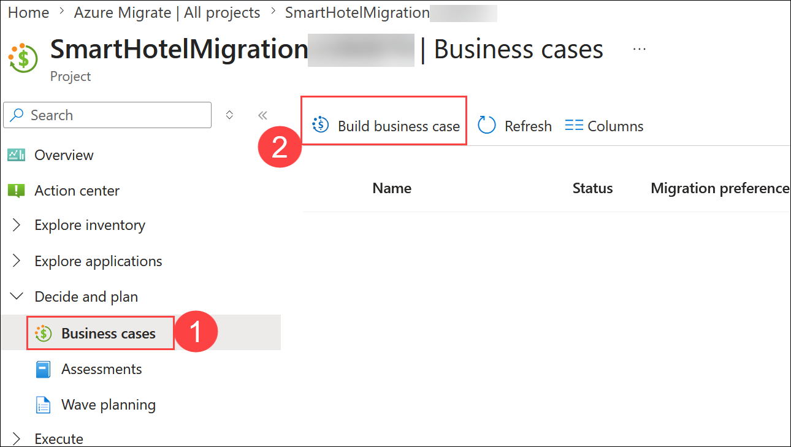
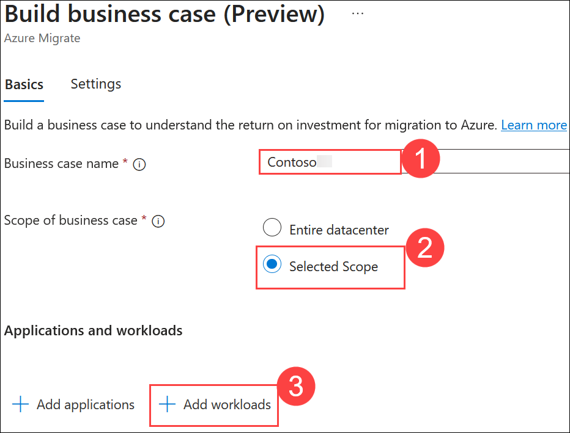
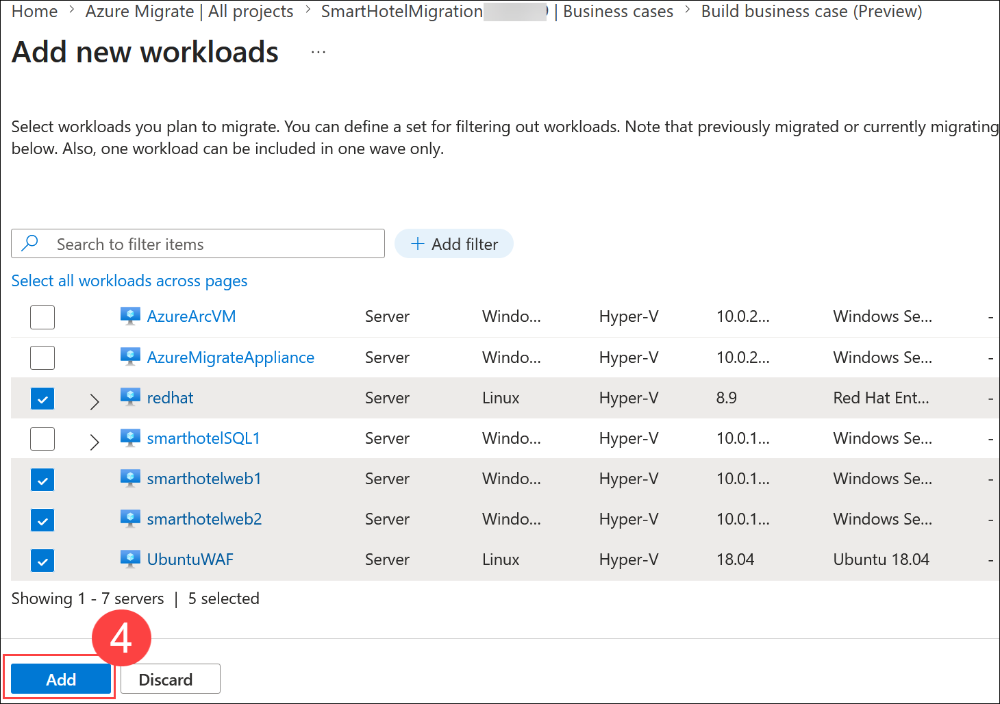

## HOL3: Exercise 5: Business case analysis capability

### Estimated duration: 15 Minutes

## Overview

In this exercise, you'll learn how to create a business case for Azure, using a free Azure Migrate feature during assessments that will help simplify your move to Azure.

Managing your on-premises data centres can present time-bound challenges such as expiring contracts, ageing hardware, and end-of-support software. You may also be under pressure to address cash flow challenges, add capacity, and prevent security attacks while ensuring business continuity.

To understand if Azure makes financial sense, we will start by creating a directional business case with Azure Migrate. This helps you understand what the best migration strategy is for your business and how to gradually move from a capital expenditure model to an operating expenditure model, where you only pay for what you use.

**Business case analysis** is a comprehensive, easy-to-use tool that enables customers and partners to create directional business proposals to understand how Azure can bring the most value to their business.

**Features:**

- Need **minimal inputs** to get started.

- Includes **migration strategy recommendation** including lift-and-shift to IaaS and modernize to PaaS.

- Highlights **on-premises TCO, ROI** and financial analysis, **resource utilization-based insights and quick wins**.

- Enables creating **what-if** scenarios with customizable settings and assumptions.

1. In the Azure portal, click the **Show Portal Menu (1)** icon, then select  **All services (2)** from the left navigation pane.
 
    

1. In the search bar, type **Azure Migrate (1)**, and select **Azure Migrate (2)** from the suggestions to open.
 
    

1.  On the **Azure Migrate** page in the **Azure portal**. From the left navigation pane, select **All projects (1)**, and then choose **SmartHotelMigration<inject key="DeploymentID" enableCopy="false" /> (2)**. 

   

1. On the **SmartHotelMigration<inject key="DeploymentID" enableCopy="false" />** project page, click on **Buisness Case (1)** under **Decide and Plan** and click on **Build business case (2)**.

   
        
1. On the **Build business case (preview)** wizard, enter the following details in **Basics** tab:
   
   - **Business case name:** Enter **Contoso (1)**
   - **Scope of business case:** Select **Selected Scope(2)**
   - **Applications and workloads:** click on  **+ Add workloads (3)**
     
      

   - On the **+ Add workloads** page, add the servers that you have just migrated and click on **Add (4)**.

      

1. On the **Settings** tab of the **Build business case (preview)** wizard, enter the following details: 

     - **Migration prefrence:** Select the `Migrate` **(1)**
     - **Target location:** Select any available region **(2)**
     - **Preferred target:** `Azure VM` **(3)**
     - **Savings Option:** Select `Reserved Instance + Azure Savings Plan` **(4)**
     - **Program/Offer:** set this to `Pay-As-You-Go` **(5)**.
     - **Discount(%) on Pay as you go:** Enter `0` **(6)**
     - **Currency:** Select **US Dollar ($) (7)**
     - Click on **Build business case (8)**

     
   
8. Once the build has succeeded click on it, so you can start reviewing the business case that was created from the above inputs and industry benchmarks.

     
   
9. On the **TCO Comparison** blade, observe the cost. It represents an estimated on-premises cost versus Azure TCO and the potential savings possible by getting rid of components that you'll no longer need. 

     
   
10. The **YoY current vs future state cost** presents a year-over-year cost breakdown of the estimated current versus future state.

      
    
11. On the same business case overview page, you'll receive unique incentives such as Azure hybrid benefits and extended security update savings to help drive technical and workplace innovations.

     
    
12. Based on the rich data insights collected during the discovery process, on the **Selected Scope : Resource summary for scoped items**, you can observe how to effectively migrate to Azure, which underutilized servers to the right size, and which unused servers to potentially decommission.

     
   
1. Under Business case reports, click **Migration strategies**. This report provides a unified view of the recommended Azure migration targets for your discovered workloads, including right-sized Azure resources, estimated costs, migration strategies, and potential savings.

     

1. Review the **Migration strategies** report to compare the recommended Azure targets for your workloads and understand the estimated Azure costs, savings, and migration recommendations based on your selected migration preference.
     
17. Learn more about the business case here: 

- https://learn.microsoft.com/en-us/azure/cloud-adoption-framework/strategy/cloud-migration-business-case 

- https://learn.microsoft.com/en-us/azure/migrate/how-to-view-a-business-case?view=migrate

## Summary

In this exercise, you explored the Azure Migrate Business Case feature to evaluate the financial benefits of moving to Azure. You reviewed TCO and ROI comparisons, migration strategy recommendations, and cost-saving insights through IaaS and PaaS reports.

### You have successfully completed this Hands-on lab.

By completing this lab Infrastructure Migration, you gained hands-on experience in assessing, migrating, and protecting on-premises workloads using Azure. You began by exploring Azure Migrate projects, configuring the appliance, and performing assessments with dependency visualization. You then registered a Hyper-V host, created storage accounts, and enabled replication of VMs to Azure with Azure Site Recovery. Next, you tested migration scenarios by performing live VM migrations, setting static IPs, and enabling Automanage, AAD authentication, and Managed Identities for secure management. You also deployed Azure Arc-enabled servers to extend management to non-Azure machines. Finally, you validated disaster recovery strategies by configuring replication policies, performing test failovers, and executing a full failover to Azure to ensure business continuity.
