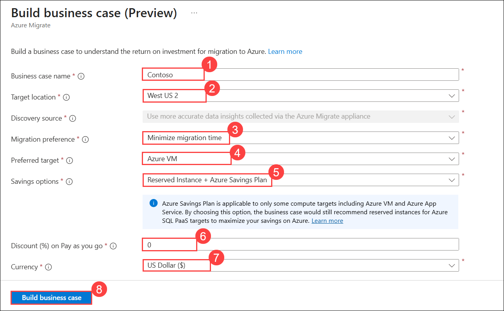

## HOL3: Exercise 6: Business case analysis capability

### Estimated duration: 15 Minutes

## Overview

In this exercise, you'll learn how to create a business case for Azure, using a free Azure Migrate feature during assessments that will help simplify your move to Azure.

Managing your on-premises data centres can present time-bound challenges such as expiring contracts, ageing hardware, and end-of-support software. You may also be under pressure to address cash flow challenges, add capacity, and prevent security attacks while ensuring business continuity.

To understand if Azure makes financial sense, we will start by creating a directional business case with Azure Migrate. This helps you understand what the best migration strategy is for your business and how to gradually move from a capital expenditure model to an operating expenditure model, where you only pay for what you use.

**Business case analysis** is a comprehensive, easy-to-use tool that enables customers and partners to create directional business proposals to understand how Azure can bring the most value to their business.

> **Note:** You don't need to perform this task as it is a read-only exercise.

**Features:**

- Need **minimal inputs** to get started.

- Includes **migration strategy recommendation** including lift-and-shift to IaaS and modernize to PaaS.

- Highlights **on-premises TCO, ROI** and financial analysis, **resource utilization-based insights and quick wins**.

- Enables creating **what-if** scenarios with customizable settings and assumptions.

1. In the Azure portal, click the **Show Portal Menu (1)** icon, then select  **All services (2)** from the left navigation pane.
 
    

1. In the search bar, type **Azure Migrate (1)**, and select **Azure Migrate (2)** from the suggestions to open.
 
    

1. On the **Azure Migrate** | Servers, databases and web apps page, click **Migration goals (1)** from the left panel and select **Servers, databases and web apps (2)** 
 
    

1. Now, you should see the **Azure Migrate: Discovery and assessment** and **Migration and modernization** panels for the current migration project, as shown below.

    
    
    >**Note:** If you are not able to see the **Azure Migrate: Discovery and assessment** and **Migration and modernization** panels, please follow the instructions below to select the migration project.

     - Click on **Project** and select the existing project from the list. Create a new project if you do not have any projects created previously.

        
        
1. Under **Azure Migrate: Discovery and assessment**, select **Build business case** to open the **Build business case** blade. 

    >**Note:** Make sure you discovered your on-premises environment with the Azure Migrate agentless appliance, which collects configuration and resource utilization data for your servers and workloads.

      
    
1. On the **Build business case** blade, enter the following details:
   
   - **Business case name:** Enter **Contoso (1)**
   - **Target location:** Select any available region **(2)**
   - **Migration prefrence:** Select the **Minimize migration time (3)**
   - **Preferred time:** Azure VM **(4)**
   - **Savings Option:** Select **Reserved Instance + Azure Savings Plan (5)**
   - **Discount(%) on Pay as you go:** Enter **0 (6)**
   - **Currency:** Select **US Dollar ($) (7)**
   - Click on **Build business case (8)**
     
      
   
8. Once the build has succeeded, you can start reviewing the business case that was created from the above inputs and industry benchmarks.

     
   
9. On the **TCO Comparison** blade, observe the cost. It represents an estimated on-premises cost versus Azure TCO and the potential savings possible by getting rid of components that you'll no longer need. 

     
   
10. The **YoY estimated current vs future state cost** presents a year-over-year cost breakdown of the estimated current versus future state.

      
    
11. On the same business case overview page, you'll receive unique incentives such as Azure hybrid benefits and extended security update savings to help drive technical and workplace innovations.

     
    
12. Based on the rich data insights collected during the discovery process, on the **Recommended migration strategy blade**, you can observe how to effectively migrate to Azure, which underutilized servers to the right size, and which unused servers to potentially decommission.

     
   
13. Under **Business case reports (1)**, click on **Azure Iaas (2)**. You can dive deeper into detailed Azure Infrastructure as a Service and Platform as a Service reports. IaaS Reports will provide you with recommended right-sized targets and the most cost-effective offers based on your usage.

     

14. Click on **On-premises** tab. You can also identify the impact of underutilized servers and identify quick wins through software end-of-support and zombie servers.

      

15. Click on **Azure PaaS** from the left navigation pane under **Business case reports**. You'll find recommendations in the PaaS reports identifying quick wins and the ideal right-sized targets for your database and application workloads.

16. Given the importance of what-if scenarios and customizations in the planning process, use new settings to override default assumptions and build a business case for your migration strategy. We can present this business case to your stakeholders, obtain buy-ins, and know that you've taken the steps to make the right decisions for your business.
     
17. Learn more about the business case here: https://learn.microsoft.com/en-us/azure/cloud-adoption-framework/strategy/cloud-migration-business-case.

## Summary

In this exercise, you explored the Azure Migrate Business Case feature to evaluate the financial benefits of moving to Azure. You reviewed TCO and ROI comparisons, migration strategy recommendations, and cost-saving insights through IaaS and PaaS reports.

### You have successfully completed this Hands-on lab.

By completing this lab Infrastructure Migration, you gained hands-on experience in assessing, migrating, and protecting on-premises workloads using Azure. You began by exploring Azure Migrate projects, configuring the appliance, and performing assessments with dependency visualization. You then registered a Hyper-V host, created storage accounts, and enabled replication of VMs to Azure with Azure Site Recovery. Next, you tested migration scenarios by performing live VM migrations, setting static IPs, and enabling Automanage, AAD authentication, and Managed Identities for secure management. You also deployed Azure Arc-enabled servers to extend management to non-Azure machines. Finally, you validated disaster recovery strategies by configuring replication policies, performing test failovers, and executing a full failover to Azure to ensure business continuity.
