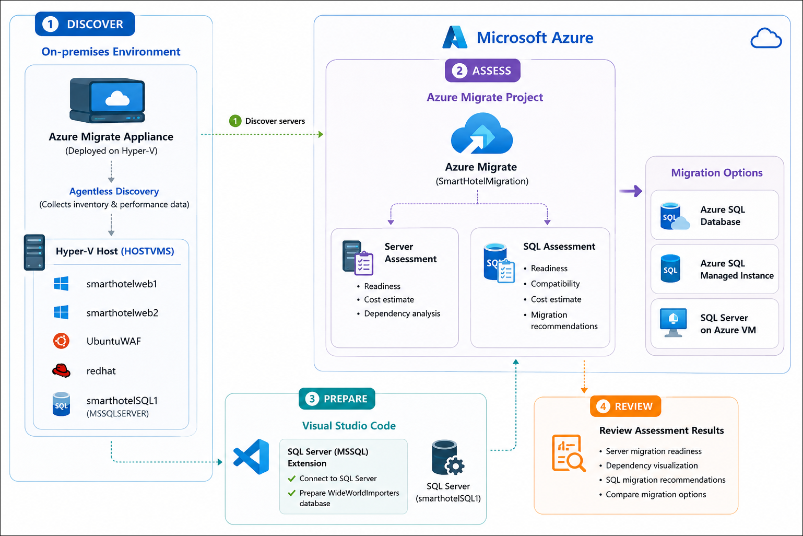
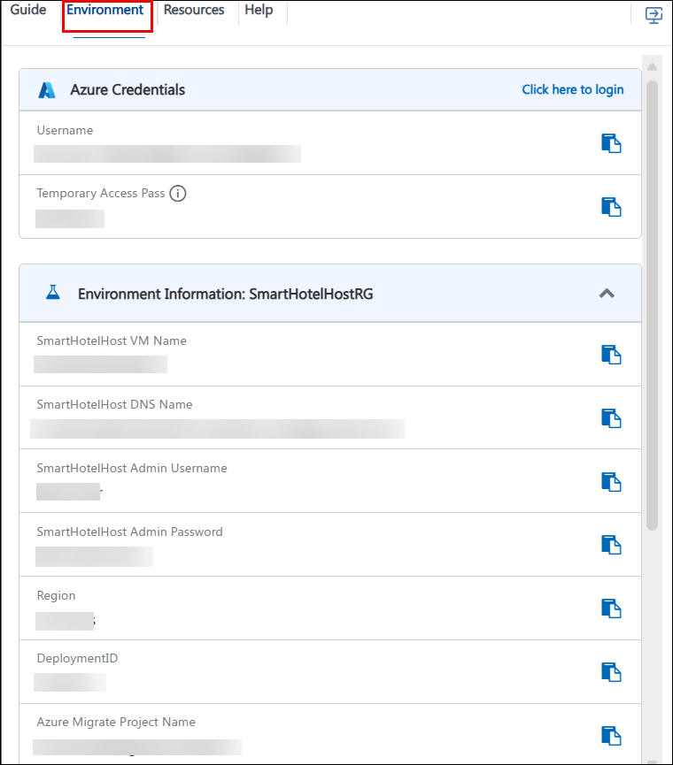
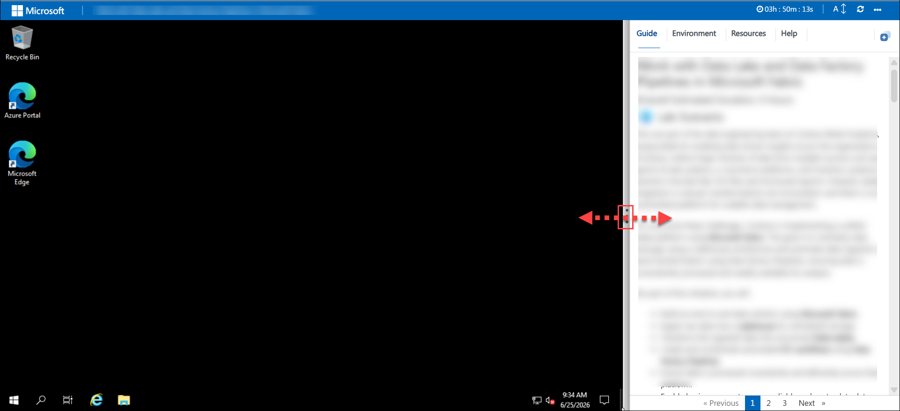
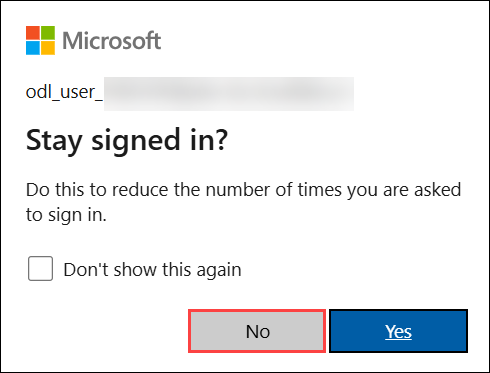

# Discover And Assess On-premises Windows & SQL Servers

### Estimated Duration: 4 Hours

## 📘Workshop Scenario

**SmartHotel** is a leading global hospitality company operating hotels, resorts, and conference centers across multiple regions. Its on-premises datacenter hosts critical business applications, including hotel reservation systems, property management services, SQL Server databases, Linux-based web applications, and supporting infrastructure.

As part of its cloud transformation strategy, SmartHotel plans to migrate its infrastructure to Microsoft Azure to improve scalability, enhance operational resilience, strengthen security, and reduce infrastructure management costs. Before migrating, the IT team must discover existing servers, analyze application dependencies, assess Azure readiness, and evaluate SQL workloads to determine the most appropriate migration strategy.

In this lab, you will use **Azure Migrate** to discover on-premises Windows Servers, create server and SQL migration assessments, and configure dependency visualization for migration planning. You will also use **Visual Studio Code** with the **SQL Server (MSSQL)** extension to connect to the SQL Server instance and prepare the **WideWorldImporters** database for assessment. Finally, you will review migration recommendations for **Azure SQL Managed Instance**, **Azure SQL Database**, and **SQL Server on Azure Virtual Machines** to identify the most suitable migration target.

## 📋Overview

Azure Migrate is Microsoft's centralized platform designed to assist organizations in planning, assessing, and executing their migration journey to Azure. It provides a comprehensive set of tools to discover, assess, and migrate on-premises servers, applications, databases, and virtual machines to Azure with minimal disruption.

Visual Studio Code, together with the **SQL Server (MSSQL)** extension, provides a lightweight and modern development environment for connecting to SQL Server, executing queries, and managing databases. In this lab, it is used to connect to the SQL Server instance and prepare the **WideWorldImporters** database for migration assessment.

In this Hands-On Lab, you will use the Azure Migrate appliance to discover on-premises workloads, create server and SQL migration assessments, and configure dependency visualization for migration planning. You will also use Visual Studio Code to connect to the SQL Server instance, prepare the **WideWorldImporters** database, and review migration recommendations for Azure SQL Managed Instance, Azure SQL Database, and SQL Server on Azure Virtual Machines to determine the most suitable migration strategy.
 
## 🎯Objectives

- **Discover your Windows Server:** Leverage the Azure Migrate Appliance to discover and assess your Hyper-V-based Windows Server environment, enabling detailed inventory collection and Azure readiness evaluation for a seamless migration.

- **Set up your environment on Azure to migrate servers:** Create a migration assessment and configure dependency visualization to analyze workload communication and evaluate Azure readiness. This includes preparing the discovered on-premises servers, configuring the required discovery settings, and validating workload dependencies to support migration planning.

- **Perform database assessments:** Use **Visual Studio Code** with the **SQL Server (MSSQL)** extension to connect to the **WideWorldImporters** database and prepare it for assessment. Then, use **Azure Migrate** to create a SQL migration assessment, evaluate migration readiness, and review recommendations for **Azure SQL Managed Instance**, **Azure SQL Database**, and **SQL Server on Azure Virtual Machines** to determine the most suitable migration strategy.

## ⚙️ Prerequisites

Participants should have:

- An active Microsoft Azure subscription to deploy and manage Azure resources.
- Familiarity with Azure services, including **Azure Migrate**, **Visual Studio Code**, and **Azure SQL** solutions.
- Experience with network configuration and enabling outbound connectivity for the Azure Migrate Appliance.
- Basic knowledge of SQL Server, database management, and SQL query execution.
- Understanding of server discovery, assessment, and migration planning for on-premises workloads to Azure.

## 🏗️ Architecture

The lab architecture integrates an on-premises Hyper-V environment with Azure to discover, assess, and plan the migration of Windows Server and SQL Server workloads. The Azure Migrate Appliance, deployed in the on-premises environment, performs agentless discovery of servers, software inventory, SQL Server instances, and workload dependencies. The collected metadata is securely transmitted to the Azure Migrate project, where server and SQL migration assessments are generated to evaluate migration readiness, estimate costs, and recommend the most suitable Azure migration targets.

Visual Studio Code, together with the **SQL Server (MSSQL)** extension, is used to connect to the on-premises SQL Server instance and prepare the **WideWorldImporters** database for assessment. Azure Migrate then provides migration recommendations for **Azure SQL Managed Instance**, **Azure SQL Database**, and **SQL Server on Azure Virtual Machines**, enabling informed migration planning while maintaining data integrity and application compatibility.

## Architecture Diagram

## 🔍 Explanation of Components

- **Azure Migrate Appliance:** A virtual appliance deployed in the on-premises Hyper-V environment. It performs agentless discovery of servers, software inventory, SQL Server instances, and workload dependencies, then securely sends the collected metadata to Azure Migrate.

- **On-premises Environment:** Hosts the SmartHotel application workloads, including Windows Servers, Linux Servers, and the SQL Server instance containing the **WideWorldImporters** database. These workloads are discovered and assessed for migration readiness.

- **Azure Migrate Project:** A centralized Azure service that manages discovery, assessments, and migration planning. It analyzes the collected metadata to generate migration readiness reports, cost estimates, and Azure migration recommendations.

- **Server Assessment:** Evaluates the discovered on-premises servers for Azure readiness by analyzing configuration, performance, sizing, and estimated migration costs.

- **SQL Assessment:** Assesses the discovered SQL Server instance and provides migration recommendations for **Azure SQL Managed Instance**, **Azure SQL Database**, and **SQL Server on Azure Virtual Machines** based on readiness and compatibility.

- **Visual Studio Code with SQL Server (MSSQL) Extension:** Used to connect to the SQL Server instance, execute SQL queries, and prepare the **WideWorldImporters** database before performing the SQL migration assessment.

- **Azure SQL Managed Instance / Azure SQL Database / SQL Server on Azure Virtual Machines:** Azure migration targets evaluated by Azure Migrate. The assessment compares these options to help determine the most suitable migration destination based on workload readiness, migration strategy, and estimated costs.

## 🚀Getting started with the lab

 We've prepared a seamless environment for you to explore and learn about Azure services. Let's begin by making the most of this experience:

## Accessing Your Lab Environment
 
Once you're ready to dive in, your virtual machine and **Guide** will be right at your fingertips within your web browser.

### Virtual Machine & Lab Guide
 
Your virtual machine is your workhorse throughout the workshop. The lab guide is your roadmap to success.
 
## Exploring Your Lab Resources
 
To get a better understanding of your lab resources and credentials, navigate to the **Environment** tab.

 
## Utilizing the Split Window Feature
 
For convenience, you can open the lab guide in a separate window by selecting the **Split Window** button from the Top right corner.
 

 
## Managing Your Virtual Machine
 
Feel free to **Start, Stop, or Restart (2)** your virtual machine as needed from the **Resources (1)** tab. Your experience is in your hands!
 

## Lab Guide Zoom In/Zoom Out

To adjust the zoom level for the environment page, click the **A↕** icon located next to the timer in the lab environment.

## Resize the Virtual Machine View

Use the **slider (three vertical dots)** located between the **Virtual Machine** and the **Lab Guide** panes to adjust the display size, allowing you to customize the layout based on your preference.

   
## Let's Get Started with Azure Portal
 
1. On your **LabVM**, click on the **Azure Portal** icon as shown below:
 
   
 
2. You'll see the **Sign into Microsoft Azure** tab. Here, enter your credentials and click on **Next (2)**:
 
   - **Email/Username:** <inject key="AzureAdUserEmail"></inject> **(1)**
 
     
 
3. Next, provide your temporary access pass and click on **Sign in (2)**:

   - **Temporary Access Pass:** <inject key="AzureAdUserPassword"></inject> **(1)**
 
     
 
4. If you see the pop-up **Stay Signed in?**, click **No**.

   
 
## Support Contact
 
The CloudLabs support team is available 24/7, 365 days a year, via email and live chat to ensure seamless assistance at any time. We offer dedicated support channels tailored specifically for both learners and instructors, ensuring that all your needs are promptly and efficiently addressed.

Learner Support Contacts:
- Email Support: cloudlabs-support@spektrasystems.com
- Live Chat Support: https://cloudlabs.ai/labs-support

Now, click on **Next >>** from the lower right corner to move on to the next page.

### Happy Learning!!
