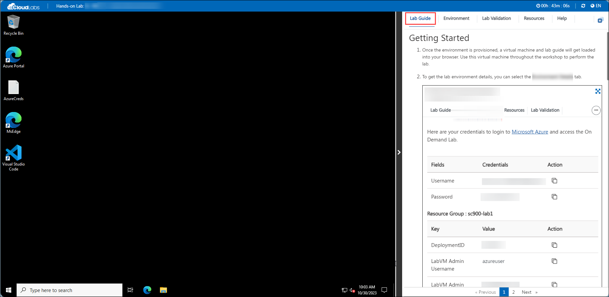
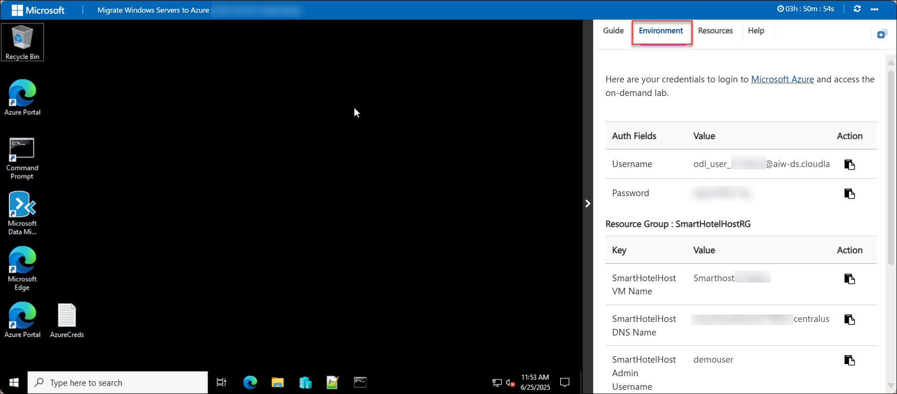

# Migrate Windows Server to Azure
 
Welcome to Migrate Windows Server to Azure workshop! We've prepared a seamless environment for you to explore and learn about Azure services. Let's begin by making the most of this experience:

### Overall Estimated Duration: 4 Hours

## Overview

In this hands-on lab, you will explore how Azure Migrate simplifies the migration of applications and data to Azure. You will learn to perform key pre-migration tasks, including discovery, assessments, and resource right-sizing. The lab covers configuring replication from on-premises Hyper-V hosts to Azure and executing server migrations, ensuring smooth operation through proper networking configurations. Additionally, you’ll gain valuable insights into Azure Networking and Security to support successful infrastructure migration.

## Objective 

This exercise focuses on enhancing your skills in migrating applications and data to Azure using Azure Migrate and related services. By completing this lab, you will learn:

1. **Pre-migration steps with Azure Migrate:** Understand how to perform discovery, assessments, and right-sizing of on-premises resources for infrastructure, data, and applications.

2. **Replication and migration:** Configure replication from on-premises Hyper-V hosts to Azure and migrate virtual machines using Azure Migrate Server Migration.

3. **Networking configuration:** Modify replicated VM settings to ensure proper networking, including static private IP assignments for seamless integration.

4. **Azure Networking and Security:** Gain insights into Azure networking and security best practices for infrastructure and platform migrations.

## Prerequisites

1. **Basic Azure Knowledge:** Familiarity with Azure services and resource management.

2. **Virtualization Concepts:** Understanding of Hyper-V and virtual machine management.

3. **Networking Basics:** Knowledge of IP addressing and network security principles.
   
## Architecture

In this hands-on lab, you will follow a structured workflow to migrate applications and data to Azure using Azure Migrate: Server Migration. The process begins with creating a storage account and registering your on-premises Hyper-V host with the Migration and Modernization service, leveraging Azure Site Recovery as the migration engine. You will then enable replication of virtual machines to Azure, configure networking for seamless integration, and perform server migrations. Additionally, you will explore Azure Networking and Security best practices, gaining a comprehensive understanding of the tools and services that support successful migration to Azure.

## Architecture Diagram

  

## Explanation of Components

- **Azure Migrate**: Simplifies migration with pre-migration assessments, right-sizing, and VM replication to Azure.  

- **Migration and Modernization Service**: Uses Azure Site Recovery to automate and streamline infrastructure migration to Azure.  

- **Azure Networking**: Ensures secure, scalable network designs for seamless connectivity during and after migration.  

- **Azure Site Recovery**: Provides reliable replication and failover of workloads to Azure with minimal downtime.  

## **Accessing Your Lab Environment**
 
Once you're ready to dive in, your virtual machine and **Lab Guide** will be right at your fingertips within your web browser.

   

### **Virtual Machine & Lab Guide**
 
Your virtual machine is your workhorse throughout the workshop. The lab guide is your roadmap to success.
 
## **Exploring Your Lab Resources**
 
To get a better understanding of your lab resources and credentials, navigate to the **Environment** tab.

   
 
## **Utilizing the Split Window Feature**
 
For convenience, you can open the lab guide in a separate window by selecting the **Split Window** button from the Top right corner.
 
   
 
## **Managing Your Virtual Machine**
 
Feel free to start, stop, or restart your virtual machine as needed from the **Resources** tab. Your experience is in your hands!
 
  

## Lab Guide Zoom In/Zoom Out

1. To adjust the zoom level for the environment page, click the **A↕ : 100%** icon located next to the timer in the lab environment.

   
   
## **Let's Get Started with Azure Portal**
 
1. On your virtual machine, click on the Azure Portal icon as shown below:
 
    
 
2. You'll see the **Sign into Microsoft Azure** tab. Here, enter your credentials:
 
   - **Email/Username:** <inject key="AzureAdUserEmail"></inject>
 
      
 
3. Next, provide your password:
 
   - **Password:** <inject key="AzureAdUserPassword"></inject>
 
      
 
4. If you see the pop-up **Stay Signed in?**, click **No**.

   

5. If you see the pop-up **You have free Azure Advisor recommendations!**, close the window to continue the lab.

6. If a **Welcome to Microsoft Azure** popup window appears, click **Cancel** to skip the tour.

7. Now you will see the Azure Portal Dashboard, click on **Resource groups** from the Navigate panel to see the resource groups.

     
   
8. Confirm you have all resource groups present as shown below.

     
   
9. Now, click on the **Next** from the lower right corner to move to the next page.

   
 
Now you're all set to explore the powerful world of technology. Feel free to reach out if you have any questions along the way. Enjoy your workshop!
