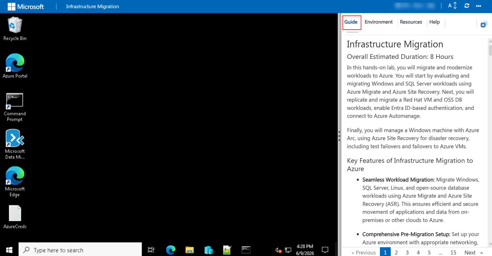
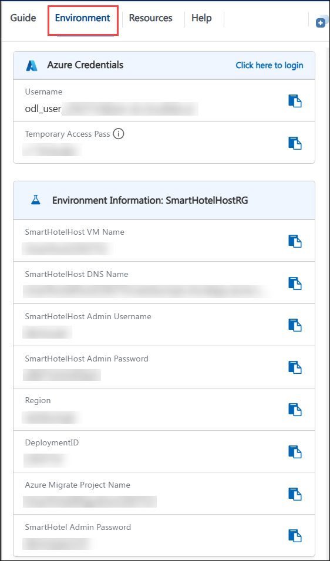
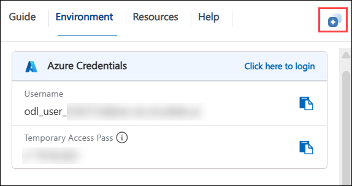
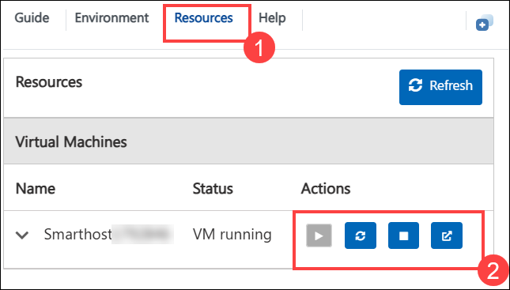
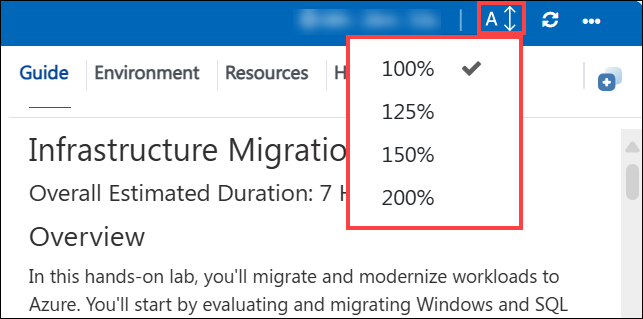
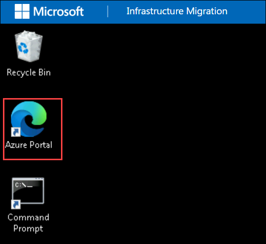
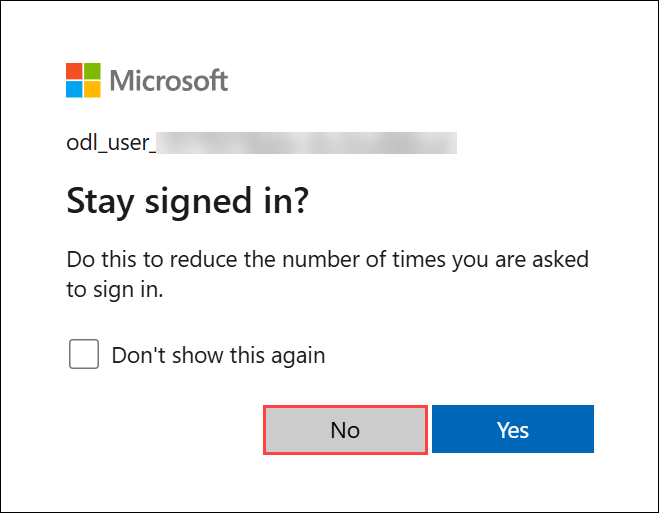
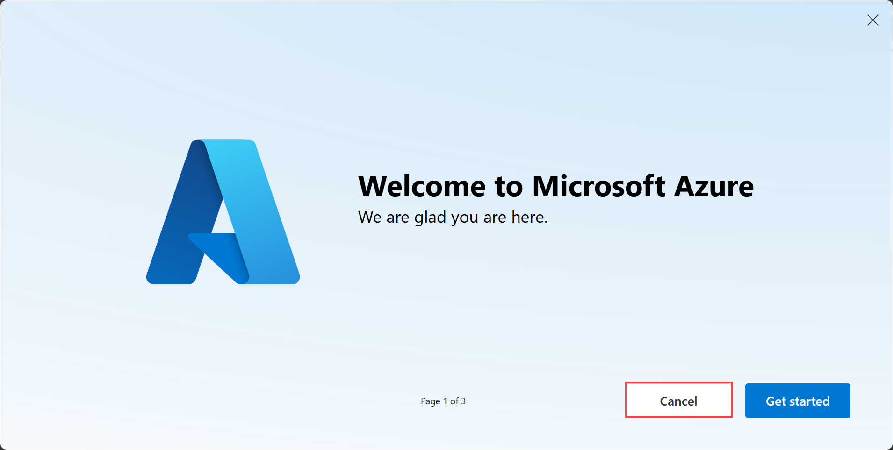
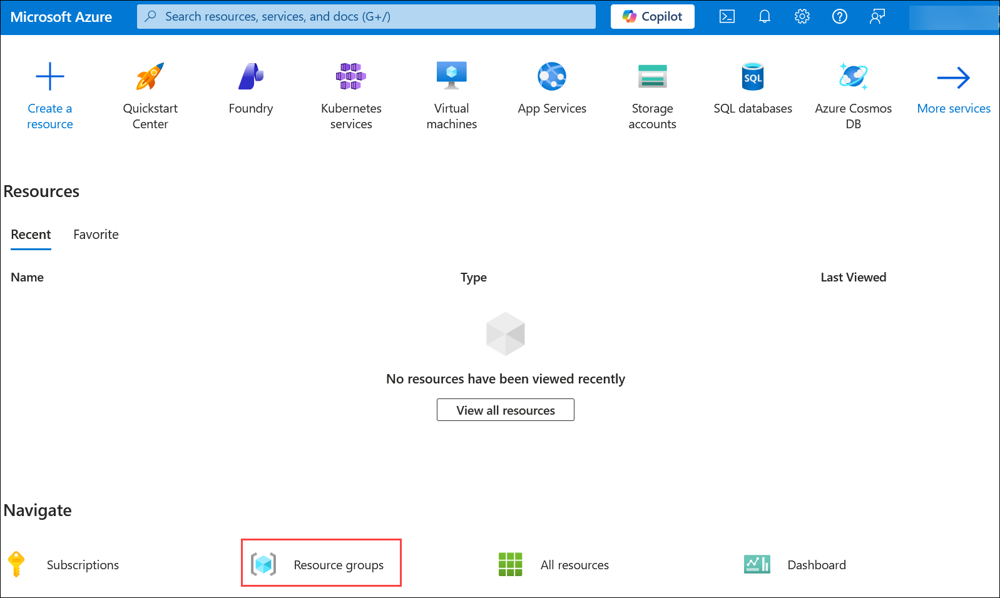
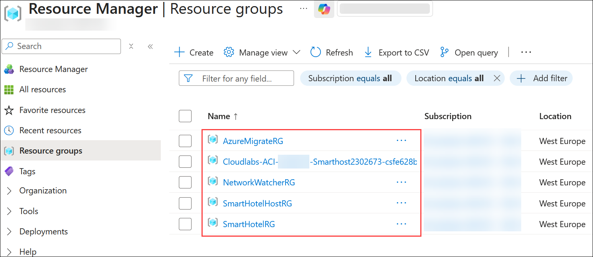

# Infrastructure Migration 

### Overall Estimated Duration: 8 Hours

## 📘Workshop Scenario

**SmartHotel** is a leading global hospitality company operating hotels, resorts, and conference centers across multiple regions. Its on-premises datacenter hosts critical business applications, including hotel reservation systems, property management services, SQL Server databases, Linux-based web applications, and supporting infrastructure.

As part of its cloud transformation strategy, SmartHotel plans to migrate its infrastructure to Microsoft Azure to improve scalability, enhance operational resilience, strengthen security, and reduce infrastructure management costs. Before migrating, the IT team must discover existing servers, analyze application dependencies, assess Azure readiness, and plan migrations with minimal disruption to business operations.

In this lab, you will assume the role of a Cloud Administrator responsible for modernizing SmartHotel's infrastructure. You will use the Azure Migrate appliance to perform **agentless discovery, software inventory, and dependency analysis**, assess workloads for Azure readiness, and migrate Windows, SQL Server, Linux, and open-source database workloads to Azure using Azure Migrate and Azure Site Recovery.

After migration, you will configure Microsoft Entra ID authentication, onboard servers to Azure Arc for hybrid management, enable Azure Automanage, validate disaster recovery through Azure Site Recovery, and generate Business Case reports to evaluate migration readiness, projected costs, and potential savings.

## 📋Overview

In this hands-on lab, you will use the Azure Migrate appliance to perform agentless discovery, software inventory, and dependency analysis of on-premises servers. Based on the collected inventory and dependency information, you will assess workloads for Azure readiness, replicate and migrate Windows, SQL Server, Linux, and open-source database workloads using Azure Migrate and Azure Site Recovery.

After migration, you will configure Microsoft Entra ID authentication, onboard servers to Azure Arc for hybrid management, enable Azure Automanage, validate disaster recovery using Azure Site Recovery, and generate Azure Migrate Business Case reports to evaluate migration readiness, costs, and expected savings.

### Key Features of Infrastructure Migration to Azure

* **Agentless Discovery and Dependency Analysis:** Discover on-premises servers using the Azure Migrate appliance without installing agents on the source machines. Perform software inventory and agentless dependency analysis to understand application dependencies and build an accurate migration plan.

* **Comprehensive Workload Assessment:** Assess discovered workloads for Azure readiness, right-sizing, and cost estimation. Leverage Azure Migrate assessments to identify the most suitable Azure resources before migration.

* **Seamless Workload Migration:** Migrate Windows Server, SQL Server, Linux, and open-source database workloads using Azure Migrate and Azure Site Recovery (ASR), ensuring secure and efficient migration with minimal downtime.

* **Migration Optimization:** Optimize migrated workloads using Azure recommendations for performance, scalability, cost, and operational efficiency while applying Azure best practices.

* **Modernization of Linux and Open-Source Workloads:** Migrate and modernize Red Hat Enterprise Linux virtual machines and open-source database workloads while maintaining application compatibility and improving cloud readiness.

* **Hybrid Management with Azure Arc and Azure Automanage:** Extend Azure management capabilities to hybrid servers using Azure Arc and simplify post-migration operations with Azure Automanage for centralized governance, monitoring, and configuration management.

* **Business Continuity with Azure Site Recovery:** Configure Azure Site Recovery to replicate workloads, perform test failovers, and execute planned failovers, ensuring disaster recovery preparedness and business continuity.

* **Security and Identity Integration:** Strengthen the security posture of migrated workloads by enabling Microsoft Entra ID authentication and integrating Azure security and monitoring services for ongoing protection and operational visibility.

* **Business Case Analysis:** Generate Azure Migrate Business Case reports to evaluate migration readiness, projected Azure costs, potential savings, and return on investment, supporting informed migration decisions.

* **Unified Azure Management:** Manage migrated resources through Azure's centralized management platform, enabling consistent governance, automation, compliance, and lifecycle management across hybrid and cloud environments.

## 🎯Objectives

By the end of this lab, you will be able to discover on-premises servers using the Azure Migrate appliance and perform agentless software inventory and dependency analysis to understand your environment. You will assess workloads for Azure readiness and migration planning, replicate and migrate Windows, SQL Server, Linux, and open-source database workloads using Azure Migrate and Azure Site Recovery, and configure Microsoft Entra ID authentication and Azure Automanage. Additionally, you will manage hybrid servers using Azure Arc, configure and validate disaster recovery through Azure Site Recovery, and analyze migration readiness, cost optimization, and potential savings using Azure Migrate Business Case reports.

## ⚙️Pre-requisites

- **Access to Azure Environment:** An active Azure subscription with necessary permissions to deploy and configure resources, including enabling Azure Migrate and Azure Site Recovery (ASR).  

- **Familiarity with Azure Services and Migration Tools:** Basic understanding of Azure concepts, resource management, and migration tools like Azure Migrate, Azure Hybrid Benefit, and ASR to ensure seamless migration.  

- **Technical Environment Preparation:** Prepared on-premises environment with necessary agents installed, server discovery enabled, and application compatibility assessed for migration readiness.  

## 🏗️ Architecture

The architecture diagram illustrates a comprehensive infrastructure migration and modernization journey for **SmartHotel**, demonstrating how on-premises workloads are discovered, assessed, migrated, and managed using Microsoft Azure services. The process begins with deploying the **Azure Migrate appliance** to perform **agentless discovery, software inventory, and dependency analysis** of Windows Server, SQL Server, Linux, and open-source database workloads. Based on the collected inventory, Azure Migrate assesses workload readiness, provides right-sizing and cost recommendations, and prepares workloads for migration.

The migration workflow continues by replicating and migrating workloads to Azure using **Azure Migrate** and **Azure Site Recovery (ASR)** while minimizing downtime and ensuring business continuity. After migration, users configure **Microsoft Entra ID** authentication, onboard hybrid servers to **Azure Arc**, and enable **Azure Automanage** to simplify ongoing operations and management. Finally, **Azure Site Recovery** is used to validate disaster recovery through test failover and planned failover operations, while **Azure Migrate Business Case** provides migration readiness assessments, cost analysis, and projected savings, enabling organizations to optimize their cloud migration strategy and make informed business decisions.

## 🔍Explanation of Components

1. **On-premises Environment:** Represents SmartHotel's on-premises infrastructure hosting Windows Server, SQL Server, Linux virtual machines, and open-source database workloads that are prepared for migration to Azure.

2. **Azure Migrate Appliance:** Deployed within the on-premises environment to perform **agentless discovery**, **software inventory**, and **dependency analysis** without installing agents on the source servers.

3. **Azure Migrate:** Evaluates discovered workloads for Azure readiness, generates right-sizing and cost recommendations, and orchestrates the migration process using the collected dependency information.

4. **Azure Site Recovery (ASR):** Replicates workloads to Azure and enables migration, test failover, and planned failover operations to support business continuity during and after migration.

5. **Microsoft Azure:** Serves as the target environment where migrated virtual machines and supporting Azure resources are hosted and managed.

6. **Microsoft Entra ID:** Provides secure identity and authentication services for migrated workloads, enabling centralized access management and enhanced security.

7. **Azure Arc:** Extends Azure management capabilities to hybrid and migrated servers, allowing centralized governance, inventory, and resource management from the Azure portal.

8. **Azure Automanage:** Simplifies post-migration operations by automatically applying Azure best practices for configuration, updates, monitoring, and operational management.

9. **Azure Migrate Business Case:** Provides migration readiness insights, estimated Azure costs, projected savings, and business value analysis to support migration planning and decision-making.

## 🚀 Getting Started with the Lab

We've prepared a seamless environment for you to explore and learn about Azure services. Let's begin by making the most of this experience!

## Accessing Your Lab Environment
 
Once you're ready to dive in, your virtual machine and **Guide** will be right at your fingertips within your web browser.

## Virtual Machine & Lab Guide
 
Your virtual machine is your workhorse throughout the workshop. The lab guide is your roadmap to success.
 
## Exploring Your Lab Resources
 
To get a better understanding of your lab resources and credentials, navigate to the **Environment Details** tab.

   
 
## Utilizing the Split Window Feature
 
For convenience, you can open the lab guide in a separate window by selecting the **Split Window** button from the Top right corner.
 
   
 
## Managing Your Virtual Machine
 
Feel free to **Start, Stop, or Restart (2)** your virtual machine as needed from the **Resources (1)** tab. Your experience is in your hands!
 
  

## Lab Guide Zoom In/Zoom Out

To adjust the zoom level for the environment page, click the **A↕ : 100%** icon located next to the timer in the lab environment.

 

## Resize the Virtual Machine View

Use the **slider (three vertical dots)** located between the **Virtual Machine** and the **Lab Guide** panes to adjust the display size, allowing you to customize the layout based on your preference.

## Let's Get Started with Azure Portal
 
1. On your virtual machine, click on the **Azure Portal** icon as shown below:
 
    
 
2. You'll see the **Sign into Microsoft Azure** tab. Here, enter your credentials:
 
   - **Email/Username:** <inject key="AzureAdUserEmail"></inject>
 
      
 
3. Next, provide your password:
 
   - **Temporary Access Pass:** <inject key="AzureAdUserPassword"></inject>
 
      
 
4. If you see the pop-up **Stay Signed in?**, click **No**.

   

5. If a **Welcome to Microsoft Azure** pop-up window appears, click **Cancel** to skip the tour.

     

6. From the **Azure Portal** Dashboard, under the Navigate section, click **Resource groups** to view all the resource groups.

   

   >**Note:** If you see pop-up notification to **Restore pages**, please close it.
   
7. On the **Resource groups** page in the Azure portal, confirm you have all resource groups present as shown below.

   

## Support Contact

The CloudLabs support team is available 24/7, 365 days a year, via email and live chat to ensure seamless assistance at any time. We offer dedicated support channels tailored specifically for both learners and instructors, ensuring that all your needs are promptly and efficiently addressed.

Learner Support Contacts:

- Email Support: cloudlabs-support@spektrasystems.com
- Live Chat Support: https://cloudlabs.ai/labs-support

Now, click on **Next >>** from the lower right corner to move on to the next page.

## Happy Learning!!
