# HOL1: Exercise 1: Migrating Windows & SQL Server workloads

### Estimated time: 60 Minutes

In this HOL, you will use Azure Migrate: Server Assessment to assess the on-premises environment. This will include selecting Azure Migrate tools, deploying the Azure Migrate appliance into the on-premises environment, creating a migration assessment, and using the Azure Migrate dependency visualization.

## Lab objectives

In this HOL, you will complete the following task:

- Task 1: Discovery, Assess, and Plan: Evaluate your current environment

### Task 1: Discovery, Assess, and Plan: Evaluate your current environment

In this task, you will deploy the Azure Migrate appliance in the on-premises Hyper-V environment. This appliance communicates with the Hyper-V server to gather configuration and performance data about your on-premises VMs and returns that data to your Azure Migrate project.

1. If you are not logged in already, click on the **Azure portal** shortcut that is available on the desktop and log in with the below Azure credentials.
    
    - Enter your **Username/Email:** <inject key="AzureAdUserEmail"></inject> in the **Sign in** field. Click **Next** to continue.
      
      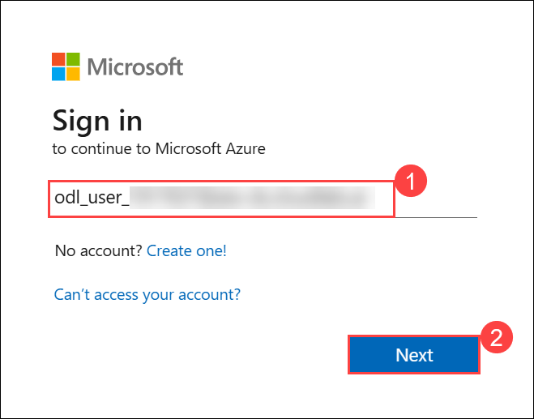
      
    - **Enter Password:** <inject key="AzureAdUserPassword"></inject> and click **Sign in**

      

1. In the Azure portal, click the **Show Portal Menu (1)** icon, then select  **All services (2)** from the left navigation pane.
 
    

1. In the search bar, type **Azure Migrate (1)**, and select **Azure Migrate (2)** from the suggestions to open.
 
    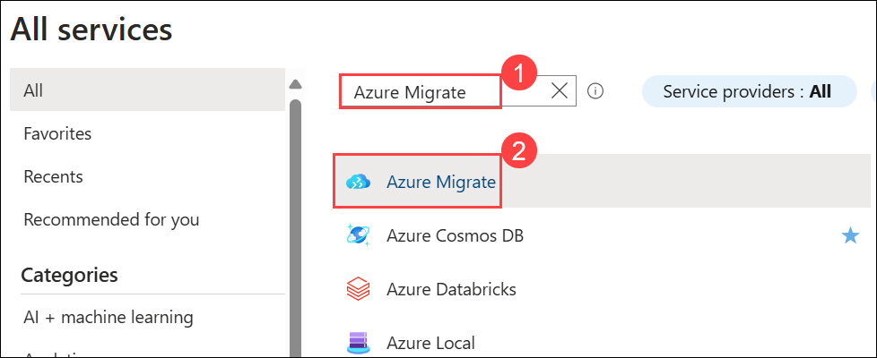

1. On the **Azure Migrate** page, from the left navigation pane, select **All projects (1)**, and then choose **SmartHotelMigration<inject key="DeploymentID" enableCopy="false" /> (2)**
 
    

1. On the **SmartHotelMigration<inject key="DeploymentID" enableCopy="false" />** page, select the down arrow next to **Start discovery (1)**, then choose **Using appliance (2)**, and select **From Azure (3)**.

   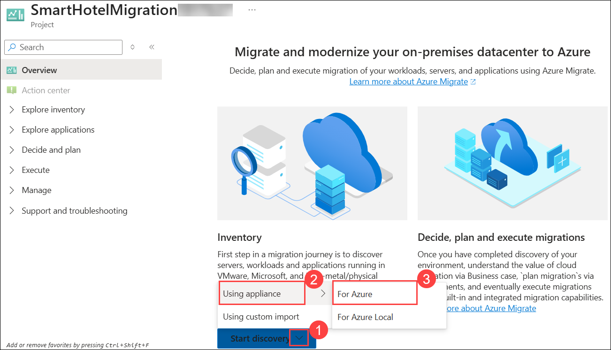
   
1. On the **Discover** page, under **Are your servers virtualized?**, click the drop-down **(1)** and select **Yes, with Hyper-V (2)** from the list.

    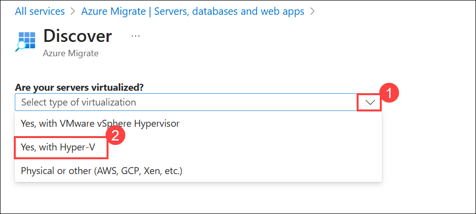

1. On the **Discover page**, under **1: Generate project key**, enter the name below as the appliance name **(1)**, then click **Generate key (2)** to start creating the required Azure resources.

     ```
     SmartHotelAppl
     ```
    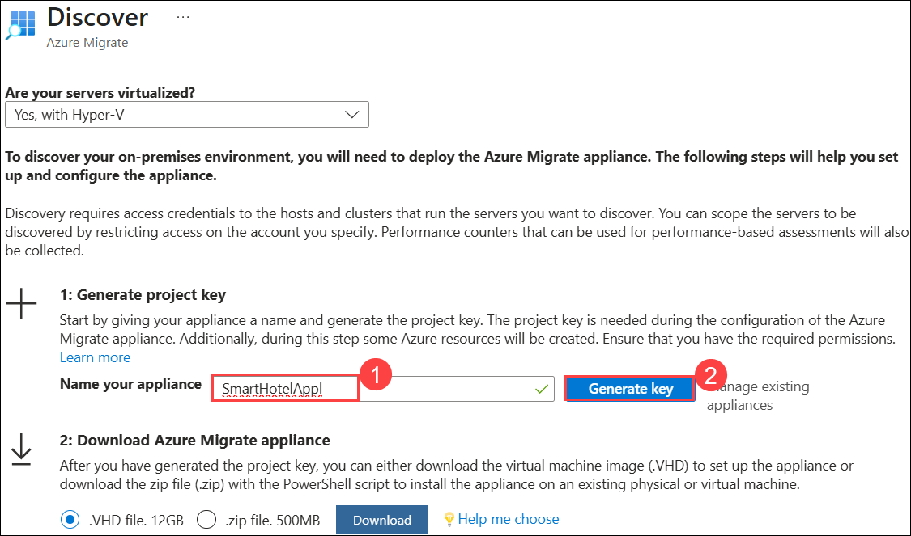

1. Once the project key is generated, click the **copy** icon to the right of the **Project key** field and save it in a **Notepad** for future reference.

    

1.  Read through the instructions on how to download, deploy, and configure the Azure Migrate appliance, then close the 'Discover machines' blade by clicking on the cross button **X** (do **not** download the .VHD file or .ZIP file, the .VHD has already been downloaded for you). 
 
    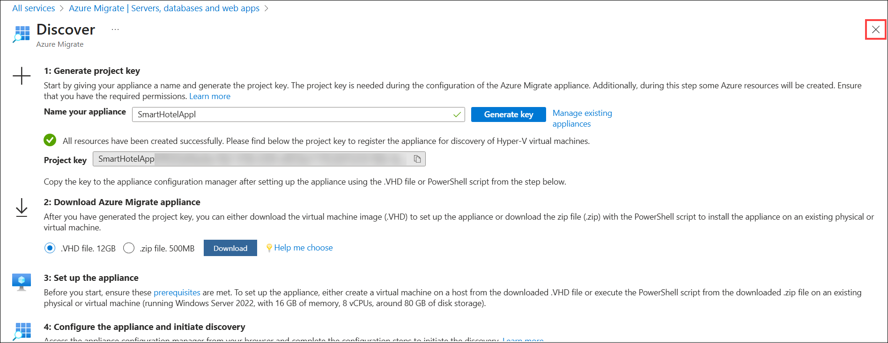

1. As we have created the Azure Migrate project key for the Discover and Assessment, you will be accessing the Hyper-V manager in the next tasks to start the discovery process with the help of the Azure Migrate Appliance.

1. On the lab VM, click the **Start (1)** button, search for **Hyper-V Manager (2)**, and select  **Hyper-V Manager (3)** from the results. You will use Hyper-V Manager to access your infrastructure and connect to the Azure Migrate Appliance VM to begin discovery.

    > You can also open the Hyper-V Manager by clicking on the  icon in the taskbar.

      

1. In Hyper-V Manager, select **HOSTVMS<inject key="DeploymentID" enableCopy="false" /> (1)** from the left pane. You should now see the AzureMigrateAppliance VM along with other VMs **(2)** that make up the on-premises SmartHotel application and will be used in upcoming hands-on labs.

    
     
1. In Hyper-V Manager, select the **AzureMigrateAppliance (1)** VM, then click **Start (2)** from the right-hand Actions pane if it is not already running.

    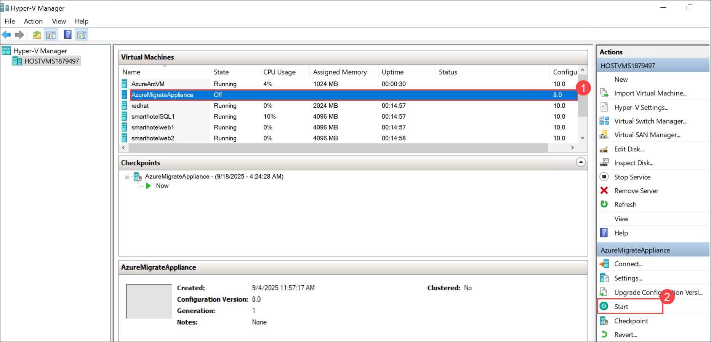
    
     > **Note:** If you encounter an error while starting the **AzureMigrateAppliance** VM, try **turning off** the **AzureArcVM**, then start the **AzureMigrateAppliance** VM again.

     > **Note:** Follow these steps and run the commands one-by-one from the code block.

     1. On the **Lab VM**, open **Windows PowerShell** (blue icon) **Run as administrator.**

     2. Copy the code block below.

     3. Paste **one line at a time** into PowerShell and press **Enter** after each line.

     4. After the last line, confirm the VM **State** shows **Running.**

      ```powershell
    $vm = "AzureMigrateAppliance"
    
    Import-Module Hyper-V -ErrorAction SilentlyContinue
    
    if (-not (Get-Command Get-VM -ErrorAction SilentlyContinue)) { DISM /Online /Enable-Feature /FeatureName:Microsoft-Hyper-V-Management-PowerShell /All }
    
    Import-Module Hyper-V
    
    Remove-VMSavedState -VMName $vm -ErrorAction SilentlyContinue
    
    Stop-VM -Name $vm -TurnOff -ErrorAction SilentlyContinue
    
    Set-VMProcessor -VMName $vm -CompatibilityForMigrationEnabled $true
    
    Set-VMMemory -VMName $vm -DynamicMemoryEnabled $true -StartupBytes 4096MB -MinimumBytes 2048MB -MaximumBytes 8192MB
    
    Start-VM -Name $vm -ErrorAction SilentlyContinue
    
    if ((Get-VM -Name $vm).State -ne 'Running') { Set-VMMemory -VMName $vm -DynamicMemoryEnabled $true -StartupBytes 2048MB -MinimumBytes 1024MB -MaximumBytes 8192MB; Start-VM -Name $vm }
    
    Get-VM -Name $vm | Select Name, State, Status, MemoryAssigned | Format-Table -Auto
    ```
1. In Hyper-V Manager, select the **AzureMigrateAppliance (1)** VM, then click **Connect (2)** from the right-hand Actions pane.

    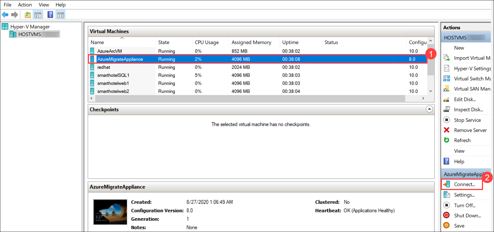    
   
1. On the **Connect to AzureMigrateAppliance** window, click **Connect**, then log in to the VM using the administrator password: **<inject key="SmartHotel Admin Password" />** (Note: The login screen may use your local keyboard layout, click the 'eyeball' icon to verify your password.)
 
    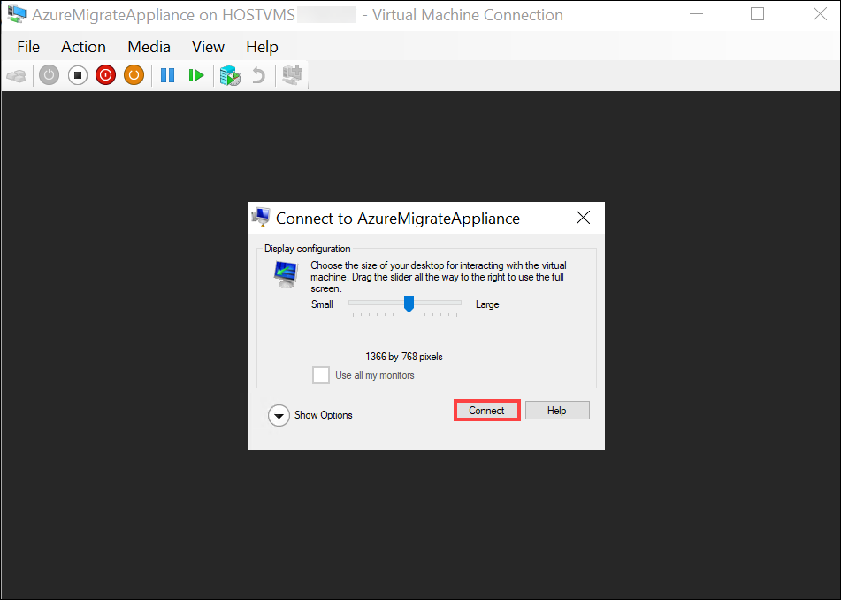

    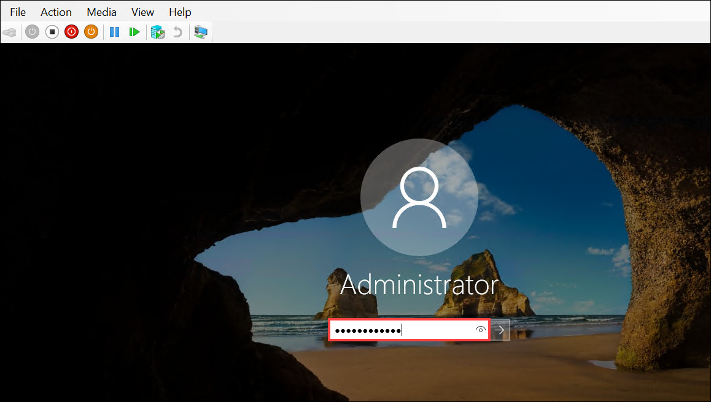

1. On the desktop of the **AzureMigrateAppliance** VM, double-click the **Azure Migrate Appliance Configuration Manager** shortcut to launch the wizard. Wait a minute or two for the browser to open and display the configuration wizard.

     > **Note:** If a New updates available pop-up appears, click View updates, then close the settings panel. You can proceed without applying the updates for now.

    
    
    >**Note:** If you receive a prompt asking for credentials after launching the **Azure Migrate appliance configuration wizard** from the desktop shortcut, follow the instructions [here](https://github.com/CloudLabsAI-Azure/Know-Before-You-Go/blob/main/AIW-KBYG/AIW-Infrastructure-Migration.md#1-exercise1---task3---step3) to connect to the appliance configuration wizard.

1. If a **Terms of use** pop-up appears in the appliance configuration wizard, review the license terms and click **I agree** to accept.

    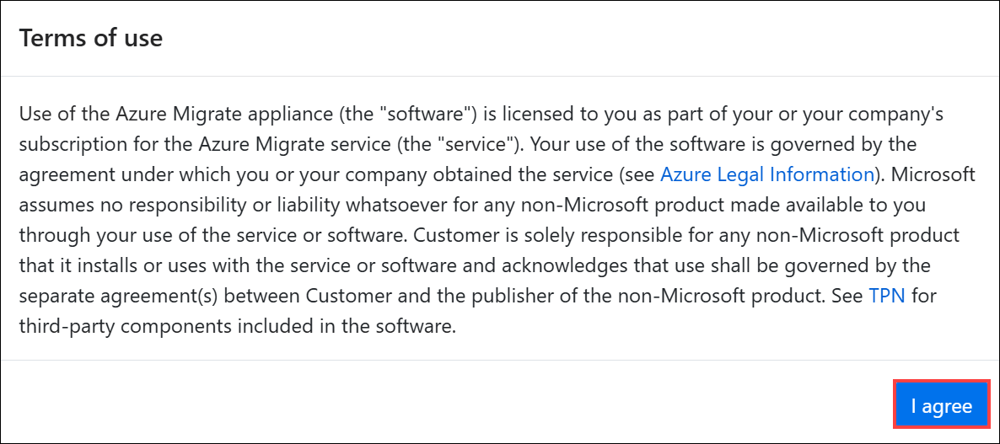

1. On the **Appliance Configuration Manager Cloud: Public** page, under **Set up prerequisites**, the following two checks, **Check connectivity to Azure** and **Check time is in sync with Azure**, should pass automatically.

    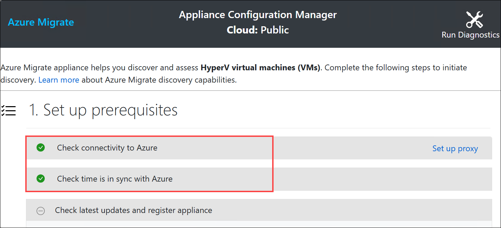

1. On the **Appliance Configuration Manager Cloud: Public** page, under **1. Set up prerequisites**, expand **Check latest updates and register appliance**. Paste the **Azure Migrate project key (1)** that you copied earlier, then click **Verify (2)** to validate the key.

    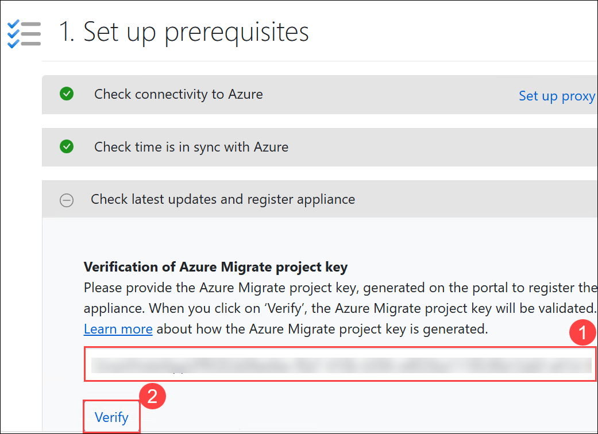

1. **Wait** while the wizard installs the latest Azure Migrate updates. If prompted, log in using the credentials, enter username as **Administrator** and password **<inject key="SmartHotel Admin Password" />**. Once the update completes, if a **New update installed** pop-up appears, click **Refresh** to restart the appliance management app.

    

1. Under **Check latest updates and register appliance**, wait for the **Appliance auto-update status (1)** to show successful completion. This may take up to **5 minutes**. Once completed, click **Login (2)** to sign in with your Azure credentials.

    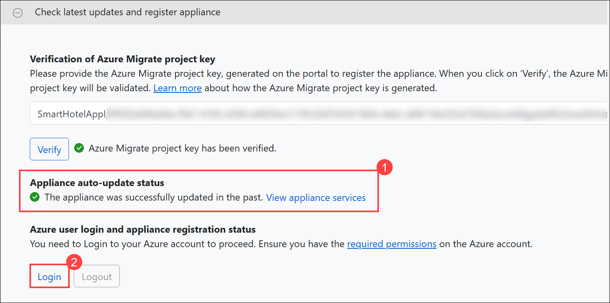
   
    >**Note:** Now, follow the instructions below to complete the login process.
    
 1. After clicking Login, in the **Continue with Azure Login** dialog, click **Copy code & Login** to copy the device code.
    
    
  
 1. This will open an Azure login prompt in a new browser tab. If it doesn’t appear, ensure that your browser’s pop-up blocker is disabled. Paste the device **code (1)** and click **Next (2)**. You will then be prompted to sign in with your Azure portal credentials to complete the login.

     

 1. Log in using the provided Azure credentials. On the **Are you trying to sign in to Microsoft Azure PowerShell?** prompt, select **Continue** to complete the login. 
    
     - Azure Username/Email: <inject key="AzureAdUserEmail"></inject>
        
        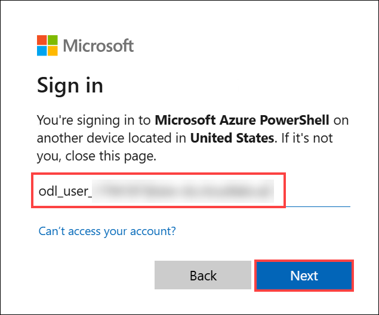
       
     - Azure Password: <inject key="AzureAdUserPassword"></inject>
   
        

        
       
1. Once signed in, return to the Azure Migrate Appliance tab the appliance registration will begin automatically and display The appliance has been successfully registered once complete.

   

1. Once registration is complete, navigate to the **Manage credentials and discovery sources** panel. Under **Step 1: Provide Hyper-V host credentials for discovery of Hyper-V VMs**, click **Add credentials** to proceed.

    

1. On the **Add credentials** tab, enter the following details for the Hyper-V host/cluster that the appliance will use to discover VMs, and then click **Save (4)** to continue.
 
      - Friendly name: Enter **hostlogin (1)** 
      - Username: **<inject key="SmartHotelHost Admin Username" /> (2)**
      - Password: **<inject key="SmartHotelHost Admin Password" /> (3)**

        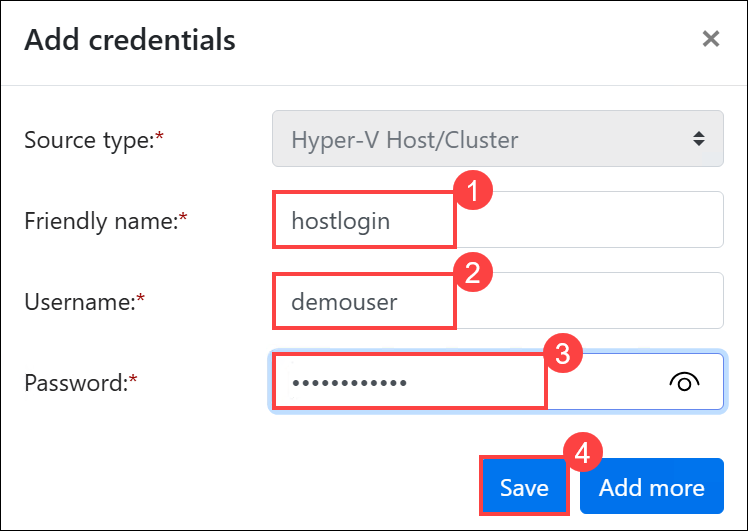

        > **Note**: The Azure Migrate appliance may not have picked up your local keyboard mapping. Select the 'eyeball' in the password box to check that the password was entered correctly.

1. In **Step 2: Provide Hyper-V host/cluster details**, click **Add discovery source** to specify the IP address or FQDN of the Hyper-V host/cluster
   
    

1. On the **Add discovery source** blade, provide the following details:
     
      - Select **Add single item (1)**
      - IP Address / FQDN:  Enter **HOSTVMS<inject key="DeploymentID" enableCopy="false" /> (2)** 
      - Map credentials: Select **hostlogin (3)** from the dropdown and 
      - Select **Save (4)**.

        

         > **Note:** You can either **Add single item** at a time or **Add multiple items** in one go. There is also an option to provide Hyper-V host/cluster details through **Import CSV**.

1. Once the discovery source is added, the appliance will validate the connection to the Hyper-V host/cluster. A **Validation successful** status will be displayed in the table next to the corresponding host or cluster.

    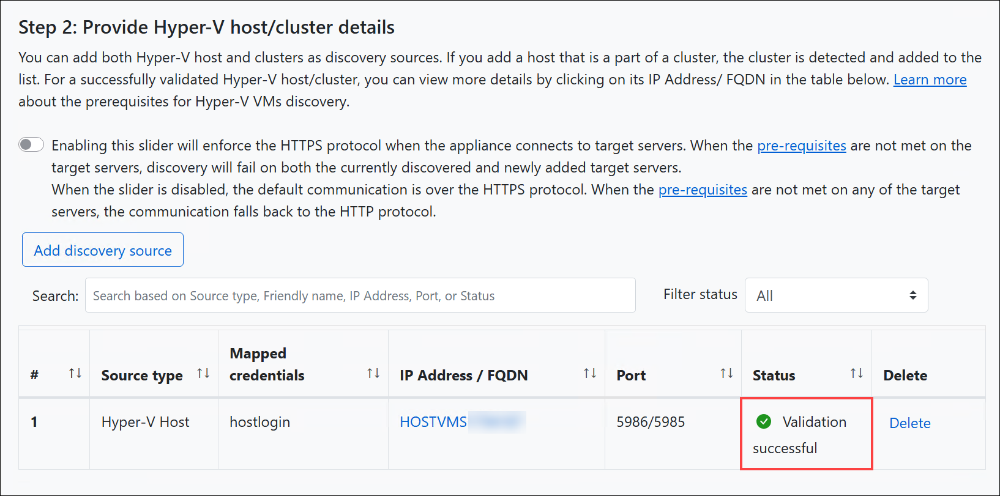

    > **Note:** When adding discovery sources:
    > - For successfully validated hosts/clusters, you can view more details by selecting their IP address/FQDN.
    > - If validation fails for a host, review the error by selecting Validation failed in the Status column of the table. Fix the issue and validate again.
    > - To remove hosts or clusters, select **Delete**.
    > - You can't remove a specific host from a cluster. You can only remove the entire cluster.
    > - You can add a cluster, even if there are issues with specific hosts in the cluster.

1. In **Step 3: Provide server credentials to perform guest discovery of installed software, dependencies and workloads**, **Disable** the slider, and then select **Start discovery**  to begin VM discovery from the validated Hyper-V hosts or clusters.

   >**Note:** The discovery process may take up to 10 minutes to complete
   
   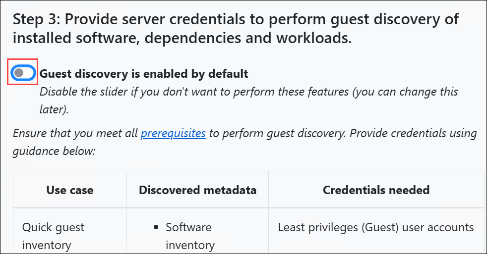
    
   

1. Wait for the Azure Migrate status to show that **Discovery has been successfully initiated**. This will take several minutes. After the discovery has been successfully initiated, you can check the discovery status against each host/cluster in the table. (Wait for the Azure Migrate status to display . Discovery has been successfully initiated. This may take several minutes. Once initiated, you can view the discovery status for each host or cluster in the table.)
  
    

1. Return to the **LabvmVM**, then navigate to the **Azure Migrate** page in the Azure portal. On the **SmartHotelMigration<inject key="DeploymentID" enableCopy="false" />** page scroll down. Then click on **Click here** to view details in the old experience.

     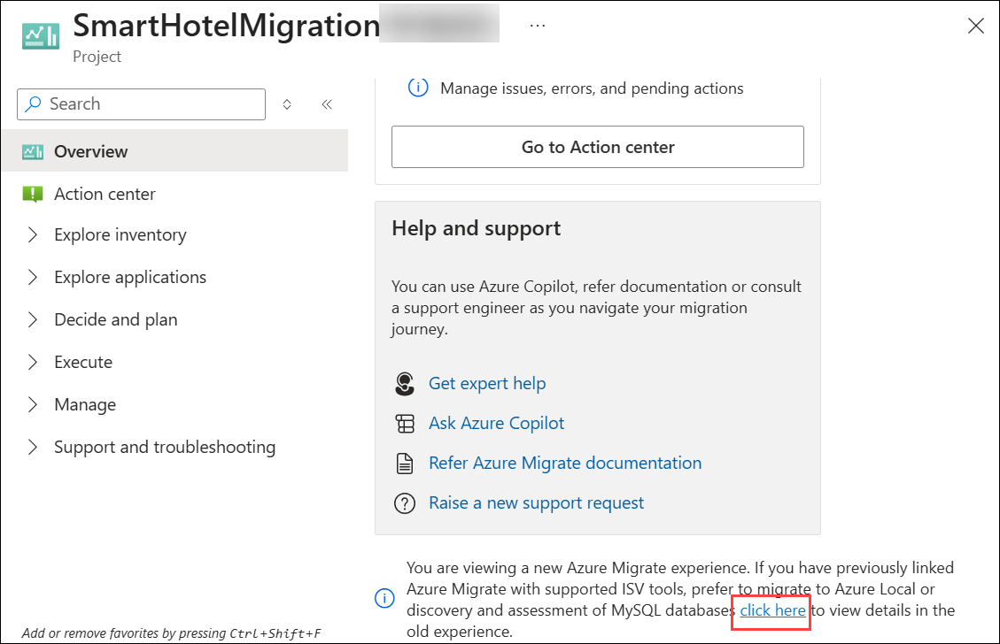

1. On the **SmartHotelMigration<inject key="DeploymentID" enableCopy="false" />** pageUnder Migration goals, select **Servers, databases and web apps (1)**, then click **Refresh (2)**. In the Azure Migrate: Discovery and assessment panel, you should see a count of **Discovered servers (3)**. If discovery is still in progress, continue clicking Refresh periodically until all 7 servers are shown. This may take several minutes.

    

    > **Note:** **Wait for the discovery process to complete before proceeding to the next Task**.

### Summary 

In this exercise, you explored an Azure Migrate project and the default built-in tools for server assessment and server migration. You have also configured the Azure Migrate appliance in the on-premises Hyper-V environment and started the migration assessment discovery process using Azure Migrate.

Click on **Next >>** from the lower right corner to move on to the next page.


