# HOL1: Exercise 2: Set up your Environment on Azure to Migrate Servers

### Estimated time: 40 Minutes

In this exercise, you'll assess the migration readiness of the SmartHotel application using Azure Migrate. First, you'll create an assessment for selected VMs, setting up and grouping them to generate a report that shows whether they're ready for migration to Azure.

Next, you'll configure dependency visualization by installing monitoring agents on the VMs. This will help you map out and understand the dependencies between different application parts, ensuring everything works properly before migrating to Azure.

## Lab objectives

In this exercise, you will complete the following tasks:

- Task 1: Create a migration assessment
- Task 2: Configure dependency visualization

### Task 1: Create a migration assessment

In this task, you will use Azure Migrate to create a migration assessment for the SmartHotel application, using the data gathered during the discovery phase.

1. On **Assessments tools**, under **Azure Migrate: Discovery and assessment**, click on **Assess** **(1)** and select **Azure VM** **(2)** from the dropdown to start a new migration assessment.

   

1.  On the **Basics** tab, ensure the **Assessment type** is set to **Azure VM** **(1)** and the **Discovery source** is **Servers discovered from Azure Migrate appliance** **(2)**. under **Assessment settings**, click on **Edit** **(3)**.

    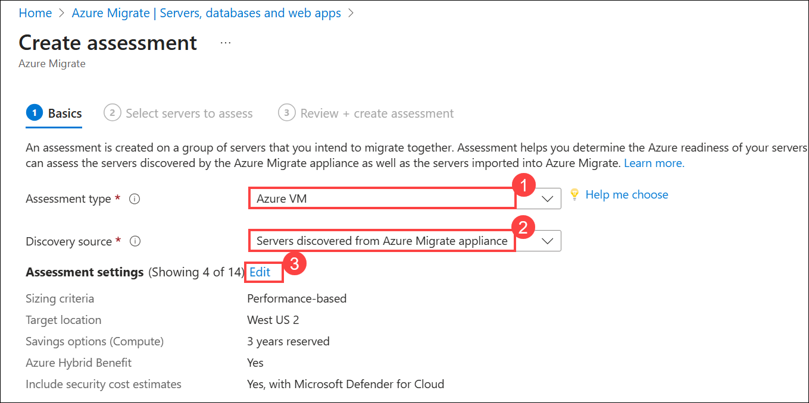

1. On the **Infrastructure settings** page, under **Target settings**, the **Assessment settings** blade allows you to tailor many settings used when making a migration assessment report. Take a few moments to explore the wide range of assessment properties. Hover over the information icons to view more details for each setting. Choose any settings you prefer, then click **Save** to apply them.

   > **Note**: You must make at least one change for the **Save** button to be enabled. If you don’t want to make any changes, simply close the blade.

     

1. Click on **Next: Select servers to assess >** to proceed to the next tab and On the **Select servers to assess** tab, enter the following:

     - **Assessment name**: `SmartHotelAssessment` **(1)**
     - Under **Select or create a group**, select **Create new** **(2)**
     - Enter **Group name** as **SmartHotel VMs** **(3)**.
     - From the **Appliance name** dropdown, select **SmartHotelAppl (Hyper-V)** **(4)**.
     - Select the **smarthotelweb1**, **smarthotelweb2**, **UbuntuWAF**, and **redhat** VMs **(5)**
     - Click on **Next: Review + create assessment >** **(6)** to continue.

         
  
         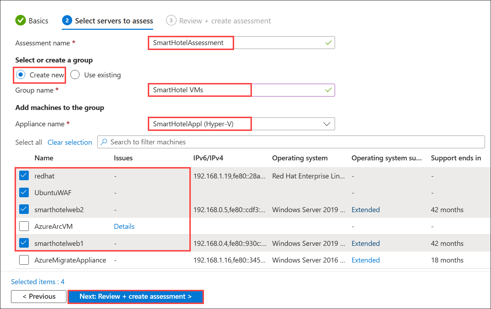
       
        > **Note**: There is no need to include the **smarthotelSQL1**, **AzureMigrateAppliance** and other VMs in the assessment, since they will not be migrated to Azure.
        
        > **Note**: Please note that even though we are adding **Redhat** VM to the assessment here, we will not be setting up our environment in Redhat VM in this exercise. Users will review the assessment and perform all the steps for environment setup in HOL2.
    
1. On the **Review + create assessment** tab, verify the configuration details and Click on **Create assessment** to create the assessment.

    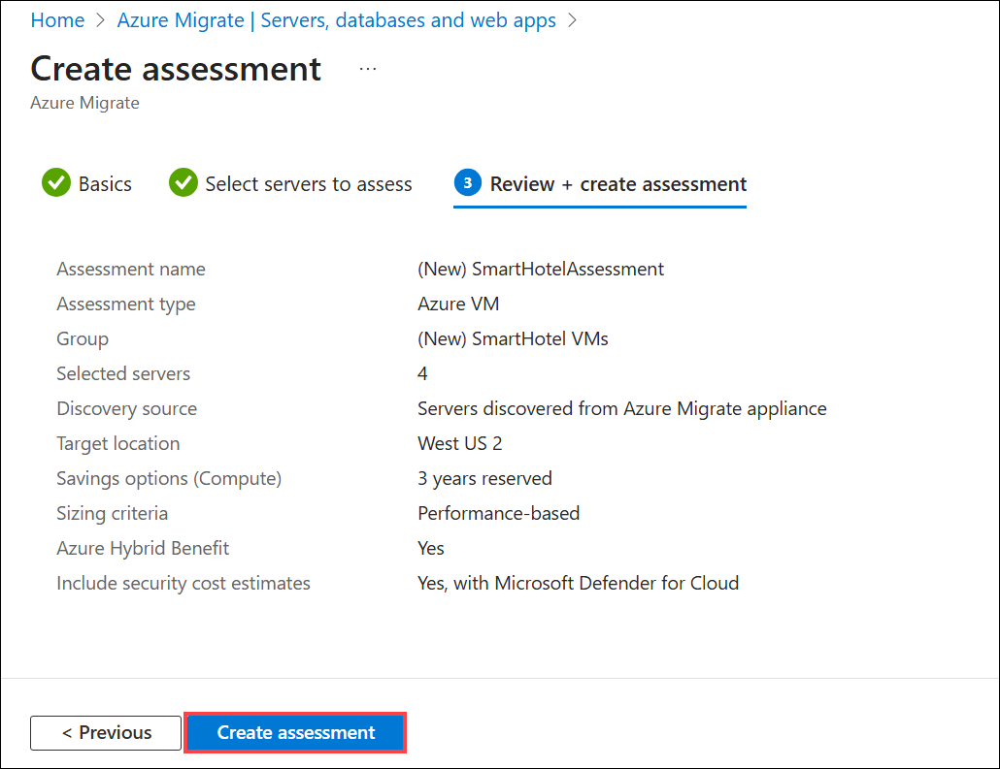

1. In Azure Migrate, on the **Servers, databases, and web apps** page, Expand **Migration goals** from the left navigation menu **(1)**. Select **Servers, databases and web apps** **(2)**. Click on **Refresh** periodically **(3)** until the number of assessments under **Assessments > Total** updates to **1** (This may take a few minutes). Once the count is updated, click on the number **1** next to **Total** under **Appliances** **(4)**. 

    ")
    
1. On the **Azure Migrate: Discovery and assessment** page. Expand the **Manage** section from the left pane **(1)**. Select **Assessments** to view the list of assessments **(2)**. Click on the **SmartHotelAssessment** entry to open the assessment details **(3)**.

    

     > **Congratulations** on completing the task! Now, it's time to validate it. Here are the steps:
     > - Hit the Inline Validate button for the corresponding task. If you receive a success message, you can proceed to the next task. 
     > - If not, carefully read the error message and retry the step, following the instructions in the lab guide.
     > - If you need any assistance, please contact us at cloudlabs-support@spektrasystems.com. We are available 24/7 to help.

     <validation step="b1bc5f5b-6e26-451d-883a-842902f61bdc" />

### Task 2: Configure dependency visualization

When migrating a workload to Azure, it is important to understand all workload dependencies. A broken dependency could mean that the application does not run properly in Azure, perhaps in hard-to-detect ways. Some dependencies, such as those between application tiers, are obvious. Other dependencies, such as DNS lookups, Kerberos ticket validation, or certificate revocation checks, are not.

In this task, you will configure the Azure Migrate dependency visualization feature. This requires you to first create a Log Analytics workspace and then deploy agents on the to-be-migrated VMs.

1. Return to the **Azure Migrate** blade in the Azure portal, Select **Servers, databases and web apps** **(1)** under **Migration goals** section. Under **Discovery and assessment**, click on the number next to **Groups** **(2)** to view the available groups.

   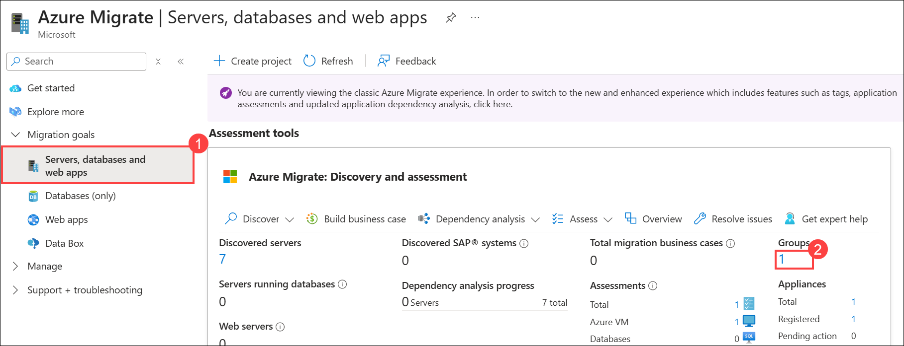

1. On the **Azure Migrate: Discovery and assessment** page, expand the **Manage** section **(1)** and select **Groups** **(2)**. Click on the **SmartHotel VMs** group to view its details **(3)**. 

    

1. In the **SmartHotel VMs** group details page. Note that each VM shows **Dependencies** status as **Requires agent installation**. Click on **Requires agent installation** for the **smarthotelweb1** VM to proceed with agent setup.

    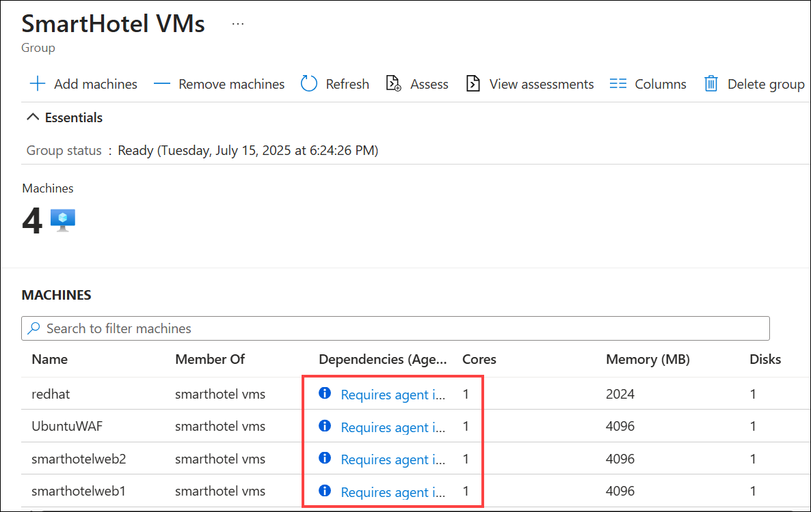

1. On the **Dependencies** tab, click on **Configure Log Analytics workspace**.

    

1. On the **Configure Log Analytics workspace** screen, provide the following and Click on **Configure** **(4)** to proceed.

   - **Log Analytics workspace**: Select **Create new** **(1)** and enter the name **AzureMigrateWS<inject key="DeploymentID" enableCopy="false" /> (2)**
   - **Log Analytics workspace location**: Select **East US (3)** from the dropdown. 

        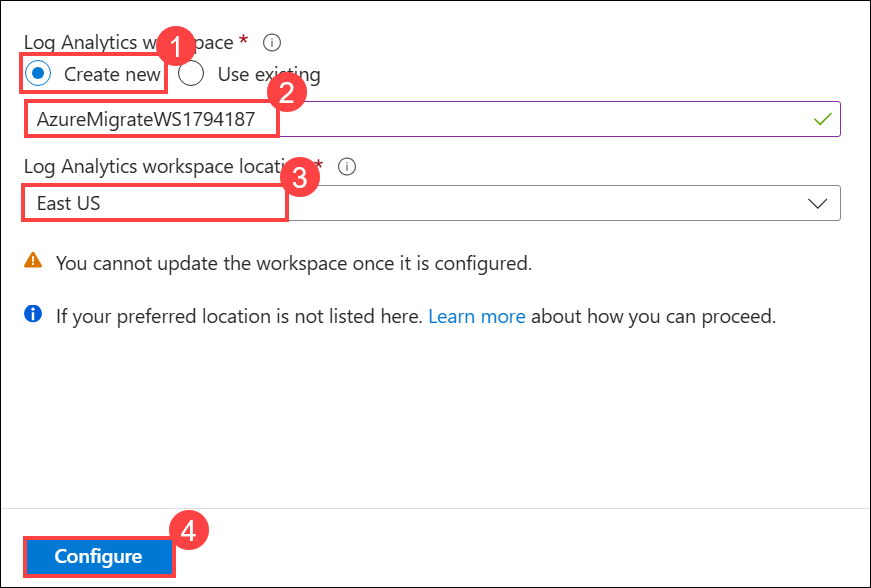

1. On the **Dependencies** page, navigate to **AzureMigrateWS<inject key="DeploymentID" enableCopy="false" />** by clicking on it.

    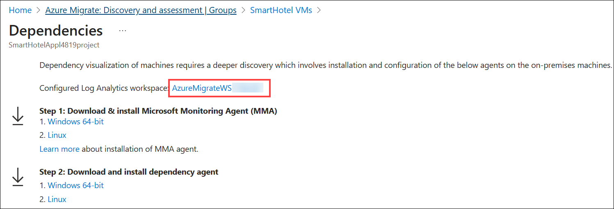

     > **Note**: If you don't see the workspace here. You can attempt to close and reopen the Workspace, or you can try refreshing the browser page. This may have been caused by a temporary error in the portal.

1. From the **Log Analytics workspace** screen: Select **Agents (1)** under **Settings** from the left-hand side menu and Expand the **Log analytics agent instructions** and make a note of the **Workspace ID (2)** and **Primary Key (3)**. You can copy them using the copy icon and paste them into Notepad for later use.

    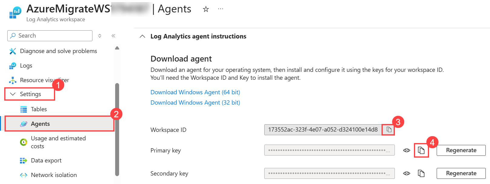

1. Return to the **Dependencies** screen in Azure Migrate. Then copy the download links for both agents (Windows 64-bit and Linux) and save them along with the Workspace ID and Primary Key noted earlier.
   
    

1. In the **Hyper-V Manager** console, from the list of virtual machines, select **smarthotelweb1** **(1)**. In the right-hand **Actions** pane, click **Connect** **(2)** to launch the VM console. 

    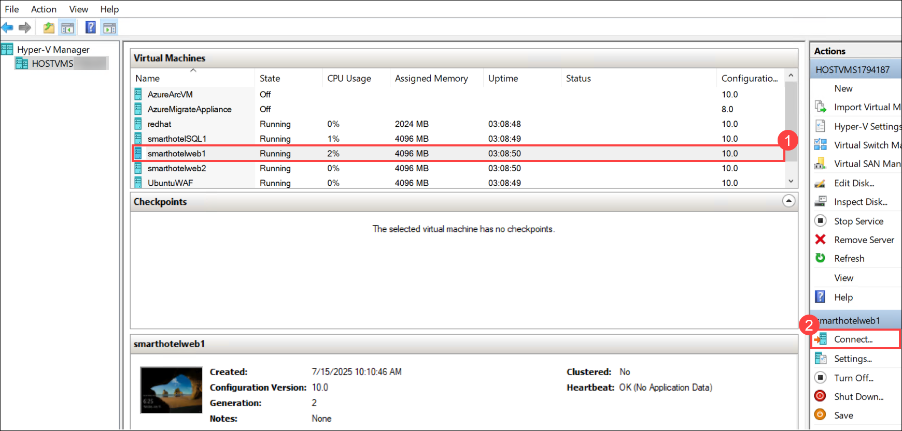

1. When the **Connect to smarthotelweb1** window appears, click **Connect** to continue. Log in to the **Administrator** account using the password **<inject key="SmartHotel Admin Password" />**.

    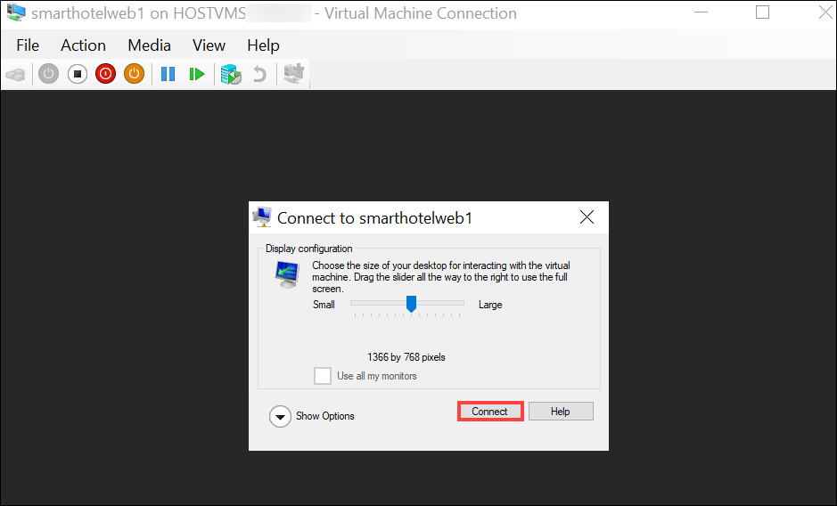

1. On the **smarthotelweb1** VM. Open **Internet Explorer** from the **Start** menu. Paste the link to the **64-bit Microsoft Monitoring Agent for Windows** that you saved earlier. Once the download completes, click **Run** when prompted to start the installer.

     > **Note**: You may need to disable **Internet Explorer Enhanced Security Configuration** on **Server Manager** under **Local Server** to complete the download. 

    

1. On the **Welcome to the Microsoft Monitoring Agent Setup Wizard** screen, select **Next**. 

    

1. On the **Microsoft Software License Terms** screen, select **I Agree**.

    

1. On the **Destination Folder** screen, leave everything as default and select **Next**. 

    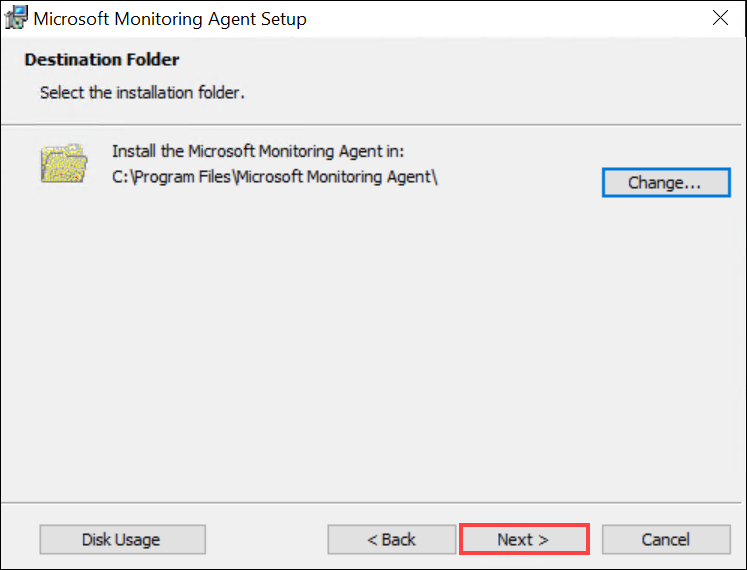 

1. On the **Agent Setup Options** screen, select **Connect the agent to Azure Log Analytics (OMS) (1)** and click **Next (2)**.

    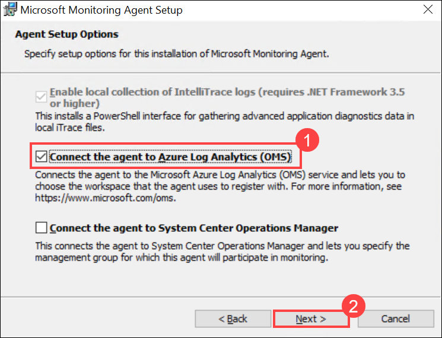 

1. On the **Azure Log Analytics** screen, enter the **Workspace ID** and **Workspace Key** **(1)** that you copied earlier and then select **Next (2)**.

    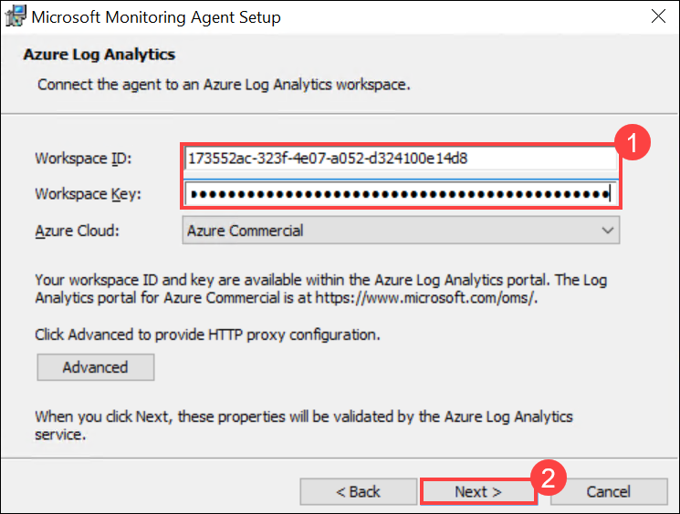

1. On the **Microsoft Update** screen, leave everything as default and select **Next**. 

    

1. On the **Ready to Install** screen, click on **Install**. 

    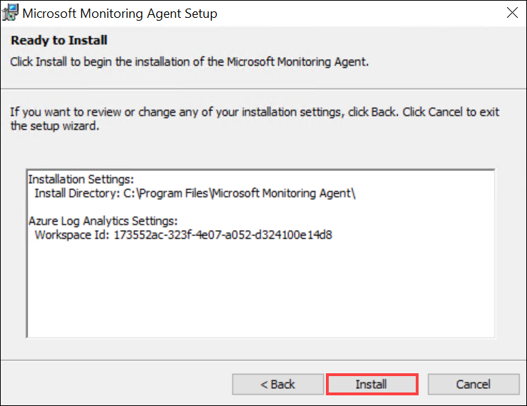

1. On the **Microsoft Monitoring Agent configuration completed successfully** screen, click **Finish** to complete the installation.

    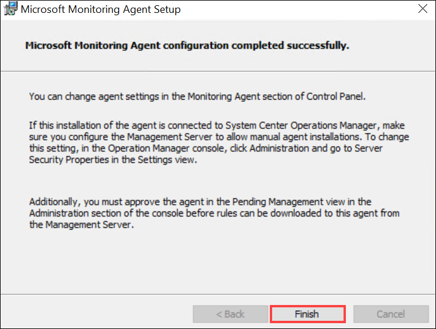

1. Open **Internet Explorer** and paste the link to the **Windows Dependency Agent** installer. When prompted, click **Save** to download the file. Once the download is complete, click **Run** to launch the installer.

    
    

1. On the **License Agreement** screen, select **I Agree** to accept the agreement and continue. 

     

1. On the **Completing Dependency Agent Setup** screen, select **Finish** to finish the installation process.

     

    > **Note**: You do not need to configure the workspace ID and key when installing the Dependency Agent, since it uses the same settings as the Microsoft Monitoring Agent, which must be installed beforehand.

1. Close the virtual machine connection window for the **smarthotelweb1 VM**. Connect to the **smarthotelweb2 VM** and repeat the installation process (steps 10-22) for both agents (the administrator password is the same as for smarthotelweb1). Close the virtual machine connection window for the **smarthotelweb2 VM** once the installation of agents is done.

1. On the **smarthotelweb1** VM desktop, double-click the **Command Prompt** shortcut to open a terminal window.

     
    
     > **Note**: The SmartHotelHost runs Windows Server 2019 with the Windows Subsystem for Linux enabled. This allows the command prompt to be used as an SSH client. More info on supported Linux on Azure can be found here: https://Azure.com/Linux. 

1. Enter the following command to connect to the **UbuntuWAF** VM running in Hyper-V on the SmartHotelHost:

    ```bash
    ssh demouser@192.168.0.8
    ```

1. Enter 'yes' when prompted whether to connect. Enter the password **<inject key="SmartHotel Admin Password" />**.

    

1. Enter the following command, followed by the password **<inject key="SmartHotel Admin Password" />** when prompted:
  
    ```
    sudo -s
    ```

    > This gives the terminal session elevated privileges.

1. Enter the following command, substituting **\<Workspace ID\> and \<Primary Key\>** with the values copied previously. Answer **Yes** when prompted to **Restart services during package upgrades without asking**.  

    ```
    wget https://raw.githubusercontent.com/Microsoft/OMS-Agent-for-Linux/master/installer/scripts/onboard_agent.sh && sh onboard_agent.sh -w <Workspace ID> -s <Primary Key>
    ```

    
    
    > **Note**: If you encounter any error related to the deprecation of the log analytics agent while executing the command above, you can ignore it and proceed.
    
     

    > **Note**: However, if you encounter any other errors other than the log analytics agent, run the command below to update the packages and then repeat **Step 28**.
     
     ```
     apt-get update
     ```

31. Enter the following command, substituting \<Workspace ID\> with the value copied earlier:

    ```s
    /opt/microsoft/omsagent/bin/service_control restart <Workspace ID>
    ```

    > **Note**: If you receive any error while running the above command, run the below command to update the rebuild the directory and perform **Step 29** again.
     
     ```
      sudo sh /opt/microsoft/omsagent/bin/omsadmin.sh -w <workspaceID> -s <workspaceKey>
     ```

1. Enter the following command. This downloads a script that will install the Dependency Agent.

    ```s
    wget --content-disposition https://aka.ms/dependencyagentlinux -O InstallDependencyAgent-Linux64.bin
    ```

1. Install the dependency agent by running the script downloaded in the previous step.

    ```s
    sh InstallDependencyAgent-Linux64.bin -s
    ```

    
    

1. Return to the **SmartHotel VMs** group in the **Azure Migrate** portal. Refresh the page using the **browser refresh button** (not the one in the portal UI). Verify that the **Dependency Agent** status for **smarthotelweb1**, **smarthotelweb2**, and **UbuntuWAF** shows as **Installed**. It may take up to **5 minutes** for the status to update after installation.

    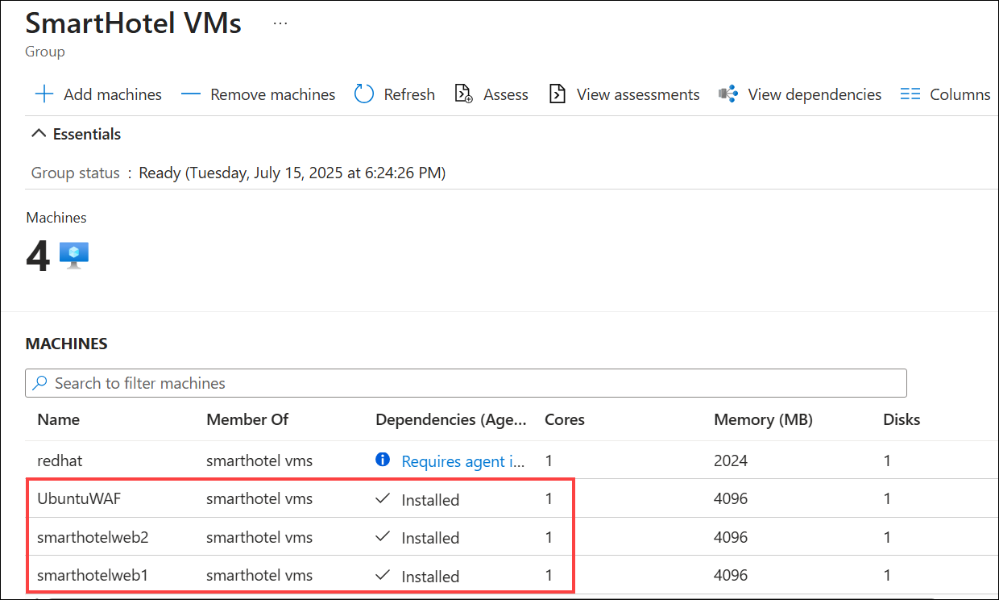
   
    **Note**: If you notice that the dependency agent status is showing as **Requires Agent Installation** instead of Installed even after installing dependency agents in all three VMs, please follow the steps from [here](https://github.com/CloudLabsAI-Azure/Know-Before-You-Go/blob/main/AIW-KBYG/AIW-Infrastructure-Migration.md#4-exercise1---task6---step1) to confirm dependency agent installation in VMs using Log Analytics workspace.
 
1. In the **SmartHotel VMs** group page, click **View dependencies** to open the dependency visualization.

    
   
1. Take a few minutes to explore the **Dependencies** view. Expand each server to show the processes running on that server. Select a process to see process information. See which connections each server makes.

    

     > **Congratulations** on completing the task! Now, it's time to validate it. Here are the steps:
     > - Hit the Inline Validate button for the corresponding task. If you receive a success message, you can proceed to the next task. 
     > - If not, carefully read the error message and retry the step, following the instructions in the lab guide.
     > - If you need any assistance, please contact us at cloudlabs-support@spektrasystems.com. We are available 24/7 to help.

     <validation step="76903306-f337-49dc-99b9-2e46e1c17fbe" />

### Summary 

In this exercise, you created and configured a migration assessment in Azure Migrate and its dependency visualization feature by creating a Log Analytics workspace and deploying the Azure Monitoring Agent and Dependency Agent on both Windows and Linux on-premises machines.

Click on **Next** from the lower right corner to move on to the next page.


