# HOL 1: Exercise 3: Migrating your applications and data by utilizing Microsoft services and tools, such as Azure Migrate: Server Migration

### Estimated duration: 60 Minutes

## Scenario

You are a Cloud Engineer at Contoso responsible for migrating the company’s on-premises application servers and workloads to Microsoft Azure. In this exercise, you will configure the Azure environment for migration, enable replication for virtual machines, and migrate Windows and Linux-based application servers using Azure Migrate: Server Migration. 

You will also validate networking and workload configurations to ensure a secure, reliable, and seamless transition of the SmartHotel application infrastructure to Azure.

## Overview

In this exercise, you will learn about Azure migration and how all pre-migration steps, such as discovery, assessments, and right-sizing of on-premises resources, are included for infrastructure, data, and applications. Azure Migrate provides a simplified migration, modernization, and optimization service for Azure.

## Objectives

In this exercise, you will complete the following tasks:

- Task 1: Register the Hyper-V Host with Migration and modernization
- Task 2: Enable Replication from Hyper-V to Azure Migrate
- Task 3: Configure Networking
- Task 4: Run a Test Migration
- Task 5: Server migration

## Task 1: Register the Hyper-V Host with Migration and modernization

In this task, you will register the Hyper-V host (LabVM) with the Azure Migrate: Server Migration service using Azure Site Recovery for migration.

1. Select **Migrations (1)** under Execute, then click on **Start migration (2)**.

     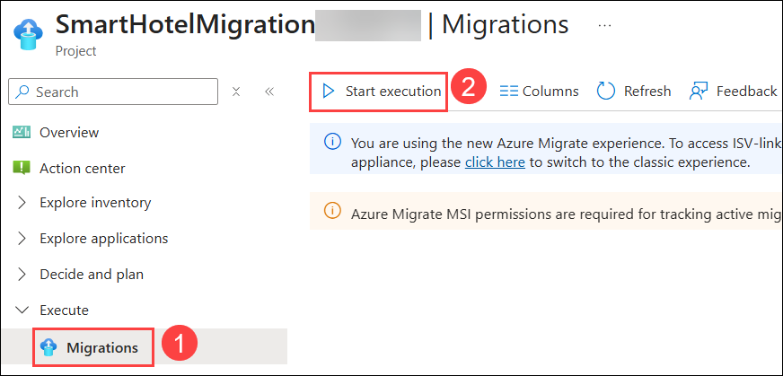

1. On the Specify intent panel, provide the following details:

    - What do you want to migrate to? : Select Servers or Virtual Machines(VM) (1) from the dropdown.

    - Where do you want to migrate to?: Select Azure VM (2) from the dropdown.

    - How will you select workload?: Select From all inventory (3) from the dropdown.

    - Discovery method: Select MigrateAppl(HyperV) (4) from the dropdown.
    
    - A notification will appear indicating that No Hyper-V hosts are registered for this project. This is expected, as no Hyper-V host has been configured yet. To begin the registration process, select Click here to set up (5) and proceed with the required configuration steps.

        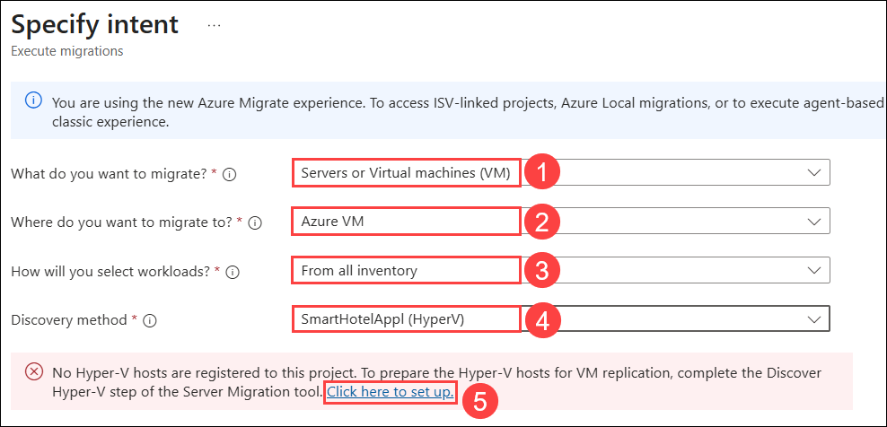

1. On the **Discover** pane, keep the default settings. Select the checkbox to confirm that the target region for migration is **<inject key="Region"></inject> (1)**, and then click **Create resources (2)** to deploy the required Azure Site Recovery resources.

    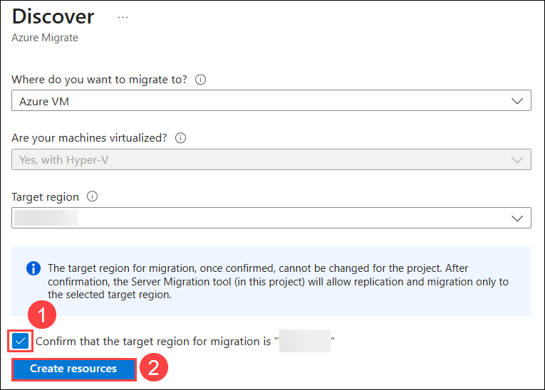

     > **Note:** Once deployment is complete, the 'Discover machines' panel should be updated with additional instructions.
  
1. On the **Discover** pane, under **Prepare Hyper-V host servers**, click the **Download** link to download the **Azure Site Recovery Provider** installer.

    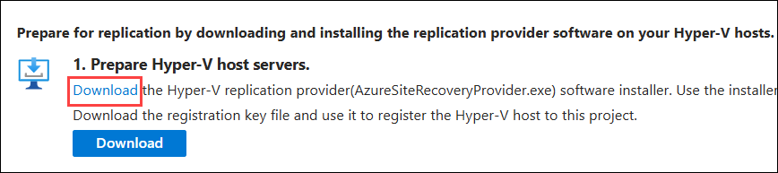

1. Return to the **Discover** page and click the blue **Download** button to download the **registration key file**.

    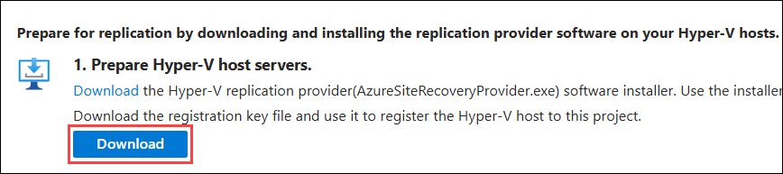

1. Open the **AzureSiteRecoveryProvider.exe** installer you downloaded a moment ago. On the **Microsoft Update** tab, select **Off (1)** and click on **Next (2)**. On the **Installation** screen, accept the default installation location and click **Install (3)** to begin installation.

    

    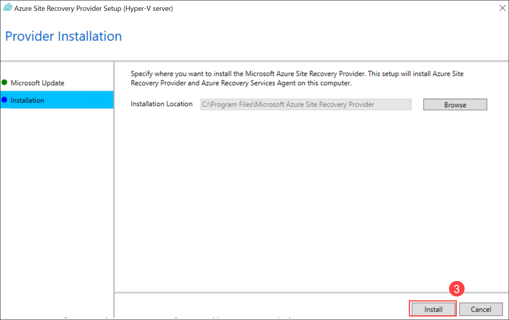

    > **Note:** If you are prompted with a pop-up, like the latest version of the Provider is installed on this server. Would you like to proceed to registration? select **Yes**. (You can directly jump to the next step in that case.)

1. When the installation has completed, on the **Installation** pane, click on **Register (1)**. On the **Vault Settings** page, select **Browse (2)**, navigate to the Downloads folder, choose the key file, and select Open. Once the key file is loaded, select **Next (3)** to continue.

   
   
   

1. On the **Proxy Settings** pane, select **Connect directly to Azure Site Recovery without a proxy server (1)**, then click **Next (2)** to proceed. This will initiate the registration of the Hyper-V host with Azure Site Recovery.

    

1.  On the **Registration** pane, wait for the message **The server was registered in the Azure Site Recovery vault** to appear. Once registration is complete, select **Finish** to close the wizard.

    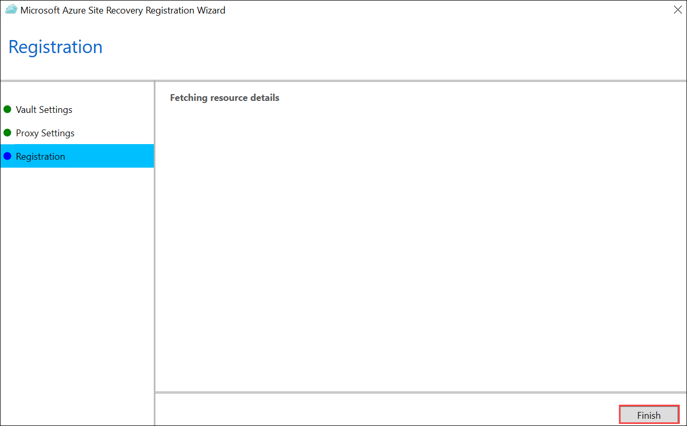

    >**Note:** The registration may take about 2-3 minutes to complete.

1. Return to the **Discover** browser window. Click **Refresh**, and once the registration status is updated, select **Finalize registration**.

    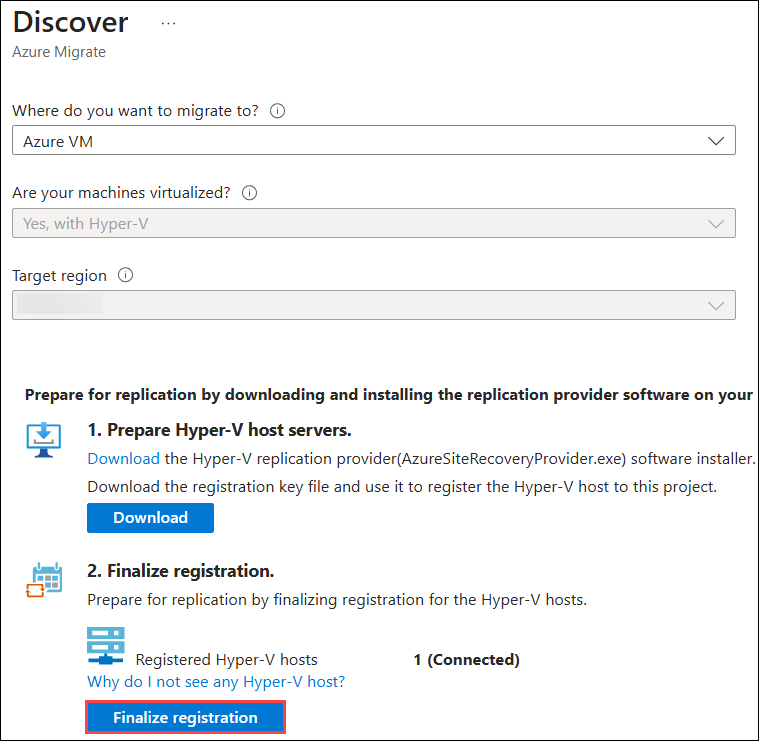

1. Azure Migrate will now complete the registration with the Hyper-V host. **Wait** for the registration to complete. This may take 10-15 minutes.

    

1. Once registration is complete, verify that the registration status displays **Registration finalized**. Then, click **Close (1)** to return to the Azure Migrate project.

    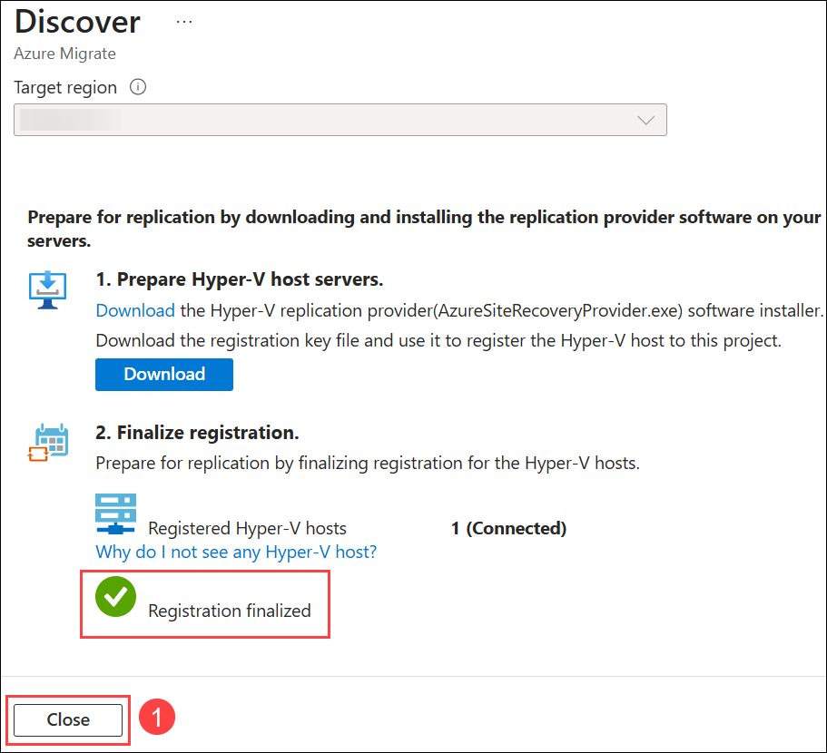

     > **Congratulations** on completing the task! Now, it's time to validate it. Here are the steps:
     > - Hit the Inline Validate button for the corresponding task. If you receive a success message, you can proceed to the next task. 
     > - If not, carefully read the error message and retry the step, following the instructions in the lab guide.
     > - If you need any assistance, please contact us at cloudlabs-support@spektrasystems.com. We are available 24/7 to help.

     <validation step="2eb6b36f-a031-40f0-8bad-a1748a3c532a" />

### Task 2: Enable Replication from Hyper-V to Azure Migrate

In this task, you will configure and enable the replication of your on-premises virtual machines from Hyper-V to the Azure Migrate Server Migration service.

1. Search for **Azure Migrate (1)** and select it **Azure Migrate (2)** from the search results.

    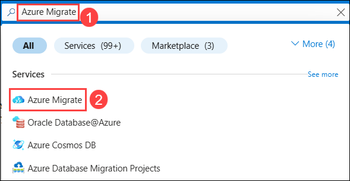

1. On Azure Migrate page, click on **All projects (1)** and click on the **SmartHotelMigration<inject key="DeploymentID" enableCopy="false" /> (2)**.

    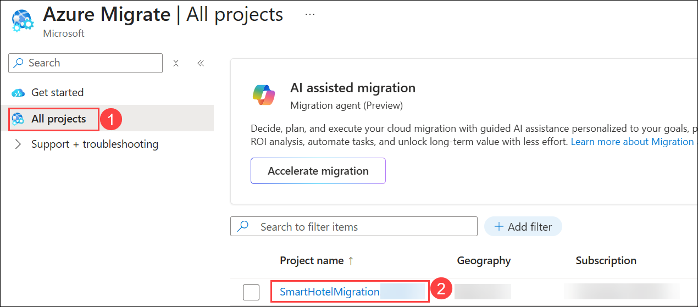

1. Select **Migrations (1)** under Execute, then click on **Start execution (2)**. 

     
   
1. On the Specify intent panel, provide the following details, then click on **Continue (5)**.

    - What do you want to migrate to? : Select **Servers or Virtual Machines(VM) (1)** from the dropdown.

    - Where do you want to migrate to?: Select **Azure VM (2)** from the dropdown.

    - How will you select workload?: Select **From all inventory (3)** from the dropdown.

    - Discovery method: Select **SmartHotelAppl(HyperV) (4)** from the dropdown.

       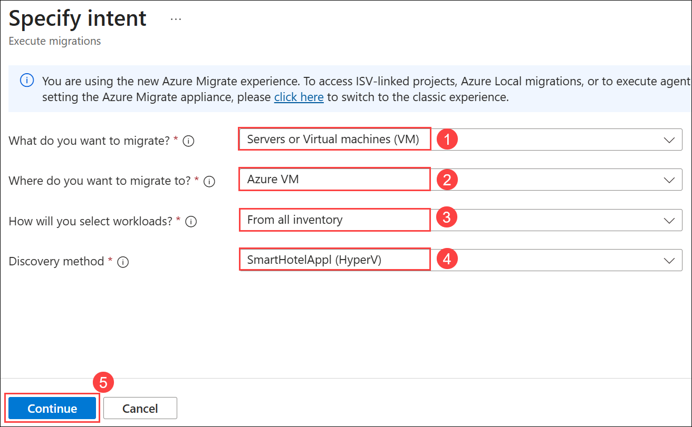

1. In the Workloads tab, select **smarthotelweb1**, **smarthotelweb2**, and **UbuntuWAF** virtual machines **(1)**, then select **Next (2)**.

    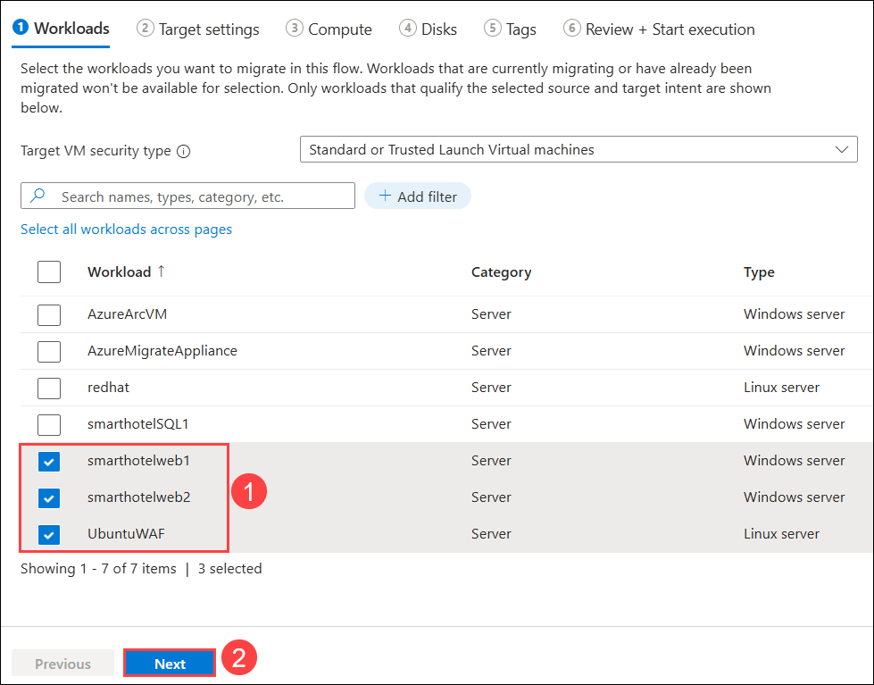

1. On the **Target settings** tab, configure the following settings. Select **Next (6)** to continue.

    - Keep the default values for **Region** and **Subscription**.
    - **Resource group**: Select the existing **SmartHotelHostRG (1)**.
    - **Cache storage account**: Select **Auto-create (default) (2)**. If the **Cache storage account** option is not displayed, wait for **5 minutes**, refresh the browser, and then check again. It may take a few minutes for this option to become available after the required resources are created.
    - **Virtual network**: Select **SmartHotelVNet (3)**.
    - **Subnet**: Select **SmartHotel (4)**.
    - **Availability options**: Select **No infrastructure redundancy required (5)**.

        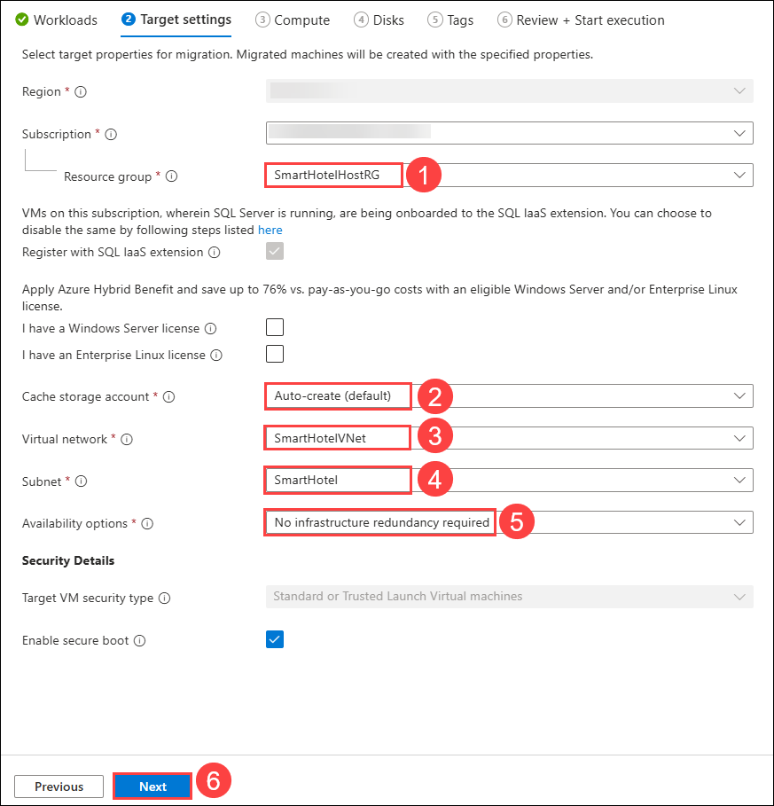

        > **Note:** For simplicity, in this lab, you will not configure the migrated VMs for high availability, since each application tier is implemented using a single VM.

1. On the **Compute** tab, configure the following settings for each virtual machine:

   - Set the **Azure VM size** to **Standard_F2s_v2** for all virtual machines **(1)**.
   - Set the **OS type** to **Windows** for **smarthotelweb1** and **smarthotelweb2**, and **Linux** for **UbuntuWAF** **(2)**.
   - Set the **Operating system** to **Windows Server 2019** for **smarthotelweb1** and **smarthotelweb2**, and **Red Hat Enterprise Linux 7** for **UbuntuWAF** **(3)**.
   - Click **Next** to continue.

     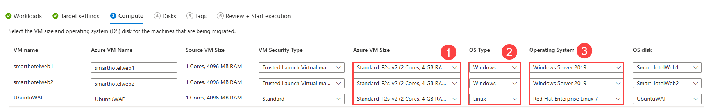
    
1. In the **Disks** tab, review the settings but do not make any changes. Select **Next** , then select **Next** in the **Tags** tab. 

    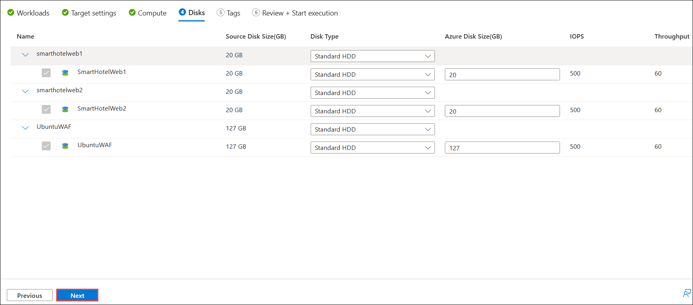

1. On the **Review + Start execution** tab, verify the replication settings for the selected virtual machines. After confirming the configuration, click **Execute migration** to start the replication process.

    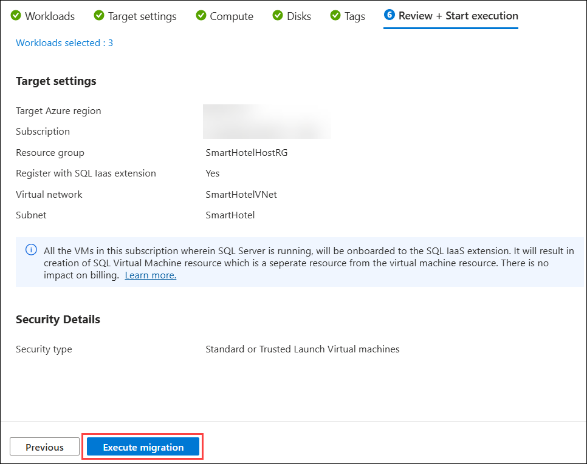

1. In the Azure Migrate project, under **Execute**, select **Migrations (1)**. On the **Migrations** page, verify that the selected workloads are listed with the **Execution stage** as **Testing** This will take 15-20 minutes.

    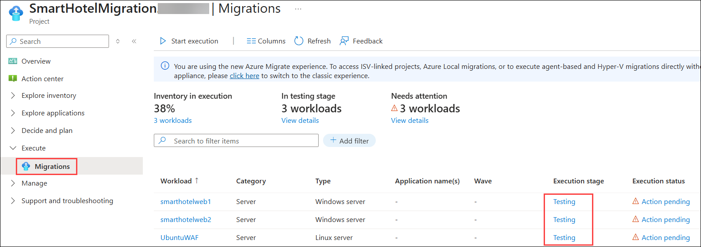
    
1. Under **Manage**, select **Jobs** to view the detailed status of the migration jobs. The **Jobs** page displays the progress and status of each migration operation performed by Azure Migrate. Verify that the **Enable replication** and **Finalize protection** jobs for the selected virtual machines have completed successfully.

    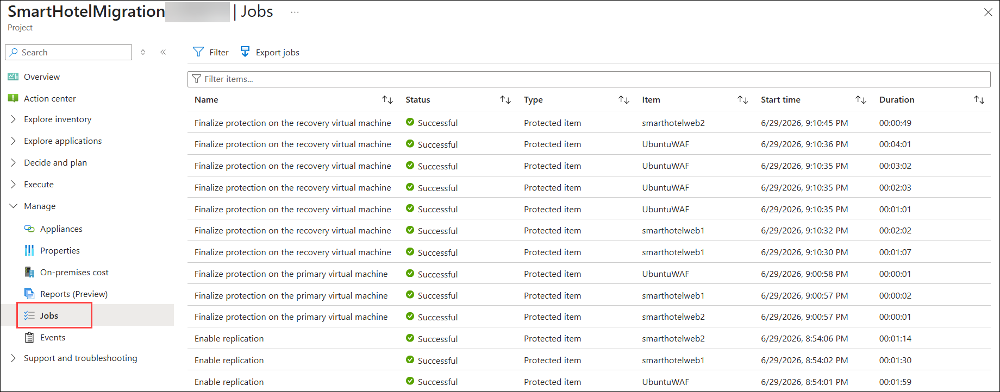

    > **Note**: Please make sure you run the **validation steps** for this task before moving to the next tasks, as there are a few dependencies. **Not** running the validation after performing this task will result in **validation failure** as the status of the Virtual Machine will be changed from **Protected** to **Planned failover** when you migrate the servers in Task 5.

     > **Congratulations** on completing the task! Now, it's time to validate it. Here are the steps:
     > - Hit the Inline Validate button for the corresponding task. If you receive a success message, you can proceed to the next task. 
     > - If not, carefully read the error message and retry the step, following the instructions in the lab guide.
     > - If you need any assistance, please contact us at cloudlabs-support@spektrasystems.com. We are available 24/7 to help.

     <validation step="b38db9a2-1678-47a6-a053-c863b83f8ada" />

### Task 3: Configure Networking

In this task, you will modify the settings for each replicated VM to use a static private IP address that matches the on-premises IP addresses for that machine.

1. Navigate back to **Execute**, select **Migrations (1)**. On the **Migrations** page, select **smarthotelweb1 (2)** to view its migration details, including the **Preparation**, **Testing**, and **Completion** stages. After reviewing the information, click **Go to execution details (3)**.

    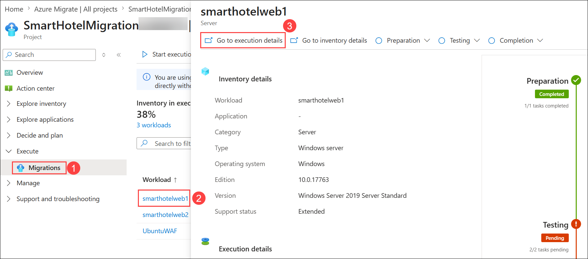

1. A new browser tab will open. On the workload details page, under **General**, select **Compute and Network (1)** to review the target Azure virtual machine configuration. Verify that the **Size** under the **Microsoft Azure** column is set to **F2s_v2 (2)**.

    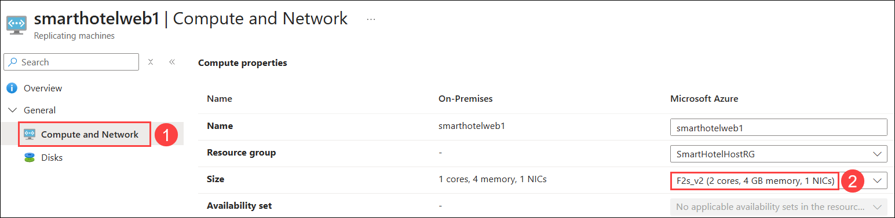

1. In the **Compute and Network** section, scroll down to the **Network interfaces** section. Select the **Edit** (✏️) icon next to the network interface.
    
    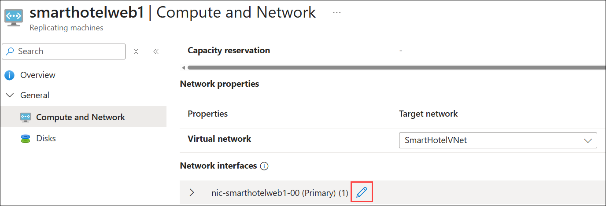

1. On the **Network interface** page, under the **Target** column, configure the following settings:

   - Set **IP address type** to **Static (1)**.
   - Set **Private IP address** to **192.168.0.4 (2)**.
   - Click **Apply (3)** to save the changes.

       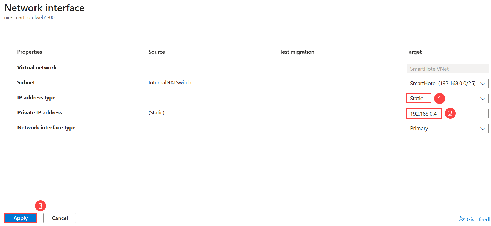

1. You will be redirected to the **Compute and Network** page. Verify that the network interface has been updated with the configured settings, and then click **Save** to save the compute and network configuration.

    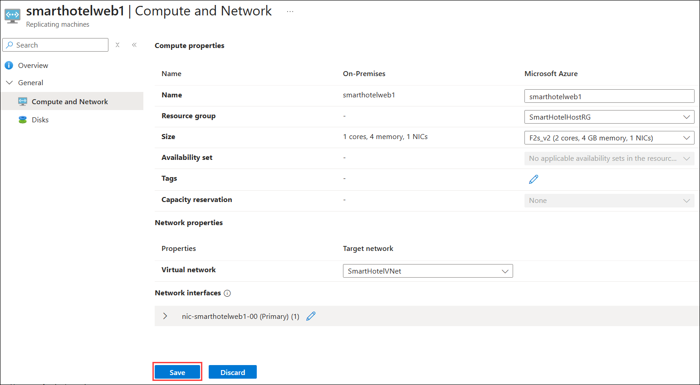

1. Repeat these steps to configure the private IP address for the other VMs.
 
   - For **smarthotelweb2** use private IP address **192.168.0.5**
  
   - For **UbuntuWAF** use private IP address **192.168.0.8**

> **Note**: Azure Migrate makes a "best guess" at the VM settings, but you have full control over the settings of migrated items. In this case, setting a static private IP address ensures the virtual machines in Azure retain the same IPs they had on-premises, which avoids having to reconfigure the VMs during migration (for example, by editing web.config files).

### Task 4: Run a Test Migration

In this task, you will run a test migration for the virtual machines after delta replication begins and before performing the final migration to Azure. It is highly recommended that you perform a test migration at least once for each machine before migrating it.

1. Under **Execute**, select **Migrations**. On the **Migrations** page, select **smarthotelweb1 (1)**. On the workload details page, expand **Testing (2)** and select **Start test migration (3)** to begin a test migration of the replicated virtual machine.

    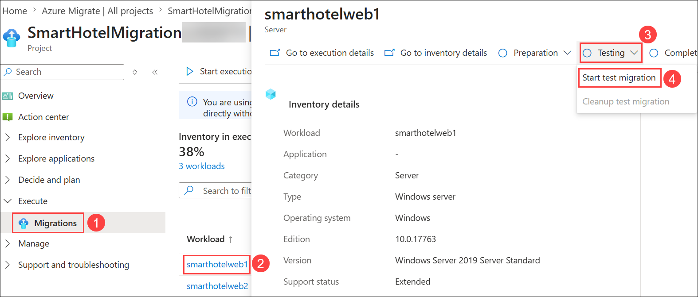

1. On the **Test migration** page, select **SmartHotelVNet (1)** from the **Virtual network** dropdown, and then click **Test migration (2)** to start the test migration.

    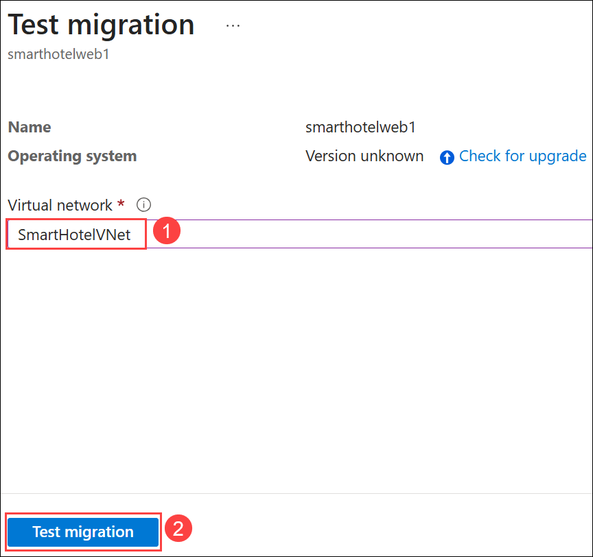

1. To monitor the test migration progress, under **Manage**, select **Jobs (1)**. Verify that the **Test failover** job displays the **Status** as **In progress (2)**. You can select the **Test failover** job to view additional details, including the sub-jobs and their current status. The test migration may take a few minutes to complete. Refresh the page periodically until the job status changes to **Successful** before proceeding to the next step.

    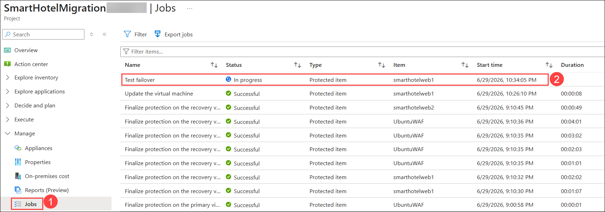

1. After the test migration completes, clean up the test migration resources to remove the temporary test virtual machine before proceeding with the actual migration. Under **Execute**, select **Migrations (1)**. On the **Migrations** page, select **smarthotelweb1 (2)**, expand **Testing (3)**, and then select **Clean up test migration (4)**.

    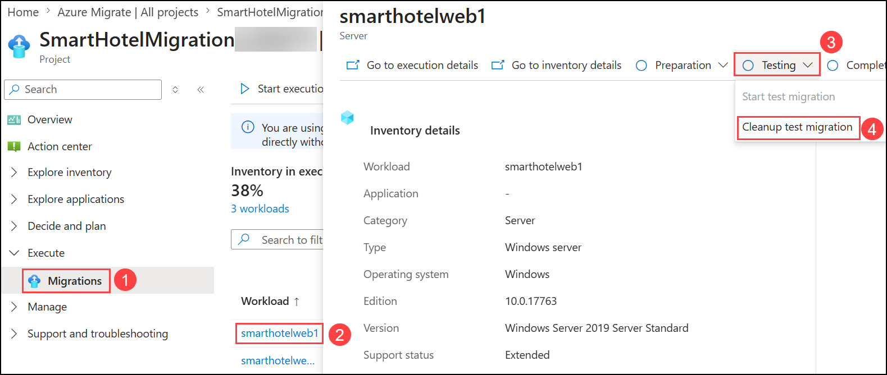

1. On the **Test migrate cleanup** page, enter any note in the **Notes (1)** field, select **Testing is complete. Delete test virtual machine (2)**, and then click **Cleanup test (3)** to remove the test migration resources.

    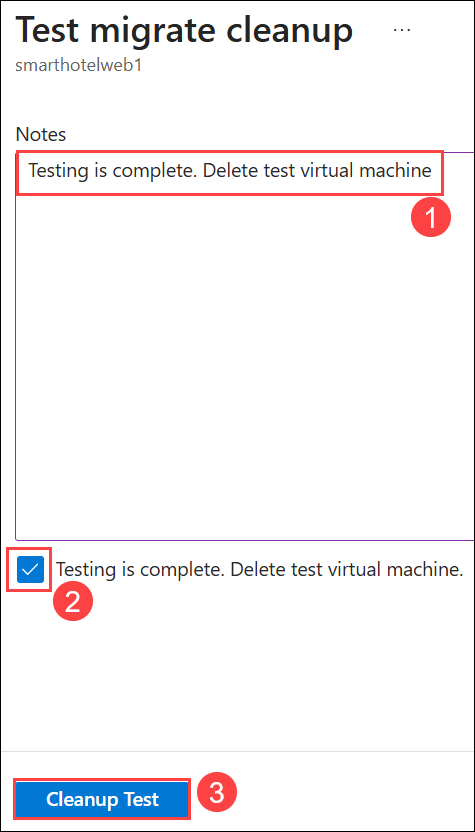

1. Under **Manage**, select **Jobs (1)** to monitor the cleanup progress. Verify that the **Test failover cleanup** job is **In progress**. You can select the job to view additional details, including the sub-jobs and their current status. Refresh the page periodically until the **Test failover cleanup** job displays the **Status** as **Successful (2)** before proceeding to the next task.

    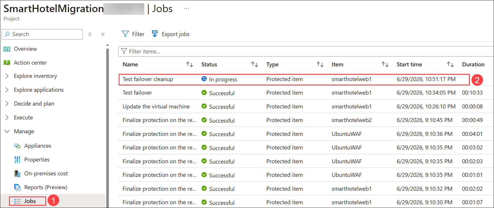

1. Repeat the test migration and test migration cleanup steps for the **smarthotelweb2** and **UbuntuWAF** virtual machines.

### Task 5: Server migration

In this task, you will perform a migration of the UbuntuWAF, smarthotelweb1, and smarthotelweb2 machines to Azure.

1. Under **Execute**, select **Migrations (1)**. On the **Migrations** page, select **smarthotelweb1 (2)**. On the workload details page, expand **Completion (3)** and select **Migrate (4)** to begin the final migration of the replicated virtual machine to Azure.

    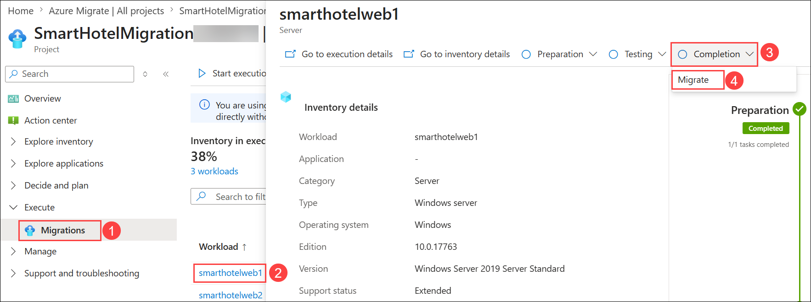

1. On the **Migrate** page, keep the default settings. Ensure **Shutdown virtual machines and perform a planned migration with no data loss?** is set to **Yes** and **Capacity Reservation** is set to **None**. Then, click **Migrate** to start the migration.

   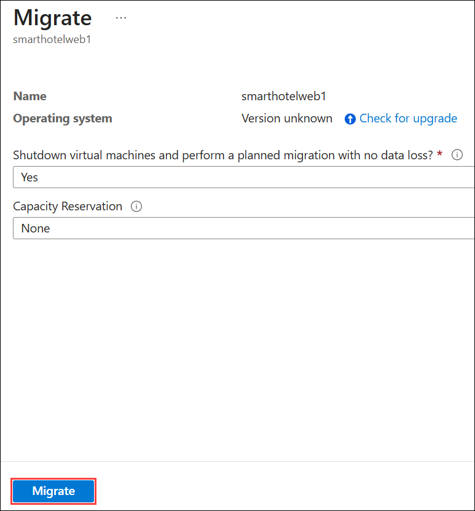

    > **Note**: You can optionally choose whether the on-premises virtual machines should be automatically shut down before migration to minimize data loss. Either setting will work for this lab.

1. Repeat the migration steps for the **smarthotelweb2** and **UbuntuWAF*** virtual machines.
   
1. To monitor the migration progress, navigate to **Manage** and select **Jobs (1)**. Verify that the **Planned failover** job is in the **In progress** state. The migration process may take up to **15 minutes** to complete. Refresh the page periodically until the job status changes to **Successful** before proceeding to the next step. You can also select the **Planned failover** job to view detailed information about the migration and its sub-tasks.

    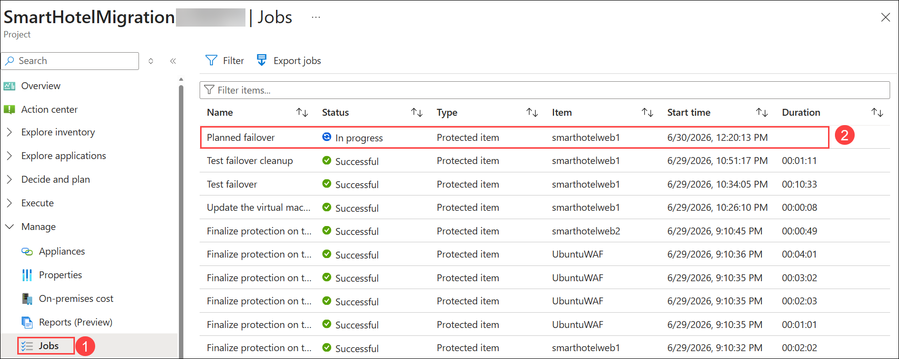

1. Navigate to the resource group, on the **Resource group** page, select the **SmartHotelHostRG** resource group. and check that the VM, network interface, and disk resources have been created for each of the virtual machines being migrated.

    
   
1. On the **SmartHotelHostRG** resource group, verify that the VM, network interface, and disk resources have been created for each migrated virtual machine.

   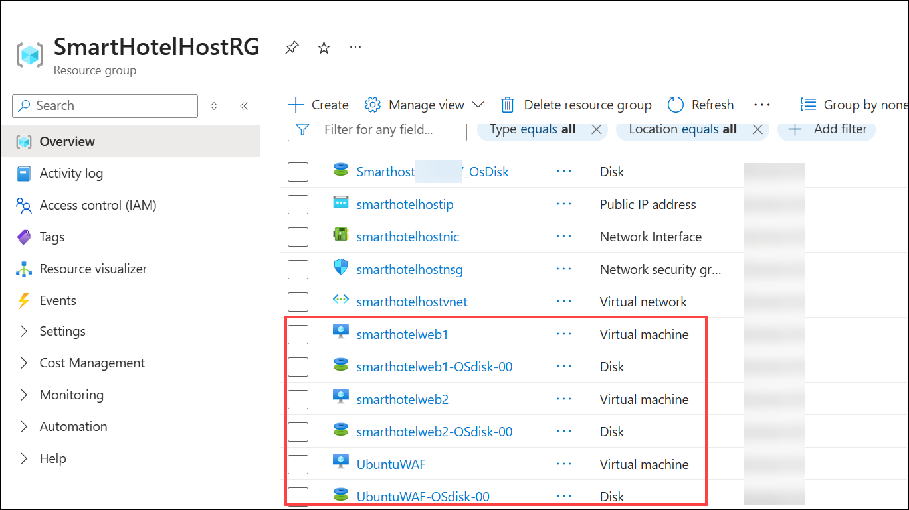

     > **Congratulations** on completing the task! Now, it's time to validate it. Here are the steps:
     > - Hit the Inline Validate button for the corresponding task. If you receive a success message, you can proceed to the next task. 
     > - If not, carefully read the error message and retry the step, following the instructions in the lab guide.
     > - If you need any assistance, please contact us at cloudlabs-support@spektrasystems.com. We are available 24/7 to help.

     <validation step="db5d197a-151d-4987-8011-9568dc93e642" />

## Summary 

In this exercise, you created a new Azure Storage Account that was used for Migration and modernization. You registered your Hyper-V host with the Azure Migrate Server Migration service. You enabled replication of your on-premises virtual machines from Hyper-V to the Azure Migrate Server Migration service. You configured networking for the replicated VMs to use static private IP addresses. Finally, you performed the migration of the virtual machines to Azure.

Click on **Next** from the lower right corner to move on to the next page.

