# HOL1: Exercise 3: Migrating your applications and data by utilizing Microsoft services and tools, such as Azure Migrate: Server Migration

### Estimated time: 60 Minutes

In this exercise, you will learn about Azure migration and how all pre-migration steps, such as discovery, assessments, and right-sizing of on-premises resources, are included for infrastructure, data, and applications. Azure Migrate provides a simplified migration, modernization, and optimization service for Azure.

## Lab objectives

In this exercise, you will complete the following tasks:

- Task 1: Create a Storage Account
- Task 2: Register the Hyper-V Host with Migration and modernization
- Task 3: Enable Replication from Hyper-V to Azure Migrate
- Task 4: Configure Networking
- Task 5: Server migration

## Task 1: Create a Storage Account

In this task, you will create a new Azure Storage Account that will be used by Migration and for the storage of your virtual machine data during migration.

> **Note:** This lab focuses on the technical tools for workload migration, but in real-world scenarios, a comprehensive long-term plan is needed. Considerations for the landing zone should include network traffic, access control, resource organization, and governance. The CAF Migration and Foundation Blueprints can help deploy a pre-defined landing zone using Infrastructure as Code (IaC) for resource management. For more details, refer to [Azure Landing Zones](https://docs.microsoft.com/azure/cloud-adoption-framework/ready/landing-zone/) and the [Cloud Adoption Framework Azure Migration landing zone Blueprint sample](https://docs.microsoft.com/azure/governance/blueprints/samples/caf-migrate-landing-zone/).

1. In the Azure portal, in the search bar at the top, type **Storage account** **(1)** and select **Storage accounts** **(2)** from the Services list.

   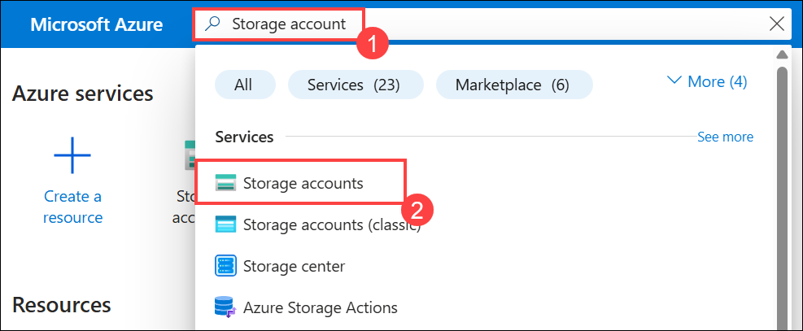
 
1. On the **Storage accounts** page, click **Create** **(1)** to start creating a new storage account.

   

1. In the **Create a storage account** page , on the **Basics** tab, enter the following values:

   - Subscription: **Select your Azure subscription (1)**.
  
   - Resource group: **AzureMigrateRG (2)**
  
   - Storage account name: **migrationstorage<inject key="DeploymentID" enableCopy="false" /> (3)**

   - Region: Select **<inject key="Region" enableCopy="false" /> (4)** from the dropdown.

   - Primary Service: **Azure Blob Storage or Azure Data Lake Storage Gen 2 (5)**

   - Performance: **Standard (6)**
  
   - Redundancy: **Locally-redundant storage (LRS) (7)**

   - Click **Review + create** to continue **(8)**

     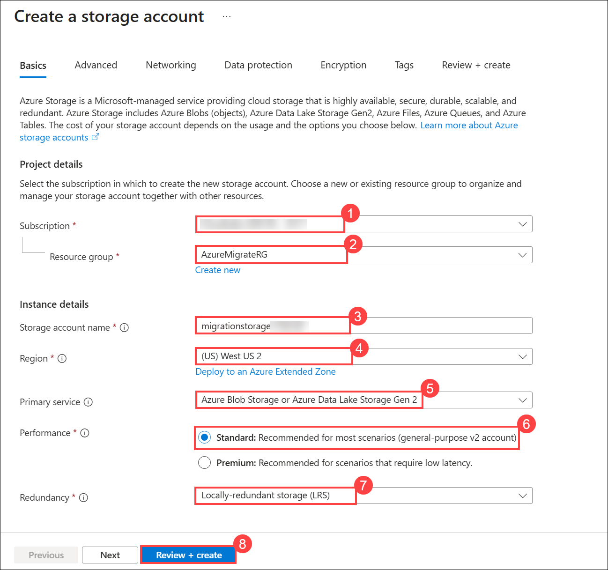

1. On the **Review + create** tab, verify the entered details. Click **Create** to deploy the storage account.

    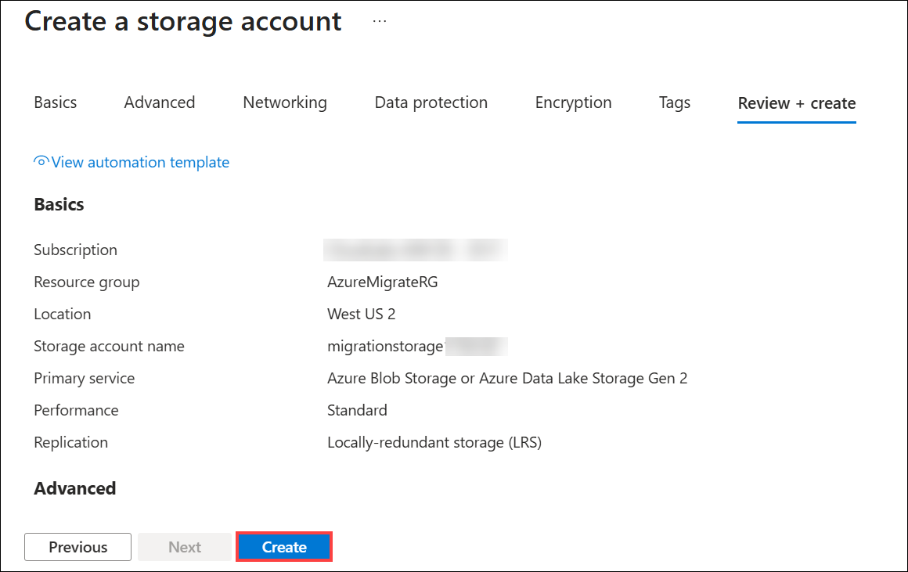

1. Once the storage account is successfully deployed, select **Go to resource** to open the newly created storage account.

    

1. On the **Storage account** page, under **Data management (1)**, select **Data protection (2)** from the left-hand menu and then under the **Recovery** section, **uncheck** the boxes for **Enable soft delete for blobs (3)** and **Enable soft delete for containers (4)**, then click on **Save (5)**.
   
   

#### Task summary 

In this task, you created a new Azure Storage Account that will be used for Migration and modernization.

## Task 2: Register the Hyper-V Host with Migration and modernization

In this task, you will register your Hyper-V host(LabVM) with the Migration and Modernization service. This service uses Azure Site Recovery as the underlying migration engine. As part of the registration process, you will deploy the Azure Site Recovery Provider on your Hyper-V host.

1. On the  **Azure Migrate | Servers, databases and web apps** page, expand **Migration goals (1)** from the left menu, then select **Servers, databases and web apps (2)**. Under **Migration tools**, click **Discover (3)**.

   >**Note:** You may need to add the migration tool yourself by following the link below the **Migration Tools** section, selecting **Migration and modernization**, then selecting **Add tool(s)**.
   
     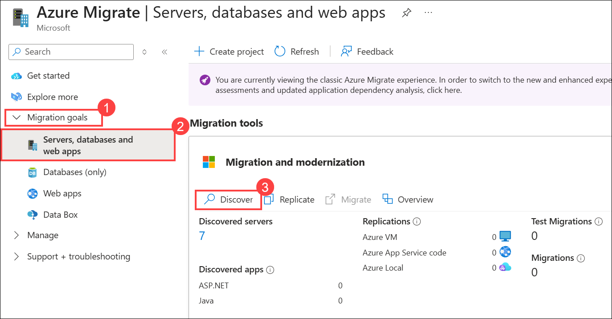

1. On the **Discover** pane, provide the following configuration:

   - For **Where do you want to migrate to?**, select **Azure VM (1)**.
   - For **Are your machines virtualized?**, select **Yes, with Hyper-V (2)**.
   - For **Target region**, select **<inject key="Region"></inject>** **(3)** (make sure this matches the region of your Resource Group).
   - Check the box to **Confirm the target region for migration is **<inject key="Region"></inject>** (4)**.
   - Click **Create resources (5)** to deploy the necessary Azure Site Recovery resources.

     

     > **Note:** Once deployment is complete, the 'Discover machines' panel should be updated with additional instructions.
  
1. On the **Discover** pane, under **Prepare Hyper-V host servers**, click the **Download** link to download the **Azure Site Recovery Provider** installer.

     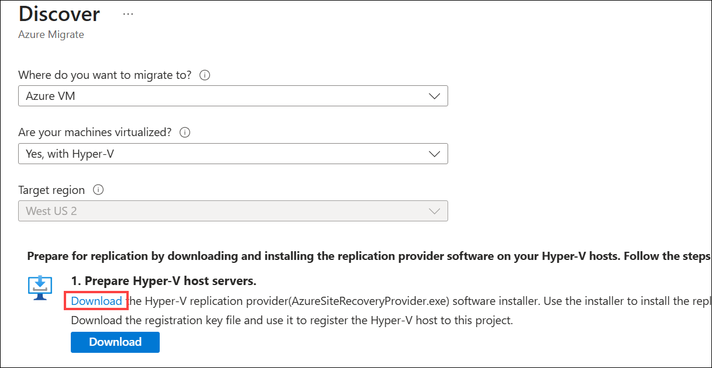

1. Return to the **Discover** page and click the blue **Download** button to download the **registration key file**.

     

1. Open the **AzureSiteRecoveryProvider.exe** installer you downloaded a moment ago. On the **Microsoft Update** tab, select **Off (1)** and click on **Next (2)**. On the **Installation** screen, accept the default installation location and click **Install** to begin installation.

    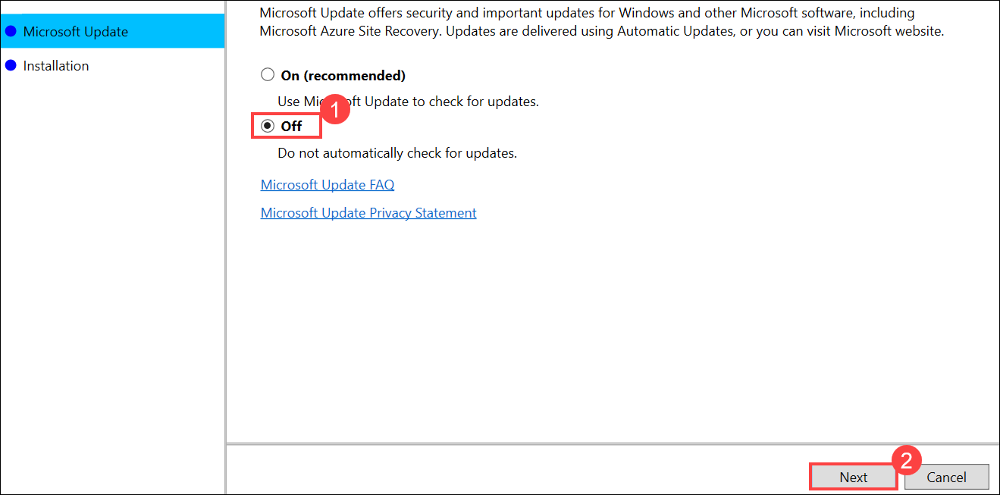

    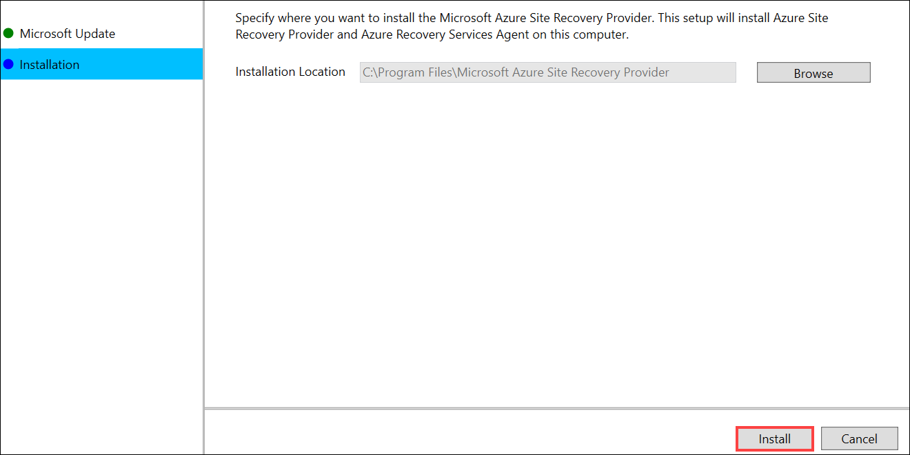

    > **Note:** If you are prompted with a pop-up, like the latest version of the Provider is installed on this server. Would you like to proceed to registration? select **Yes**. (You can directly jump to the next step in that case.)

1. When the installation has completed, on the **Installation** pane, click on **Register**.

   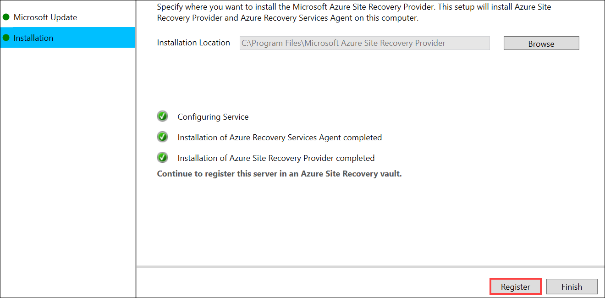
   
1. On the **Vault Settings** page, click **Browse (1)** to locate the registration key file you downloaded earlier. In the **Open** dialog, select the downloaded registration key file **(2)**, then click **Open (3)**. Once the key file is loaded, click **Next (4)** to proceed with the registration process.

   

   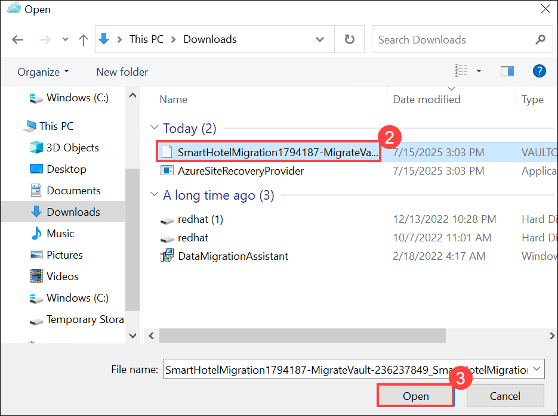

1. On the **Proxy Settings** pane, select **Connect directly to Azure Site Recovery without a proxy server (1)**, then click **Next (2)** to proceed. This will initiate the registration of the Hyper-V host with Azure Site Recovery.

     

1.  On the **Registration** pane, wait for the message **The server was registered in the Azure Site Recovery vault** to appear. Once registration is complete, select **Finish** to close the wizard.

     

1. Return to the **Azure Migrate** browser window. Refresh the page, then under **Migration and modernization**, select **Discover** to reopen the panel.
    
      - Set **Where do you want to migrate to?** to **Azure VM (1)**
      - Set **Are your machines virtualized?** to **Yes, with Hyper-V (2)**
      - Under **Do you want to install a new replication appliance or scale-out existing setup?**, select **Install a replication appliance (3)**
      - Select **Finalize registration (4)**

        .png "Finalize registration")

1. Azure Migrate will now complete the registration with the Hyper-V host. **Wait** for the registration to complete. This may take 5-10 minutes.

     

1. Once registration is complete, confirm the status shows **Registration finalized (1)** under **Registered Hyper-V hosts**. Select **Close (2)** to exit the **Discover machines** panel.

     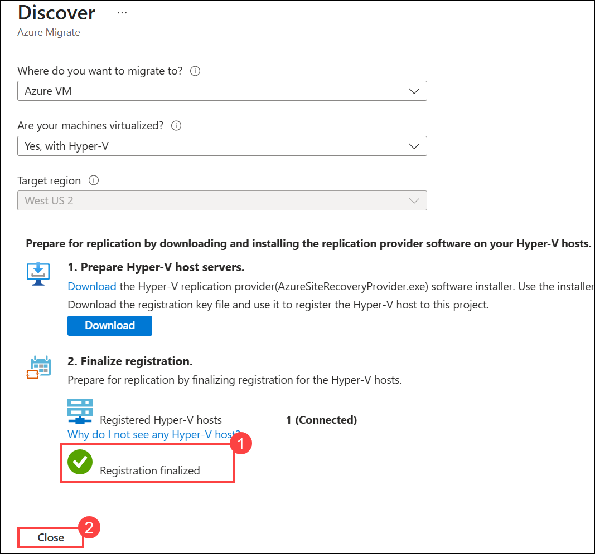

1. On the  **Azure Migrate | Servers, databases and web apps** page, In the left-hand navigation pane, expand **Migration goals (1)**, then select **Servers, databases and web apps (2)**. In the **Migration tools** section under **Migration and modernization**, verify that the **Discovered servers** count displays **7** **(3)**.

     

     > **Congratulations** on completing the task! Now, it's time to validate it. Here are the steps:
     > - Hit the Inline Validate button for the corresponding task. If you receive a success message, you can proceed to the next task. 
     > - If not, carefully read the error message and retry the step, following the instructions in the lab guide.
     > - If you need any assistance, please contact us at cloudlabs-support@spektrasystems.com. We are available 24/7 to help.

     <validation step="db65cf08-a8e5-4466-ae1f-0cebe033250c" />

#### Task summary 

In this task, you registered your Hyper-V host with the Azure Migrate Server Migration service.

### Task 3: Enable Replication from Hyper-V to Azure Migrate

In this task, you will configure and enable the replication of your on-premises virtual machines from Hyper-V to the Azure Migrate Server Migration service.

1. On the  **Azure Migrate | Servers, databases and web apps** page, In the left-hand navigation pane, expand **Migration goals (1)**, then select **Servers, databases and web apps (2)**. In the **Migration tools** section under **Migration and modernization**, select **Replicate** **(3)**.

     
   
1. On the **Specific Intent** page, select the following details:

    -  What do you want to migrate? : Select **Servers or Virtual machines (VM)** **(1)**
    -  Where do you want to migrate to? : Select **Azure VM** **(2)**
    -  Are your machines virtualized? : Select **Yes, with Hyper-V (3)**
    -  Click on **Continue (4)**

       

1. On the **Replicate** page, in the **Virtual machines** tab, select **Standard or trusted launch Virtual Machine (1)** under **Target VM security type** section, then under **Import migration settings from an assessment** section, select **Yes, apply migration settings from an Azure Migrate assessment (2)** and select the **SmartHotelAssessment (3)** migration assessment.

     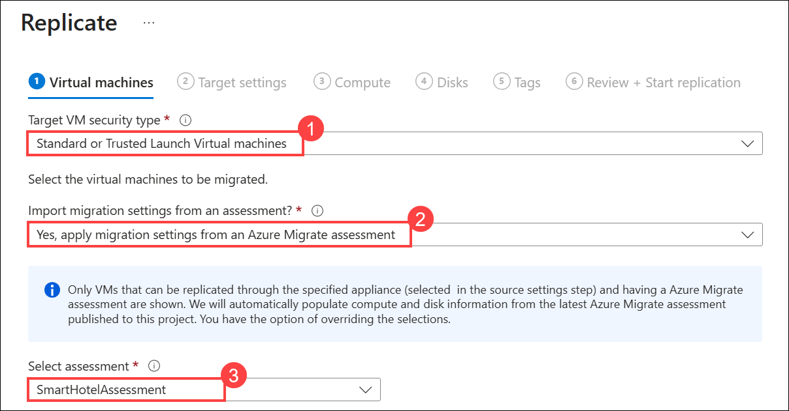

1. The **Virtual machines** tab should now show the virtual machines included in the assessment. Select the **UbuntuWAF**, **smarthotelweb1**, and **smarthotelweb2** virtual machines **(1)**, then select **Next (2)**.

     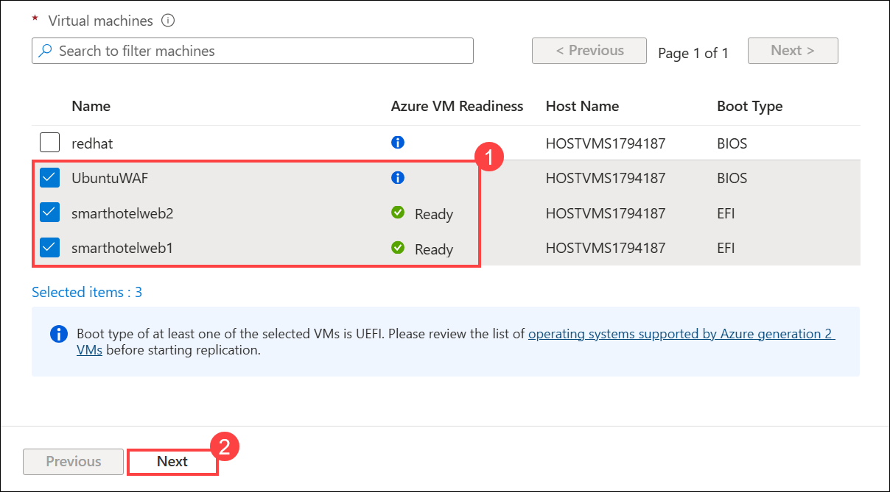

1. On the **Target settings** tab, select the information below,

   - **Subscription**: Select your subscription **(1)**
   - **Resource Group**: Select the existing **SmartHotelHostRG (2)**
   - **Cache storage account**: Choose the storage account here from the drop-down that you created in task 1 **(3)**. 
   - **Virtual Network**: Select **SmartHotelVNet (4)**. 
   - **Subnet**: Select **SmartHotel (5)**. 
   - Leave other values as default and select **Next (6)**.
   
     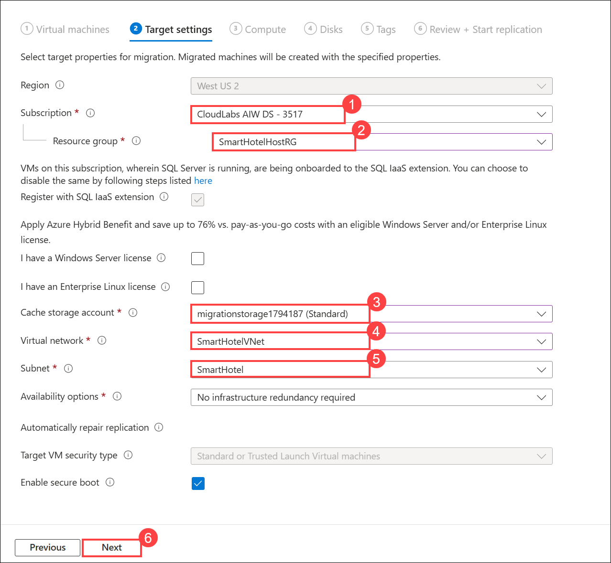

     > **Note:** For simplicity, in this lab, you will not configure the migrated VMs for high availability, since each application tier is implemented using a single VM.
     
     > **Note:** If you encounter any errors while selecting the storage account, please follow these steps:

        - Select the storage account **migrationstorage<inject key="DeploymentID" enableCopy="false" />**
          
        - On the **Data Management page (1)**, choose **Object Replication (2)**
          
        - In the **Advanced Settings (3)** section , enable **cross-tenant replication (4)** and click **OK (5)**
          
        

1. On the **Compute** tab, configure the following settings for each virtual machine:

   - Select the **Azure VM Size** to **Standard_F2s_v2** for all VMs **(1)**. 
   - Select **OS Type** `Windows` and **Operating System** `Windows Server` for the **smarthotelweb1**, **smarthotelweb2** virtual machines.
   - Select the **Linux** operating system for the **UbuntuWAF** virtual machine. 
   - Click **Next (2)** to proceed. 

     
    
1. In the **Disks** tab, review the settings but do not make any changes. Select **Next** and verify the configuration details, then select **Replicate** to start the server replication.

    
    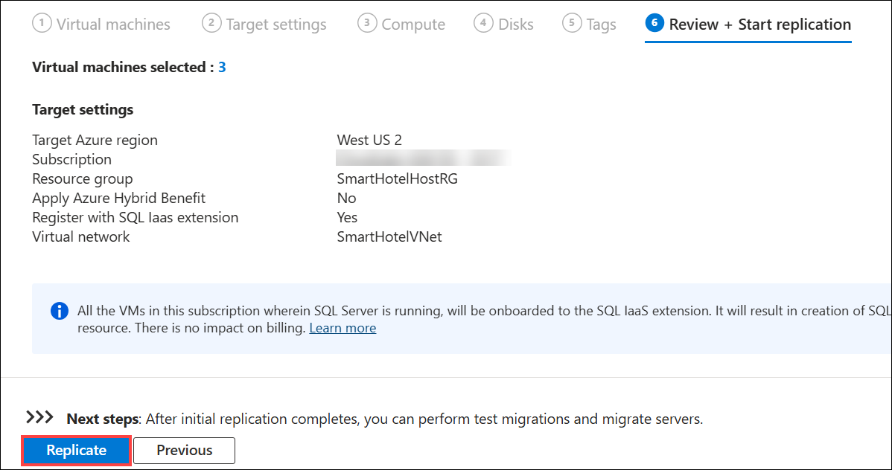

1. On the **Migration tools**, under **Migration and modernization**, select the **Overview** button.

    
    
1. On the **Azure Migrate: Migration and modernization** page, confirm that the 3 machines are replicating.

     .png "Replication summary")

1. In the **Azure Migrate: Server Migration** page, expand the **Migration (1)** section in the left-hand menu and select **Replications (2)**. Select **Refresh (3)** occasionally and wait until all three machines have a **Protected (4)** status, which shows the initial replication is complete. This will take **5-10*** minutes.

     

    > **Note**: Please make sure you run the **validation steps** for this task before moving to the next tasks, as there are a few dependencies. **Not** running the validation after performing this task will result in **validation failure** as the status of the Virtual Machine will be changed from **Protected** to **Planned failover** when you migrate the servers in Task 5.

     > **Congratulations** on completing the task! Now, it's time to validate it. Here are the steps:
     > - Hit the Inline Validate button for the corresponding task. If you receive a success message, you can proceed to the next task. 
     > - If not, carefully read the error message and retry the step, following the instructions in the lab guide.
     > - If you need any assistance, please contact us at cloudlabs-support@spektrasystems.com. We are available 24/7 to help.

     <validation step="97eb72f2-501f-4175-a43b-6d5e408263c9" />

#### Task summary 

In this task, you enabled replication from the Hyper-V host to Azure Migrate and configured the replicated VM size in Azure.

### Task 4: Configure Networking

In this task, you will modify the settings for each replicated VM to use a static private IP address that matches the on-premises IP addresses for that machine.

1. In the **Azure Migrate: Server Migration** page, select the **smarthotelweb1** virtual machine. This opens a detailed migration and replication blade for this machine. Take a moment to study this information.

    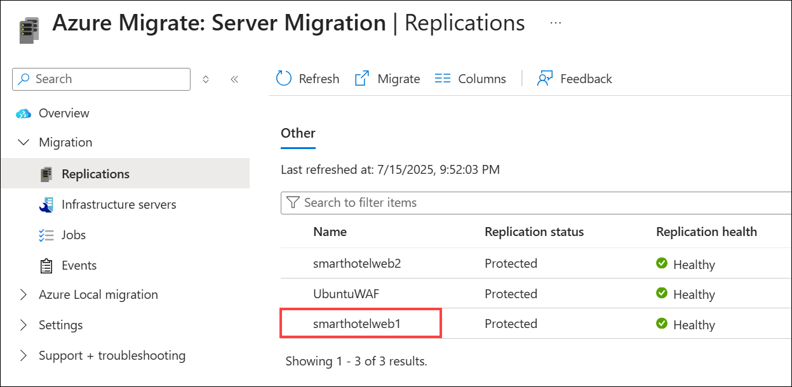

1. On the left menu, expand **General (1)** and select **Compute and Network (2)**. Under the **Microsoft Azure** column, verify the **Size** is set to **F2s_v2** **(3)**.

    

1. In the **Compute and Network** section, scroll down to the **Network interfaces**. Select the **pencil icon** (✏️) next to the NIC name.
    
    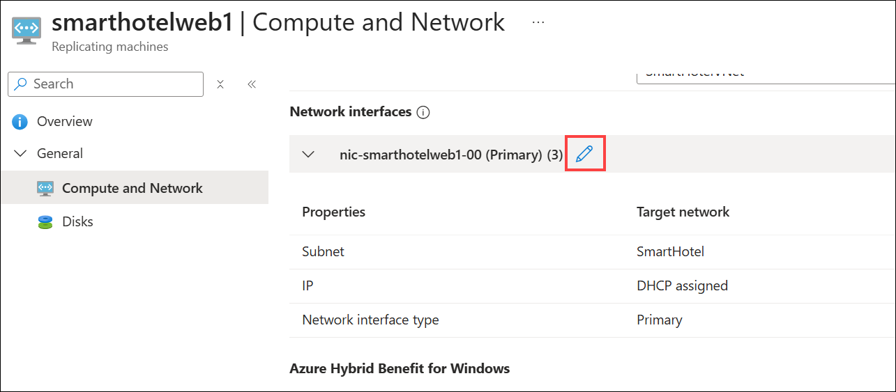

1. In the **Network interface** settings:

    - Under **IP address type**, select **Static** **(1)**.
    - In the **Private IP address** field, enter: `192.168.0.4` **(2)**.
    - Select **Apply** **(3)** to save the changes.

       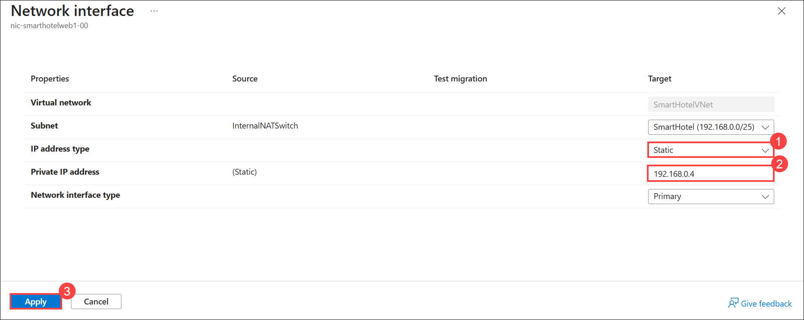

1. Select **Save** to apply the changes to the VM's configuration.

    

1. Repeat these steps to configure the private IP address for the other VMs.
 
   - For **smarthotelweb2** use private IP address **192.168.0.5**
  
   - For **UbuntuWAF** use private IP address **192.168.0.8**

#### Task summary 

In this task, you modified the settings for each replicated VM to use a static private IP address that matches the on-premises IP addresses for that machine

> **Note**: Azure Migrate makes a "best guess" at the VM settings, but you have full control over the settings of migrated items. In this case, setting a static private IP address ensures the virtual machines in Azure retain the same IPs they had on-premises, which avoids having to reconfigure the VMs during migration (for example, by editing web.config files).

### Task 5: Server migration

In this *task, you will perform a migration of the UbuntuWAF, smarthotelweb1, and smarthotelweb2 machines to Azure.

> **Note**: In a real-world scenario, you would perform a test migration before the final migration. To save time, you will skip the test migration in this lab. The test migration process is very similar to the final migration.

1. On the **Azure Migrate: Server Migration** page, click on **Overview (1) section** and under **Migrate to Azure**, select **Migrate (2)**.

    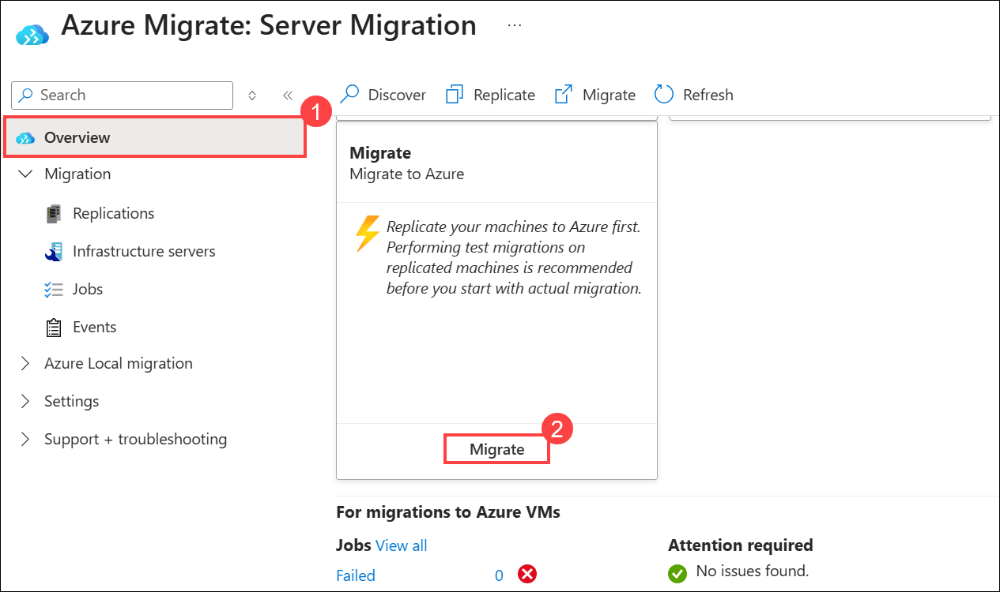

1. On the **Specify Intent** page, select **Azure VM (1)** for **Where do you want to migrate to?** and click on **Continue (2)**

    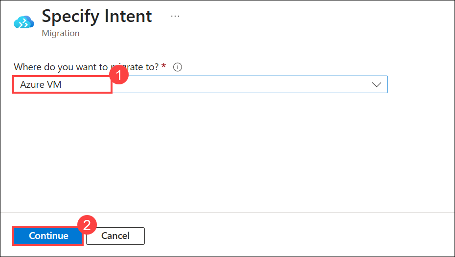
   
1. On the **Migrate** page, select the 3 VMs **(1)**, choose **Yes, Shutdown virtual machines (Ensure no data loss) (2)**, and click **Migrate (3)** to start the migration.

    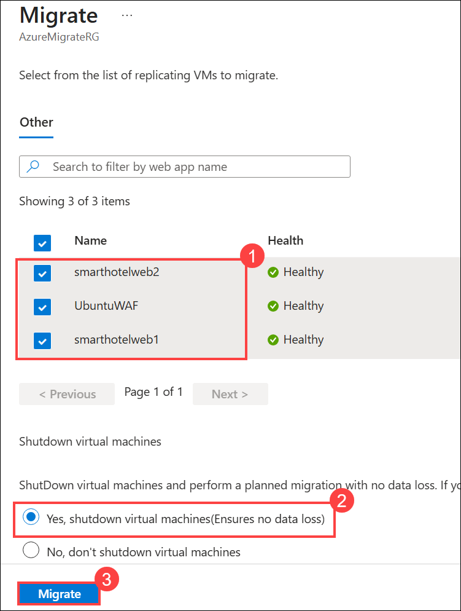

   > **Note**: You can optionally choose whether the on-premises virtual machines should be automatically shut down before migration to minimize data loss. Either setting will work for this lab.

1. The migration process will start.

    

1. On the **Azure Migrate: Server Migration** page, to monitor progress, expand **Manage (1)** on the left menu and select **Jobs (2)** and review the status of the three **Planned failover (3)** jobs.

    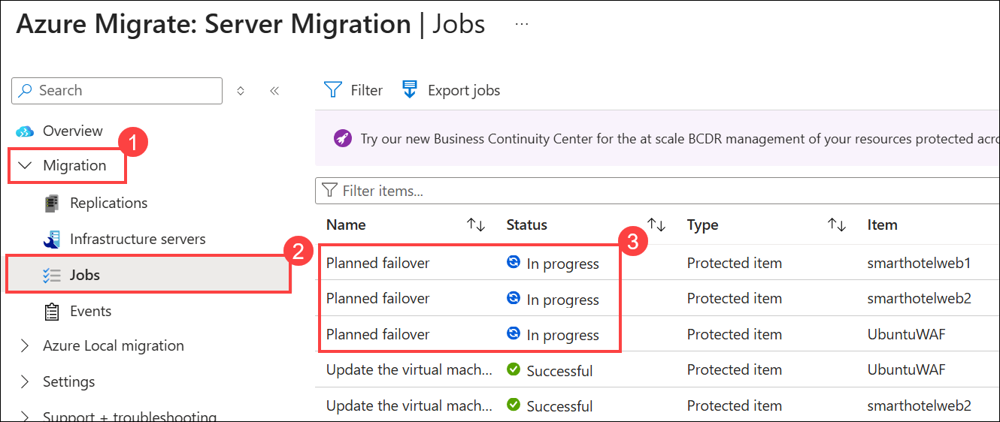

1. **Wait** until all three **Planned failover** jobs show a **Status** of **Successful**. You should not need to refresh your browser. This could take up to **15 minutes**.

    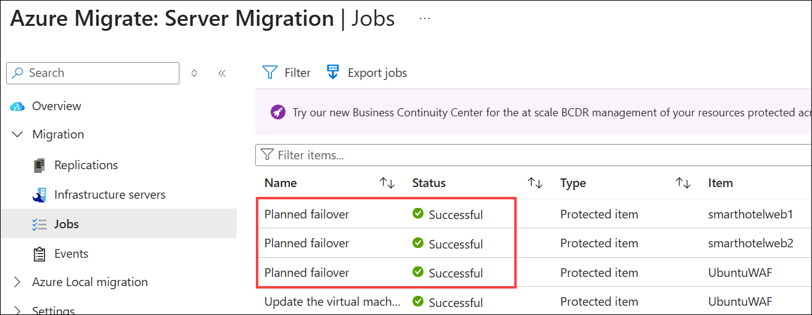

1. Navigate to the resource group, on the **Resource group** page, select the **SmartHotelHostRG** resource group. and check that the VM, network interface, and disk resources have been created for each of the virtual machines being migrated.

    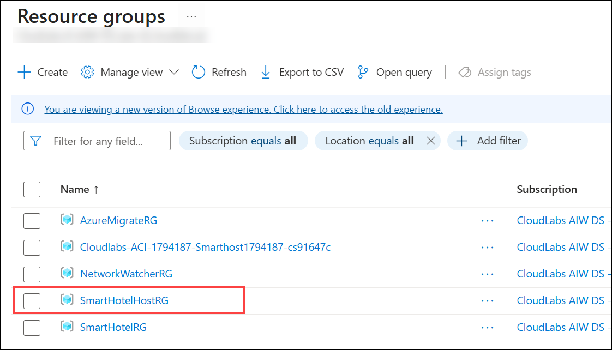
   
1. On the **SmartHotelHostRG** resource group, verify that the VM, network interface, and disk resources have been created for each migrated virtual machine.

   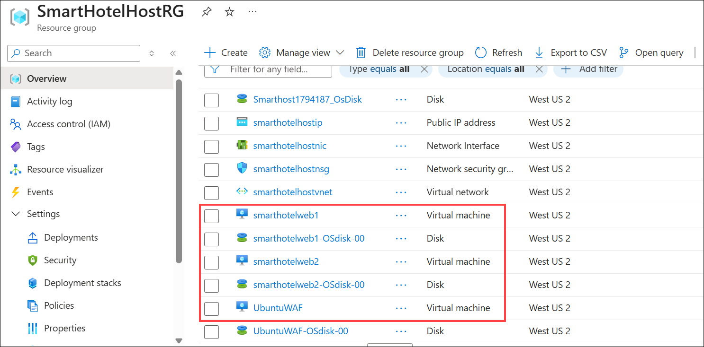

     > **Congratulations** on completing the task! Now, it's time to validate it. Here are the steps:
     > - Hit the Inline Validate button for the corresponding task. If you receive a success message, you can proceed to the next task. 
     > - If not, carefully read the error message and retry the step, following the instructions in the lab guide.
     > - If you need any assistance, please contact us at cloudlabs-support@spektrasystems.com. We are available 24/7 to help.

     <validation step="11060600-4d3d-4338-9c6a-0e2853192dee" />

### Summary 

In this exercise, you created an Azure Storage Account for VM data migration. The Hyper-V host (LabVM) was registered with the Migration and Modernization service, using Azure Site Recovery for migration. You deployed the Azure Site Recovery Provider on the Hyper-V host and configured replication for on-premises VMs to the Azure Migrate Server Migration service. Static private IPs were set for the replicated VMs to match their on-premises configurations. Finally, the UbuntuWAF, smarthotelweb1, and smarthotelweb2 VMs were successfully migrated to Azure.

Click on **Next** from the lower right corner to move on to the next page.

