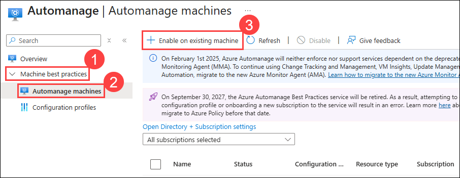

# Exercise 02: Creating VM Scale sets from Azure VMs

### Estimated Duration: 3 hours

## Overview

In this exercise, you will create a Virtual Machine Scale Set (VMSS) from an existing VM image to enable scalability and high availability. You will also enable Azure Automanage to automatically apply best practices for backup, monitoring, and security on a virtual machine.

## Lab objectives

After completing this exercise, you will:

- Task 1: Using VM Scale Sets to Drive Business Resiliency
- Task 2: Enabling Azure Automanage on Virtual Machines

## Task 1: Using VM Scale Sets to Drive Business Resiliency

In this task, you will capture a specialized image from an existing virtual machine and use it to create a Virtual Machine Scale Set (VMSS). This enables scalable deployment of identical VMs, ensuring high availability and consistent performance for business-critical applications.

1. In the Azure portal, go to **Resource groups**, select **SmartHotelHostRG (1)**, then click on **smarthotelweb1 (2)** to begin creating an image.

   

1. On the VM page, click **Capture (1)** from the top menu and select **Image (2)** from the dropdown.
   
   

1. Under **Project details**, ensure the Resource group is set to **SmartHotelHostRG (1)**, then under **Instance details**, select **Yes, share it to a gallery as a VM image version (2)**.

   

1. In **Gallery details**, create a new gallery by selecting **Create new (1)** and enter **imagemigration<inject key="DeploymentID" enableCopy="false" /> (2)** and click **Ok (3)**.

   

1. In the **Operating System state**, select **Specialized (1)**, then click **Create new (2)** under image definition to create a new VM image definition and click **Ok (7)**.

   - Image VM definition name: **imagedefinition<inject key="DeploymentID" enableCopy="false" /> (2)**

   - Publisher: **Microsoft (4)**
    
   - Offer: **windows (5)**
  
   - SKU: **migration (6)**

       

10. Set the **Version number** to **1.0.0 (1)**, then click **Review + create (2)** to proceed.

       

12. After validation passes, select **Create** to create the image and wait for the image creation.

       

13.  Once the image is created, click on **Go to resource**. 

       

13. On the VM image version page, click **Create VMSS** on the top menu to start creating a Virtual Machine Scale Set using this image.

    

14. On the **Create a Virtual Machine Scale Set (VMSS)** page, under **Basics** tab, select the **SmartHotelHostRG (1)** resource group, enter **migrationscaleset<inject key="DeploymentID" enableCopy="false" /> (2)** as the **Virtual machine scale set name**.

    

16. Select the **VM size** as **Standard D2s v3 (1)**, choose **Windows server (2)** as the **License type**, and then click **Review + create (3)** to proceed.

     

> **Congratulations** on completing the task! Now, it's time to validate it. Here are the steps:
> - If you receive a success message, you can proceed to the next task.
> - If not, carefully read the error message and retry the step, following the instructions in the lab guide. 
> - If you need any assistance, please contact us at cloudlabs-support@spektrasystems.com. We are available 24/7 to help you out.
<validation step="3435fc35-adbc-4789-885e-d2231cc767d4" />

In this task, you have created an Image from the smarhotelweb1 virtual machine, and using that image, you successfully created a Virtual Machine Scale Set (VMSS).

## Task 2: Enabling Azure Automanage on Virtual Machines

Azure Automanage automatically applies best practice configurations like backup, monitoring, and security to your VMs, simplifying management and ensuring compliance. In this task, you will enable Automanage on existing machines.

1. In the **Azure portal**, search for **Automanage (1)** in the top search bar and select the **Automanage (2)** service from the results.

   

3. From the left side panel, expand **Machine best practices (1)**, select **Automanage machines (2)**, and click **Enable on existing machine (3)** to onboard a VM to Automanage.
   
   

4. On the **Enable Automanage** blade, select **Azure best practices: Production (1)**, then click **Next: Machines > (2)** to continue.
   
   
   
   > Click **View best practice profiles** to see the differences between the environments.
    
   

5. On the **Machines** blade, click **Check eligibility on machines (1)**, select the VM named **smarthotelweb1 (2)**, and then click **Review + Create (3)**.
   
   

6. Click **Create**.

   

   In this task, you have successfully enabled Automanage on a virtual machine. 

## Summary

In this lab, you learned how to create an image from an existing virtual machine, use that image to deploy a Virtual Machine Scale Set (VMSS), and enable Automanage on a virtual machine for simplified management.

## You have successfully completed the Hands-on Lab.
