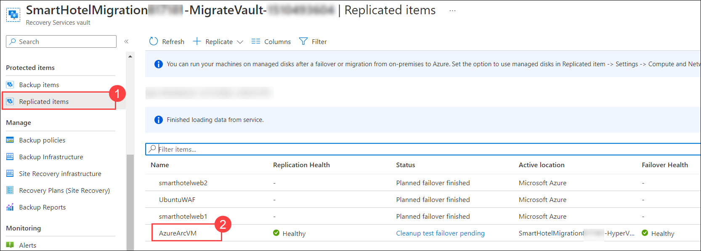
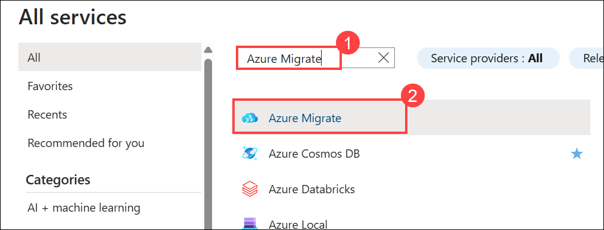
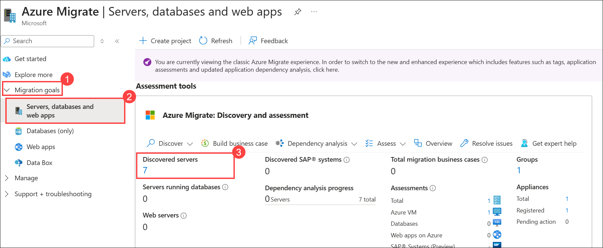
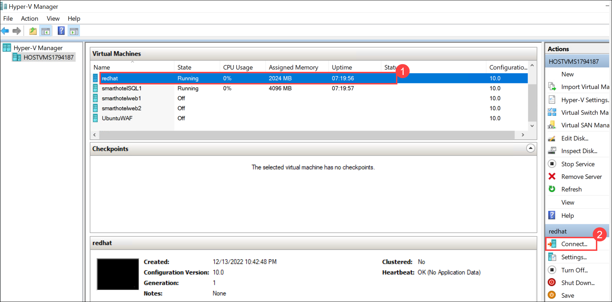
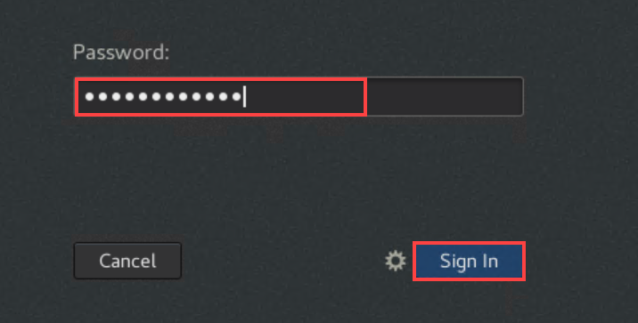

# HOL2: Exercise 1: Migrate and Modernize Linux & OSS DB workloads to Azure

### Estimated time: 15 Minutes

In this HOL, you will use Azure Migrate: Server Assessment to assess the on-premises environment. This will include selecting Azure Migrate tools, deploying the Azure Migrate appliance into the on-premises environment, creating a migration assessment, and using the Azure Migrate dependency visualization.

## Lab objectives

In this HOL, you will complete the following exercises:

- Exercise 1: Migrate and Modernize Linux & OSS DB workloads to Azure
- Exercise 2: Set up your environment on Azure to Migrate Servers
- Exercise 3: Migrating your applications and data using Microsoft services and tools, such as Azure Migrate, the Azure Hybrid Benefit, and additional programs
- Exercise 4: Optimizing newly Migrated Workloads, and Emphasizing commonalities across all Stacks

## Exercise 1: Discovery, Assess, and Plan: Evaluate your current environment

In this exercise, you will review the already discovered server on your Azure Migrate project.

## Task 1: Review the already discovered and assessed environment in Azure migrate

In this task, you will review the environment discovered in Azure Migrate. After logging into the Azure portal, we'll go to All Services and search for Azure Migrate. In the overview, you will see that seven servers have been discovered and we will focus on migrating and modernizing the Red Hat and Open Source Database (OSS DB) servers.

1. In the Azure portal, click the **Show Portal Menu (1)** icon, then select  **All services (2)** from the left navigation pane.
 
    

1. In the search bar, type **Azure Migrate (1)** and select **Azure Migrate (2)** from the suggestions to open.
   
    

1. On the **Azure Migrate | Servers, databases and web apps** page, expand **Migration goals (1)** on the left menu and select **Servers, databases and web apps (2)**. Under **Azure Migrate: Discovery and assessment**, you'll see **Discovered servers: 7 (3)**. 
 
    

    > **Note:** We have already migrated 3 servers in the previous HOL, and now we will be migrating and modernizing the Red Hat and OSS DB in this HOL
 
#### Task 2: Review your on-prem Hyper-V Linux Server and OSS DB.

In this task, you will review your on-premises Hyper-V Linux server and Open Source Database using Hyper-V Manager. Access the HOSTVMS option, select the Red Hat virtual machine, start it, connect it, and log in using the Administrator password. This sets the stage for migrating the server and OSS Database to Azure using Azure Migrate.
 
1. On the lab VM, click the **Start (1)** button, search for **Hyper-V Manager (2)**, and select  **Hyper-V Manager (3)** from the results.

   > You can also open the **Hyper-V Manager** by clicking on the icon that is present in the taskbar. 

    
     
1. In **Hyper-V Manager**, select **HOSTVMS<inject key="DeploymentID" enableCopy="false" />**. You should now see the **redhat** VM along with 6 other virtual machines that will be used in upcoming HOLs.

    
     
1. In Hyper-V Manager, select the **redhat (1)**, then select **Start (2)** on the right if not already running.

    

1. In **Hyper-V Manager**, select the **redhat** VM **(1)**, then click **Connect (2)** from the right-hand **Actions** menu.

    

1. Log into the VM with the **Administrator password**: **<inject key="SmartHotel Admin Password" />** then click **Sign In** to access the VM. (The login screen may pick up your local keyboard mapping; use the 'eyeball' icon to check.)

   

1.  You should now be successfully logged in to your on-prem **Redhat** server hosted on **Hyper-V**.

    

1. In the next exercise, you will be migrating the Red Hat server and the OSS Database hosted in the Red Hat VM to Azure with the help of Azure Migrate.  
    
### Summary 

In this exercise, you explored how Assessments work to migrate your on-premises servers to Azure virtual machines. You learnt how to assess your on-premises servers' Hyper-V environment and physical servers for migration to Azure VMs.

Click on **Next** from the lower right corner to move on to the next page.

