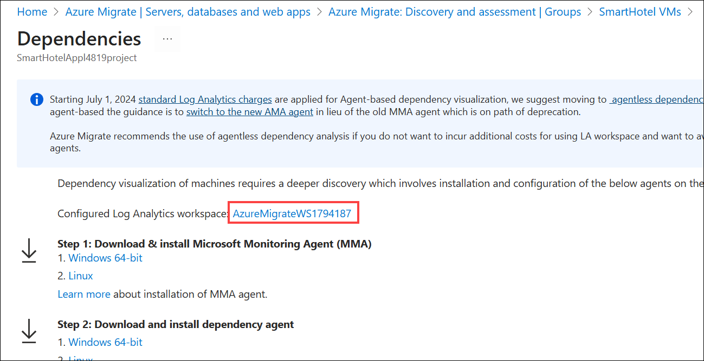
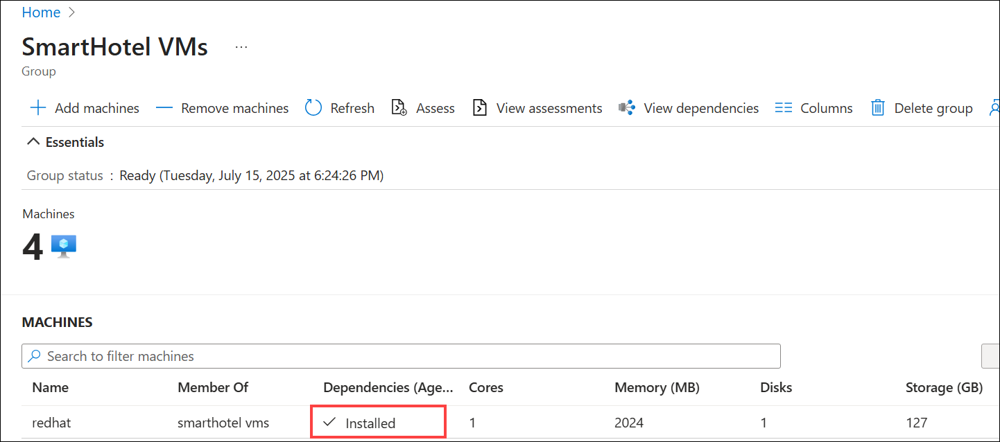

# HOL2: Exercise 2: Set up your environment on Azure to Migrate Servers

### Estimated time: 40 Minutes

In this exercise, you will learn how to migrate machines as physical servers to Azure, using the Azure Migrate: Server Migration tool. Migrating machines by treating them as physical servers is useful in several scenarios, such as migrating on-premises physical servers, migrating Hyper-V VMs, and much more.

## Lab objectives

In this exercise, you will complete the following task:

- Task 1: Configure dependency visualization

### Task 1: Configure dependency visualization

When migrating a workload to Azure, it is important to understand all workload dependencies. A broken dependency could mean that the application doesn't run properly in Azure, perhaps in hard-to-detect ways. Some dependencies, such as those between application tiers, are obvious. Other dependencies, such as DNS lookups, Kerberos ticket validation, or certificate revocation checks, are not.

In this task, you will configure the Azure Migrate dependency visualization feature. This requires you to first create a Log Analytics workspace and then deploy agents on the to-be-migrated VMs.

1. Return to the **Azure Migrate | Servers, databases and web apps** page in the Azure Portal, expand **Migration goals (1)** on the left menu and select **Servers, databases and web apps (2)**. Under **Discovery and assessment** select **Groups (2)**.

       

1. On the **Azure Migrate: Discovery and assessment | Groups** page, expand **Manage (1)**, select **Groups (2)** from the left menu. Then click on the **SmartHotel VMs (3)** group to view the group details. 

      

1. On **SmartHotel VMs**. Note that each VM has its **Dependencies** status as **Requires agent installation**. Select **Requires agent installation** for the **redhat** VM.

    

1. On the **Dependencies** page of the **SmartHotel VMs** group, locate the **Configured Log Analytics workspace** section. Click on **AzureMigrateWS<inject key="DeploymentID" enableCopy="false" />** to navigate to the connected Log Analytics workspace.

    

1. On the **AzureMigrate | Agents** page, expand **Settings (1)** from the left-hand menu and select **Agents (2)**. Make a note of the **Workspace ID (3)** and **Primary key (4)** you’ll need them during agent setup (you can save them in Notepad for quick access).

    

1. You will now deploy the Linux versions of the Microsoft Monitoring Agent and Dependency Agent on the **redhat** VM. To do so, you will first connect to the Red Hat VM remotely using an SSH session.

1. On the VM desktop, double-click the Command Prompt shortcut to open a terminal window
    
      
  
1. Enter the following command to connect to the **redhat** VM running in Hyper-V on the SmartHotelHost:

    ```bash
    ssh administrator@192.168.1.19
    ```

1. Enter 'yes' when prompted whether to connect and enter the password **<inject key="SmartHotel Admin Password" />**.

    

1. Enter the following command, followed by the password **<inject key="SmartHotel Admin Password" />** when prompted:
  
    ```
    su
    ```

    > This gives the terminal session elevated privileges.

1. Enter the following command, substituting \<Workspace ID\> and \<Primary Key\> with the values copied previously. Answer **Yes** when prompted to restart services during package upgrades without asking.  

    ```
    wget https://raw.githubusercontent.com/Microsoft/OMS-Agent-for-Linux/master/installer/scripts/onboard_agent.sh && sh onboard_agent.sh -w <Workspace ID> -s <Primary Key>
    ```
    > **Note:** Be sure to replace `<Workspace ID>` and `<Primary Key>` with the actual values you copied from the Log Analytics workspace.

1. Enter the following command, substituting \<Workspace ID\> with the value copied earlier:

    ```s
    /opt/microsoft/omsagent/bin/service_control restart <Workspace ID>
    ```
    > **Note:** If the above command fails with the error **"ERROR FOUND: file /etc/opt/microsoft/omsagent/conf/omsadmin.conf doesn't exist,"** run the command below, replacing `<WorkspaceID>` and `<PrimaryKey>`, and then repeat the steps starting from Step 11.
    
    ```
    sudo /opt/microsoft/omsagent/bin/omsadmin.sh -w <WorkspaceID> -s <PrimaryKey>
    ```
    
1. Enter the following command. This downloads a script that will install the Dependency Agent.

    ```s
    wget --content-disposition https://aka.ms/dependencyagentlinux -O InstallDependencyAgent-Linux64.bin
    ```

1. Install the dependency agent by running the script downloaded in the previous step.

    ```s
    sh InstallDependencyAgent-Linux64.bin -s
    ```

    
    

1. Return to the Azure Portal and refresh the Azure Migrate **SmartHotel VMs** VM group blade. The Red Hat VM on which the dependency agent was installed should now show its status as **Installed**. (If not, refresh the page **using the browser refresh button**, not the refresh button in the blade.  It may take up to **5 minutes** after installation for the status to be updated.)

    
   
    >**Note**: If you notice that the dependency agent status is showing as **Requires Agent Installation** instead of Installed even after installing dependency agents in all three VMs, please follow the steps from [here](https://github.com/CloudLabsAI-Azure/Know-Before-You-Go/blob/main/AIW-KBYG/AIW-Infrastructure-Migration.md#4-exercise1---task6---step1) to confirm dependency agent installation in VMs using Log Analytics workspace.
 
1. On the **SmartHotel VMs** group page, click **View dependencies** to visualize VM interconnections and traffic flows.

    
   
1. Take a few minutes to explore the dependencies view. Expand each server to show the processes running on that server. Select a process to see the process information. See which connections each server makes.

    
 
### Summary 

In this exercise, you configured the Azure Migrate dependency visualization feature by creating a Log Analytics workspace and deploying the Azure Monitoring Agent and Dependency Agent on a Linux on-premises machine.

Click on **Next** from the lower right corner to move on to the next page.


