# HOL2: Exercise 3: Migrating your applications and data using Microsoft services and tools, such as Azure Migrate, the Azure Hybrid Benefit, and additional programs

### Estimated duration: 50 Minutes

## Overview
In this exercise, you will review the registered Hyper-V host, LabVM, using Azure Site Recovery as the migration engine. The Azure Site Recovery Provider was deployed in a previous hands-on lab. Next, configure and enable replication of on-premises virtual machines from Hyper-V to the Azure Migrate Server Migration service. Modify settings for replicated virtual machines to align with on-premises IP addresses. Finally, execute the migration of the Red Hat virtual machine to Azure for a seamless transition to the cloud environment.

## Objectives

In this exercise, you will complete the following tasks:

- Task 1: Enable Replication from Hyper-V to Azure Migrate
- Task 2: Configure Networking
- Task 3: Run a Test Migration
- Task 4: Server migration

### Task 1: Enable Replication from Hyper-V to Azure Migrate

In this task, you will configure and enable the replication of your on-premises virtual machine from Hyper-V to the Azure Migrate Server Migration service.

1. Navigate to Azure portal, search for **Azure Migrate (1)** and select it **Azure Migrate (2)** from the search results.

    

1. On Azure Migrate page, click on **All projects (1)** and click on the **SmartHotelMigration<inject key="DeploymentID" enableCopy="false" /> (2)**.

    

1. Select **Migrations (1)** under Execute, then click on **Start execution (2)**. 

     
   
1. On the Specify intent panel, provide the following details, then click on **Continue (5)**.

    - What do you want to migrate to? : Select **Servers or Virtual Machines(VM) (1)** from the dropdown.

    - Where do you want to migrate to?: Select **Azure VM (2)** from the dropdown.

    - How will you select workload?: Select **From all inventory (3)** from the dropdown.

    - Discovery method: Select **SmartHotelAppl(HyperV) (4)** from the dropdown.

       

1. In the Workloads tab, select **redhat (1)** virtual machine, then select **Next (2)**.

    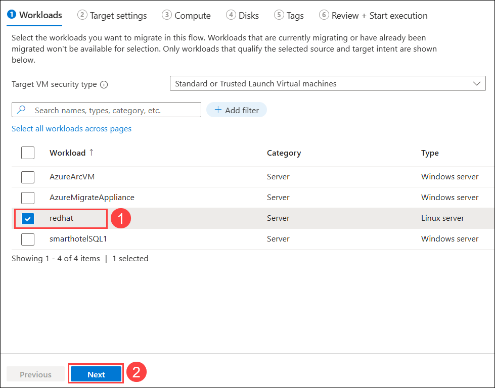

1. On the **Target settings** tab, configure the following settings. Select **Next (6)** to continue.

    - Keep the default values for **Region** and **Subscription**.
    - **Resource group**: Select the existing **SmartHotelHostRG (1)**.
    - **Cache storage account**: Verify that the **Cache storage account** created in the previous exercise is already selected **(2)**.
    - **Virtual network**: Select **SmartHotelVNet (3)**.
    - **Subnet**: Select **SmartHotel (4)**.
    - **Availability options**: Select **No infrastructure redundancy required (5)**.

        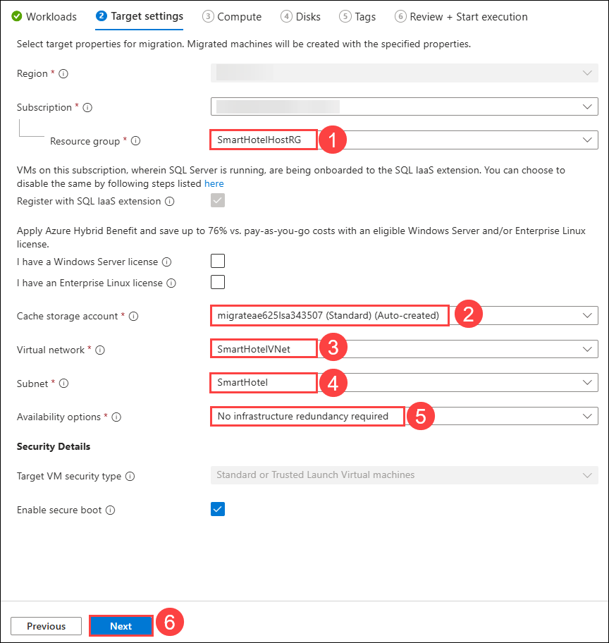

        > **Note:** For simplicity, in this lab, you will not configure the migrated VMs for high availability, since each application tier is implemented using a single VM.

1. On the **Compute** tab, configure the following settings for the **redhat** virtual machine:

   - Verify that the **Azure VM size** is set to **Standard_F2s_v2 (1)**.
   - Verify that the **OS Type** is set to **Linux (2)**.
   - Verify that the **Operating System** is set to **Red Hat Enterprise Linux 7 (3)**.
   - Select **Next** to continue.

     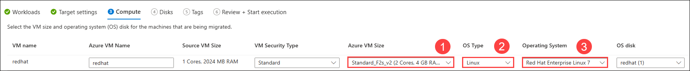
    
1. In the **Disks** tab, review the settings but do not make any changes. Select **Next** , then select **Next** in the **Tags** tab. 

    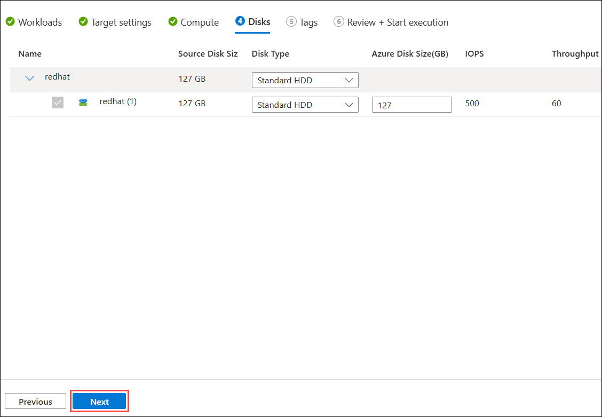

1. On the **Review + Start execution** tab, verify the replication settings for the selected virtual machines. After confirming the configuration, click **Execute migration** to start the replication process.

    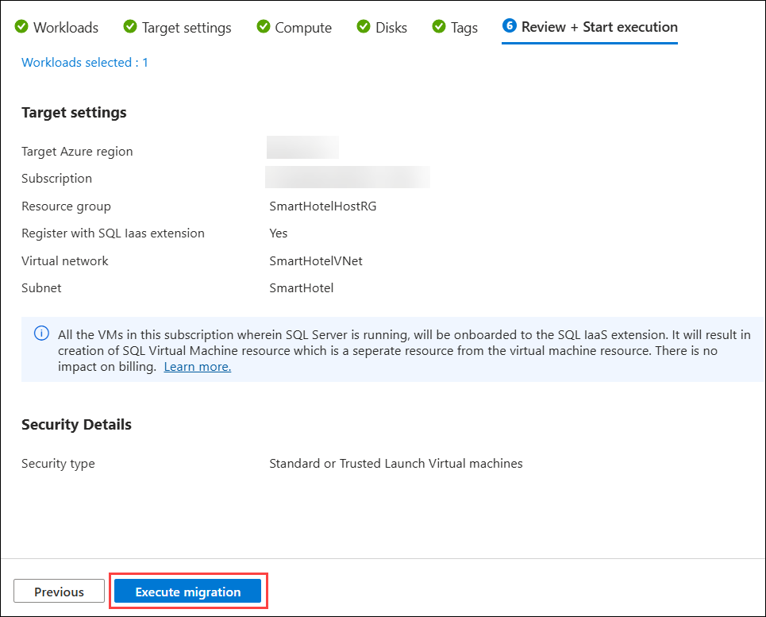

1. In the Azure Migrate project, under **Execute**, select **Migrations**. On the **Migrations** page, verify that the selected workload is listed with the **Execution stage** as **Testing** This will take 15-20 minutes.

    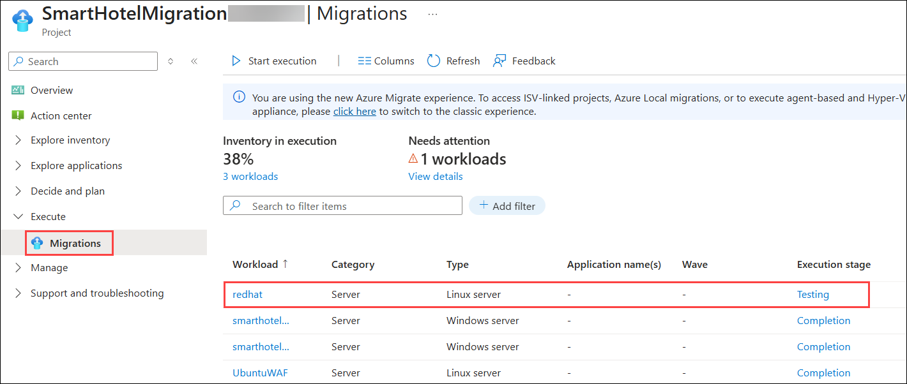
    
1. Under **Manage**, select **Jobs** to view the detailed status of the migration jobs. The **Jobs** page displays the progress and status of each migration operation performed by Azure Migrate. Verify that the **Enable replication** and **Finalize protection** jobs for the selected virtual machines have completed successfully.

    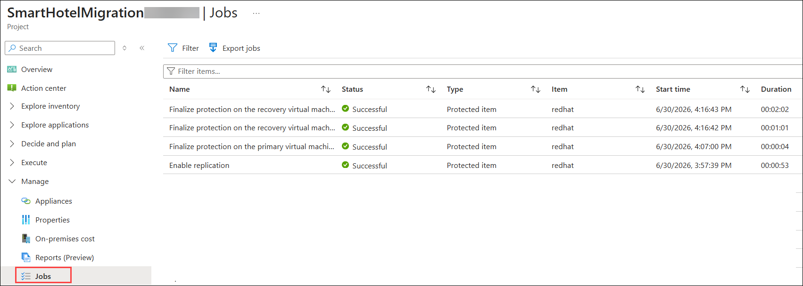

## Task 2: Configure Networking

In this task, you will modify the settings for each replicated VM to use a static private IP address that matches the on-premises IP addresses for that machine.

1. Navigate to **Migrations (1)** under **Execute**, and select **redhat (2)** from the list. This opens the migration details page for the virtual machine. Take a moment to review the migration status, and then select **Go to execution details (3)** to view the detailed replication configuration.

   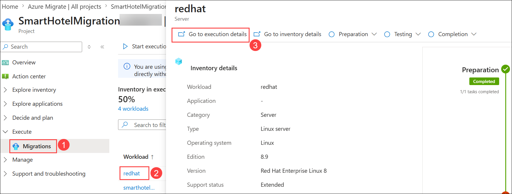

1. On the **redhat | Compute and Network** page, review the target Azure virtual machine configuration. Verify that the **Azure VM size** is set to **F2s_v2** and that the **Target network** is set to **SmartHotelVNet**.

     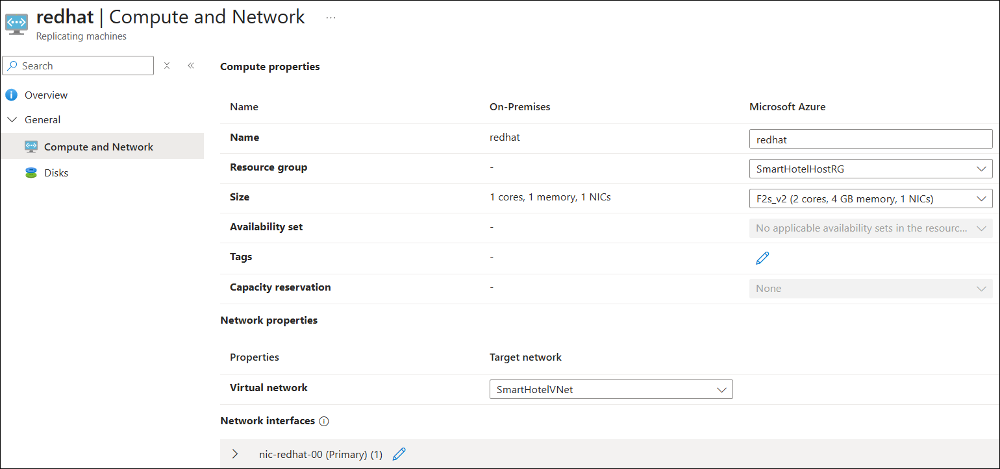

1. On the **Compute and Network** page, review the target Azure virtual machine configuration. Verify that the **Azure VM size** is set to **F2s_v2** and the **Target network** is set to **SmartHotelVNet**. Under **Network interfaces**, select the **pencil (✏️) icon** next to **nic-redhat-00 (Primary)** to configure the network interface.

    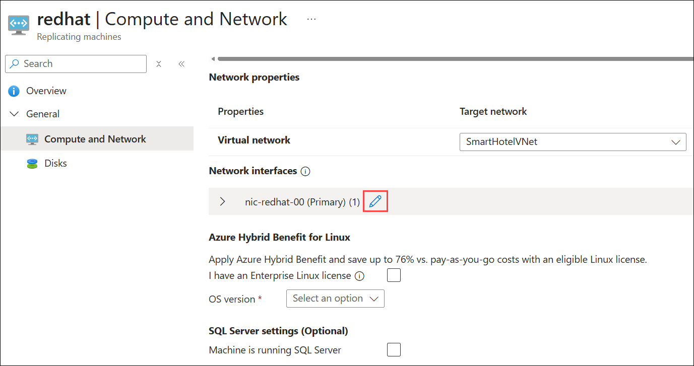 

1. On the **Network interface** page, set the **IP address type** to **Static (1)** and configure the **Private IP address** as **192.168.0.19 (2)** to preserve the existing IP address. Select **Apply (3)** to save the configuration.

    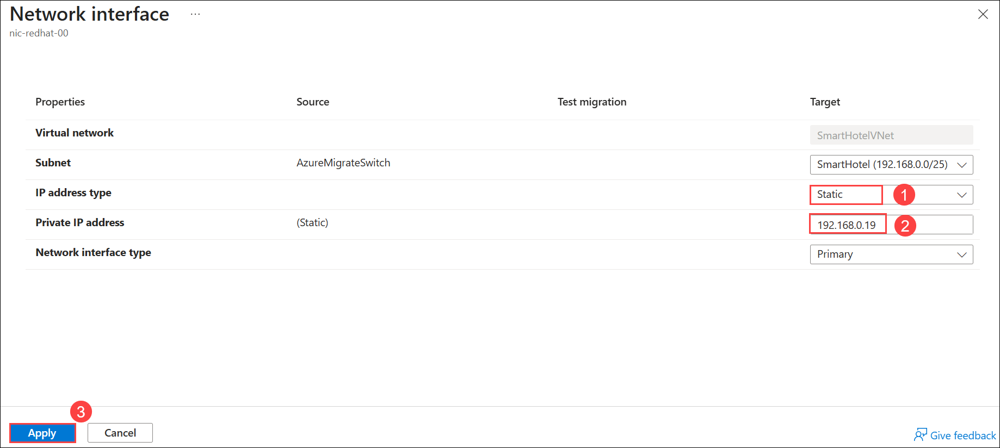

1. After applying the network interface configuration, verify that the updated network settings are reflected on the **Compute and Network** page. Select **Save** to save the replication configuration.

    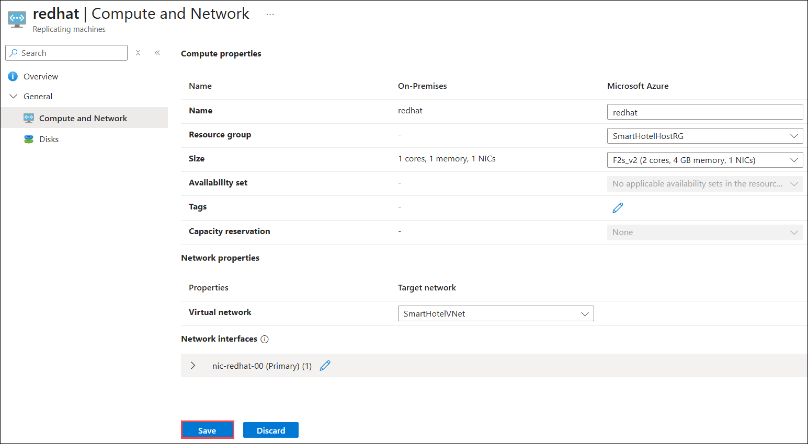

> **Note**: Azure Migrate makes a "best guess" at the VM settings, but you have full control over the settings of migrated items. In this case, setting a static private IP address ensures the virtual machine in Azure retains the same IPs they had on-premises, which avoids having to reconfigure the VM during migration (for example, by editing web.config files).

### Task 3: Run a Test Migration

In this task, you will run a test migration for the virtual machine after delta replication begins and before performing the final migration to Azure. It is highly recommended that you perform a test migration at least once for each machine before migrating it.

1. Under **Execute**, select **Migrations**. On the **Migrations** page, select **redhat (1)**. On the workload details page, expand **Testing (2)** and select **Start test migration (3)** to begin a test migration of the replicated virtual machine.

    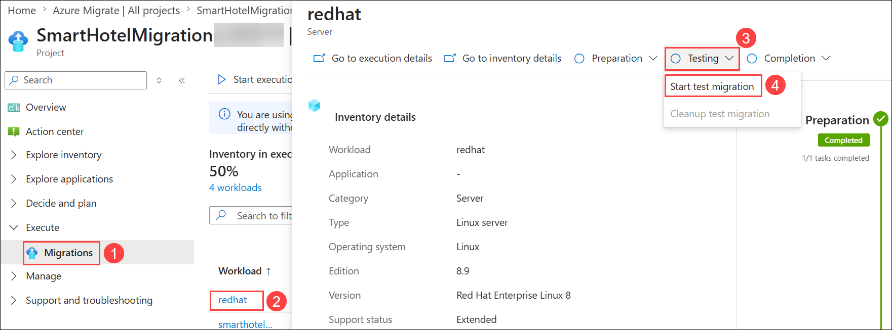

1. On the **Test migration** page, select **SmartHotelVNet (1)** from the **Virtual network** dropdown, and then click **Test migration (2)** to start the test migration.

    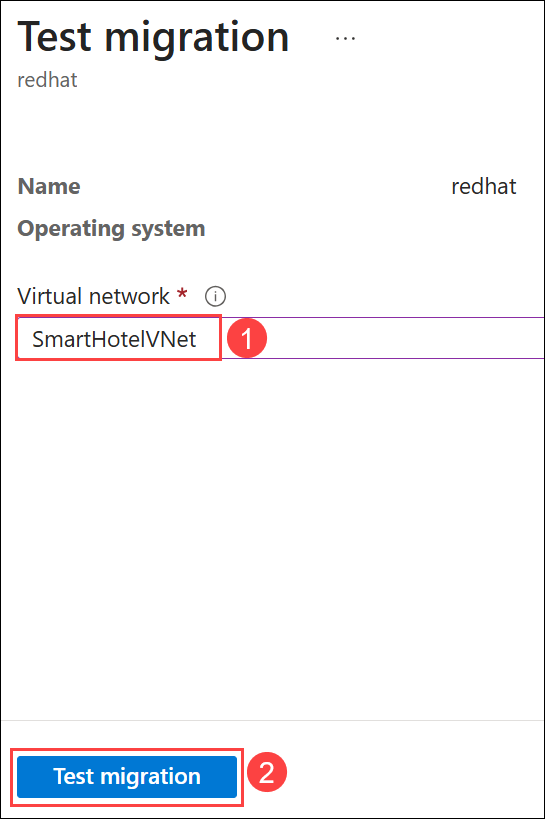

1. To monitor the test migration progress, under **Manage**, select **Jobs (1)**. Verify that the **Test failover** job displays the **Status** as **In progress (2)**. You can select the **Test failover** job to view additional details, including the sub-jobs and their current status. The test migration may take a few minutes to complete. Refresh the page periodically until the job status changes to **Successful** before proceeding to the next step.

    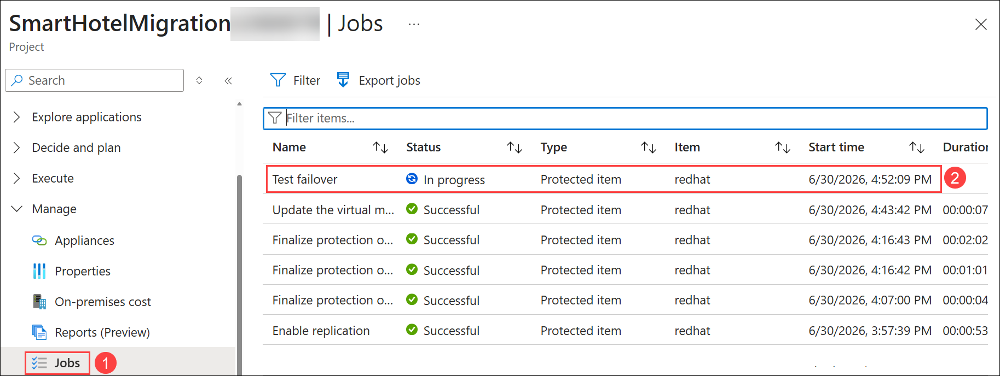

1. After the test migration completes, clean up the test migration resources to remove the temporary test virtual machine before proceeding with the actual migration. Under **Execute**, select **Migrations (1)**. On the **Migrations** page, select **redhat (2)**, expand **Testing (3)**, and then select **Clean up test migration (4)**.

    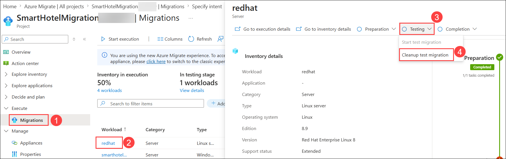

1. On the **Test migrate cleanup** page, enter any note in the **Notes (1)** field, select **Testing is complete. Delete test virtual machine (2)**, and then click **Cleanup test (3)** to remove the test migration resources.

    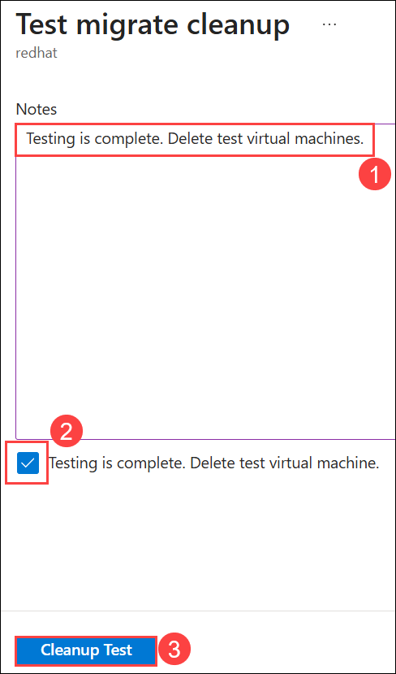

1. Under **Manage**, select **Jobs (1)** to monitor the cleanup progress. Verify that the **Test failover cleanup** job is **In progress**. You can select the job to view additional details, including the sub-jobs and their current status. Refresh the page periodically until the **Test failover cleanup** job displays the **Status** as **Successful (2)** before proceeding to the next task.

    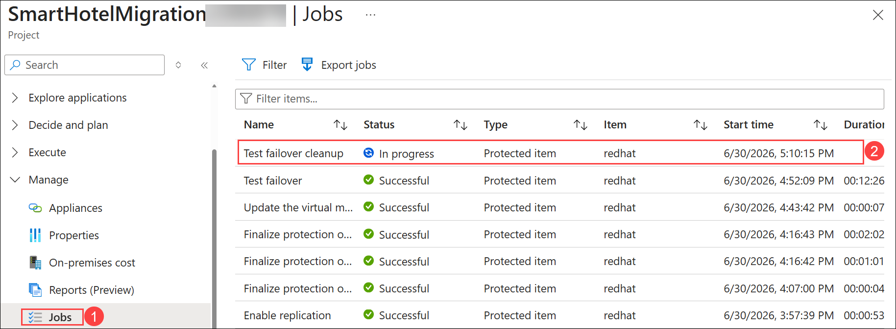

### Task 4: Server migration

In this task, you will perform a migration of the Red Hat virtual machine to Azure.

In this task, you will perform a migration of the Red Hat virtual machine to Azure.

1. Under **Execute**, select **Migrations (1)**. On the **Migrations** page, select **redhat (2)**. On the workload details page, expand **Completion (3)** and select **Migrate (4)** to begin the final migration of the replicated virtual machine to Azure.

    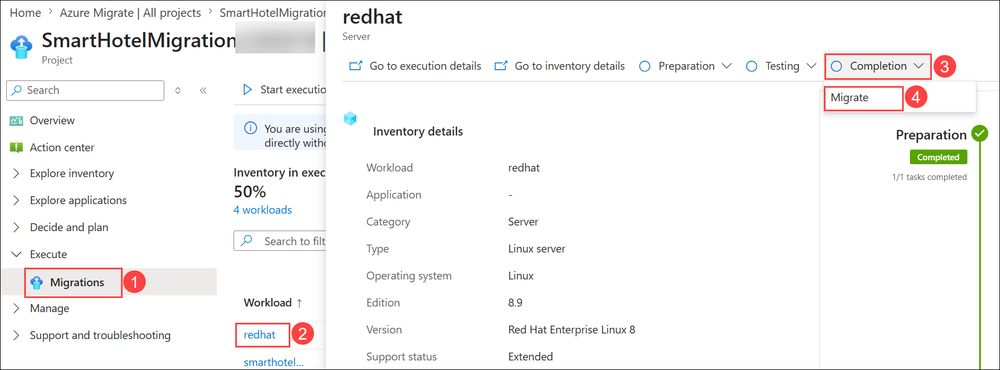

1. On the **Migrate** page, keep the default settings. Ensure **Shutdown virtual machines and perform a planned migration with no data loss?** is set to **Yes** and **Capacity Reservation** is set to **None**. Then, click **Migrate** to start the migration.

   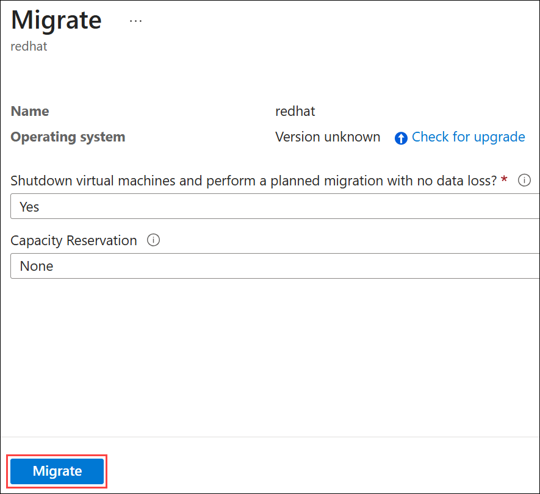

    > **Note**: You can optionally choose whether the on-premises virtual machines should be automatically shut down before migration to minimize data loss. Either setting will work for this lab.
   
1. To monitor the migration progress, navigate to **Manage** and select **Jobs (1)**. Verify that the **Planned failover** job is in the **In progress** state. The migration process may take up to **15 minutes** to complete. Refresh the page periodically until the job status changes to **Successful** before proceeding to the next step. You can also select the **Planned failover** job to view detailed information about the migration and its sub-tasks.

    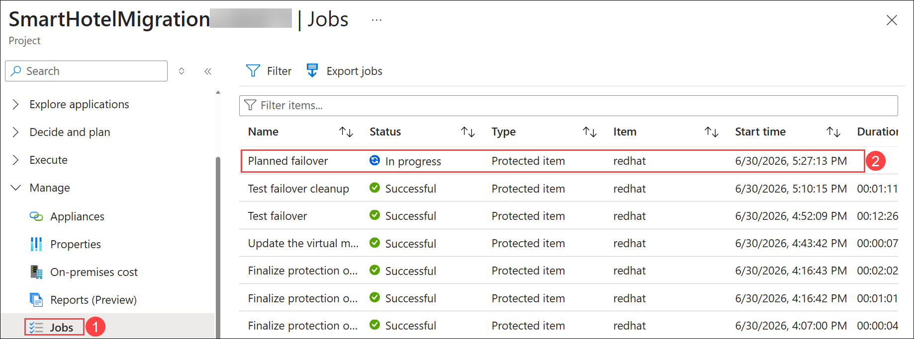

1. Navigate to the resource group, on the **Resource group** page, select the **SmartHotelHostRG** resource group. and check that the VM, network interface, and disk resources have been created for each of the virtual machines being migrated.

    
   
1. On the **SmartHotelHostRG** resource group, verify that the VM, network interface, and disk resources have been created for each migrated virtual machine.

   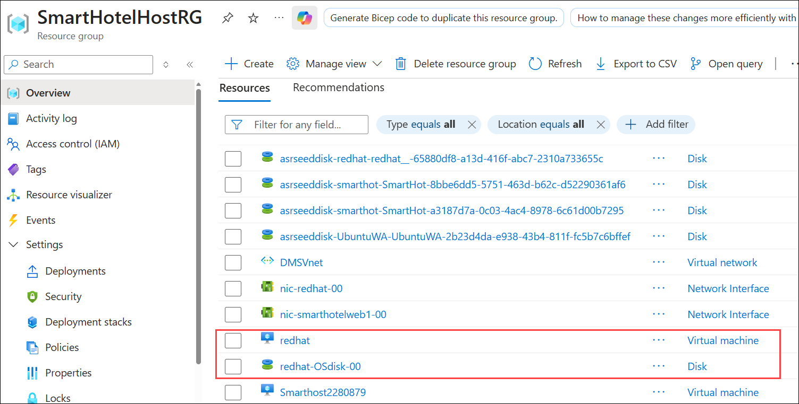

## Summary 

In this exercise, you reviewed the registered Hyper-V host, LabVM, with the Migration and Modernization Service, using Azure Site Recovery for migration. The Azure Site Recovery Provider was previously deployed on the Hyper-V host. You configured and enabled replication of the on-premises virtual machine to the Azure Migrate Server Migration service, adjusting settings for each replicated VM to use static private IP addresses matching their on-premises counterparts. Finally, you migrated the Red Hat virtual machine to Azure, ensuring a seamless transition to the cloud.

Click on **Next** from the lower right corner to move on to the next page.

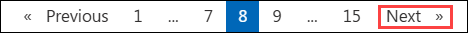
