# HOL2: Exercise 3: Migrating your applications and data using Microsoft services and tools, such as Azure Migrate, the Azure Hybrid Benefit, and additional programs

### Estimated time: 50 Minutes

In this exercise, you will review the registered Hyper-V host, LabVM, using Azure Site Recovery as the migration engine. The Azure Site Recovery Provider was deployed in a previous hands-on lab. Next, configure and enable replication of on-premises virtual machines from Hyper-V to the Azure Migrate Server Migration service. Modify settings for replicated virtual machines to align with on-premises IP addresses. Finally, execute the migration of the Red Hat virtual machine to Azure for a seamless transition to the cloud environment.

## Lab objectives

In this exercise, you will complete the following tasks:

- Task 1: Register the Hyper-V Host with Migration and modernization
- Task 2: Enable Replication from Hyper-V to Azure Migrate
- Task 3: Configure Networking
- Task 4: Server migration

## Task 1: Register the Hyper-V Host with Migration and modernization

In this task, you will review the already registered Hyper-V host (LabVM) with the Migration and modernization service. This service uses Azure Site Recovery as the underlying migration engine. As part of the registration process, we have already deployed the Azure Site Recovery Provider on your Hyper-V host in HOL1 and we will be using the same here as well.

1. Return to the **Azure Migrate | Servers, databases and web apps** page in the Azure Portal, expand **Migration goals (1)** on the left menu and select **Servers, databases and web apps (2)**. Under **Discovery and assessment**, you should be able to see 7 discovered servers **(3)**. Now, click on the **Discovered servers** to view all the servers that have been discovered with the help of Azure Migrate.

    

1. On the **Discovered servers** page, locate the **redhat** VM in the list. We will be replicating this **redhat** VM in the next task using **Azure Migrate**.

    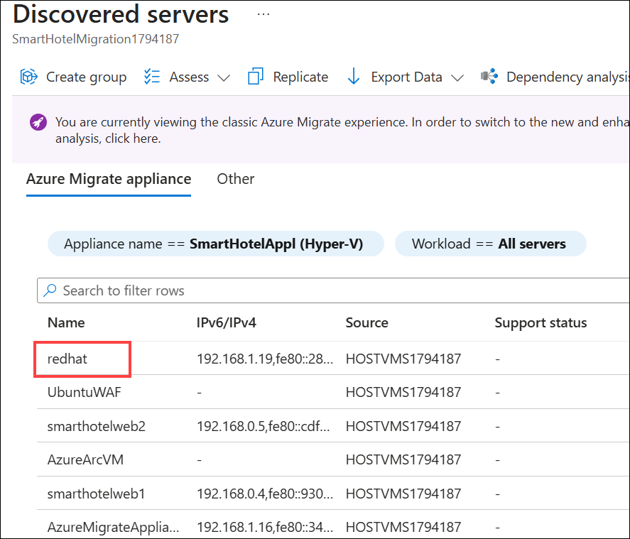

#### Task summary 

In this task, you get an overview of your registered Hyper-V host with the Azure Migrate Server Migration service.

### Task 2: Enable Replication from Hyper-V to Azure Migrate

In this task, you will configure and enable the replication of your on-premises virtual machine from Hyper-V to the Azure Migrate Server Migration service.

1. Return to the **Azure Migrate | Servers, databases and web apps** page and under **Migration and modernization**, select **Replicate**. This opens the **Replicate** wizard.

    
   
1. On the **Specific Intent** page, provide the following details:

    - What do you want to migrate? : Select **Servers or Virtual machines (VM)** **(1)**
    - Where do you want to migrate to? : Select **Azure VM** **(2)**
    - Are your machines virtualized? : Select **Yes, with Hyper-V (3)**
    - Click on **Continue (4)**

       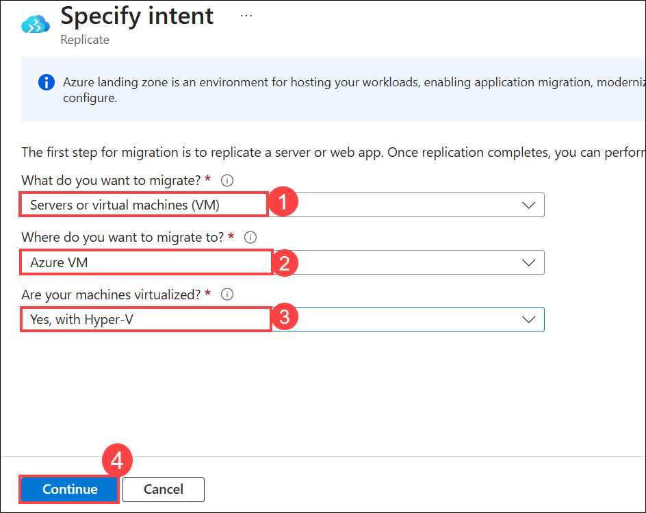

1. On the **Replicate** page, under the **Virtual machines** tab, set **Target VM security type** to **Standard or Trusted Launch Virtual machines (1)**. Under **Import migration settings from an assessment**, select **Yes, apply migration settings from an Azure Migrate assessment (2)**. Then choose **SmartHotelAssessment (3)** as the migration assessment.

    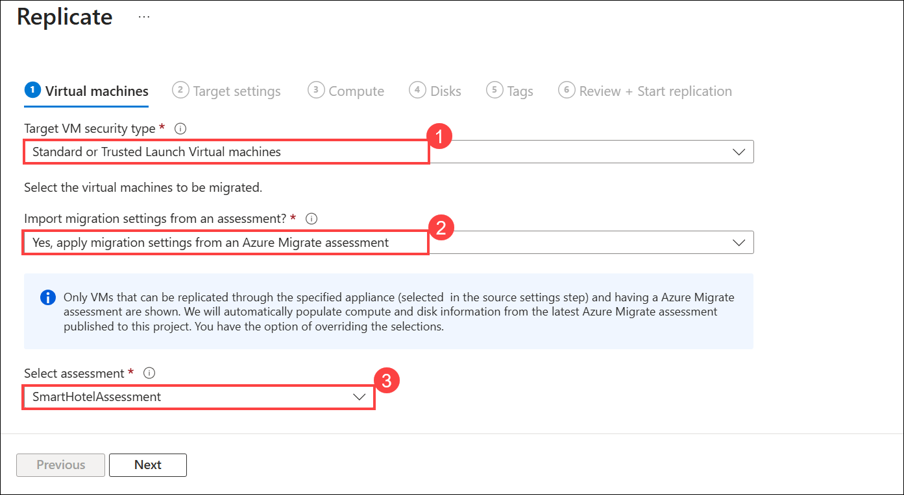

1. On the **Virtual machines** tab, you’ll now see the VMs included in the selected assessment. Select the **redhat (1)** virtual machine, then click **Next (2)**.

    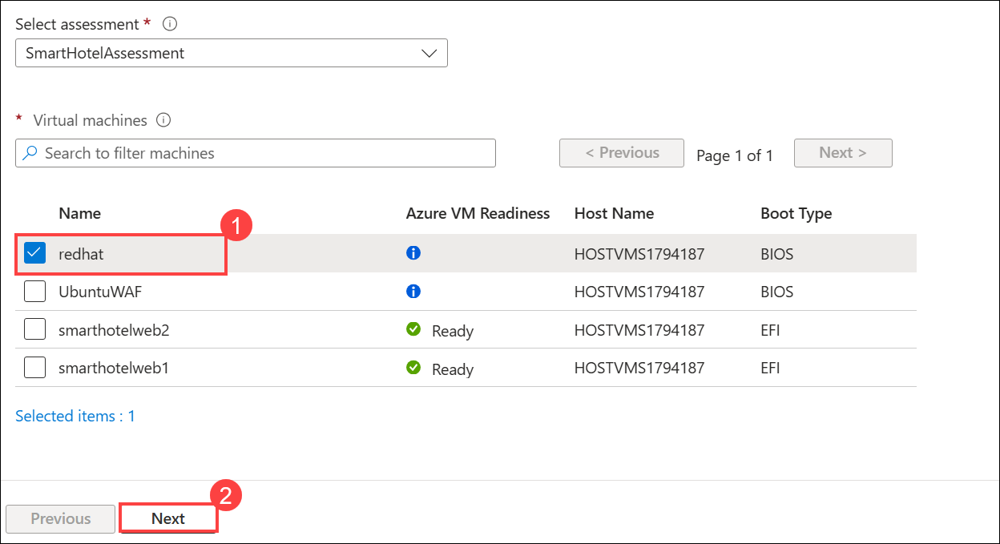

1. On the **Target settings** tab, configure the following values:
   
    - Select your subscription and the existing **SmartHotelRG (1)** resource group.  
    - For **Cache storage account**, choose **migrationstorage1794187 (2)**.  
    - Under **Virtual network**, select **SmartHotelVNet (3)**.  
    - For **Subnet**, select **SmartHotel (4)**.  
    - Click **Next (5)** to continue.
 
       

       > **Note:** For simplicity, in this lab you will not configure the migrated VM for high availability, since each application tier is implemented using a single VM.

1. On the **Compute** tab, configure the following for the **redhat** virtual machine:
   
   - Select **Standard_F2s_v2** as the Azure VM size and set the **OS Type** to **Linux** **(1)**.  
   - Click **Next (2)** to proceed.

   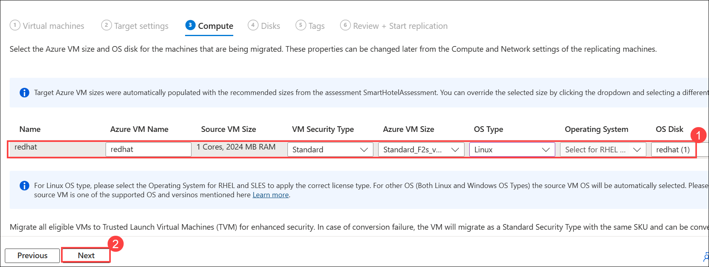
   
1. In the **Disks** tab, review the settings but do not make any changes. Select **Next**.

   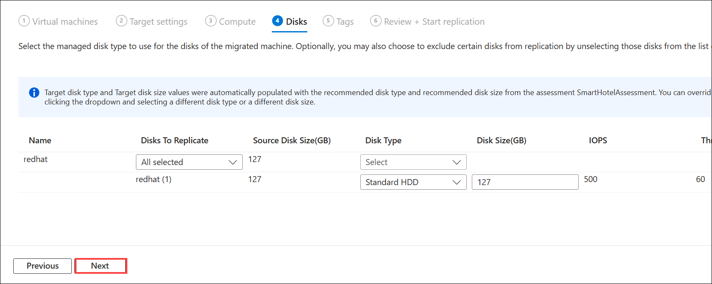

1. On the **Review + Start replication** tab, review the selected configuration details. Once confirmed, click **Replicate** to start the replication process.

    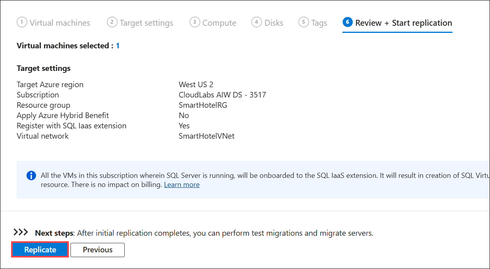

1. In the **Azure Migrate | Servers, databases and web apps** page, under **Migration and modernization**, select the **Overview** button.

    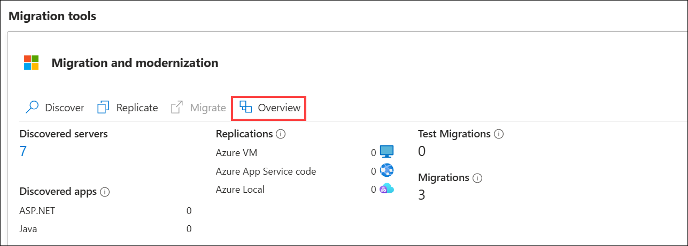
    
1. On the **Azure Migrate: Server Migration** overview page, you’ll see the **Replicate** tile under the migration dashboard. The count under **Azure VM** should show `1`, indicating that replication is in progress.

     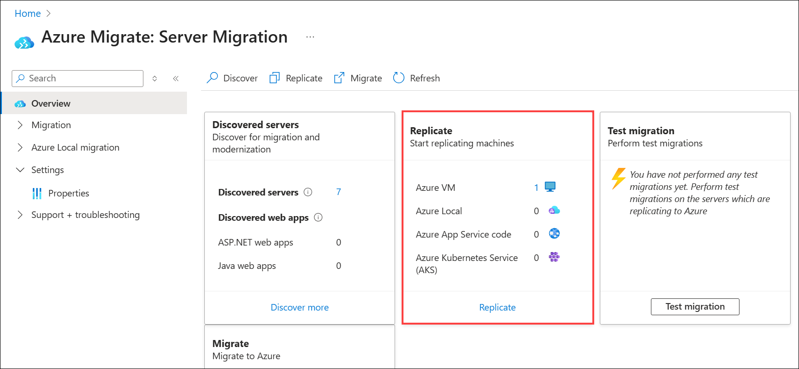

1. On the **Azure Migrate: Server Migration** page, select **Replications (1)** under the **Migration** section on the left. Click **Refresh (2)** occasionally and wait until the **redhat** VM shows a **Protected (3)** status. This indicates the initial replication is complete. It may take 5–10 minutes.

     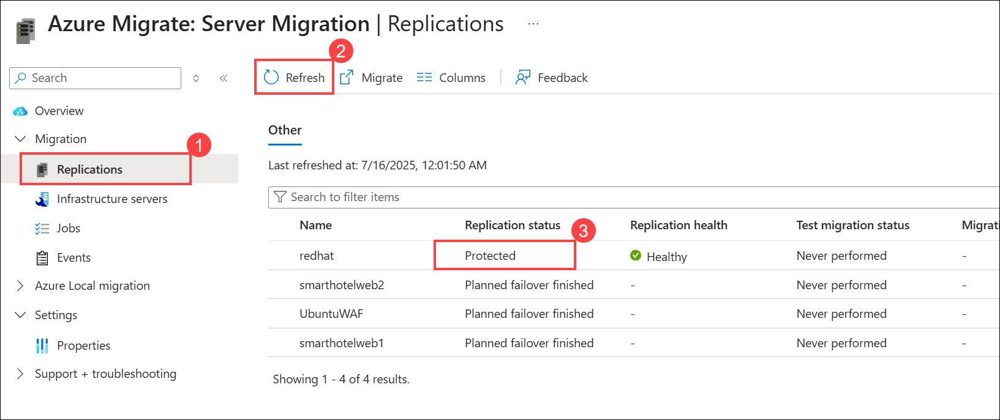

#### Task summary 

In this task, you enabled replication from the Hyper-V host to Azure Migrate and configured the replicated VM size in Azure.

## Task 3: Configure Networking

In this task, you will modify the settings for each replicated VM to use a static private IP address that matches the on-premises IP addresses for that machine.

1. On the **Migration and modernization | Replications** page, select the **redhat** virtual machine to open its detailed migration and replication settings. Review the replication health, status, and other migration-related information carefully.

   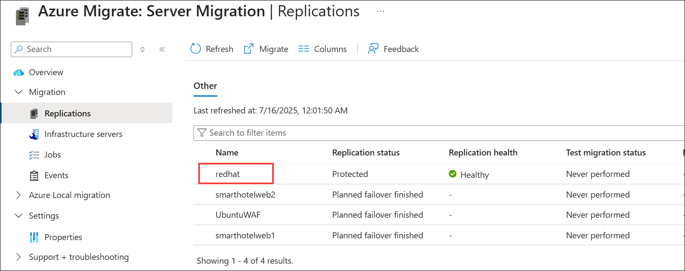

1. In the **redhat Replicating machines** page, expand **General (1)** and select **Compute and Network (2)**. Confirm that the **Azure VM size** is set to **F2s_v2 (3)**.

     

1. On the **redhat Replicating machines** section, locate the **Network interfaces** field. Select the **Edit icon** next to **nic-redhat-00 (Primary)** to configure the NIC settings.

     

1. In the **Network interface** configuration panel, set the following:
     
     - **IP address type**: `Static` **(1)**  
     - **Private IP address**: `192.168.0.19` **(2)**
     - Then click **Apply (3)** to save the changes.

       

1. Back in the **Compute and Network** pane, click **Save** to apply the network interface changes.

    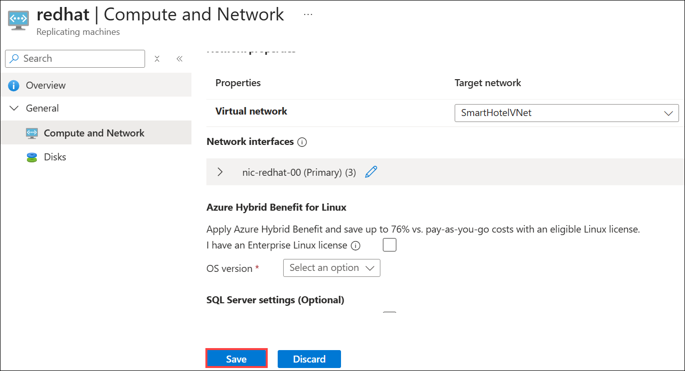

#### Task summary 

In this task, you modified the settings for each replicated VM to use a static private IP address that matches the on-premises IP addresses for that machine

> **Note**: Azure Migrate makes a "best guess" at the VM settings, but you have full control over the settings of migrated items. In this case, setting a static private IP address ensures the virtual machine in Azure retains the same IPs they had on-premises, which avoids having to reconfigure the VM during migration (for example, by editing web.config files).

### Task 4: Server migration

In this task, you will perform a migration of the Red Hat virtual machine to Azure.

> **Note**: In a real-world scenario, you would perform a test migration before the final migration. To save time, you will skip the test migration in this lab. The test migration process is very similar to the final migration.

1. On the **Migration and modernization** **overview (1)** blade, under the **Migrate (2)** section, click **Migrate (3)** to initiate migration for additional servers.

    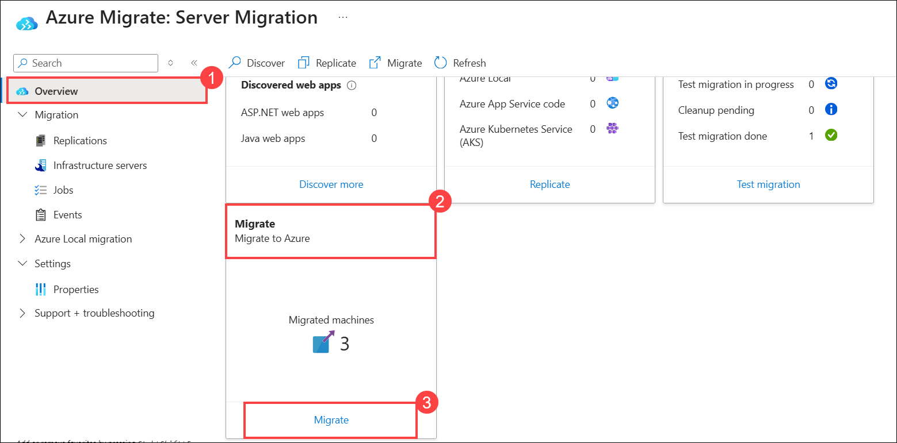
   
1. On the **Specify Intent** blade, select **Azure VM (1)** for **Where do you want to migrate to?** and click on **Continue (2)**

    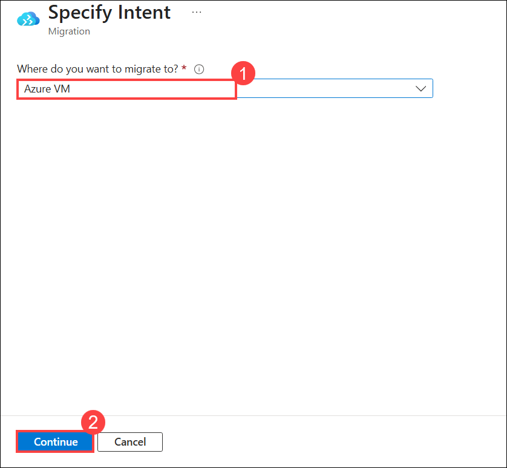

1. On the **Migrate** blade, perform the following actions:
  
     - Select the **redhat** virtual machine **(1)**.
     - Choose **Yes, shut down virtual machines (Ensures no data loss)** **(2)**.
     - Click **Migrate** **(3)** to begin the migration.

        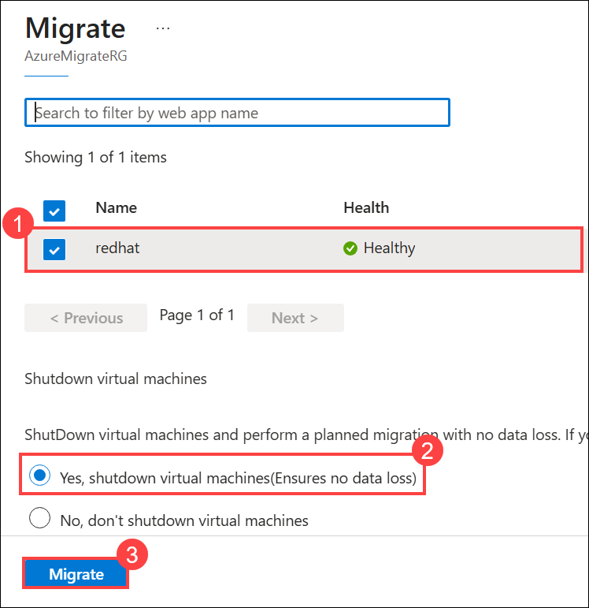

        > **Note**: You can optionally choose whether the on-premises virtual machine should be automatically shut down before migration to minimize data loss. Either setting will work for this lab.

1. The migration process will start. To monitor its progress, select the **Notifications** icon **(1)** and verify that the **Migration of redhat** status shows as **Running** **(2)**.

    

1. To monitor migration progress, expand **Migration (1)** and select **Jobs** **(2)**. Locate the **Planned failover** job for **redhat** and verify that its status shows as **In progress (3)**.

    

1. Under the **Migration** section, select **Jobs** **(1)**. **Wait** until the **Planned failover** jobs show a **Status** of **Successful (2)**. You should not need to refresh your browser. This could take up to **15 minutes**.

    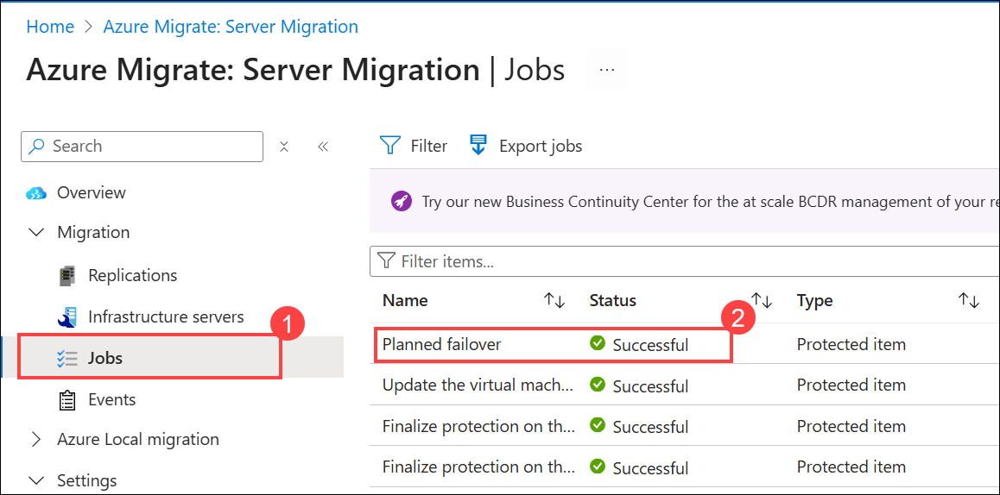
   
1. In the **SmartHotelRG** resource group, verify that the **Virtual machine**, **Disk**, and **Network Interface** for **redhat** have been successfully created.

    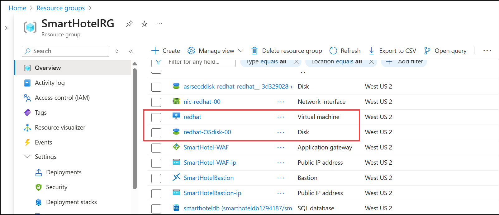

### Summary 

In this exercise, you reviewed the registered Hyper-V host, LabVM, with the Migration and Modernization Service, using Azure Site Recovery for migration. The Azure Site Recovery Provider was previously deployed on the Hyper-V host. You configured and enabled replication of the on-premises virtual machine to the Azure Migrate Server Migration service, adjusting settings for each replicated VM to use static private IP addresses matching their on-premises counterparts. Finally, you migrated the Red Hat virtual machine to Azure, ensuring a seamless transition to the cloud.

Click on **Next** from the lower right corner to move on to the next page.
