# HOL2: Exercise 4: Optimizing newly Migrated Workloads and Emphasizing commonalities across all Stacks

### Estimated duration: 40 Minutes

## Overview
In this exercise, you will enable the Managed Identity feature and configure Azure Active Directory (AAD) based authentication for SSH login by deploying a VM extension on virtual machines. Additionally, you'll activate Automanage on existing machines to streamline configuration and monitoring. This process simplifies identity management and automates the operational tasks necessary for managing VMs efficiently in Azure, ensuring enhanced security and compliance across your cloud environment.

## Objectives

In this exercise, you will complete the following tasks:

- Task 1: Getting Started with Azure Active Directory for Linux
- Task 2: Azure Automanage

### Task 1: Getting Started with Azure Active Directory for Linux 

In this task, you will be enabling the AAD authentication using a VM extension and enabling Managed Identity. 

1. Navigate to the resource group, on the **Resource group** page, select the **SmartHotelHostRG** resource group. Select **redhat** virtual machine from the list. 

    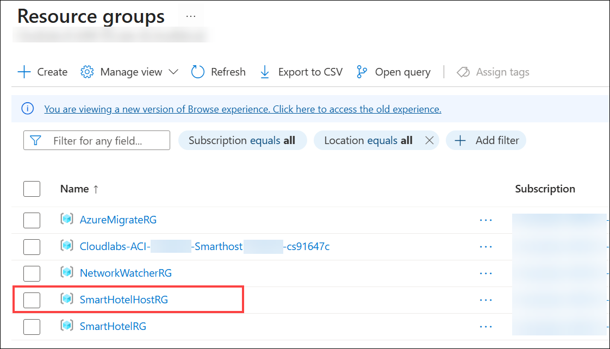

    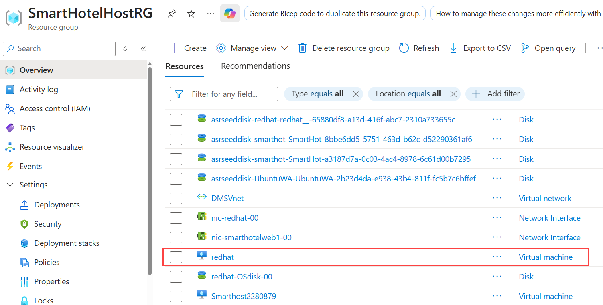
    
1. Under **Security**, select **Identity (1)**. On the **System assigned** tab, set the **Status** to **On (2)**, and then select **Save (3)** to enable the system-assigned managed identity. When prompted with the Enable system-assigned managed identity pop-up, click on **Yes**.

   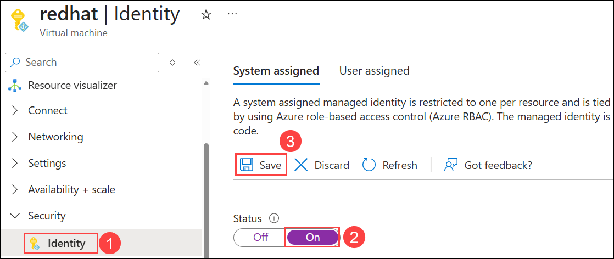

   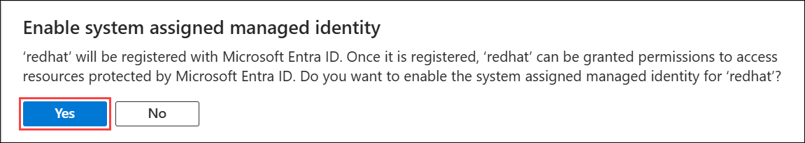 

    > **Note:** It may take a few moments to complete the process, as background operations like creating service principals are performed automatically.
      
1. Under **Settings**, select **Extensions + applications (1)**. On the **Extensions** tab, select **+ Add (2)** to add a new virtual machine extension.
   
   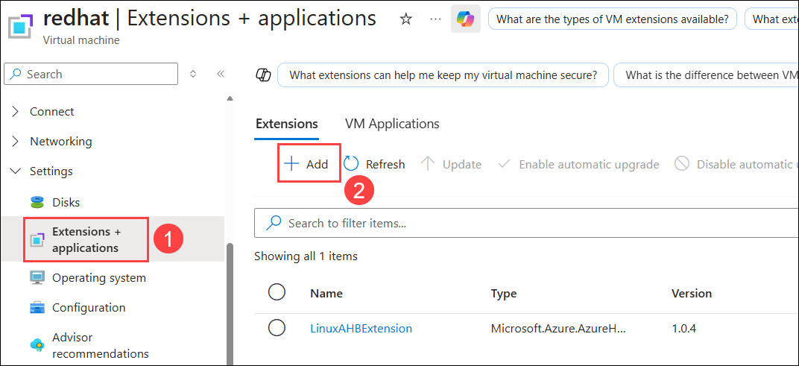

1. On the **Install an Extension** page, select the **Azure AD based SSH Login (1)** extension, and then select **Next (2)** to continue.

    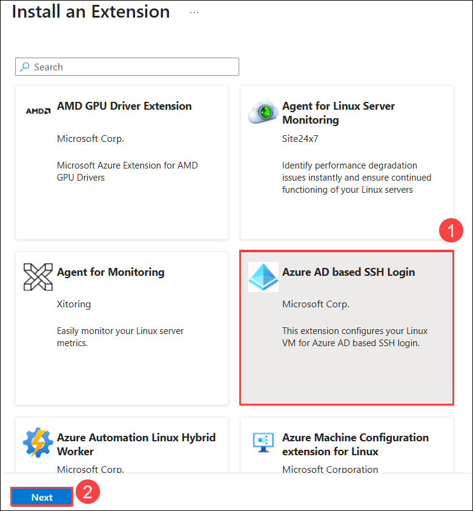

1. On the **Configure Azure AD based SSH Login Extension** page, click on **Review + create**.

    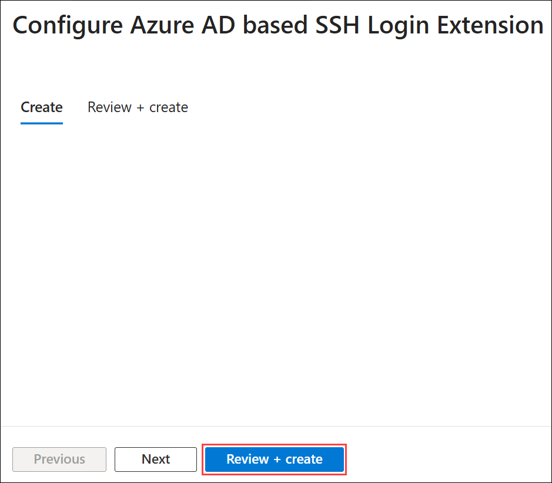

1. On the **Review + create** tab, click **Create** to start installing the extension into your Redhat VM.

    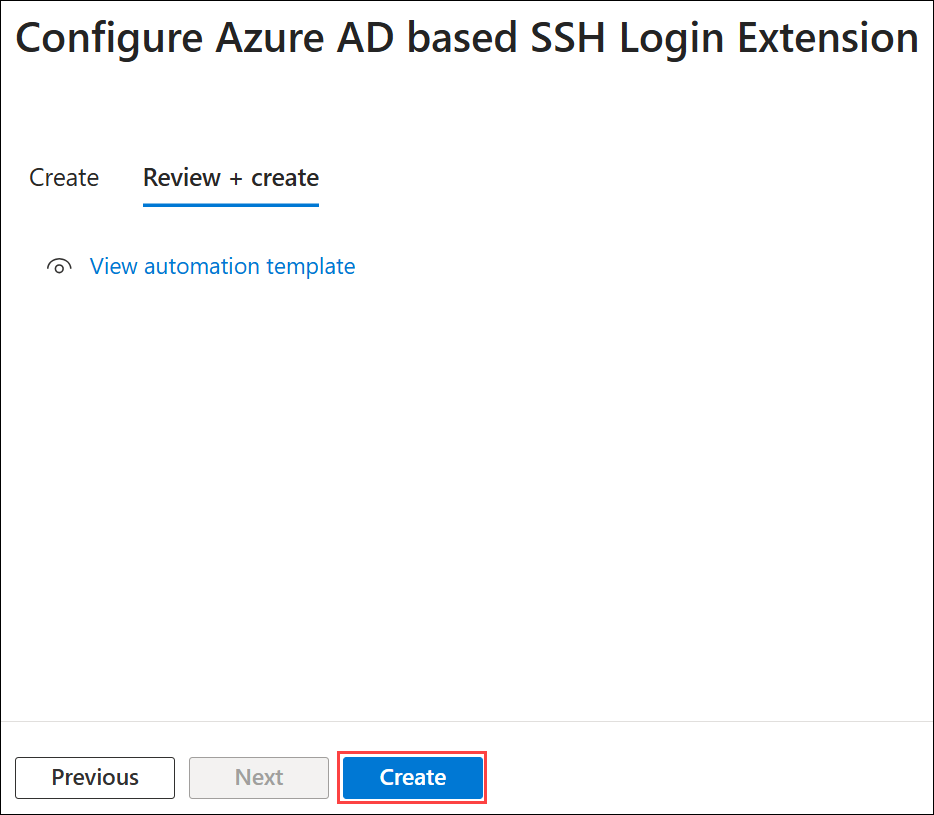

<!--
     > **Congratulations** on completing the task! Now, it's time to validate it. Here are the steps:
     > - Hit the Inline Validate button for the corresponding task. If you receive a success message, you can proceed to the next task. 
     > - If not, carefully read the error message and retry the step, following the instructions in the lab guide.
     > - If you need any assistance, please contact us at cloudlabs-support@spektrasystems.com. We are available 24/7 to help.

     <validation step="bb993c1c-a2c9-44d8-be3a-d3faa6c356fb" />
-->

### Task 2: Azure Automanage

In this task, you will enable Automanage on existing machines.

1. In the **Azure portal**, type **Automanage (1)** in the search bar and select **Automanage (2)** from the search results.

    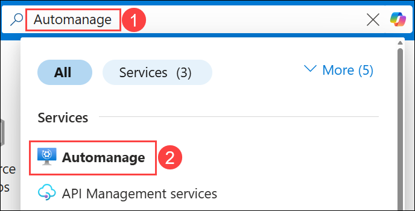

1. Select **Automanage machines (1)** under **Machine best practices** and click on **+ Enable on existing machine (2)**.
   
   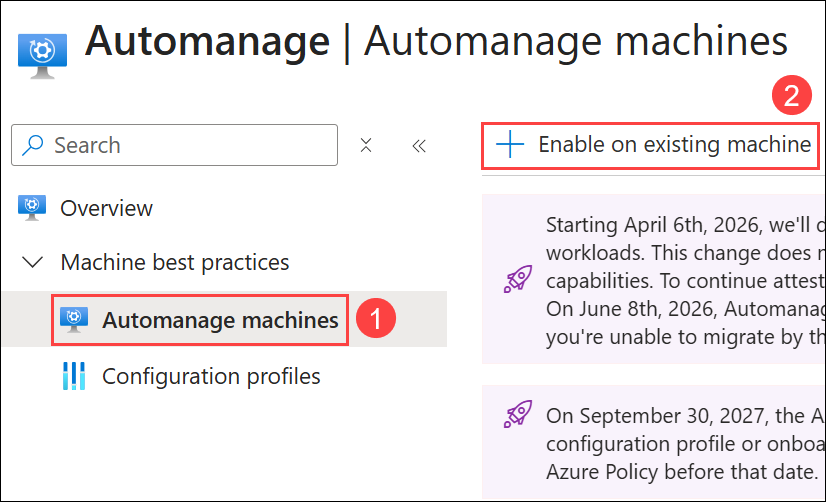

1. On the **Basics** tab, under **Configuration profile**, select your profile type: **Azure Best Practices - Production (1)** and click **Next : Machines (2)**.
   
   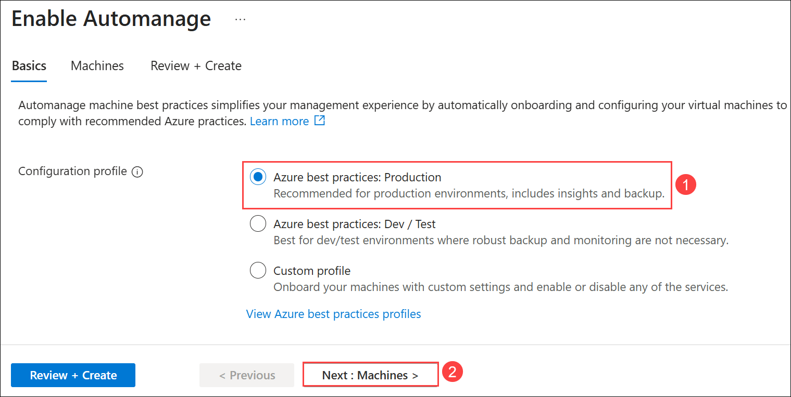
   
    > **Note:** Click View best practice profiles to see the differences between the environments.
    
    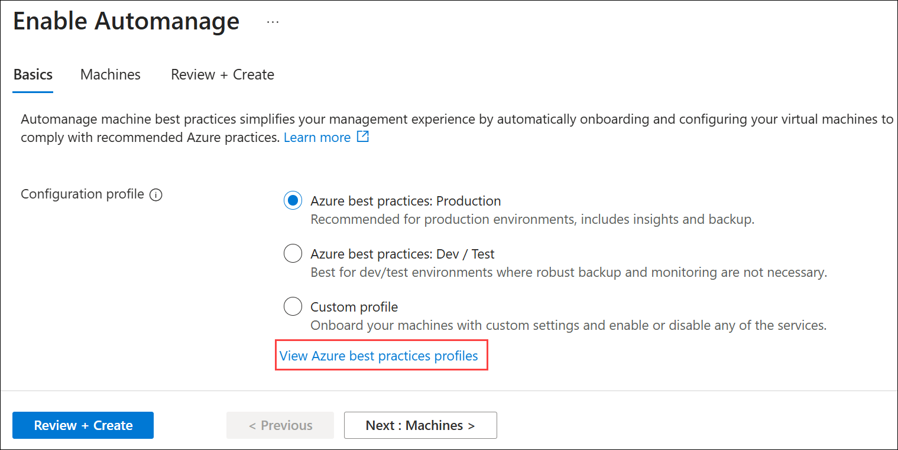

    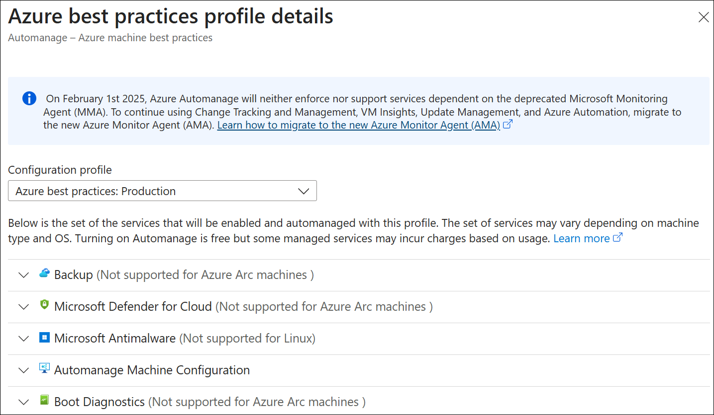

1. On the **Enable Automanage** page, select **Check eligibility on machines (1)**. After confirming that the **redhat** virtual machine is eligible, select the **redhat (2)** virtual machine, and then select **Review + Create (3)**.
   
    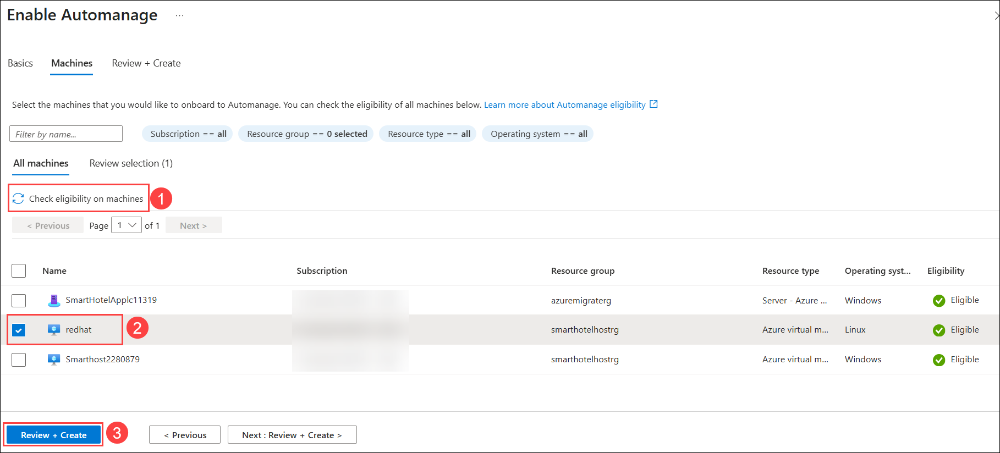

1. On the **Review + Create** tab, verify the selected configuration and click **Create** to enable Automanage. 

    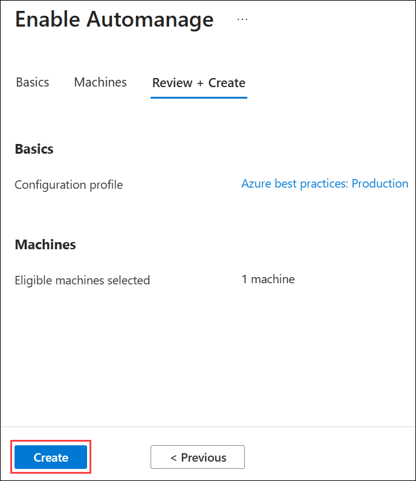

1. After the configuration profile assignment completes successfully, it may take 5-10 minutes for the Status to change to **Conformant**. Refresh the page periodically to view the latest status.

    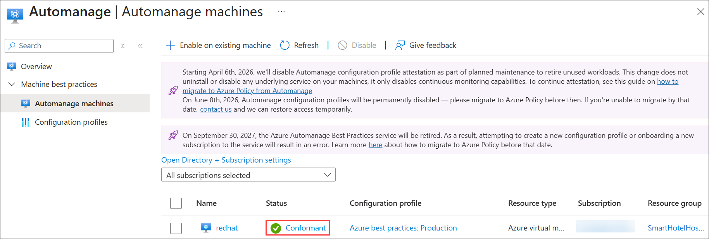

## Summary

In this exercise, you enabled Azure Active Directory (AAD) authentication and Managed Identity on virtual machines by deploying a VM extension. Additionally, you activated Automanage on existing machines to streamline configuration and monitoring. This process simplified identity management and automated the operational tasks necessary for managing VMs efficiently in Azure, ensuring enhanced security and compliance across the cloud environment.

Click on **Next** from the lower right corner to move on to the next page.

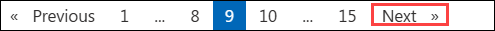
