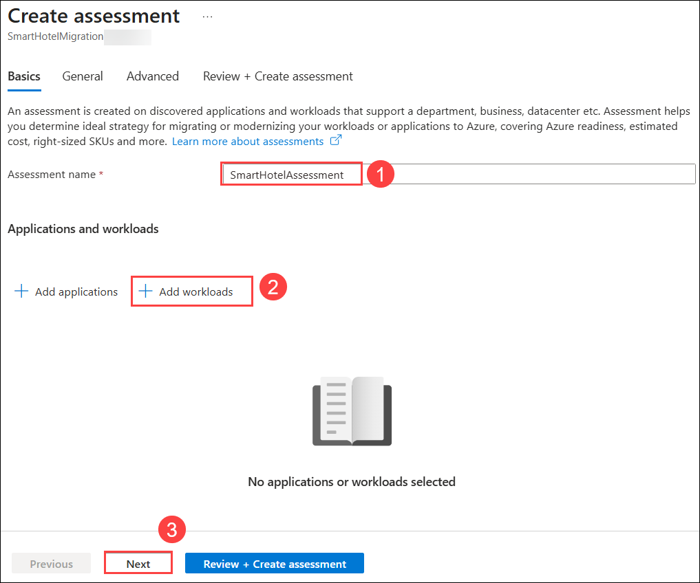
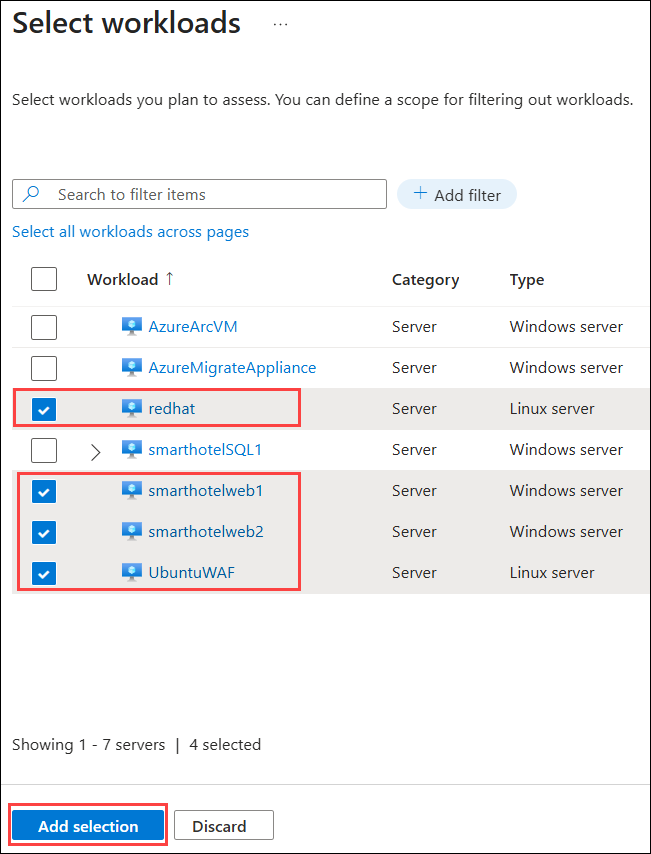
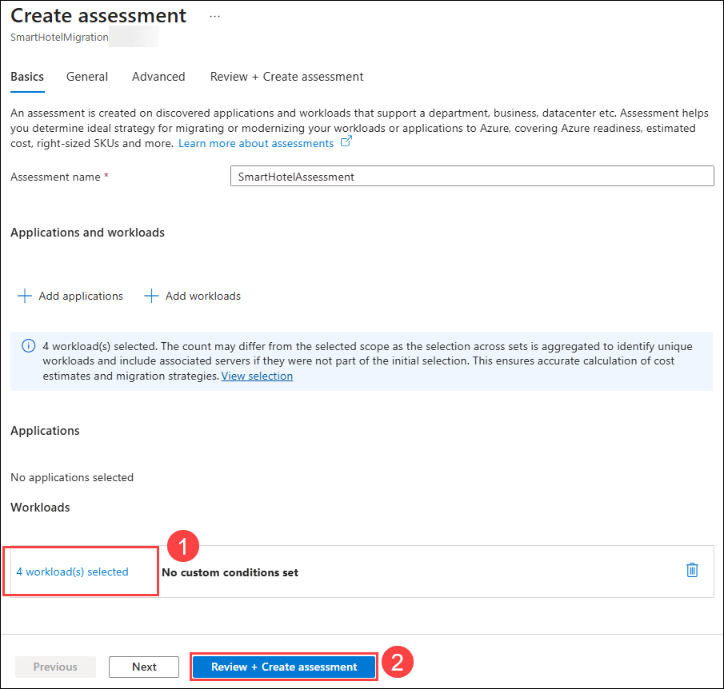
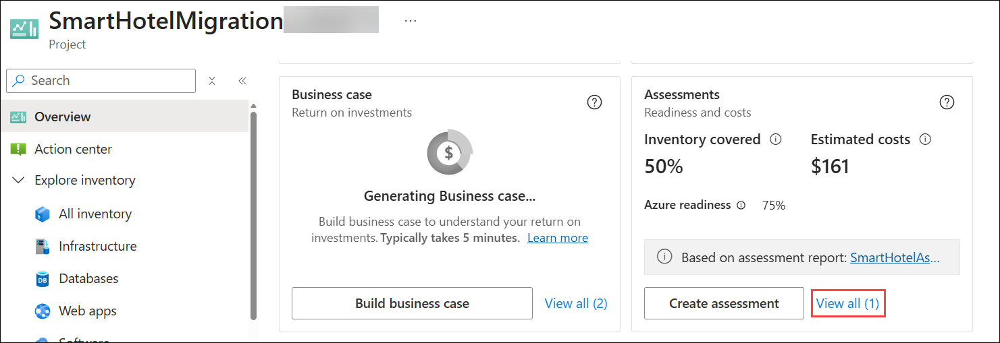
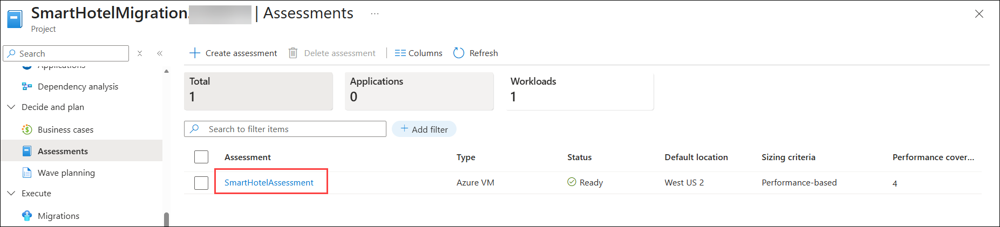
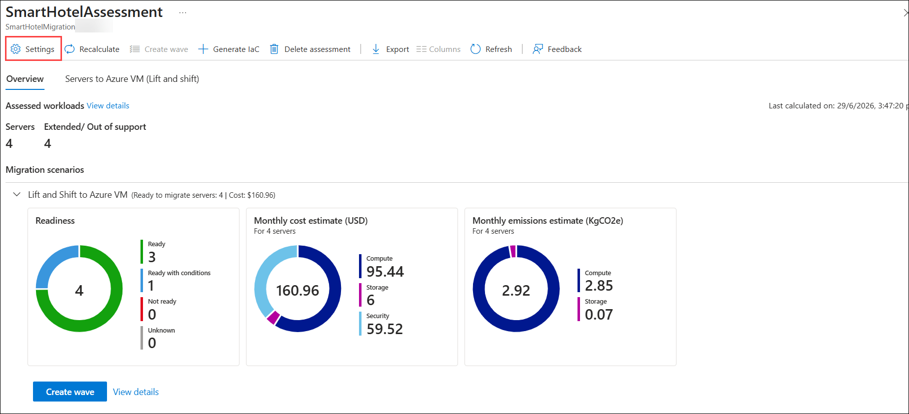
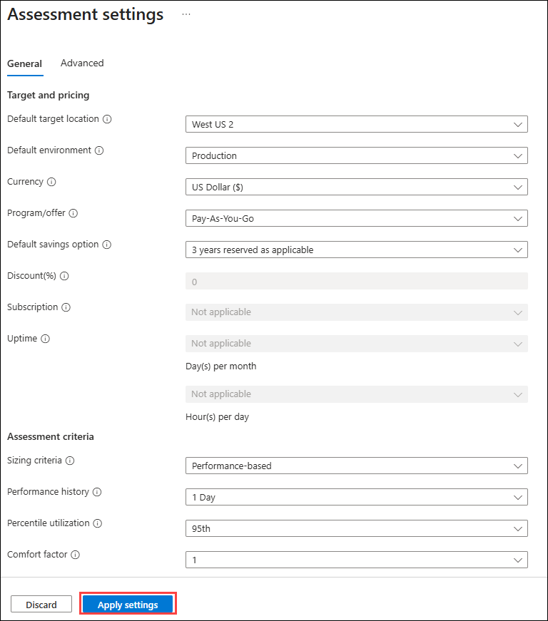
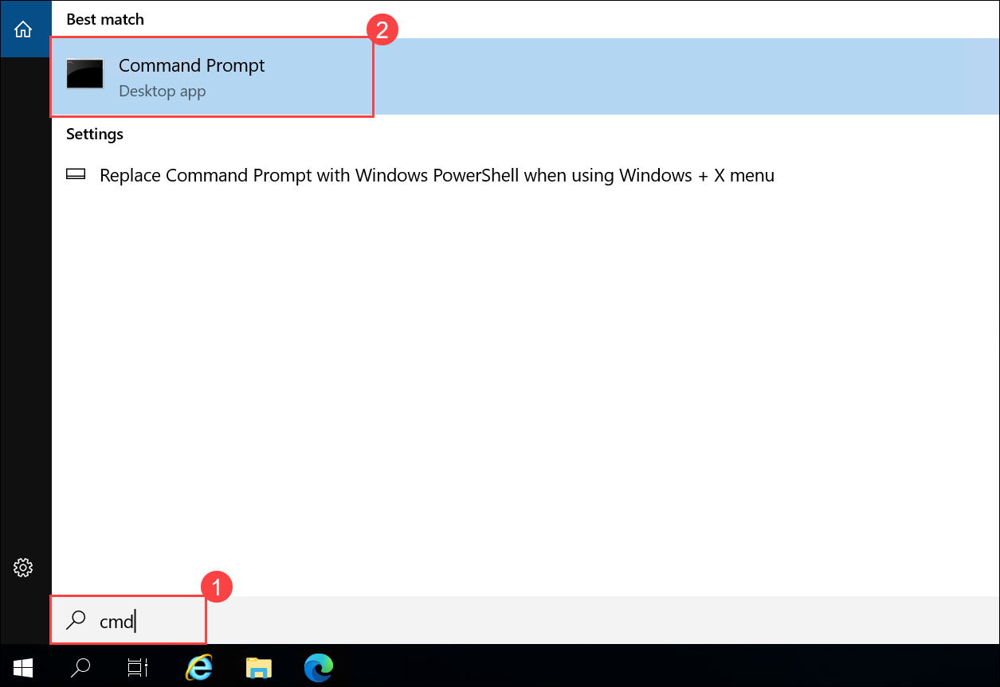
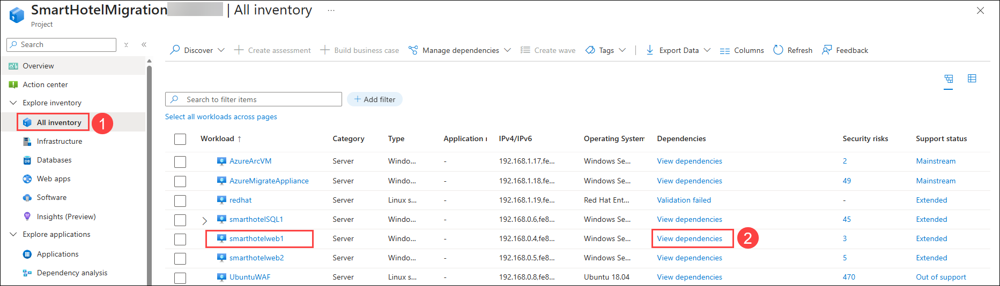
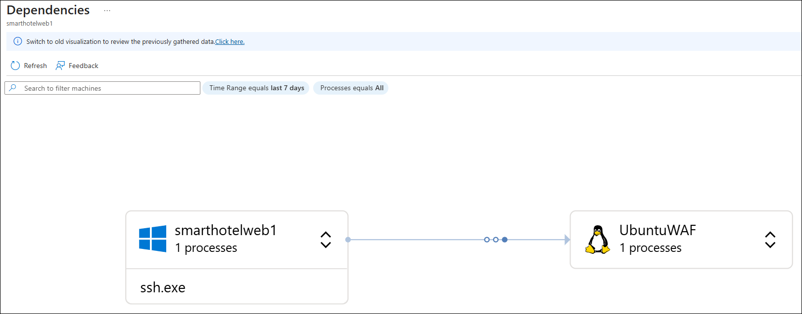

# Lab 02: Set up your environment on Azure to migrate servers

### Estimated Duration: 90 Minutes

In this lab, you will use Azure Migrate: Server Assessment to assess the already discovered on-prem servers by creating a migration assessment in your Azure Migrate project and configuring dependencies for migration. Azure Migrate assessment is a feature within the Azure Migrate service that helps evaluate the readiness and suitability of on-premises workloads for migration to Azure. It analyzes data collected during the discovery phase to provide insights into performance, cost estimation, and compatibility

## Lab Objectives

In this exercise, you will complete the following tasks:

- Task 1: Create a migration assessment
- Task 2: Generate workload communication
- Task 3: Review dependency analysis

### Task 1: Create a migration assessment

In this task, you will create a migration assessment for the SmartHotel application using Azure Migrate. The assessment will help you evaluate the readiness of the on-premises VMs for migration to Azure.

1.  On the **Azure Migrate** project **Overview (1)** page, under the **Assessments** section, click **Create assessment (2)**.

    

1.  On the **Create assessment** page, under the **Basics** tab, enter **Assessment name** as `SmartHotelAssessment` **(1)**. Then click **Add workloads (2)**. Select **Next (3)**.

    

1. On the **Select workloads** page, select the following workloads. After selecting the workloads, click **Add selection**.

    - **smarthotelweb1**
    - **smarthotelweb2**
    - **UbuntuWAF**
    - **redhat**

        

        > **Note**: Do not select **smarthotelSQL1**, **AzureMigrateAppliance**, or any other workloads, as they are not part of this migration scenario.
    
1. Back on the **Create assessment** page, verify that the selected workloads **(1)** are listed, then click **Review + Create assessment (2)**.

    

1. On the **Review + Create assessment** tab, review the assessment configuration and click **Create**.

    ")

    > **Note**: It may take up to **5 minutes** for the assessment to be created and appear in the **Assessments** list. If the assessment is not displayed, click **Refresh** in the upper-right corner of the page periodically until the **SmartHotelAssessment** assessment appears.

1. After creating the assessment, return to the **Azure Migrate** project **Overview** page. Under the **Assessments** section, click **View all**.

       

1. On the **Assessments** page, verify that the **SmartHotelAssessment** assessment is listed, then select **SmartHotelAssessment** to view its details. 

      

1. Review the assessment results displayed on the **Overview** page. Click **Settings**.

      

1. On the **Assessment settings** page, review the available settings under the **General** and **Advanced** tabs. Hover over the information icons to learn more about each setting. Modify any settings as desired, then click **Apply settings** to save your changes. If you do not want to modify any settings, click **Discard** to return to the assessment.

      

<!-- 
> **Congratulations** on completing the task! Now, it's time to validate it. Here are the steps:
> - Hit the Inline Validate button for the corresponding task. If you receive a success message, you can proceed to the next task. 
> - If not, carefully read the error message and retry the step, following the instructions in the lab guide.
> - If you need any assistance, please contact us at cloudlabs-support@spektrasystems.com. We are available 24/7 to help.

<validation step="d02af13b-6aaf-4dbf-b62a-659da8174d25" /> -->

### Task 2: Generate workload communication

In this task, you will establish an SSH connection from the **smarthotelweb1** virtual machine to the **UbuntuWAF** virtual machine. This generates communication between the workloads, allowing Azure Migrate to capture and visualize workload dependencies for migration planning.

1. On the **smarthotelweb1** virtual machine, type **cmd (1)** in the Windows search box and select **Command Prompt (2)** to open a command prompt.

    

    > **Note**: The **smarthotelweb1** virtual machine runs Windows Server with the Windows OpenSSH client installed, allowing you to connect to Linux virtual machines using SSH.

1. Run the following command to connect to the **UbuntuWAF** virtual machine:

    ```bash
    ssh demouser@192.168.0.8
    ```

    > **Note**: If **Ctrl + V** does not work in Command Prompt, right-click inside the window or press **Shift + Insert** to paste the command.

1. When prompted, type **yes** to trust the host, enter the password **<inject key="SmartHotel Admin Password" />**, and press **Enter**.

    

    > **Note**: Password characters are not displayed while typing. This behavior is expected.

1. After signing in, run the following command to switch to the root user:

    ```bash
    sudo -s
    ```
1. When prompted, enter the password **<inject key="SmartHotel Admin Password" />** and press **Enter**.

    > **Note**: Keep the SSH session open until you complete the dependency analysis exercise.

### Task 3: Review dependency analysis

When migrating a workload to Azure, it is important to understand all workload dependencies. Understanding workload dependencies is an important part of migration planning. Azure Migrate provides dependency analysis to help you identify communication between workloads, enabling you to validate application dependencies before migration.

1. In the **Azure Migrate** project, under **Explore inventory**, select **All inventory (1)**. Locate the **smarthotelweb1** workload. Under the **Dependencies** column, click **View dependencies (2)**.

      

1. Review the dependency map for the selected workload to understand its communication with other workloads in the environment.

    > **Note**: After enabling guest discovery, Azure Migrate may take up to **24 hours** to collect and display workload dependencies. During this time, you may see the message **"Unable to generate the new dependency view. Switch to the old view for previously gathered data."** This is expected behavior. You can ignore this message and continue with the remaining exercises. Once the dependency discovery process completes, the dependency view will be generated automatically.

      

## Summary

In this lab, you completed the following:

- Created an Azure Migrate migration assessment for the discovered workloads.
- Generated workload communication between servers to support dependency discovery.
- Reviewed workload dependency analysis to understand application communication before migration.

### You have successfully completed the lab. Click on **Next >>** to proceed with the next lab.


