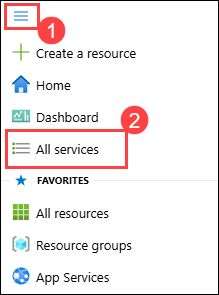
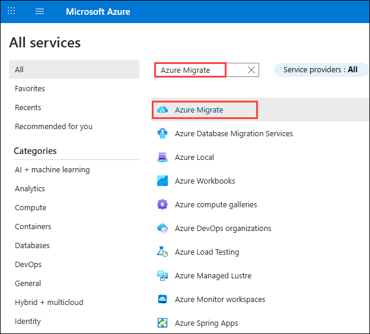
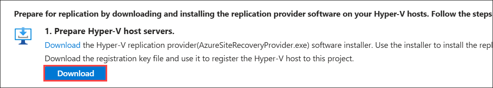

# Exercise 01: Migrating Applications and Data Using Microsoft Services, Azure Migrate, and the Azure Hybrid Benefit

### Estimated duration: 3 Hours

## Overview

In this exercise, you will migrate an on-premises Linux VM and database to Azure using Azure Migrate, Azure Site Recovery, and the Azure Hybrid Benefit. You'll walk through the key steps of discovery, replication, networking, and final migration—gaining hands-on experience with Microsoft's end-to-end migration tools.

## Lab objectives
In this exercise, you will complete the following tasks:

- Task 1: Review your on-prem Hyper-V Linux Server and OSS DB
- Task 2: Register the Hyper-V Host with Migration and modernization
- Task 3: Enable Replication from Hyper-V to Azure Migrate
- Task 4: Configure Networking
- Task 5: Server migration

## Task 1: Review your on-prem Hyper-V Linux Server and OSS DB

In this task, you will access the Hyper-V Manager to start and connect to the redhat VM, which contains an OSS Database. You'll log into this Red Hat server, preparing it for migration to Azure using Azure Migrate.
 
1. Click the **Start (1)** button, type **Hyper-V Manager (2)** in the search bar, and select **Hyper-V Manager (3)** from the results.

    
     
1. In Hyper-V Manager, select **HOSTVMS<inject key="DeploymentID" enableCopy="false" /> (1)**. You will see the **redhat VM (2)** along with six other VMs that will be used in the upcoming hands-on labs.

    
     
1. In Hyper-V Manager, select the **redhat (1)**, then select **Start (2)** on the right if not already running.

    

1. In Hyper-V Manager, select the **redhat (1)**, then select **Connect (2)** on the right.

    

1. Log into the VM with the **Administrator password**: **<inject key="SmartHotel Admin Password" />** (the login screen may pick up your local keyboard mapping, use the 'eyeball' icon to check).

1. You should be able to log in to your on-prem Redhat server hosted on Hyper-V. 

    

1. In the next task you will be migrating the Redhat server, and the OSS Database hosted in the Red Hat VM to the Azure with the help of Azure Migrate.

## Task 2: Register the Hyper-V Host with Migration and modernization

In this task, you will register your Hyper-V host(LabVM) with the Migration and Modernization service. This service uses Azure Site Recovery as the underlying migration engine. As part of the registration process, you will deploy the Azure Site Recovery Provider on your Hyper-V host.

1. Click on **Show Portal Menu (☰) (1)**  bar and select **All services (2)** from the left navigation pane.
 
    

2. In the search bar, search for **Azure Migrate** and select it from the suggestions to open the Azure Migrate Overview blade, as shown below. 
 
    

3. On the  **Azure Migrate | Servers, databases and web apps** page, expand **Migration goals (1)** from the left menu, then select **Servers, databases and web apps (2)**. Under **Migration tools**, click **Discover (3)**.

     new.png)

4. On the **Discover** pane, provide the following configuration:

   - For **Where do you want to migrate to?**, select **Azure VM (1)**.

   - For **Are your machines virtualized?**, select **Yes, with Hyper-V (2)**.

   - For **Target region**, select **<inject key="Region" enableCopy="false" />** **(3)** region.

   - Check the box to **Confirm the target region for migration (4)**.
   
   - Click **Create resources (5)** to deploy the necessary Azure Site Recovery resources.

     .png)

     > **Note:** Once deployment is complete, the 'Discover machines' panel should be updated with additional instructions.
  
5. On the **Discover** pane, under **Prepare Hyper-V host servers**, click the **Download** link to download the **Azure Site Recovery Provider** installer.

     .png)

6. Return to the **Discover** page in your browser, select the blue **Download** button and download the **registration key file**.

     

7. Open the **AzureSiteRecoveryProvider.exe** installer you downloaded a moment ago. On the **Microsoft Update** tab, select **Off (1)** and click on **Next (2)**. On the **Installation** screen, accept the default installation location and click **Install** to begin installation.

     .png "Azure Site Recovery Provider Setup")

     .png "Azure Site Recovery Provider Setup")

    > **Note:** If you are prompted with a pop-up, like the latest version of the Provider is installed on this server. Would you like to proceed to registration? select **Yes**. (You can directly jump to the next step in that case.)

8. When the installation has completed, on the **Installation** pane, click on **Register**.
    
    .png "Key file registration")

9. On the **Vault Settings** page, click **Browse (1)** to locate the registration key file you downloaded earlier. In the **Open** dialog, select the downloaded registration key file **(2)**, then click **Open (3)**. Once the key file is loaded, click **Next (4)** to proceed with the registration process.

     .png "Key file registration")

     .png "Key file registration")

10. On the **Proxy Settings** pane, select **Connect directly to Azure Site Recovery without a proxy server (1)**, then click **Next (2)** to proceed. This will initiate the registration of the Hyper-V host with Azure Site Recovery.

     .png)

11. On the **Registration** pane, wait for the message **The server was registered in the Azure Site Recovery vault** to appear. Once registration is complete, select **Finish** to close the wizard.

     .png "Registration complete")

12. Return to the **Azure Migrate** browser window. Refresh the page, then under **Migration and modernization**, select **Discover** to reopen the panel.
    
      - Set **Where do you want to migrate to?** to **Azure VM (1)**
      - Set **Are your machines virtualized?** to **Yes, with Hyper-V (2)**
      - Select **Finalize registration (3)**

     1.png)

13. Azure Migrate will now complete the registration with the Hyper-V host. **Wait** for the registration to complete. This may take 5-10 minutes.

     1.png "Finalizing registration...")

14. Once registration is complete, confirm the status shows **Registration finalized (1)**. Select **Close (2)** to exit the **Discover machines** panel.

     .png "Registration finalized")

15. On the  **Azure Migrate | Servers, databases and web apps** page, In the left-hand navigation pane, expand **Migration goals (1)**, then select **Servers, databases and web apps (2)**. In the **Migration tools** section under **Migration and modernization**, verify that the **Discovered servers** count displays **7** **(3)**.

     .png)

    You successfully registered your Hyper-V host with the Azure Migrate Server Migration service, enabling discovery and replication of on-premises virtual machines to Azure.

## Task 3: Enable Replication from Hyper-V to Azure Migrate

In this task, you will configure and enable the replication of your on-premises virtual machines from Hyper-V to the Azure Migrate Server Migration service.

1. On the  **Azure Migrate | Servers, databases and web apps** page, In the left-hand navigation pane, expand **Migration goals (1)**, then select **Servers, databases and web apps (2)**. In the **Migration tools** section under **Migration and modernization**, select **Replicate** **(3)**.

     .png "Replicate link")
   
2. Under the **Specific intent** page, provide the following details:

    -  What do you want to migrate? : Select **Servers or Virtual machines (VM)** **(1)**
    
    -  Where do you want to migrate to? : Select **Azure VM** **(2)**
  
    -  Are your machines virtualized? : Select **Yes, with Hyper-V (3)**
    
    -  Click on **Continue (4)**

       .png)

       >**Note:** If you get any error kindly refresh the screen periodically or Please try signing in to the Azure portal using incognito mode.

3. On the **Virtual machines** tab, set **Import migration settings from an assessment** to **No, I'll specify the migration settings manually (1)**. Then, select the virtual machine **redhat (2)**, and click **Next (5)** to proceed.

     

1. On the **Target settings** tab, select the following information:

    - Select your **Subscription (1)**
        
    - Select the existing **SmartHotelRG (2)** resource group. 

    - Leave the **Cache storage account** setting as **Auto-create (default) (3)**.

    - Under **Virtual Network**, choose **SmartHotelVNet (4)**. 

    - For the **Subnet:**, select **SmartHotel (5)**. 

    - Leave all other values as default and click **Next (6)**.
   
      

      > **Note:** For simplicity, in this lab, you will not configure the migrated VMs for high availability, since each application tier is implemented using a single VM.

6. On the **Compute** tab, select the below configuration, and select **Next (4)**. 

      | **Virtual Machine** | **VM Size (1)**    | **OS Type (2)** | **OS Dish (3)**    |
      |---------------------|----------------|-------------|-------------------------|
      | redhat           | Standard_F2s_v2 | Linux      | redhat (1)    |

      
    
1. In the **Disks** tab, review the configuration settings without making any changes. Select **Next**, then select **Replicate** to begin the server replication process.

    new22new2.png)

    new.png)

1. On the **Migration tools**, under **Migration and modernization**, select the **Overview** button.

     
    
1. Confirm that the number next to **Azure VM** under the **Replicate** section shows **1**, indicating one machine is replicating.

     

1. In the **Azure Migrate: Server Migration** page, expand the **Migration (1)** section in the left-hand menu and select **Replications (2)**. Select **Refresh (3)** and wait until the machine have a **Protected (4)** status, which shows the initial replication is complete. This will take 5-10 minutes.

     new1.png "Replication status")

    You enabled replication from your Hyper-V host to Azure Migrate and configured the virtual machine sizes to match target Azure specifications, preparing the VMs for migration.

## Task 4: Configure Networking

In this task, you will modify the settings for each replicated VM to use a static private IP address that matches the on-premises IP addresses for that machine.

1. In the **Azure Migrate: Server Migration** page, select the **redhat** virtual machine. This opens a detailed migration and replication blade for this machine. Take a moment to study this information.

    

1. On the left menu, expand **General (1)** and select **Compute and Network (2)**. Under the **Microsoft Azure** column, verify the **Size** is set to **F2s_v2** **(3)**.

    

1. In the **Compute and Network** section, scroll down to the **Network interfaces**. Select the **pencil icon** (✏️) next to the NIC name.
    
    

    >**Note:** If you get any error kindly refresh the screen periodically or Please try signing in to the Azure portal using incognito mode.

1. In the **Network interface** settings:

    - Under **IP address type**, select **Static** **(1)**.
    - In the **Private IP address** field, enter: `192.168.0.19` **(2)**.
    - Select **Apply** **(3)** to save the changes.

       

1. Select **Save** to apply the changes to the VM's configuration.

    

     In this task, you modified the settings for redhat VM to use a static private IP address that matches the on-premises IP addresses for that machine.

## Task 5: Server migration

In this task, you will perform a migration of the redhat machine to Azure.

> **Note:** In a real-world scenario, you would perform a test migration before the final migration. To save time, you will skip the test migration in this lab. The test migration process is very similar to the final migration.

1. On the **Azure Migrate: Server Migration** page, click on **Overview (1)** section and under Migrate to Azure, select **Migrate (2)**.

    .png)

1. On the **Specify intent** tab, Select **Azure VM (1)** under **Where do you want to migrate to?** and select **Continue (2)**.

    new.png "Replication summary")

3. On the **Migrate** blade, select the virtual machine **redhat (1)**, choose **Yes, shutdown virtual machines (Ensure no data loss) (2)**, then select **Migrate (3)** to start the migration process.

    new.png)

    > **Note:** You can optionally choose whether the on-premises virtual machines should be automatically shut down before migration to minimize data loss. Either setting will work for this lab.

4. The migration process will start.

    

5. On the **Azure Migrate: Server Migration** page, to monitor progress, expand **Migration (1)** on the left menu and select **Jobs (2)** and review the status of the one **Planned failover (3)** job.

    

6. **Wait** until the **Planned failover** job show **Status** to **Successful**. You should not need to refresh your browser. This could take up to **15 minutes**.

    

7. Navigate to the resource group, on the **Resource group** page, select the **SmartHotelRG** resource group.

    

7. Check that the **VM, disk** resources have been created for each of the migrated virtual machines.

    

    > **Congratulations** on completing the task! Now, it's time to validate it. Here are the steps:
    > - Hit the Inline Validate button for the corresponding task. If you receive a success message, you can proceed to the next task.
    > - If not, carefully read the error message and retry the step, following the instructions in the lab guide.
    > - If you need any assistance, please contact us at labs-support@spektrasystems.com. We are available 24/7 to help you out.

   <validation step="8bfe92e8-9f21-4236-91e8-b1c10057b564" />
   
    

## Summary

In this lab, you logged into the Red Hat VM in Hyper-V Manager to prepare for migration, reviewed the registered Hyper-V host in Azure Migrate Server Migration, enabled replication from Hyper-V to Azure while configuring the VM size, set a static private IP for the replicated VM to match on-premises settings, and used Azure Migrate to create an Azure VM with the replicated data.

### You have successfully completed the lab.

