# Exercise 01: Application and Data Migration Using Microsoft Services and Azure Migrate: Server Migration

### Estimated Duration: 3 hours

## Overview

In this exercise, you will learn about Azure migration and how all pre-migration steps, such as discovery, assessments, and right-sizing of on-premises resources, are included for infrastructure, data, and applications. Azure Migrate provides a simplified migration, modernization, and optimization service for Azure.
     `
## Lab objectives

In this exercise, you will complete the following tasks:

- Task 1: Create a Storage Account
- Task 2: Register the Hyper-V Host with Migration and modernization
- Task 3: Enable Replication from Hyper-V to Azure Migrate
- Task 4: Configure Networking
- Task 5: Server migration

## Task 1: Create a Storage Account

In this task, you will create a new Azure Storage Account that will be used by Migration and for the storage of your virtual machine data during migration.

> **Note:** This lab focuses on the technical tools required for workload migration. In a real-world scenario, more consideration should go into the long-term plan prior to migrating assets. The landing zone required to host VMs should also include considerations for network traffic, access control, resource organization, and governance. For example, the CAF Migration Blueprint and CAF Foundation Blueprint can be used to deploy a pre-defined landing zone and demonstrate the potential of an Infrastructure as Code (IaC) approach to infrastructure resource management. For more information, see [Azure Landing Zones](https://docs.microsoft.com/azure/cloud-adoption-framework/ready/landing-zone/) and [Cloud Adoption Framework Azure Migration landing zone Blueprint sample](https://docs.microsoft.com/azure/governance/blueprints/samples/caf-migrate-landing-zone/).

1. In the Azure portal, in the search bar at the top, type **Storage account** **(1)** and select **Storage accounts** **(2)** from the Services list.

    new.png)

2. On the **Storage accounts** page, click **Create** to start creating a new storage account.

    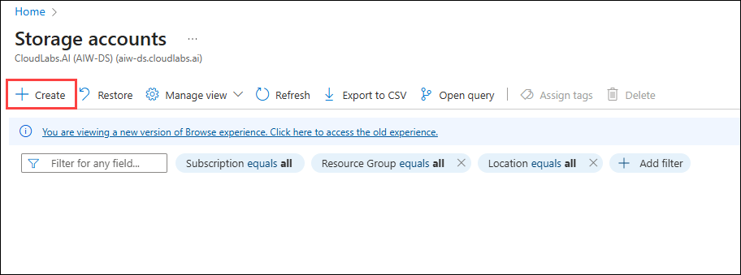

3. In the **Create a storage account** page , on the **Basics** tab, enter the following values:

   - Subscription: **Select your Azure subscription (1)**.
  
   - Resource group: **AzureMigrateRG (2)**
  
   - Storage account name: **migrationstorage<inject key="DeploymentID" enableCopy="false" /> (3)**

   - Region: Select **<inject key="Region" enableCopy="false" /> (4)** from the dropdown.

   - Primary Service: **Azure Blob Storage or Azure Data Lake Storage Gen 2 (5)**

   - Performance: **Standard (6)**
  
   - Redundancy: **Locally-redundant storage (LRS) (7)**
   
   - Click **Review + create** to continue **(8)**

     .png)

4. On the **Review + create** tab, verify the entered details. Click **Create** to deploy the storage account.

    new.png)

5. Once the storage account is successfully deployed, select **Go to resource** to open the newly created storage account.

    

6. Go to the **Data management (1)** section and select **Data protection (2)**. To enable replication for Virtual Machines, uncheck **Enable soft delete for blobs (3)** and **Enable soft delete for containers (4)**. Click **Save (5)** to apply the changes.

   new.png)

7. In the **Data management** section, select **Object replication (1)**. Click on **Advanced settings (2)**, check the box for **Allow cross-tenant replication (3)** and then click **OK (4)** to confirm your changes.

    .png)

    You created a new Azure Storage Account to support the migration and modernization process, providing the necessary storage for virtual machine replication data.

## Task 2: Register the Hyper-V Host with Migration and modernization

In this task, you will register your Hyper-V host(LabVM) with the Migration and Modernization service. This service uses Azure Site Recovery as the underlying migration engine. As part of the registration process, you will deploy the Azure Site Recovery Provider on your Hyper-V host.

1. Click on **Show Portal Menu (☰) (1)**  bar and select **All services (2)** from the left navigation pane.
 
    

2. In the search bar, search for **Azure Migrate** and select it from the suggestions to open the Azure Migrate Overview blade, as shown below. 
 
    

3. On the  **Azure Migrate | Servers, databases and web apps** page, expand **Migration goals (1)** from the left menu, then select **Servers, databases and web apps (2)**. Under **Migration tools**, click **Discover (3)**.

     new.png)

4. On the **Discover** pane, provide the following configuration:

   - For **Where do you want to migrate to?**, select **Azure VM (1)**.

   - For **Are your machines virtualized?**, select **Yes, with Hyper-V (2)**.

   - For **Target region**, select **<inject key="Region" enableCopy="false" />** **(3)** region.

   - Check the box to **Confirm the target region for migration (4)**.
   
   - Click **Create resources (5)** to deploy the necessary Azure Site Recovery resources.
     
     .png)

     > **Note:** Once deployment is complete, the 'Discover machines' panel should be updated with additional instructions.
  
5. On the **Discover** pane, under **Prepare Hyper-V host servers**, click the **Download** link to download the **Azure Site Recovery Provider** installer.

     .png)

6. Return to the **Discover** page in your browser, select the blue **Download** button and download the **registration key file**.

     

7. Open the **AzureSiteRecoveryProvider.exe** installer you downloaded a moment ago. On the **Microsoft Update** tab, select **Off (1)** and click on **Next (2)**. On the **Installation** screen, accept the default installation location and click **Install** to begin installation.

     .png "Azure Site Recovery Provider Setup")

     .png "Azure Site Recovery Provider Setup")

    > **Note:** If you are prompted with a pop-up, like the latest version of the Provider is installed on this server. Would you like to proceed to registration? select **Yes**. (You can directly jump to the next step in that case.)

8. When the installation has completed, on the **Installation** pane, click on **Register**.
    
    .png "Key file registration")

9. On the **Vault Settings** page, click **Browse (1)** to locate the registration key file you downloaded earlier. In the **Open** dialog, select the downloaded registration key file **(2)**, then click **Open (3)**. Once the key file is loaded, click **Next (4)** to proceed with the registration process.

     .png "Key file registration")

     .png "Key file registration")

10. On the **Proxy Settings** pane, select **Connect directly to Azure Site Recovery without a proxy server (1)**, then click **Next (2)** to proceed. This will initiate the registration of the Hyper-V host with Azure Site Recovery.

     .png)

11. On the **Registration** pane, wait for the message **The server was registered in the Azure Site Recovery vault** to appear. Once registration is complete, select **Finish** to close the wizard.

     .png "Registration complete")

12. Return to the **Azure Migrate** browser window. Refresh the page, then under **Migration and modernization**, select **Discover** to reopen the panel.
    
      - Set **Where do you want to migrate to?** to **Azure VM (1)**
      - Set **Are your machines virtualized?** to **Yes, with Hyper-V (2)**
      - Select **Finalize registration (3)**

     1.png)

13. Azure Migrate will now complete the registration with the Hyper-V host. **Wait** for the registration to complete. This may take 5-10 minutes.

     1.png "Finalizing registration...")

14. Once registration is complete, confirm the status shows **Registration finalized (1)**. Select **Close (2)** to exit the **Discover machines** panel.

     .png "Registration finalized")

15. On the  **Azure Migrate | Servers, databases and web apps** page, In the left-hand navigation pane, expand **Migration goals (1)**, then select **Servers, databases and web apps (2)**. In the **Migration tools** section under **Migration and modernization**, verify that the **Discovered servers** count displays **7** **(3)**.

     .png)

    You successfully registered your Hyper-V host with the Azure Migrate Server Migration service, enabling discovery and replication of on-premises virtual machines to Azure.

## Task 3: Enable Replication from Hyper-V to Azure Migrate

In this task, you will configure and enable the replication of your on-premises virtual machines from Hyper-V to the Azure Migrate Server Migration service.

1. On the  **Azure Migrate | Servers, databases and web apps** page, In the left-hand navigation pane, expand **Migration goals (1)**, then select **Servers, databases and web apps (2)**. In the **Migration tools** section under **Migration and modernization**, select **Replicate** **(3)**.

     .png "Replicate link")
   
2. Under the **Specific intent** page, provide the following details:

    -  What do you want to migrate? : Select **Servers or Virtual machines (VM)** **(1)**
    
    -  Where do you want to migrate to? : Select **Azure VM** **(2)**
  
    -  Are your machines virtualized? : Select **Yes, with Hyper-V (3)**
    
    -  Click on **Continue (4)**

       .png)

       >**Note:** If you get any error kindly refresh the screen periodically or Please try signing in to the Azure portal using incognito mode.

3. On the **Virtual machines** tab, set **Import migration settings from an assessment** to **No, I'll specify the migration settings manually (1)**. Then, select the virtual machines **smarthotelweb1 (2)**, **UbuntuWAF (3)** and **smarthotelweb2 (4)**, and click **Next (5)** to proceed.

     

1. On the **Target settings** tab, select the following information:

    - Select your **Subscription (1)**
        
    - Select the existing **SmartHotelHostRG (2)** resource group. 

    - For the **Cache storage account:** select the storage account you created in task 1 from the drop-down **(3)**. 

    - Under **Virtual Network**, choose **SmartHotelVNet (4)**. 

    - For the **Subnet:**, select **SmartHotel (5)**. 

    - Leave all other values as default and click **Next (6)**.
   
      

      > **Note:** For simplicity, in this lab, you will not configure the migrated VMs for high availability, since each application tier is implemented using a single VM.

6. On the **Compute** tab, select the below configuration, and select **Next (4)**. 

      | **Virtual Machine** | **VM Size (1)**    | **OS Type (2)** | **Operating System (3)**    |
      |---------------------|----------------|-------------|-------------------------|
      | smarthotelweb1      | Standard_F2s_v2 | Windows    | Windows Server 2019     |
      | smarthotelweb2      | Standard_F2s_v2 | Windows    | Windows Server 2019     |
      | UbuntuWAF           | Standard_F2s_v2 | Linux      | Redhat Enterprise 8     |

      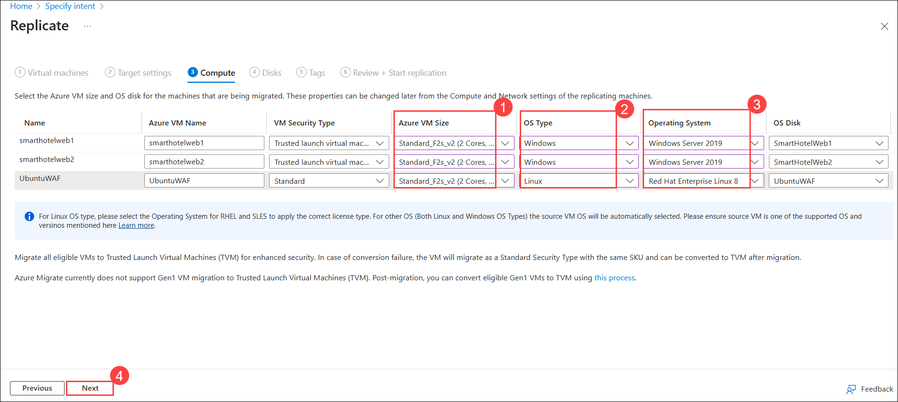
    
1. In the **Disks** tab, review the configuration settings without making any changes. Select **Next**, then select **Replicate** to begin the server replication process.

    new22.png)

    new.png)

1. On the **Migration tools**, under **Migration and modernization**, select the **Overview** button.

     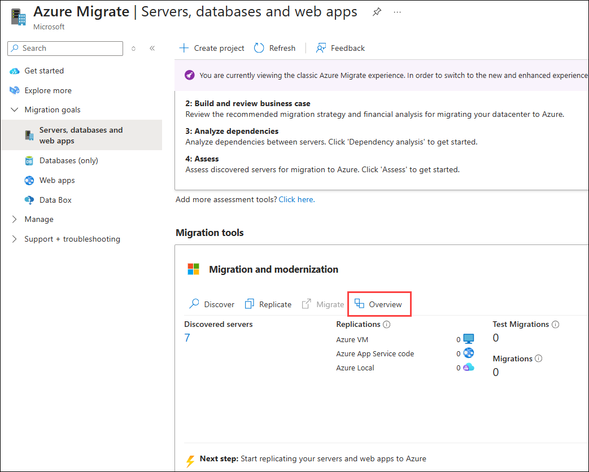
    
1. Confirm that the number next to **Azure VM** under the **Replicate** section shows **3**, indicating two machines are replicating.

     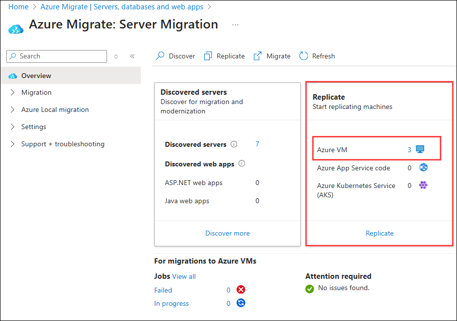

1. In the **Azure Migrate: Server Migration** page, expand the **Migration (1)** section in the left-hand menu and select **Replications (2)**. Select **Refresh (3)** and wait until all three machines have a **Protected (4)** status, which shows the initial replication is complete. This will take 5-10 minutes.

     .png "Replication status")

    You enabled replication from your Hyper-V host to Azure Migrate and configured the virtual machine sizes to match target Azure specifications, preparing the VMs for migration.

## Task 4: Configure Networking

In this task, you will modify the settings for each replicated VM to use a static private IP address that matches the on-premises IP addresses for that machine.

1. In the **Azure Migrate: Server Migration** page, select the **smarthotelweb1** virtual machine. This opens a detailed migration and replication blade for this machine. Take a moment to study this information.

    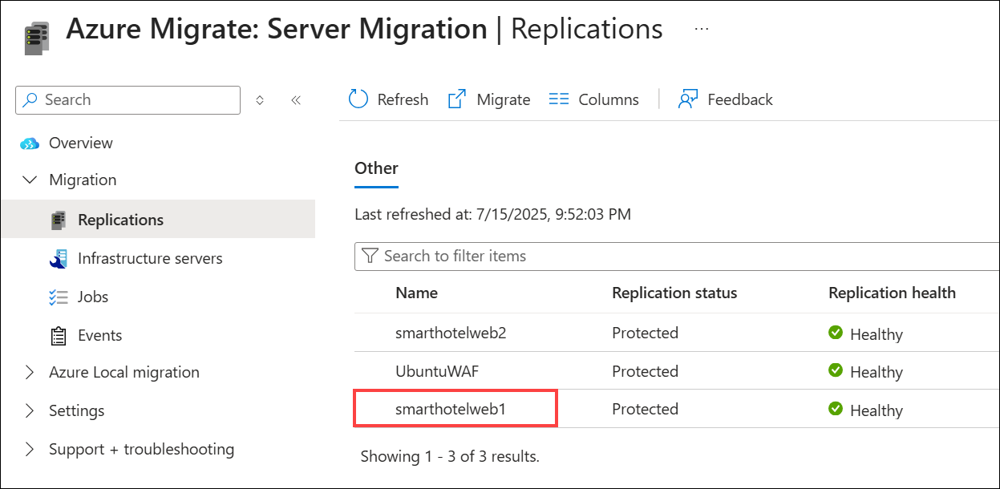

1. On the left menu, expand **General (1)** and select **Compute and Network (2)**. Under the **Microsoft Azure** column, verify the **Size** is set to **F2s_v2** **(3)**.

    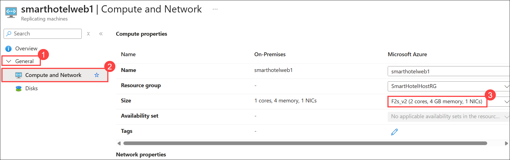

1. In the **Compute and Network** section, scroll down to the **Network interfaces**. Select the **pencil icon** (✏️) next to the NIC name.
    
    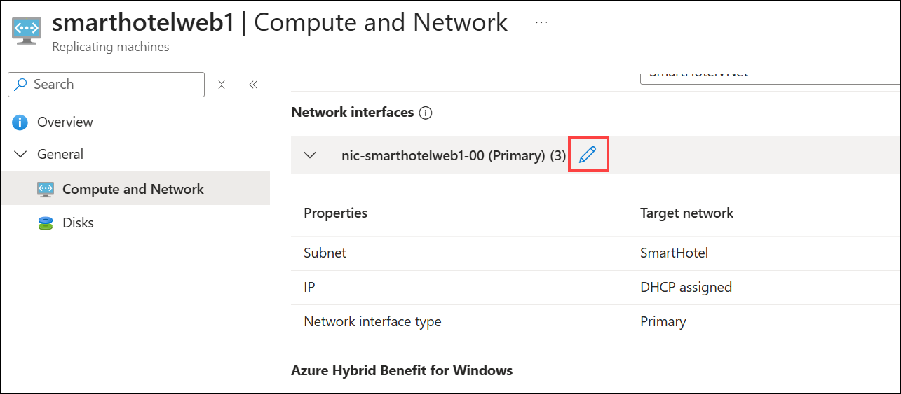

1. In the **Network interface** settings:

    - Under **IP address type**, select **Static** **(1)**.
    - In the **Private IP address** field, enter: `192.168.0.4` **(2)**.
    - Select **Apply** **(3)** to save the changes.

       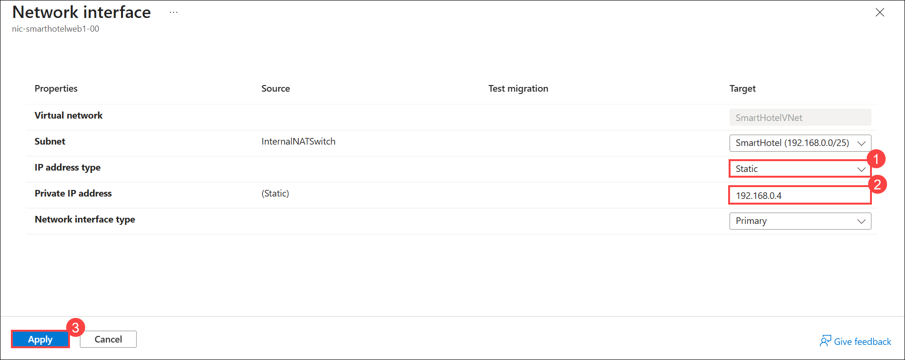

1. Select **Save** to apply the changes to the VM's configuration.

    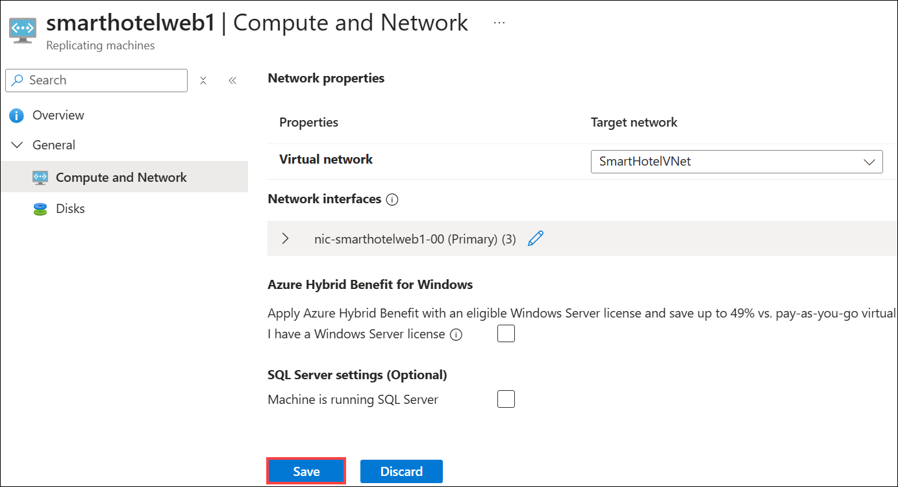

1. Repeat these steps to configure the private IP address for the other VMs.
 
   - For **smarthotelweb2** use private IP address **192.168.0.5**
  
   - For **UbuntuWAF** use private IP address **192.168.0.8**

     In this task, you modified the settings for each replicated VM to use a static private IP address that matches the on-premises IP addresses for that machine

## Task 5: Server migration

In this task, you will perform a migration of the smarthotelweb1, and smarthotelweb2 machines to Azure.

> **Note:** In a real-world scenario, you would perform a test migration before the final migration. To save time, you will skip the test migration in this lab. The test migration process is very similar to the final migration.

1. On the **Azure Migrate: Server Migration** page, click on **Overview (1)** section and under Migrate to Azure, select **Migrate (2)**.

    .png)

1. On the **Specify intent** tab, Select **Azure VM (1)** under **Where do you want to migrate to?** and select **Continue (2)**.

    new.png "Replication summary")

3. On the **Migrate** blade, select the virtual machines **smarthotelweb2, UbuntuWAF and smarthotelweb1 (1)**, choose **Yes, shutdown virtual machines (Ensure no data loss) (2)**, then select **Migrate (3)** to start the migration process.

    .png)

    > **Note:** You can optionally choose whether the on-premises virtual machines should be automatically shut down before migration to minimize data loss. Either setting will work for this lab.

4. The migration process will start.

    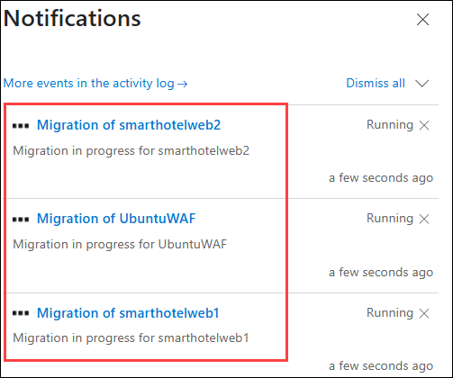

5. On the **Azure Migrate: Server Migration** page, to monitor progress, expand **Migration (1)** on the left menu and select **Jobs (2)** and review the status of the three **Planned failover (3)** jobs.

    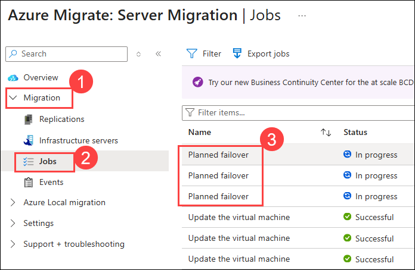

6. **Wait** until all two **Planned failover** jobs show **Status** to **Successful**. You should not need to refresh your browser. This could take up to **15 minutes**.

    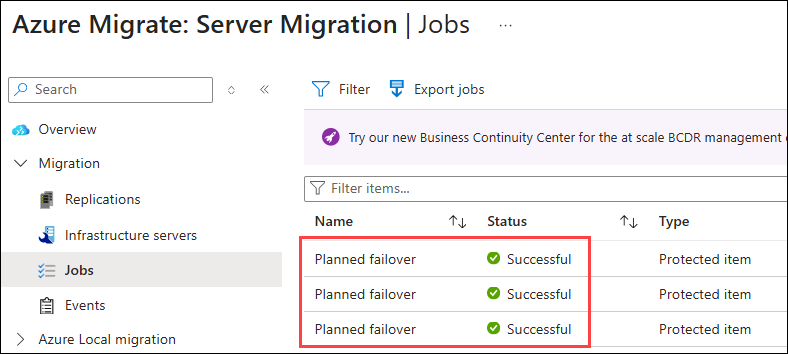

7. Navigate to the resource group, on the **Resource group** page, select the **SmartHotelHostRG** resource group.

    

7. Check that the **VM, network interface and disk** resources have been created for each of the migrated virtual machines.

    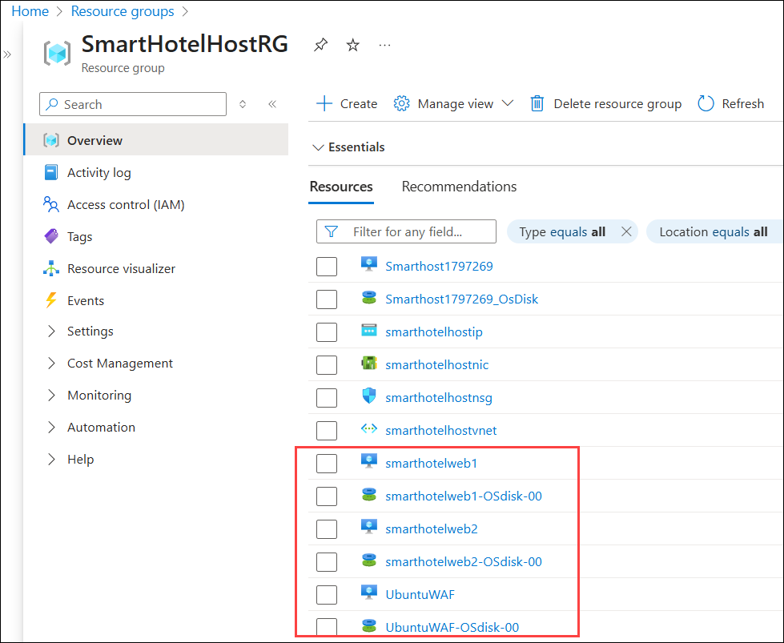

## Summary 

In this lab, you learned how to migrate Windows Servers from Hyper-V to Azure using Azure Migrate: Server Migration. You created a storage account for migration data, registered your Hyper-V host with Azure Migrate, and configured replication for virtual machines. The lab provided essential knowledge on discovery, replication, and migration to Azure.

### You have successfully completed the Hands-on Lab.
