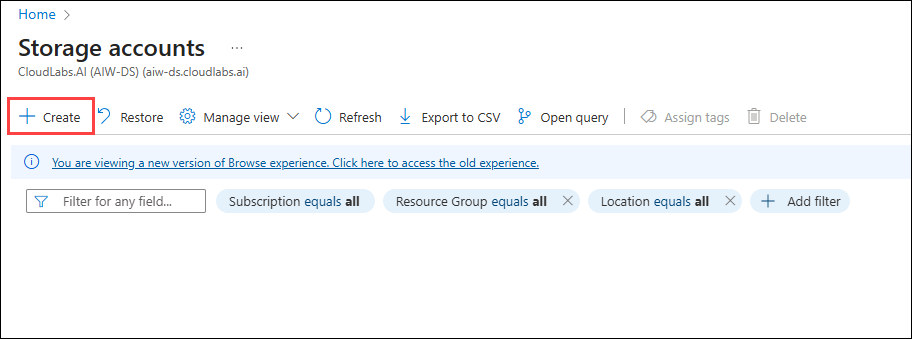
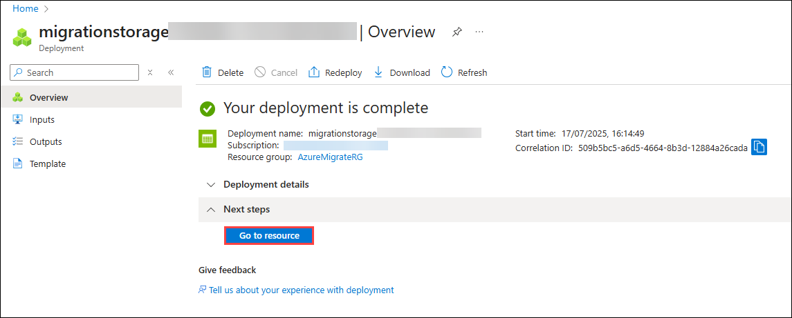
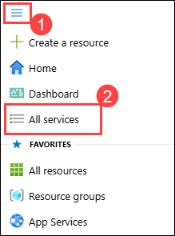
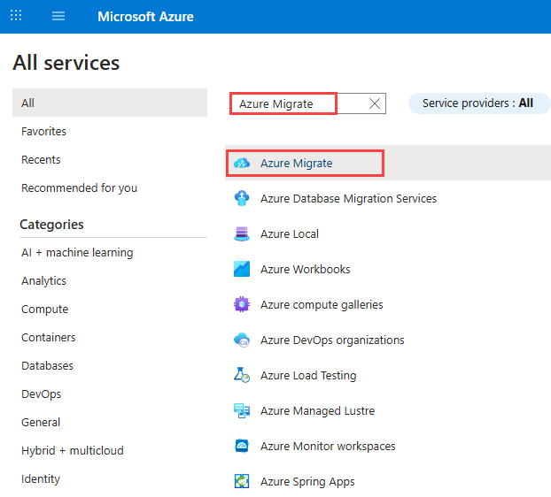
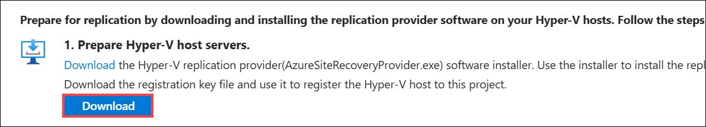
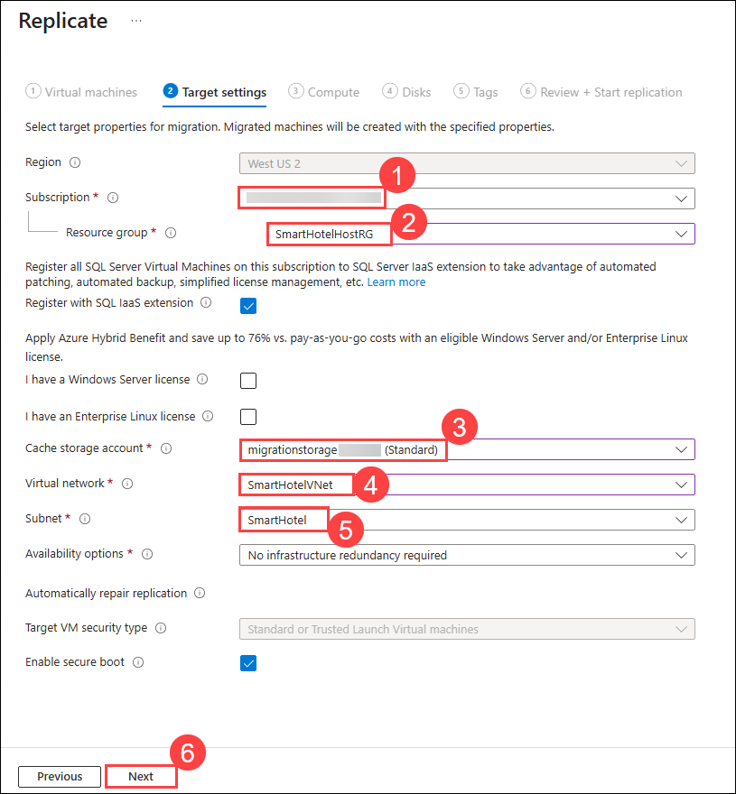
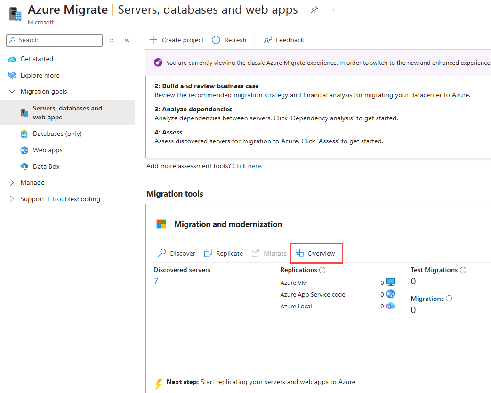
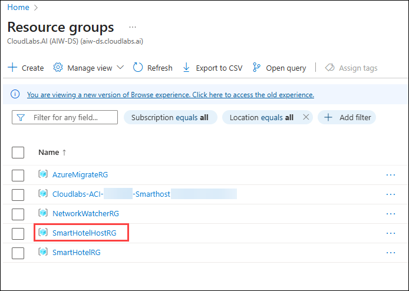

# Lab 01: Migrate Windows Servers from Hyper-V to Azure

### Estimated Duration: 6 hours

## Overview
In this Guided Lab, you will learn about Azure migration and how all pre-migration steps, such as discovery, assessments, and right-sizing of on-premises resources, are included for infrastructure, data, and applications. Azure Migrate provides a simplified migration, modernization, and optimization service for Azure.

## Lab objectives

In this exercise, you will complete the following tasks:

- Task 1: Create a Storage Account
- Task 2: Register the Hyper-V Host with Migration and modernization
- Task 3: Enable Replication from Hyper-V to Azure Migrate
- Task 4: Server migration
- Task 5: Pointers around Azure Networking and Azure Network Security (Read only)
- Task 6: Migrating VMware VMs to Azure (Read only)

## Task 1: Create a Storage Account

In this task, you will create a new Azure Storage Account that will be used by Migration and for the storage of your virtual machine data during migration.

> **Note:** This lab focuses on the technical tools required for workload migration. In a real-world scenario, more consideration should go into the long-term plan prior to migrating assets. The landing zone required to host VMs should also include considerations for network traffic, access control, resource organization, and governance. For example, the CAF Migration Blueprint and CAF Foundation Blueprint can be used to deploy a pre-defined landing zone and demonstrate the potential of an Infrastructure as Code (IaC) approach to infrastructure resource management. For more information, see [Azure Landing Zones](https://docs.microsoft.com/azure/cloud-adoption-framework/ready/landing-zone/) and [Cloud Adoption Framework Azure Migration landing zone Blueprint sample](https://docs.microsoft.com/azure/governance/blueprints/samples/caf-migrate-landing-zone/).

1. In the Azure portal, in the search bar at the top, type **Storage account** **(1)** and select **Storage accounts** **(2)** from the Services list.

    new.png)

2. On the **Storage accounts** page, click **Create** to start creating a new storage account.

    

3. In the **Create a storage account** page , on the **Basics** tab, enter the following values:

   - Subscription: **Select your Azure subscription (1)**.
  
   - Resource group: **AzureMigrateRG (2)**
  
   - Storage account name: **migrationstorage<inject key="DeploymentID" enableCopy="false" /> (3)**

   - Region: Select **<inject key="Region" enableCopy="false" /> (4)** from the dropdown.

   - Performance: **Standard (5)**
  
   - Redundancy: **Locally-redundant storage (LRS) (6)**
   
   - Click **Review + create** to continue **(7)**

     new1.png)

4. On the **Review + create** tab, verify the entered details. Click **Create** to deploy the storage account.

    new.png)

5. Once the storage account is successfully deployed, select **Go to resource** to open the newly created storage account.

    

6. Go to the **Data management (1)** section and select **Data protection (2)**. To enable replication for Virtual Machines, uncheck **Enable soft delete for blobs (3)** and **Enable soft delete for containers (4)**. Click **Save (5)** to apply the changes.

   new.png)

7. In the **Data management** section, select **Object replication (1)**. Click on **Advanced settings (2)**, check the box for **Allow cross-tenant replication (3)** and then click **OK (4)** to confirm your changes.

    .png)

    You created a new Azure Storage Account to support the migration and modernization process, providing the necessary storage for virtual machine replication data.

## Task 2: Register the Hyper-V Host with Migration and modernization

In this task, you will register your Hyper-V host(LabVM) with the Migration and Modernization service. This service uses Azure Site Recovery as the underlying migration engine. As part of the registration process, you will deploy the Azure Site Recovery Provider on your Hyper-V host.

1. Click on **Show Portal Menu (☰) (1)**  bar and select **All services (2)** from the left navigation pane.
 
    

2. In the search bar, search for **Azure Migrate** and select it from the suggestions to open the Azure Migrate Overview blade, as shown below. 
 
    

3. On the  **Azure Migrate | Servers, databases and web apps** page, expand **Migration goals (1)** from the left menu, then select **Servers, databases and web apps (2)**. Under **Migration tools**, click **Discover (3)**.

   > **Note:** You may need to add the migration tool yourself by following the link below the **Migration Tools** section, selecting **Migration and modernization**, then selecting **Add tool(s)**.
   
     new.png)

4. On the **Discover** pane, provide the following configuration:

   - For **Where do you want to migrate to?**, select **Azure VM (1)**.

   - For **Are your machines virtualized?**, select **Yes, with Hyper-V (2)**.

   - For **Target region**, select **<inject key="Region" enableCopy="false" />** **(3)** region.

   - Check the box to **Confirm the target region for migration (4)**.
   
   - Click **Create resources (5)** to deploy the necessary Azure Site Recovery resources.

     .png)

     > **Note:** Once deployment is complete, the 'Discover machines' panel should be updated with additional instructions.
  
5. On the **Discover** pane, under **Prepare Hyper-V host servers**, click the **Download** link to download the **Azure Site Recovery Provider** installer.

     .png)

6. Return to the **Discover** page in your browser, select the blue **Download** button and download the **registration key file**.

     

7. Open the **AzureSiteRecoveryProvider.exe** installer you downloaded a moment ago. On the **Microsoft Update** tab, select **Off (1)** and click on **Next (2)**. On the **Installation** screen, accept the default installation location and click **Install** to begin installation.

     .png "Azure Site Recovery Provider Setup")

     .png "Azure Site Recovery Provider Setup")

    > **Note:** If you are prompted with a pop-up, like the latest version of the Provider is installed on this server. Would you like to proceed to registration? select **Yes**. (You can directly jump to the next step in that case.)

8. When the installation has completed, on the **Installation** pane, click on **Register**.
    
    .png "Key file registration")

9. On the **Vault Settings** page, click **Browse (1)** to locate the registration key file you downloaded earlier. In the **Open** dialog, select the downloaded registration key file **(2)**, then click **Open (3)**. Once the key file is loaded, click **Next (4)** to proceed with the registration process.

     .png "Key file registration")

     .png "Key file registration")

10. On the **Proxy Settings** pane, select **Connect directly to Azure Site Recovery without a proxy server (1)**, then click **Next (2)** to proceed. This will initiate the registration of the Hyper-V host with Azure Site Recovery.

     .png)

11. On the **Registration** pane, wait for the message **The server was registered in the Azure Site Recovery vault** to appear. Once registration is complete, select **Finish** to close the wizard.

     .png "Registration complete")

12. Return to the **Azure Migrate** browser window. Refresh the page, then under **Migration and modernization**, select **Discover** to reopen the panel.
    
      - Set **Where do you want to migrate to?** to **Azure VM (1)**
      - Set **Are your machines virtualized?** to **Yes, with Hyper-V (2)**
      - Select **Finalize registration (3)**

     1.png)

13. Azure Migrate will now complete the registration with the Hyper-V host. **Wait** for the registration to complete. This may take 5-10 minutes.

     1.png "Finalizing registration...")

14. Once registration is complete, confirm the status shows **Registration finalized (1)**. Select **Close (2)** to exit the **Discover machines** panel.

     .png "Registration finalized")

15. On the  **Azure Migrate | Servers, databases and web apps** page, In the left-hand navigation pane, expand **Migration goals (1)**, then select **Servers, databases and web apps (2)**. In the **Migration tools** section under **Migration and modernization**, verify that the **Discovered servers** count displays **7** **(3)**.

     .png)

    > **Congratulations** on completing the task! Now, it's time to validate it. Here are the steps:
    > - Hit the Inline Validate button for the corresponding task. If you receive a success message, you can proceed to the next task.
    > - If not, carefully read the error message and retry the step, following the instructions in the lab guide.
    > - If you need any assistance, please contact us at labs-support@spektrasystems.com. We are available 24/7 to help you out.
    
    <validation step="a6405ea6-b97d-4e45-8cf8-c8997009392d" />
   

    You successfully registered your Hyper-V host with the Azure Migrate Server Migration service, enabling discovery and replication of on-premises virtual machines to Azure.

## Task 3: Enable Replication from Hyper-V to Azure Migrate

In this task, you will configure and enable the replication of your on-premises virtual machines from Hyper-V to the Azure Migrate Server Migration service.

1. On the  **Azure Migrate | Servers, databases and web apps** page, In the left-hand navigation pane, expand **Migration goals (1)**, then select **Servers, databases and web apps (2)**. In the **Migration tools** section under **Migration and modernization**, select **Replicate** **(3)**.

     .png "Replicate link")
   
2. Under the **Specific intent** page, provide the following details:

    -  What do you want to migrate? : Select **Servers or Virtual machines (VM)** **(1)**
    
    -  Where do you want to migrate to? : Select **Azure VM** **(2)**
  
    -  Are your machines virtualized? : Select **Yes, with Hyper-V (3)**
    
    -  Click on **Continue (4)**

       .png)

       >**Note:** If you get any error kindly refresh the screen periodically or Please try signing in to the Azure portal using incognito mode.

3. On the **Virtual machines** tab, set **Import migration settings from an assessment** to **No, I'll specify the migration settings manually (1)**. Then, select the virtual machines **smarthotelweb1 (2)** and **smarthotelweb2 (3)**, and click **Next (4)** to proceed.

     1.png)

1. On the **Target settings** tab, select the following information:

    - Select your **Subscription (1)**
        
    - Select the existing **SmartHotelHostRG (2)** resource group. 

    - For the **Cache storage account:** select the storage account you created in task 1 from the drop-down **(3)**. 

    - Under **Virtual Network**, choose **SmartHotelVNet (4)**. 

    - For the **Subnet:**, select **SmartHotel (5)**. 

    - Leave all other values as default and click **Next (6)**.
   
      

      > **Note:** For simplicity, in this lab, you will not configure the migrated VMs for high availability, since each application tier is implemented using a single VM.

1. On the **Compute** tab, select the configuration below:

    - Select **Standard (1)** as the **VM Security Type**.

    - Choose **Standard_F2s_v2 (2)** as **Azure VM Size**.

    - Select the **OS Type** as **Windows (3)**.

    - Select **Next (4)**. 

      new1.png)
    
1. In the **Disks** tab, review the configuration settings without making any changes. Select **Next**, then select **Replicate** to begin the server replication process.

    new22.png)

    new.png)

1. On the **Migration tools**, under **Migration and modernization**, select the **Overview** button.

     
    
1. Confirm that the number next to **Azure VM** under the **Replicate** section shows **2**, indicating two machines are replicating.

     new.png)

1. In the **Azure Migrate: Server Migration** page, expand the **Migration (1)** section in the left-hand menu and select **Replications (2)**. Select **Refresh (3)** and wait until all two machines have a **Protected (4)** status, which shows the initial replication is complete. This will take 5-10 minutes.

     new.png "Replication status")

   > **Note:** Please make sure you run the **validation steps** for this task before moving to the next tasks as there are a few dependencies. **Not** running the validation after performing this task will result in **validation failure** as the status of the Virtual Machine will be changed from **Protected** to **Planned failover** when you migrate the servers in Task 4.
    > **Congratulations** on completing the task! Now, it's time to validate it. Here are the steps:
    > - Hit the Inline Validate button for the corresponding task. If you receive a success message, you can proceed to the next task.
    > - If not, carefully read the error message and retry the step, following the instructions in the lab guide.
    > - If you need any assistance, please contact us at labs-support@spektrasystems.com. We are available 24/7 to help you out.
    
    <validation step="216eebdd-a59b-4f61-a316-af714d0c342e" />

    You enabled replication from your Hyper-V host to Azure Migrate and configured the virtual machine sizes to match target Azure specifications, preparing the VMs for migration.

## Task 4: Server migration

In this task, you will perform a migration of the smarthotelweb1, and smarthotelweb2 machines to Azure.

> **Note:** In a real-world scenario, you would perform a test migration before the final migration. To save time, you will skip the test migration in this lab. The test migration process is very similar to the final migration.

1. On the **Azure Migrate: Server Migration** page, click on **Overview (1)** section and under Migrate to Azure, select **Migrate (2)**.

    .png)

1. On the **Specify intent** tab, Select **Azure VM (1)** under **Where do you want to migrate to?** and select **Continue (2)**.

    new.png "Replication summary")

3. On the **Migrate** blade, select the virtual machines **smarthotelweb1, smarthotelweb2 (1)**, choose **Yes, shutdown virtual machines (Ensure no data loss) (2)**, then select **Migrate (3)** to start the migration process.

    new.png)

    > **Note:** You can optionally choose whether the on-premises virtual machines should be automatically shut down before migration to minimize data loss. Either setting will work for this lab.

4. The migration process will start.

    new.png "Migration started notifications")

5. On the **Azure Migrate: Server Migration** page, to monitor progress, expand **Migration (1)** on the left menu and select **Jobs (2)** and review the status of the three **Planned failover (3)** jobs.

    new1.png "Migration jobs")

6. **Wait** until all two **Planned failover** jobs show **Status** to **Successful**. You should not need to refresh your browser. This could take up to **15 minutes**.

    new.png "Migration status")

7. Navigate to the resource group, on the **Resource group** page, select the **SmartHotelHostRG** resource group.

    

7. Check that the **VM, network interface and disk** resources have been created for each of the migrated virtual machines.

    new.png "Migrated resources")

    > **Congratulations** on completing the task! Now, it's time to validate it. Here are the steps:
    > - Hit the Inline Validate button for the corresponding task. If you receive a success message, you can proceed to the next task.
    > - If not, carefully read the error message and retry the step, following the instructions in the lab guide.
    > - If you need any assistance, please contact us at labs-support@spektrasystems.com. We are available 24/7 to help you out.
    
    <validation step="e9fd6a73-9493-4184-b9c0-7bd0a4d4fce2" />

## Task 5: Pointers around Azure Networking and Azure Network Security (Read only)

Design and implementation of Azure networking is one of the most critical steps in migrating your infrastructure as a service (IaaS) and platform as a service (PaaS) implementations in Azure.

#### Azure Networking Best Practices:

- Assign an address space that is not larger than a CIDR range of /16 for each virtual network. Virtual networks allow for the use of 65,536 IP addresses. Assigning a smaller prefix than /16, such as a /15, which has 131,072 addresses, will result in the excess IP addresses becoming unusable elsewhere. It is important not to waste IP addresses, even if they're in the private ranges defined by RFC 1918.

- The hub is an Azure virtual network that acts as a central point of connectivity. The spokes are virtual networks that connect to the hub virtual network by using peering. Shared services are deployed in the hub, while individual workloads are deployed as spokes.

- To provide isolation within a virtual network, you segment it into one or more subnets and give a portion of the virtual network's address space to each subnet.

- Azure adds a DNS server by default when you deploy a virtual network. You can use this server to rapidly build virtual networks and deploy resources.

- DNS servers in a virtual network can forward DNS queries to the recursive resolvers in Azure. This forwarding enables you to resolve host names within that virtual network.

- DNS forwarding allows VMs to see both your on-premises resources (via the domain controller) and Azure-provided host names (using the forwarder). You can access the recursive resolvers in Azure by using the virtual IP address 168.63.129.16.

- DNS forwarding also enables DNS resolution between virtual networks and allows on-premises machines to resolve host names provided by Azure.

- A VPN gateway is a specific type of virtual network gateway. It sends encrypted traffic between an Azure virtual network and an on-premises location over the public internet.

- A VPN gateway can also send encrypted traffic between virtual networks in Azure over the Microsoft network. Each virtual network can have only one VPN gateway.

#### Azure Network Security Best Practices:

- Azure Site Recovery enables disaster recovery and migration to Azure for on-premises Hyper-V virtual machines, VMware virtual machines, and physical servers. For all on-premises to Azure scenarios, replication data is sent to and stored in an Azure Storage account.

- Once VMs have been created after failover to Azure, NSGs can be used to limit network traffic to the virtual network and VMs. Site Recovery does not create NSGs as part of the failover operation.

- We can create the required Azure NSGs before initiating failover. You can then associate NSGs to failed over VMs automatically during failover, using automation scripts with Site Recovery's powerful recovery plans.

- Once the NSGs are created and configured, we can run a test failover to verify scripted NSG associations and post-failover VM connectivity.

## Task 6:  Migrating VMware VMs to Azure (Read only)

Azure Migrate is a free tool from Microsoft that allows VMware administrators to replicate their VMs from on-prem to Azure. It is an extremely powerful tool that even allows for pre-migration tests to run.

Azure Migrate has two migration options:

- Migration with an agent for replication requires an agent to be installed on each VM that is to be migrated.

- Migration using agentless replication requires an agentless format, which requires no agent.

**Discovery/Assessment:**

 Discover up to 10,000 VMware VMs with a single Azure Migrate appliance for VMware. The appliance supports adding multiple vCenter Servers. You can add up to 10 vCenter Servers per appliance.
 
#### Agentless migration: 

- Agentless migration uses the Azure Migrate appliance. You can deploy the appliance as a VMware VM using an OVA template, imported into the vCenter Server, or using a PowerShell script.

- You can simultaneously replicate a maximum of 500 VMs across multiple vCenter Servers (discovered from one appliance) using a scale-out appliance.

- If you are interested in learning more about Agentless migration, you can [read more here](https://docs.microsoft.com/en-us/azure/migrate/tutorial-migrate-vmware).

#### Agent-based migration: 

- Agent-based migration does not use the Azure Migrate appliance. If you've set up an appliance for assessment, you can leave it in place or remove it if you're done with assessment.

- You can scale out the replication appliance to replicate large numbers of VMs.

- If you are interested in learning more about Agent-based migration, you can [read more here](https://docs.microsoft.com/en-us/azure/migrate/tutorial-migrate-vmware-agent).

In the portal, you can select up to 10 machines at once for replication. To replicate more machines, add in batches of 10.

## Summary 

In this lab, you learned how to migrate Windows Servers from Hyper-V to Azure using Azure Migrate: Server Migration. You created a storage account for migration data, registered your Hyper-V host with Azure Migrate, and configured replication for virtual machines. The lab provided essential knowledge on discovery, replication, and migration to Azure.

### You have successfully completed the Hands-on Lab.
